Plot AND regression for Check
================
Yoo Ri Hwang
6/5/2022

## load the package

``` r
library(tidyverse)
```

    ## -- Attaching packages --------------------------------------- tidyverse 1.3.1 --

    ## v ggplot2 3.3.6     v purrr   0.3.4
    ## v tibble  3.1.4     v dplyr   1.0.8
    ## v tidyr   1.2.0     v stringr 1.4.0
    ## v readr   2.1.2     v forcats 0.5.1

    ## Warning: package 'ggplot2' was built under R version 4.1.3

    ## Warning: package 'tidyr' was built under R version 4.1.3

    ## Warning: package 'readr' was built under R version 4.1.3

    ## Warning: package 'dplyr' was built under R version 4.1.3

    ## -- Conflicts ------------------------------------------ tidyverse_conflicts() --
    ## x dplyr::filter() masks stats::filter()
    ## x dplyr::lag()    masks stats::lag()

## load the data

``` r
sig_rate<-read.csv("type1error/sig_rate_with_conditions.csv")
sig_rate2<-read.csv("type1error/sig_rate_0.1alpha.csv")
```

## grep only interested variable (categorical and interaction terms)

``` r
sig_rate$X<-NULL
sig_rate$X.1<-NULL
sig_rate2$X<-NULL
sig_rate2$X.1<-NULL

sig_rate<-sig_rate[,grep("_gender|ev|catbtw|fxg|fxe|nxe|nxc|CN|beta|ICC",names(sig_rate))]
sig_rate2<-sig_rate2[,grep("_gender|ev|catbtw|fxg|fxe|nxe|nxc|CN|beta|ICC",names(sig_rate2))]


sig_rate$beta2_factor<-as.factor(sig_rate$beta2)
sig_rate$beta3_factor<-as.factor(sig_rate$beta3)
sig_rate$ICC_factor<-as.factor(sig_rate$ICC)
sig_rate$CN_factor <- as.factor(sig_rate$CN)


sig_rate2$beta2_factor<-as.factor(sig_rate2$beta2)
sig_rate2$beta3_factor<-as.factor(sig_rate2$beta3)
sig_rate2$ICC_factor<-as.factor(sig_rate2$ICC)
sig_rate2$CN_factor <- as.factor(sig_rate2$CN)
```

## plot (only variables that corresponding to categorical/interaction term)

### when alpha 0.5

``` r
start <- which( colnames(sig_rate)=="coef_fixed_conxev2_p_MLM6")


for(i in 1:start){
  
 p<- ggplot(sig_rate, aes(y= sig_rate[,i], x= ICC, colour = beta3_factor, size = beta2))+
        geom_point(alpha=0.5) +
          facet_wrap(~CN) +
   scale_colour_brewer(palette="OrRd") + 
      ylab(colnames(sig_rate[i]))+
   theme(panel.background= element_rect(fill = "grey"))
 print(p)
  
  
}
```

<!-- -->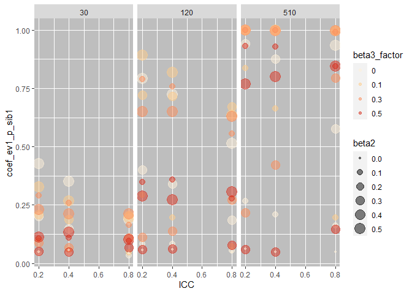<!-- -->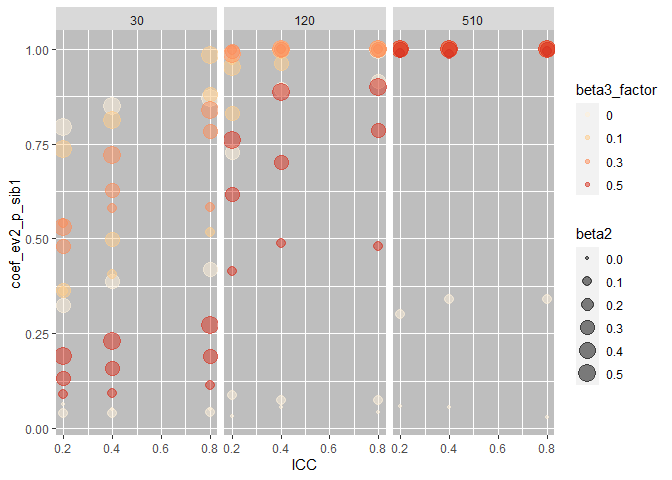<!-- -->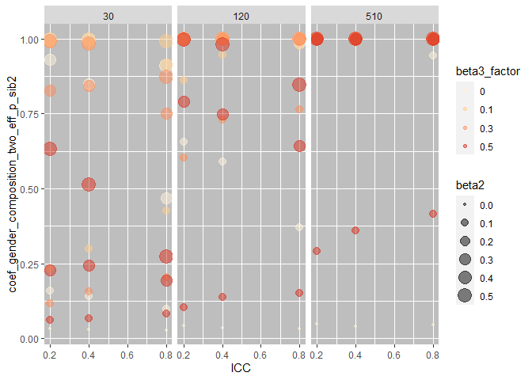<!-- --><!-- --><!-- -->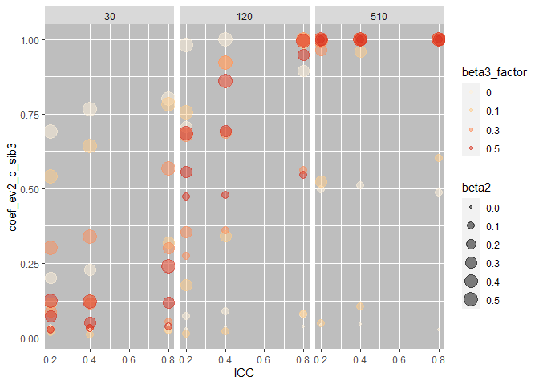<!-- -->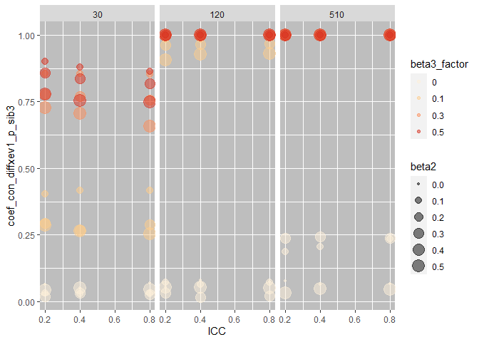<!-- --><!-- -->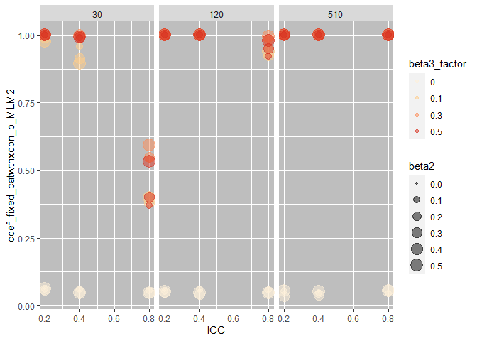<!-- --><!-- -->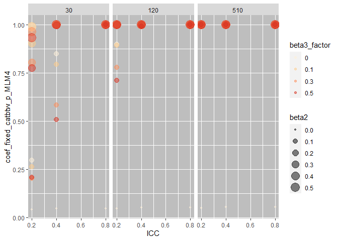<!-- -->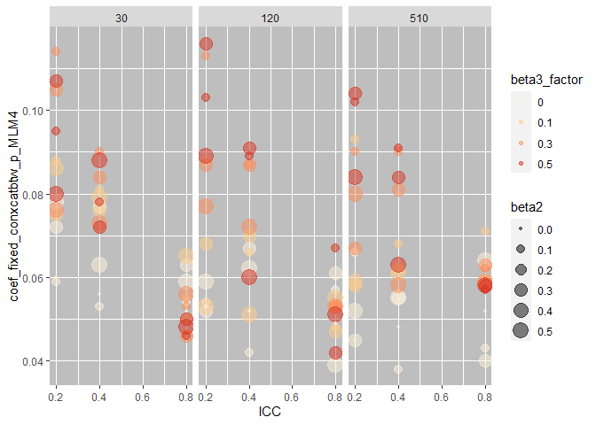<!-- -->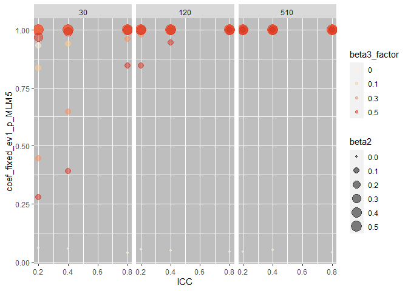<!-- -->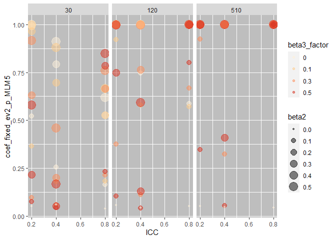<!-- -->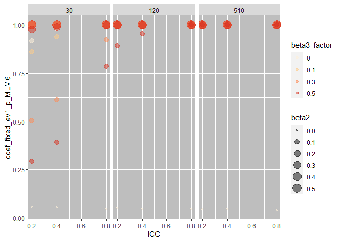<!-- -->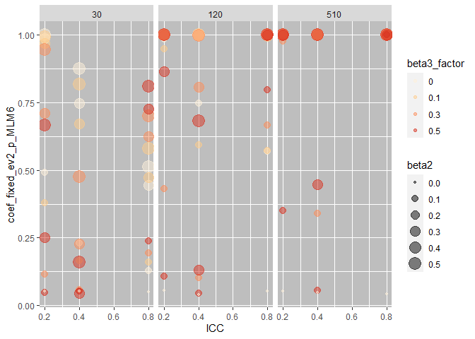<!-- -->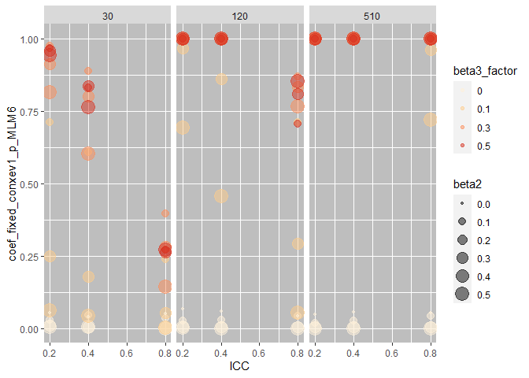<!-- -->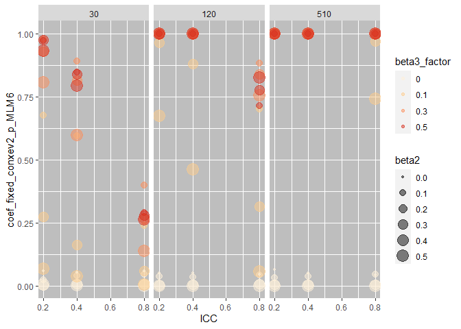<!-- -->
when alpha is 0.1

``` r
for(i in 1:start){
  
 p<- ggplot(sig_rate2, aes(y= sig_rate[,i], x= ICC, colour = beta3_factor, size = beta2))+
        geom_point(alpha=0.45) +
          facet_wrap(~CN) +
   scale_colour_brewer(palette="OrRd") + 
      ylab(colnames(sig_rate[i]))+
   theme(panel.background= element_rect(fill = "grey"))
 print(p)
  
  
}
```

<!-- -->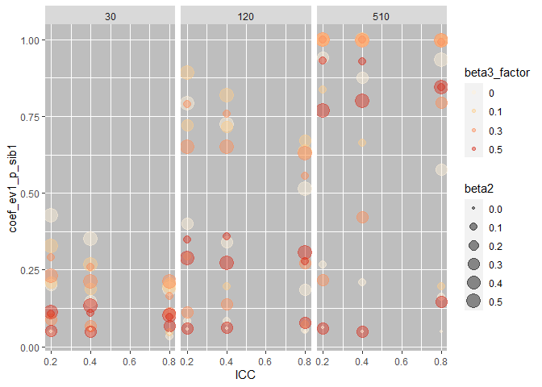<!-- -->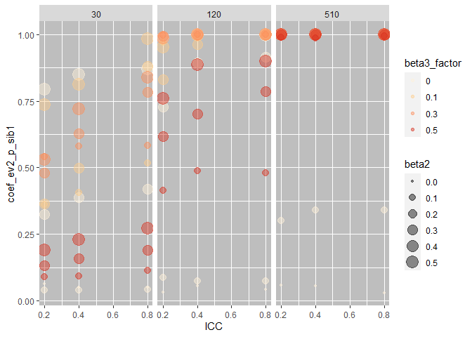<!-- -->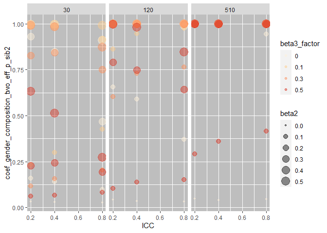<!-- -->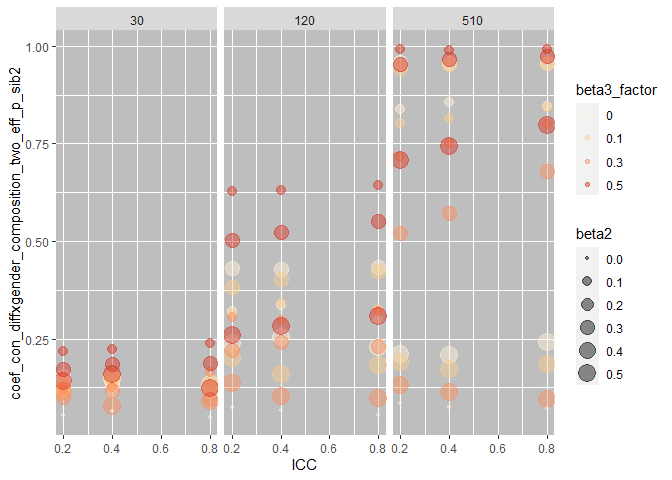<!-- -->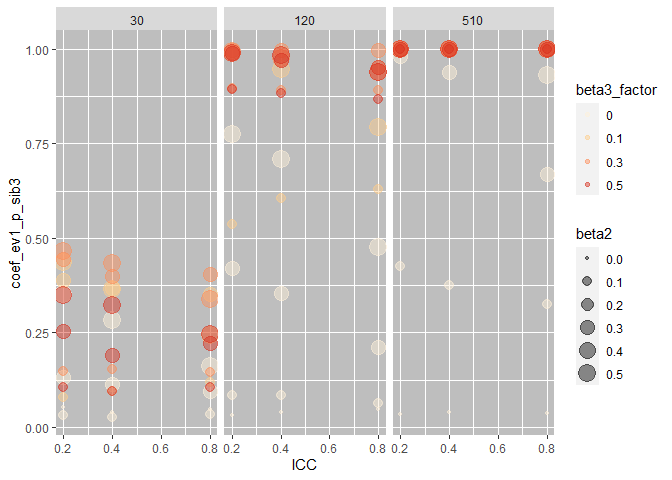<!-- -->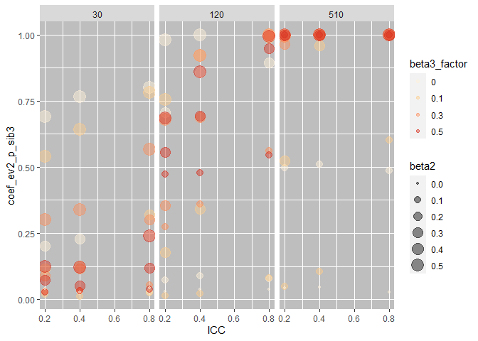<!-- -->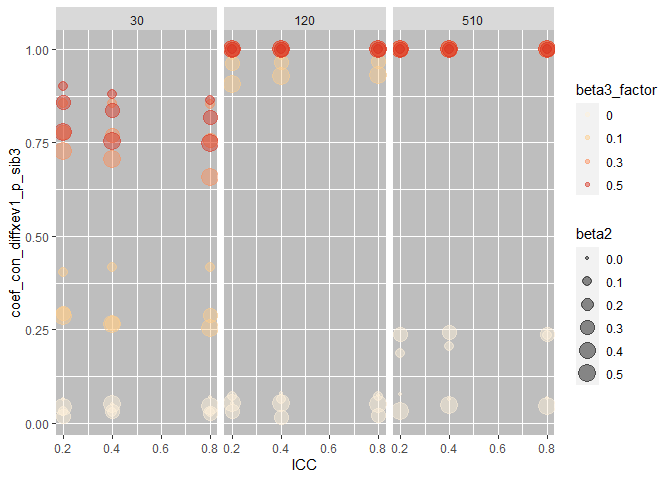<!-- -->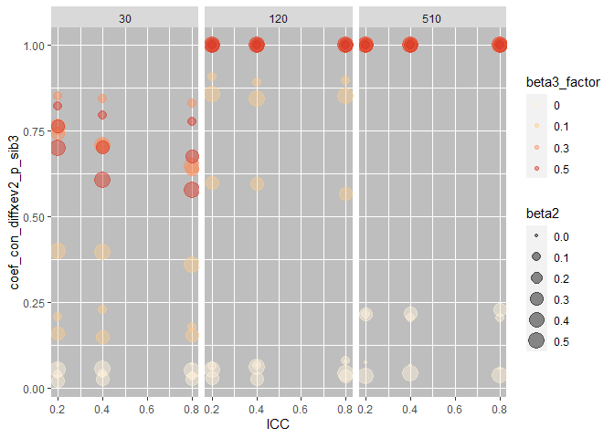<!-- -->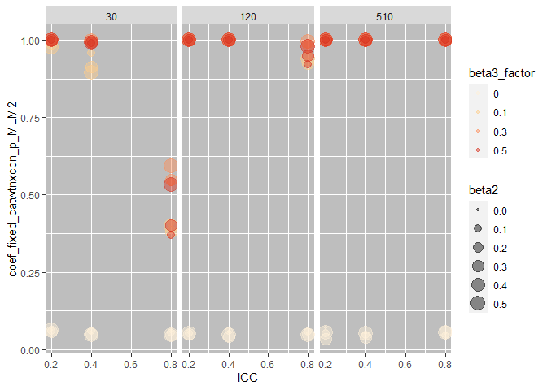<!-- --><!-- -->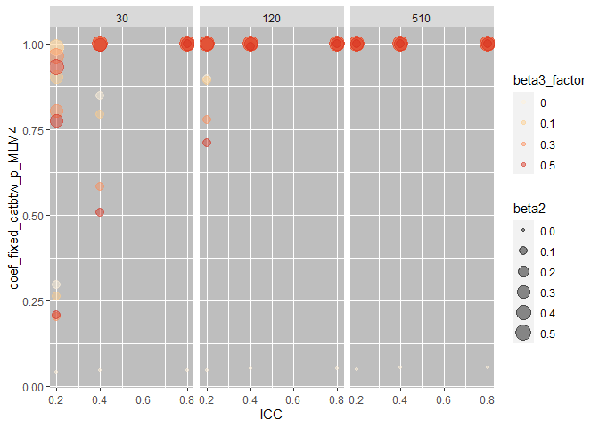<!-- -->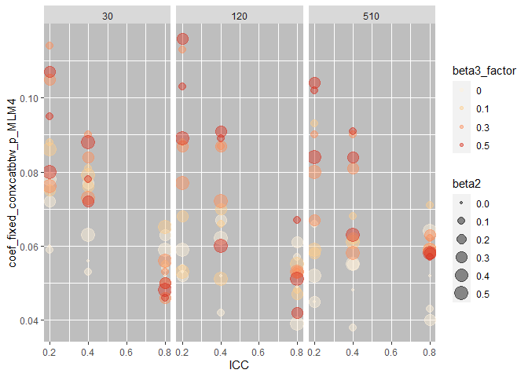<!-- --><!-- --><!-- --><!-- --><!-- --><!-- --><!-- -->

### regression

#### when alpha = 0.5

``` r
dv_list <- list("coef_gender_composition_two_eff_p_sib0",       
 "coef_ev1_p_sib1",                                
 "coef_ev2_p_sib1",                               
 "coef_gender_composition_two_eff_p_sib2",         
 "coef_con_diffxgender_composition_two_eff_p_sib2",
 "coef_ev1_p_sib3",                                
 "coef_ev2_p_sib3",                                
 "coef_con_diffxev1_p_sib3",                      
 "coef_con_diffxev2_p_sib3",                       
 "coef_fixed_catwtnxcon_p_MLM2",                   
 "coef_fixed_catbtw_p_MLM3",                       
 "coef_fixed_catbtw_p_MLM4",                       
 "coef_fixed_conxcatbtw_p_MLM4",                   
 "coef_fixed_ev1_p_MLM5",                          
 "coef_fixed_ev2_p_MLM5",                          
 "coef_fixed_ev1_p_MLM6",                          
 "coef_fixed_ev2_p_MLM6",                          
 "coef_fixed_conxev1_p_MLM6",                      
 "coef_fixed_conxev2_p_MLM6")

# empty list

sum_results<- list() 

for (i in dv_list){ 
  model <- lm(paste(i[[1]],"~ICC+beta2+beta3+CN"), data=sig_rate) 
  sum_results[[i]]<-summary(model)
  print(summary(model))
} 
```

    ## 
    ## Call:
    ## lm(formula = paste(i[[1]], "~ICC+beta2+beta3+CN"), data = sig_rate)
    ## 
    ## Residuals:
    ##      Min       1Q   Median       3Q      Max 
    ## -0.48272 -0.18952  0.00334  0.19018  0.57429 
    ## 
    ## Coefficients:
    ##               Estimate Std. Error t value Pr(>|t|)    
    ## (Intercept)  0.2570682  0.0667549   3.851 0.000196 ***
    ## ICC         -0.0594780  0.0900829  -0.660 0.510443    
    ## beta2        1.5398184  0.1288874  11.947  < 2e-16 ***
    ## beta3       -0.4088116  0.1169897  -3.494 0.000682 ***
    ## CN           0.0005677  0.0001079   5.264 6.88e-07 ***
    ## ---
    ## Signif. codes:  0 '***' 0.001 '**' 0.01 '*' 0.05 '.' 0.1 ' ' 1
    ## 
    ## Residual standard error: 0.2431 on 112 degrees of freedom
    ## Multiple R-squared:  0.6087, Adjusted R-squared:  0.5948 
    ## F-statistic: 43.56 on 4 and 112 DF,  p-value: < 2.2e-16
    ## 
    ## 
    ## Call:
    ## lm(formula = paste(i[[1]], "~ICC+beta2+beta3+CN"), data = sig_rate)
    ## 
    ## Residuals:
    ##      Min       1Q   Median       3Q      Max 
    ## -0.64274 -0.14909 -0.01977  0.17318  0.59876 
    ## 
    ## Coefficients:
    ##               Estimate Std. Error t value Pr(>|t|)    
    ## (Intercept)  0.0582040  0.0688709   0.845    0.400    
    ## ICC         -0.1036538  0.0929384  -1.115    0.267    
    ## beta2        0.7241005  0.1329730   5.445 3.09e-07 ***
    ## beta3       -0.1361564  0.1206981  -1.128    0.262    
    ## CN           0.0010100  0.0001113   9.076 4.46e-15 ***
    ## ---
    ## Signif. codes:  0 '***' 0.001 '**' 0.01 '*' 0.05 '.' 0.1 ' ' 1
    ## 
    ## Residual standard error: 0.2508 on 112 degrees of freedom
    ## Multiple R-squared:  0.5031, Adjusted R-squared:  0.4854 
    ## F-statistic: 28.35 on 4 and 112 DF,  p-value: 2.847e-16
    ## 
    ## 
    ## Call:
    ## lm(formula = paste(i[[1]], "~ICC+beta2+beta3+CN"), data = sig_rate)
    ## 
    ## Residuals:
    ##      Min       1Q   Median       3Q      Max 
    ## -0.60432 -0.17773  0.03836  0.17531  0.58979 
    ## 
    ## Coefficients:
    ##              Estimate Std. Error t value Pr(>|t|)    
    ## (Intercept) 0.1665117  0.0756834   2.200   0.0299 *  
    ## ICC         0.1120330  0.1021316   1.097   0.2750    
    ## beta2       1.0327492  0.1461262   7.068 1.43e-10 ***
    ## beta3       0.0901163  0.1326372   0.679   0.4983    
    ## CN          0.0007415  0.0001223   6.064 1.84e-08 ***
    ## ---
    ## Signif. codes:  0 '***' 0.001 '**' 0.01 '*' 0.05 '.' 0.1 ' ' 1
    ## 
    ## Residual standard error: 0.2756 on 112 degrees of freedom
    ## Multiple R-squared:  0.4477, Adjusted R-squared:  0.4279 
    ## F-statistic: 22.69 on 4 and 112 DF,  p-value: 9.549e-14
    ## 
    ## 
    ## Call:
    ## lm(formula = paste(i[[1]], "~ICC+beta2+beta3+CN"), data = sig_rate)
    ## 
    ## Residuals:
    ##      Min       1Q   Median       3Q      Max 
    ## -0.55245 -0.19047  0.00253  0.20132  0.53792 
    ## 
    ## Coefficients:
    ##               Estimate Std. Error t value Pr(>|t|)    
    ## (Intercept)  0.3110417  0.0677274   4.593 1.15e-05 ***
    ## ICC         -0.0560806  0.0913953  -0.614   0.5407    
    ## beta2        1.3988048  0.1307651  10.697  < 2e-16 ***
    ## beta3       -0.3795246  0.1186941  -3.198   0.0018 ** 
    ## CN           0.0005914  0.0001094   5.404 3.71e-07 ***
    ## ---
    ## Signif. codes:  0 '***' 0.001 '**' 0.01 '*' 0.05 '.' 0.1 ' ' 1
    ## 
    ## Residual standard error: 0.2466 on 112 degrees of freedom
    ## Multiple R-squared:  0.5675, Adjusted R-squared:  0.552 
    ## F-statistic: 36.74 on 4 and 112 DF,  p-value: < 2.2e-16
    ## 
    ## 
    ## Call:
    ## lm(formula = paste(i[[1]], "~ICC+beta2+beta3+CN"), data = sig_rate)
    ## 
    ## Residuals:
    ##      Min       1Q   Median       3Q      Max 
    ## -0.59109 -0.09766  0.00828  0.14664  0.41041 
    ## 
    ## Coefficients:
    ##               Estimate Std. Error t value Pr(>|t|)    
    ## (Intercept)  1.510e-01  5.666e-02   2.665 0.008831 ** 
    ## ICC          1.963e-02  7.647e-02   0.257 0.797835    
    ## beta2       -3.424e-01  1.094e-01  -3.130 0.002233 ** 
    ## beta3        3.829e-01  9.931e-02   3.856 0.000193 ***
    ## CN           9.733e-04  9.156e-05  10.630  < 2e-16 ***
    ## ---
    ## Signif. codes:  0 '***' 0.001 '**' 0.01 '*' 0.05 '.' 0.1 ' ' 1
    ## 
    ## Residual standard error: 0.2063 on 112 degrees of freedom
    ## Multiple R-squared:  0.5461, Adjusted R-squared:  0.5299 
    ## F-statistic: 33.69 on 4 and 112 DF,  p-value: < 2.2e-16
    ## 
    ## 
    ## Call:
    ## lm(formula = paste(i[[1]], "~ICC+beta2+beta3+CN"), data = sig_rate)
    ## 
    ## Residuals:
    ##      Min       1Q   Median       3Q      Max 
    ## -0.55780 -0.16190 -0.03124  0.17217  0.53959 
    ## 
    ## Coefficients:
    ##               Estimate Std. Error t value Pr(>|t|)    
    ## (Intercept)  0.0708231  0.0710483   0.997    0.321    
    ## ICC         -0.0880037  0.0958767  -0.918    0.361    
    ## beta2        0.7530862  0.1371769   5.490 2.54e-07 ***
    ## beta3        0.6190060  0.1245140   4.971 2.41e-06 ***
    ## CN           0.0010580  0.0001148   9.216 2.13e-15 ***
    ## ---
    ## Signif. codes:  0 '***' 0.001 '**' 0.01 '*' 0.05 '.' 0.1 ' ' 1
    ## 
    ## Residual standard error: 0.2587 on 112 degrees of freedom
    ## Multiple R-squared:  0.5718, Adjusted R-squared:  0.5565 
    ## F-statistic: 37.39 on 4 and 112 DF,  p-value: < 2.2e-16
    ## 
    ## 
    ## Call:
    ## lm(formula = paste(i[[1]], "~ICC+beta2+beta3+CN"), data = sig_rate)
    ## 
    ## Residuals:
    ##      Min       1Q   Median       3Q      Max 
    ## -0.52483 -0.15261 -0.02142  0.16362  0.46948 
    ## 
    ## Coefficients:
    ##               Estimate Std. Error t value Pr(>|t|)    
    ## (Intercept) -0.2012211  0.0646260  -3.114  0.00235 ** 
    ## ICC          0.2400092  0.0872101   2.752  0.00691 ** 
    ## beta2        1.2859052  0.1247771  10.306  < 2e-16 ***
    ## beta3        0.1502210  0.1132588   1.326  0.18742    
    ## CN           0.0010661  0.0001044  10.210  < 2e-16 ***
    ## ---
    ## Signif. codes:  0 '***' 0.001 '**' 0.01 '*' 0.05 '.' 0.1 ' ' 1
    ## 
    ## Residual standard error: 0.2353 on 112 degrees of freedom
    ## Multiple R-squared:  0.6685, Adjusted R-squared:  0.6567 
    ## F-statistic: 56.47 on 4 and 112 DF,  p-value: < 2.2e-16
    ## 
    ## 
    ## Call:
    ## lm(formula = paste(i[[1]], "~ICC+beta2+beta3+CN"), data = sig_rate)
    ## 
    ## Residuals:
    ##      Min       1Q   Median       3Q      Max 
    ## -0.41568 -0.19542 -0.09032  0.17333  0.58792 
    ## 
    ## Coefficients:
    ##               Estimate Std. Error t value Pr(>|t|)    
    ## (Intercept)  0.1915514  0.0725454   2.640 0.009462 ** 
    ## ICC         -0.0042766  0.0978970  -0.044 0.965234    
    ## beta2        0.0673647  0.1400675   0.481 0.631494    
    ## beta3        1.5690917  0.1271378  12.342  < 2e-16 ***
    ## CN           0.0004359  0.0001172   3.718 0.000315 ***
    ## ---
    ## Signif. codes:  0 '***' 0.001 '**' 0.01 '*' 0.05 '.' 0.1 ' ' 1
    ## 
    ## Residual standard error: 0.2641 on 112 degrees of freedom
    ## Multiple R-squared:  0.6044, Adjusted R-squared:  0.5903 
    ## F-statistic: 42.78 on 4 and 112 DF,  p-value: < 2.2e-16
    ## 
    ## 
    ## Call:
    ## lm(formula = paste(i[[1]], "~ICC+beta2+beta3+CN"), data = sig_rate)
    ## 
    ## Residuals:
    ##      Min       1Q   Median       3Q      Max 
    ## -0.42830 -0.19072 -0.08688  0.19168  0.54299 
    ## 
    ## Coefficients:
    ##               Estimate Std. Error t value Pr(>|t|)    
    ## (Intercept)  0.1435766  0.0688628   2.085   0.0393 *  
    ## ICC         -0.0246062  0.0929274  -0.265   0.7917    
    ## beta2        0.1015600  0.1329572   0.764   0.4466    
    ## beta3        1.5499358  0.1206838  12.843  < 2e-16 ***
    ## CN           0.0005331  0.0001113   4.791 5.13e-06 ***
    ## ---
    ## Signif. codes:  0 '***' 0.001 '**' 0.01 '*' 0.05 '.' 0.1 ' ' 1
    ## 
    ## Residual standard error: 0.2507 on 112 degrees of freedom
    ## Multiple R-squared:  0.6348, Adjusted R-squared:  0.6218 
    ## F-statistic: 48.67 on 4 and 112 DF,  p-value: < 2.2e-16
    ## 
    ## 
    ## Call:
    ## lm(formula = paste(i[[1]], "~ICC+beta2+beta3+CN"), data = sig_rate)
    ## 
    ## Residuals:
    ##      Min       1Q   Median       3Q      Max 
    ## -0.58294 -0.24273 -0.07946  0.24384  0.58706 
    ## 
    ## Coefficients:
    ##               Estimate Std. Error t value Pr(>|t|)    
    ## (Intercept)  0.3566320  0.0850849   4.191 5.56e-05 ***
    ## ICC         -0.2356921  0.1148185  -2.053   0.0424 *  
    ## beta2        0.2294516  0.1642782   1.397   0.1653    
    ## beta3        1.4822041  0.1491135   9.940  < 2e-16 ***
    ## CN           0.0001975  0.0001375   1.436   0.1537    
    ## ---
    ## Signif. codes:  0 '***' 0.001 '**' 0.01 '*' 0.05 '.' 0.1 ' ' 1
    ## 
    ## Residual standard error: 0.3098 on 112 degrees of freedom
    ## Multiple R-squared:  0.5023, Adjusted R-squared:  0.4845 
    ## F-statistic: 28.26 on 4 and 112 DF,  p-value: 3.126e-16
    ## 
    ## 
    ## Call:
    ## lm(formula = paste(i[[1]], "~ICC+beta2+beta3+CN"), data = sig_rate)
    ## 
    ## Residuals:
    ##      Min       1Q   Median       3Q      Max 
    ## -0.66129 -0.09234  0.03054  0.16882  0.34809 
    ## 
    ## Coefficients:
    ##              Estimate Std. Error t value Pr(>|t|)    
    ## (Intercept) 0.4734343  0.0633008   7.479 1.80e-11 ***
    ## ICC         0.1730394  0.0854218   2.026   0.0452 *  
    ## beta2       0.8539112  0.1222185   6.987 2.13e-10 ***
    ## beta3       0.2131274  0.1109364   1.921   0.0573 .  
    ## CN          0.0001989  0.0001023   1.944   0.0544 .  
    ## ---
    ## Signif. codes:  0 '***' 0.001 '**' 0.01 '*' 0.05 '.' 0.1 ' ' 1
    ## 
    ## Residual standard error: 0.2305 on 112 degrees of freedom
    ## Multiple R-squared:  0.3683, Adjusted R-squared:  0.3457 
    ## F-statistic: 16.32 on 4 and 112 DF,  p-value: 1.463e-10
    ## 
    ## 
    ## Call:
    ## lm(formula = paste(i[[1]], "~ICC+beta2+beta3+CN"), data = sig_rate)
    ## 
    ## Residuals:
    ##      Min       1Q   Median       3Q      Max 
    ## -0.65895 -0.09820  0.02903  0.16397  0.34913 
    ## 
    ## Coefficients:
    ##              Estimate Std. Error t value Pr(>|t|)    
    ## (Intercept) 0.4709082  0.0632735   7.442 2.17e-11 ***
    ## ICC         0.1757127  0.0853850   2.058   0.0419 *  
    ## beta2       0.8532486  0.1221658   6.984 2.16e-10 ***
    ## beta3       0.2120633  0.1108885   1.912   0.0584 .  
    ## CN          0.0002029  0.0001022   1.985   0.0496 *  
    ## ---
    ## Signif. codes:  0 '***' 0.001 '**' 0.01 '*' 0.05 '.' 0.1 ' ' 1
    ## 
    ## Residual standard error: 0.2304 on 112 degrees of freedom
    ## Multiple R-squared:  0.369,  Adjusted R-squared:  0.3464 
    ## F-statistic: 16.37 on 4 and 112 DF,  p-value: 1.375e-10
    ## 
    ## 
    ## Call:
    ## lm(formula = paste(i[[1]], "~ICC+beta2+beta3+CN"), data = sig_rate)
    ## 
    ## Residuals:
    ##        Min         1Q     Median         3Q        Max 
    ## -0.0255371 -0.0093707 -0.0003048  0.0091568  0.0283542 
    ## 
    ## Coefficients:
    ##               Estimate Std. Error t value Pr(>|t|)    
    ## (Intercept)  8.187e-02  3.475e-03  23.562  < 2e-16 ***
    ## ICC         -3.982e-02  4.689e-03  -8.492 9.66e-14 ***
    ## beta2       -1.062e-02  6.709e-03  -1.583    0.116    
    ## beta3        4.358e-02  6.089e-03   7.156 9.18e-11 ***
    ## CN          -8.984e-06  5.614e-06  -1.600    0.112    
    ## ---
    ## Signif. codes:  0 '***' 0.001 '**' 0.01 '*' 0.05 '.' 0.1 ' ' 1
    ## 
    ## Residual standard error: 0.01265 on 112 degrees of freedom
    ## Multiple R-squared:  0.5299, Adjusted R-squared:  0.5131 
    ## F-statistic: 31.56 on 4 and 112 DF,  p-value: < 2.2e-16
    ## 
    ## 
    ## Call:
    ## lm(formula = paste(i[[1]], "~ICC+beta2+beta3+CN"), data = sig_rate)
    ## 
    ## Residuals:
    ##      Min       1Q   Median       3Q      Max 
    ## -0.66126 -0.08071  0.04354  0.14375  0.30034 
    ## 
    ## Coefficients:
    ##              Estimate Std. Error t value Pr(>|t|)    
    ## (Intercept) 0.5970693  0.0629330   9.487 5.04e-16 ***
    ## ICC         0.0627010  0.0849254   0.738    0.462    
    ## beta2       0.7710309  0.1215082   6.346 4.85e-09 ***
    ## beta3       0.1801072  0.1102917   1.633    0.105    
    ## CN          0.0001079  0.0001017   1.061    0.291    
    ## ---
    ## Signif. codes:  0 '***' 0.001 '**' 0.01 '*' 0.05 '.' 0.1 ' ' 1
    ## 
    ## Residual standard error: 0.2291 on 112 degrees of freedom
    ## Multiple R-squared:  0.3019, Adjusted R-squared:  0.277 
    ## F-statistic: 12.11 on 4 and 112 DF,  p-value: 3.258e-08
    ## 
    ## 
    ## Call:
    ## lm(formula = paste(i[[1]], "~ICC+beta2+beta3+CN"), data = sig_rate)
    ## 
    ## Residuals:
    ##      Min       1Q   Median       3Q      Max 
    ## -0.57297 -0.20454  0.01502  0.19888  0.52302 
    ## 
    ## Coefficients:
    ##               Estimate Std. Error t value Pr(>|t|)    
    ## (Intercept)  0.2440164  0.0715601   3.410 0.000904 ***
    ## ICC          0.0588291  0.0965674   0.609 0.543624    
    ## beta2        1.3051561  0.1381651   9.446 6.27e-16 ***
    ## beta3       -0.4147929  0.1254110  -3.307 0.001266 ** 
    ## CN           0.0006390  0.0001156   5.526 2.16e-07 ***
    ## ---
    ## Signif. codes:  0 '***' 0.001 '**' 0.01 '*' 0.05 '.' 0.1 ' ' 1
    ## 
    ## Residual standard error: 0.2606 on 112 degrees of freedom
    ## Multiple R-squared:  0.5257, Adjusted R-squared:  0.5088 
    ## F-statistic: 31.04 on 4 and 112 DF,  p-value: < 2.2e-16
    ## 
    ## 
    ## Call:
    ## lm(formula = paste(i[[1]], "~ICC+beta2+beta3+CN"), data = sig_rate)
    ## 
    ## Residuals:
    ##      Min       1Q   Median       3Q      Max 
    ## -0.65849 -0.08120  0.04028  0.14375  0.29769 
    ## 
    ## Coefficients:
    ##              Estimate Std. Error t value Pr(>|t|)    
    ## (Intercept) 0.6017040  0.0626465   9.605 2.70e-16 ***
    ## ICC         0.0531593  0.0845388   0.629    0.531    
    ## beta2       0.7697028  0.1209551   6.364 4.45e-09 ***
    ## beta3       0.1811822  0.1097896   1.650    0.102    
    ## CN          0.0001084  0.0001012   1.070    0.287    
    ## ---
    ## Signif. codes:  0 '***' 0.001 '**' 0.01 '*' 0.05 '.' 0.1 ' ' 1
    ## 
    ## Residual standard error: 0.2281 on 112 degrees of freedom
    ## Multiple R-squared:  0.3028, Adjusted R-squared:  0.2779 
    ## F-statistic: 12.16 on 4 and 112 DF,  p-value: 3.045e-08
    ## 
    ## 
    ## Call:
    ## lm(formula = paste(i[[1]], "~ICC+beta2+beta3+CN"), data = sig_rate)
    ## 
    ## Residuals:
    ##     Min      1Q  Median      3Q     Max 
    ## -0.5790 -0.2087  0.0199  0.1960  0.5192 
    ## 
    ## Coefficients:
    ##               Estimate Std. Error t value Pr(>|t|)    
    ## (Intercept)  0.2553088  0.0725911   3.517 0.000631 ***
    ## ICC          0.0140293  0.0979587   0.143 0.886376    
    ## beta2        1.2849440  0.1401558   9.168 2.75e-15 ***
    ## beta3       -0.3683480  0.1272179  -2.895 0.004554 ** 
    ## CN           0.0006598  0.0001173   5.625 1.38e-07 ***
    ## ---
    ## Signif. codes:  0 '***' 0.001 '**' 0.01 '*' 0.05 '.' 0.1 ' ' 1
    ## 
    ## Residual standard error: 0.2643 on 112 degrees of freedom
    ## Multiple R-squared:  0.5138, Adjusted R-squared:  0.4964 
    ## F-statistic: 29.59 on 4 and 112 DF,  p-value: < 2.2e-16
    ## 
    ## 
    ## Call:
    ## lm(formula = paste(i[[1]], "~ICC+beta2+beta3+CN"), data = sig_rate)
    ## 
    ## Residuals:
    ##     Min      1Q  Median      3Q     Max 
    ## -0.5514 -0.1919 -0.0410  0.2442  0.6287 
    ## 
    ## Coefficients:
    ##               Estimate Std. Error t value Pr(>|t|)    
    ## (Intercept)  0.2869163  0.0765739   3.747 0.000285 ***
    ## ICC         -0.3421795  0.1033332  -3.311 0.001250 ** 
    ## beta2       -0.1131348  0.1478455  -0.765 0.445748    
    ## beta3        1.6104027  0.1341977  12.000  < 2e-16 ***
    ## CN           0.0005464  0.0001237   4.416 2.33e-05 ***
    ## ---
    ## Signif. codes:  0 '***' 0.001 '**' 0.01 '*' 0.05 '.' 0.1 ' ' 1
    ## 
    ## Residual standard error: 0.2788 on 112 degrees of freedom
    ## Multiple R-squared:  0.6102, Adjusted R-squared:  0.5963 
    ## F-statistic: 43.83 on 4 and 112 DF,  p-value: < 2.2e-16
    ## 
    ## 
    ## Call:
    ## lm(formula = paste(i[[1]], "~ICC+beta2+beta3+CN"), data = sig_rate)
    ## 
    ## Residuals:
    ##      Min       1Q   Median       3Q      Max 
    ## -0.53451 -0.19926 -0.04083  0.24540  0.62317 
    ## 
    ## Coefficients:
    ##               Estimate Std. Error t value Pr(>|t|)    
    ## (Intercept)  0.2884720  0.0763838   3.777 0.000256 ***
    ## ICC         -0.3414652  0.1030767  -3.313 0.001245 ** 
    ## beta2       -0.1177490  0.1474785  -0.798 0.426320    
    ## beta3        1.6111581  0.1338646  12.036  < 2e-16 ***
    ## CN           0.0005467  0.0001234   4.430 2.21e-05 ***
    ## ---
    ## Signif. codes:  0 '***' 0.001 '**' 0.01 '*' 0.05 '.' 0.1 ' ' 1
    ## 
    ## Residual standard error: 0.2781 on 112 degrees of freedom
    ## Multiple R-squared:  0.6115, Adjusted R-squared:  0.5976 
    ## F-statistic: 44.07 on 4 and 112 DF,  p-value: < 2.2e-16

as.factor

``` r
sum_results_factor<-list()

for (i in dv_list){ 
  model <- lm(paste(i[[1]],"~ICC_factor+beta2_factor+beta3_factor+CN_factor"), data=sig_rate) 
  sum_results_factor[[i]]<-summary(model)
  print(summary(model))
} 
```

    ## 
    ## Call:
    ## lm(formula = paste(i[[1]], "~ICC_factor+beta2_factor+beta3_factor+CN_factor"), 
    ##     data = sig_rate)
    ## 
    ## Residuals:
    ##      Min       1Q   Median       3Q      Max 
    ## -0.29204 -0.14211 -0.00216  0.12875  0.35981 
    ## 
    ## Coefficients:
    ##                  Estimate Std. Error t value Pr(>|t|)    
    ## (Intercept)     -0.119376   0.065468  -1.823  0.07106 .  
    ## ICC_factor0.4    0.002051   0.038894   0.053  0.95804    
    ## ICC_factor0.8   -0.032897   0.038894  -0.846  0.39956    
    ## beta2_factor0.1  0.410287   0.070117   5.851 5.49e-08 ***
    ## beta2_factor0.3  0.823287   0.070117  11.742  < 2e-16 ***
    ## beta2_factor0.5  0.911426   0.070117  12.999  < 2e-16 ***
    ## beta3_factor0.1  0.140148   0.046745   2.998  0.00338 ** 
    ## beta3_factor0.3  0.062148   0.046745   1.330  0.18653    
    ## beta3_factor0.5 -0.256000   0.046745  -5.477 2.94e-07 ***
    ## CN_factor120     0.207026   0.038894   5.323 5.75e-07 ***
    ## CN_factor510     0.326282   0.038894   8.389 2.30e-13 ***
    ## ---
    ## Signif. codes:  0 '***' 0.001 '**' 0.01 '*' 0.05 '.' 0.1 ' ' 1
    ## 
    ## Residual standard error: 0.1718 on 106 degrees of freedom
    ## Multiple R-squared:  0.8151, Adjusted R-squared:  0.7976 
    ## F-statistic: 46.73 on 10 and 106 DF,  p-value: < 2.2e-16
    ## 
    ## 
    ## Call:
    ## lm(formula = paste(i[[1]], "~ICC_factor+beta2_factor+beta3_factor+CN_factor"), 
    ##     data = sig_rate)
    ## 
    ## Residuals:
    ##      Min       1Q   Median       3Q      Max 
    ## -0.51104 -0.13966  0.01875  0.13919  0.40396 
    ## 
    ## Coefficients:
    ##                 Estimate Std. Error t value Pr(>|t|)    
    ## (Intercept)     -0.17793    0.08344  -2.133  0.03527 *  
    ## ICC_factor0.4   -0.01810    0.04957  -0.365  0.71568    
    ## ICC_factor0.8   -0.06167    0.04957  -1.244  0.21621    
    ## beta2_factor0.1  0.27761    0.08936   3.107  0.00243 ** 
    ## beta2_factor0.3  0.25189    0.08936   2.819  0.00575 ** 
    ## beta2_factor0.5  0.49994    0.08936   5.595 1.74e-07 ***
    ## beta3_factor0.1  0.13407    0.05957   2.251  0.02648 *  
    ## beta3_factor0.3  0.10796    0.05957   1.812  0.07277 .  
    ## beta3_factor0.5 -0.09048    0.05957  -1.519  0.13178    
    ## CN_factor120     0.23628    0.04957   4.767 5.99e-06 ***
    ## CN_factor510     0.53495    0.04957  10.792  < 2e-16 ***
    ## ---
    ## Signif. codes:  0 '***' 0.001 '**' 0.01 '*' 0.05 '.' 0.1 ' ' 1
    ## 
    ## Residual standard error: 0.2189 on 106 degrees of freedom
    ## Multiple R-squared:  0.6417, Adjusted R-squared:  0.6079 
    ## F-statistic: 18.98 on 10 and 106 DF,  p-value: < 2.2e-16
    ## 
    ## 
    ## Call:
    ## lm(formula = paste(i[[1]], "~ICC_factor+beta2_factor+beta3_factor+CN_factor"), 
    ##     data = sig_rate)
    ## 
    ## Residuals:
    ##      Min       1Q   Median       3Q      Max 
    ## -0.48509 -0.11334 -0.01167  0.13103  0.38748 
    ## 
    ## Coefficients:
    ##                  Estimate Std. Error t value Pr(>|t|)    
    ## (Intercept)     -0.248427   0.071907  -3.455 0.000793 ***
    ## ICC_factor0.4    0.039385   0.042719   0.922 0.358649    
    ## ICC_factor0.8    0.070615   0.042719   1.653 0.101285    
    ## beta2_factor0.1  0.404750   0.077013   5.256 7.69e-07 ***
    ## beta2_factor0.3  0.592139   0.077013   7.689 7.99e-12 ***
    ## beta2_factor0.5  0.692667   0.077013   8.994 1.03e-14 ***
    ## beta3_factor0.1  0.250296   0.051342   4.875 3.84e-06 ***
    ## beta3_factor0.3  0.265185   0.051342   5.165 1.13e-06 ***
    ## beta3_factor0.5 -0.001259   0.051342  -0.025 0.980478    
    ## CN_factor120     0.332154   0.042719   7.775 5.17e-12 ***
    ## CN_factor510     0.447462   0.042719  10.475  < 2e-16 ***
    ## ---
    ## Signif. codes:  0 '***' 0.001 '**' 0.01 '*' 0.05 '.' 0.1 ' ' 1
    ## 
    ## Residual standard error: 0.1886 on 106 degrees of freedom
    ## Multiple R-squared:  0.755,  Adjusted R-squared:  0.7319 
    ## F-statistic: 32.67 on 10 and 106 DF,  p-value: < 2.2e-16
    ## 
    ## 
    ## Call:
    ## lm(formula = paste(i[[1]], "~ICC_factor+beta2_factor+beta3_factor+CN_factor"), 
    ##     data = sig_rate)
    ## 
    ## Residuals:
    ##      Min       1Q   Median       3Q      Max 
    ## -0.28670 -0.13989 -0.01922  0.14720  0.29554 
    ## 
    ## Coefficients:
    ##                  Estimate Std. Error t value Pr(>|t|)    
    ## (Intercept)     -0.150915   0.063415  -2.380   0.0191 *  
    ## ICC_factor0.4    0.002154   0.037674   0.057   0.9545    
    ## ICC_factor0.8   -0.030974   0.037674  -0.822   0.4128    
    ## beta2_factor0.1  0.526907   0.067918   7.758 5.65e-12 ***
    ## beta2_factor0.3  0.872741   0.067918  12.850  < 2e-16 ***
    ## beta2_factor0.5  0.944685   0.067918  13.909  < 2e-16 ***
    ## beta3_factor0.1  0.093259   0.045279   2.060   0.0419 *  
    ## beta3_factor0.3  0.027704   0.045279   0.612   0.5419    
    ## beta3_factor0.5 -0.271815   0.045279  -6.003 2.75e-08 ***
    ## CN_factor120     0.243179   0.037674   6.455 3.33e-09 ***
    ## CN_factor510     0.349385   0.037674   9.274 2.42e-15 ***
    ## ---
    ## Signif. codes:  0 '***' 0.001 '**' 0.01 '*' 0.05 '.' 0.1 ' ' 1
    ## 
    ## Residual standard error: 0.1664 on 106 degrees of freedom
    ## Multiple R-squared:  0.8137, Adjusted R-squared:  0.7961 
    ## F-statistic: 46.29 on 10 and 106 DF,  p-value: < 2.2e-16
    ## 
    ## 
    ## Call:
    ## lm(formula = paste(i[[1]], "~ICC_factor+beta2_factor+beta3_factor+CN_factor"), 
    ##     data = sig_rate)
    ## 
    ## Residuals:
    ##      Min       1Q   Median       3Q      Max 
    ## -0.29542 -0.08554  0.01143  0.09506  0.24396 
    ## 
    ## Coefficients:
    ##                  Estimate Std. Error t value Pr(>|t|)    
    ## (Intercept)     -0.165752   0.056030  -2.958 0.003815 ** 
    ## ICC_factor0.4    0.006051   0.033287   0.182 0.856092    
    ## ICC_factor0.8    0.012205   0.033287   0.367 0.714598    
    ## beta2_factor0.1  0.395944   0.060008   6.598 1.69e-09 ***
    ## beta2_factor0.3  0.395972   0.060008   6.599 1.68e-09 ***
    ## beta2_factor0.5  0.143417   0.060008   2.390 0.018616 *  
    ## beta3_factor0.1 -0.014889   0.040006  -0.372 0.710509    
    ## beta3_factor0.3 -0.106630   0.040006  -2.665 0.008894 ** 
    ## beta3_factor0.5  0.143630   0.040006   3.590 0.000502 ***
    ## CN_factor120     0.178744   0.033287   5.370 4.69e-07 ***
    ## CN_factor510     0.498590   0.033287  14.979  < 2e-16 ***
    ## ---
    ## Signif. codes:  0 '***' 0.001 '**' 0.01 '*' 0.05 '.' 0.1 ' ' 1
    ## 
    ## Residual standard error: 0.147 on 106 degrees of freedom
    ## Multiple R-squared:  0.782,  Adjusted R-squared:  0.7614 
    ## F-statistic: 38.02 on 10 and 106 DF,  p-value: < 2.2e-16
    ## 
    ## 
    ## Call:
    ## lm(formula = paste(i[[1]], "~ICC_factor+beta2_factor+beta3_factor+CN_factor"), 
    ##     data = sig_rate)
    ## 
    ## Residuals:
    ##      Min       1Q   Median       3Q      Max 
    ## -0.33114 -0.10291 -0.00199  0.11340  0.41452 
    ## 
    ## Coefficients:
    ##                 Estimate Std. Error t value Pr(>|t|)    
    ## (Intercept)     -0.31519    0.05894  -5.348 5.16e-07 ***
    ## ICC_factor0.4   -0.01526    0.03501  -0.436 0.663919    
    ## ICC_factor0.8   -0.05233    0.03501  -1.495 0.137974    
    ## beta2_factor0.1  0.23820    0.06312   3.774 0.000265 ***
    ## beta2_factor0.3  0.41029    0.06312   6.500 2.69e-09 ***
    ## beta2_factor0.5  0.45629    0.06312   7.229 7.88e-11 ***
    ## beta3_factor0.1  0.29015    0.04208   6.895 4.03e-10 ***
    ## beta3_factor0.3  0.35070    0.04208   8.334 3.05e-13 ***
    ## beta3_factor0.5  0.30778    0.04208   7.314 5.17e-11 ***
    ## CN_factor120     0.49113    0.03501  14.027  < 2e-16 ***
    ## CN_factor510     0.64436    0.03501  18.403  < 2e-16 ***
    ## ---
    ## Signif. codes:  0 '***' 0.001 '**' 0.01 '*' 0.05 '.' 0.1 ' ' 1
    ## 
    ## Residual standard error: 0.1546 on 106 degrees of freedom
    ## Multiple R-squared:  0.8552, Adjusted R-squared:  0.8416 
    ## F-statistic: 62.61 on 10 and 106 DF,  p-value: < 2.2e-16
    ## 
    ## 
    ## Call:
    ## lm(formula = paste(i[[1]], "~ICC_factor+beta2_factor+beta3_factor+CN_factor"), 
    ##     data = sig_rate)
    ## 
    ## Residuals:
    ##      Min       1Q   Median       3Q      Max 
    ## -0.40280 -0.14453  0.00925  0.12641  0.44149 
    ## 
    ## Coefficients:
    ##                  Estimate Std. Error t value Pr(>|t|)    
    ## (Intercept)     -0.349282   0.077847  -4.487 1.84e-05 ***
    ## ICC_factor0.4    0.059000   0.046248   1.276 0.204839    
    ## ICC_factor0.8    0.146205   0.046248   3.161 0.002048 ** 
    ## beta2_factor0.1  0.312028   0.083375   3.742 0.000296 ***
    ## beta2_factor0.3  0.589611   0.083375   7.072 1.70e-10 ***
    ## beta2_factor0.5  0.785806   0.083375   9.425 1.11e-15 ***
    ## beta3_factor0.1 -0.113481   0.055583  -2.042 0.043670 *  
    ## beta3_factor0.3  0.015593   0.055583   0.281 0.779620    
    ## beta3_factor0.5 -0.004778   0.055583  -0.086 0.931663    
    ## CN_factor120     0.353436   0.046248   7.642 1.01e-11 ***
    ## CN_factor510     0.600538   0.046248  12.985  < 2e-16 ***
    ## ---
    ## Signif. codes:  0 '***' 0.001 '**' 0.01 '*' 0.05 '.' 0.1 ' ' 1
    ## 
    ## Residual standard error: 0.2042 on 106 degrees of freedom
    ## Multiple R-squared:  0.7637, Adjusted R-squared:  0.7414 
    ## F-statistic: 34.25 on 10 and 106 DF,  p-value: < 2.2e-16
    ## 
    ## 
    ## Call:
    ## lm(formula = paste(i[[1]], "~ICC_factor+beta2_factor+beta3_factor+CN_factor"), 
    ##     data = sig_rate)
    ## 
    ## Residuals:
    ##      Min       1Q   Median       3Q      Max 
    ## -0.32047 -0.05866  0.00277  0.09691  0.17842 
    ## 
    ## Coefficients:
    ##                  Estimate Std. Error t value Pr(>|t|)    
    ## (Intercept)     -0.105650   0.045508  -2.322   0.0222 *  
    ## ICC_factor0.4   -0.001872   0.027036  -0.069   0.9449    
    ## ICC_factor0.8   -0.002769   0.027036  -0.102   0.9186    
    ## beta2_factor0.1  0.041509   0.048739   0.852   0.3963    
    ## beta2_factor0.3  0.016287   0.048739   0.334   0.7389    
    ## beta2_factor0.5 -0.013463   0.048739  -0.276   0.7829    
    ## beta3_factor0.1  0.677704   0.032493  20.857  < 2e-16 ***
    ## beta3_factor0.3  0.842519   0.032493  25.929  < 2e-16 ***
    ## beta3_factor0.5  0.860296   0.032493  26.477  < 2e-16 ***
    ## CN_factor120     0.243077   0.027036   8.991 1.04e-14 ***
    ## CN_factor510     0.279513   0.027036  10.339  < 2e-16 ***
    ## ---
    ## Signif. codes:  0 '***' 0.001 '**' 0.01 '*' 0.05 '.' 0.1 ' ' 1
    ## 
    ## Residual standard error: 0.1194 on 106 degrees of freedom
    ## Multiple R-squared:  0.9235, Adjusted R-squared:  0.9163 
    ## F-statistic:   128 on 10 and 106 DF,  p-value: < 2.2e-16
    ## 
    ## 
    ## Call:
    ## lm(formula = paste(i[[1]], "~ICC_factor+beta2_factor+beta3_factor+CN_factor"), 
    ##     data = sig_rate)
    ## 
    ## Residuals:
    ##      Min       1Q   Median       3Q      Max 
    ## -0.32486 -0.07639 -0.00406  0.08674  0.22442 
    ## 
    ## Coefficients:
    ##                  Estimate Std. Error t value Pr(>|t|)    
    ## (Intercept)     -0.120709   0.049112  -2.458   0.0156 *  
    ## ICC_factor0.4   -0.007897   0.029177  -0.271   0.7872    
    ## ICC_factor0.8   -0.015359   0.029177  -0.526   0.5997    
    ## beta2_factor0.1  0.045000   0.052599   0.856   0.3942    
    ## beta2_factor0.3 -0.007944   0.052599  -0.151   0.8802    
    ## beta2_factor0.5  0.015944   0.052599   0.303   0.7624    
    ## beta3_factor0.1  0.593926   0.035066  16.937  < 2e-16 ***
    ## beta3_factor0.3  0.834333   0.035066  23.793  < 2e-16 ***
    ## beta3_factor0.5  0.823074   0.035066  23.472  < 2e-16 ***
    ## CN_factor120     0.250385   0.029177   8.582 8.58e-14 ***
    ## CN_factor510     0.325667   0.029177  11.162  < 2e-16 ***
    ## ---
    ## Signif. codes:  0 '***' 0.001 '**' 0.01 '*' 0.05 '.' 0.1 ' ' 1
    ## 
    ## Residual standard error: 0.1288 on 106 degrees of freedom
    ## Multiple R-squared:  0.9087, Adjusted R-squared:  0.9001 
    ## F-statistic: 105.5 on 10 and 106 DF,  p-value: < 2.2e-16
    ## 
    ## 
    ## Call:
    ## lm(formula = paste(i[[1]], "~ICC_factor+beta2_factor+beta3_factor+CN_factor"), 
    ##     data = sig_rate)
    ## 
    ## Residuals:
    ##      Min       1Q   Median       3Q      Max 
    ## -0.39096 -0.03748  0.00347  0.08643  0.17454 
    ## 
    ## Coefficients:
    ##                  Estimate Std. Error t value Pr(>|t|)    
    ## (Intercept)      0.020237   0.044637   0.453    0.651    
    ## ICC_factor0.4   -0.007309   0.026519  -0.276    0.783    
    ## ICC_factor0.8   -0.133449   0.026519  -5.032 1.99e-06 ***
    ## beta2_factor0.1 -0.006326   0.047807  -0.132    0.895    
    ## beta2_factor0.3 -0.009272   0.047807  -0.194    0.847    
    ## beta2_factor0.5 -0.001951   0.047807  -0.041    0.968    
    ## beta3_factor0.1  0.864813   0.031871  27.134  < 2e-16 ***
    ## beta3_factor0.3  0.898442   0.031871  28.190  < 2e-16 ***
    ## beta3_factor0.5  0.879499   0.031871  27.595  < 2e-16 ***
    ## CN_factor120     0.120754   0.026519   4.554 1.41e-05 ***
    ## CN_factor510     0.130292   0.026519   4.913 3.28e-06 ***
    ## ---
    ## Signif. codes:  0 '***' 0.001 '**' 0.01 '*' 0.05 '.' 0.1 ' ' 1
    ## 
    ## Residual standard error: 0.1171 on 106 degrees of freedom
    ## Multiple R-squared:  0.9327, Adjusted R-squared:  0.9263 
    ## F-statistic: 146.9 on 10 and 106 DF,  p-value: < 2.2e-16
    ## 
    ## 
    ## Call:
    ## lm(formula = paste(i[[1]], "~ICC_factor+beta2_factor+beta3_factor+CN_factor"), 
    ##     data = sig_rate)
    ## 
    ## Residuals:
    ##      Min       1Q   Median       3Q      Max 
    ## -0.50789 -0.05479  0.02974  0.06177  0.18372 
    ## 
    ## Coefficients:
    ##                  Estimate Std. Error t value Pr(>|t|)    
    ## (Intercept)     -0.093773   0.047597  -1.970 0.051430 .  
    ## ICC_factor0.4    0.081097   0.028277   2.868 0.004985 ** 
    ## ICC_factor0.8    0.113121   0.028277   4.001 0.000117 ***
    ## beta2_factor0.1  0.827334   0.050977  16.230  < 2e-16 ***
    ## beta2_factor0.3  0.950910   0.050977  18.654  < 2e-16 ***
    ## beta2_factor0.5  0.962965   0.050977  18.890  < 2e-16 ***
    ## beta3_factor0.1 -0.004694   0.033984  -0.138 0.890407    
    ## beta3_factor0.3 -0.022667   0.033984  -0.667 0.506238    
    ## beta3_factor0.5 -0.031407   0.033984  -0.924 0.357495    
    ## CN_factor120     0.107197   0.028277   3.791 0.000250 ***
    ## CN_factor510     0.126249   0.028277   4.465 2.01e-05 ***
    ## ---
    ## Signif. codes:  0 '***' 0.001 '**' 0.01 '*' 0.05 '.' 0.1 ' ' 1
    ## 
    ## Residual standard error: 0.1249 on 106 degrees of freedom
    ## Multiple R-squared:  0.8245, Adjusted R-squared:  0.808 
    ## F-statistic:  49.8 on 10 and 106 DF,  p-value: < 2.2e-16
    ## 
    ## 
    ## Call:
    ## lm(formula = paste(i[[1]], "~ICC_factor+beta2_factor+beta3_factor+CN_factor"), 
    ##     data = sig_rate)
    ## 
    ## Residuals:
    ##      Min       1Q   Median       3Q      Max 
    ## -0.50343 -0.05457  0.02853  0.06345  0.18548 
    ## 
    ## Coefficients:
    ##                  Estimate Std. Error t value Pr(>|t|)    
    ## (Intercept)     -0.095327   0.047734  -1.997 0.048384 *  
    ## ICC_factor0.4    0.081973   0.028358   2.891 0.004665 ** 
    ## ICC_factor0.8    0.114794   0.028358   4.048 9.85e-05 ***
    ## beta2_factor0.1  0.825236   0.051124  16.142  < 2e-16 ***
    ## beta2_factor0.3  0.948430   0.051124  18.552  < 2e-16 ***
    ## beta2_factor0.5  0.961208   0.051124  18.802  < 2e-16 ***
    ## beta3_factor0.1 -0.004407   0.034083  -0.129 0.897353    
    ## beta3_factor0.3 -0.023481   0.034083  -0.689 0.492354    
    ## beta3_factor0.5 -0.031185   0.034083  -0.915 0.362273    
    ## CN_factor120     0.110153   0.028358   3.884 0.000179 ***
    ## CN_factor510     0.129076   0.028358   4.552 1.43e-05 ***
    ## ---
    ## Signif. codes:  0 '***' 0.001 '**' 0.01 '*' 0.05 '.' 0.1 ' ' 1
    ## 
    ## Residual standard error: 0.1252 on 106 degrees of freedom
    ## Multiple R-squared:  0.8235, Adjusted R-squared:  0.8069 
    ## F-statistic: 49.47 on 10 and 106 DF,  p-value: < 2.2e-16
    ## 
    ## 
    ## Call:
    ## lm(formula = paste(i[[1]], "~ICC_factor+beta2_factor+beta3_factor+CN_factor"), 
    ##     data = sig_rate)
    ## 
    ## Residuals:
    ##        Min         1Q     Median         3Q        Max 
    ## -0.0246380 -0.0081252  0.0003605  0.0086976  0.0290351 
    ## 
    ## Coefficients:
    ##                   Estimate Std. Error t value Pr(>|t|)    
    ## (Intercept)      0.0661369  0.0046026  14.370  < 2e-16 ***
    ## ICC_factor0.4   -0.0085144  0.0027343  -3.114  0.00237 ** 
    ## ICC_factor0.8   -0.0240015  0.0027343  -8.778 3.13e-14 ***
    ## beta2_factor0.1  0.0083544  0.0049294   1.695  0.09304 .  
    ## beta2_factor0.3  0.0052711  0.0049294   1.069  0.28735    
    ## beta2_factor0.5  0.0005767  0.0049294   0.117  0.90709    
    ## beta3_factor0.1  0.0096667  0.0032863   2.942  0.00401 ** 
    ## beta3_factor0.3  0.0185185  0.0032863   5.635 1.46e-07 ***
    ## beta3_factor0.5  0.0201481  0.0032863   6.131 1.52e-08 ***
    ## CN_factor120    -0.0045913  0.0027343  -1.679  0.09607 .  
    ## CN_factor510    -0.0056169  0.0027343  -2.054  0.04241 *  
    ## ---
    ## Signif. codes:  0 '***' 0.001 '**' 0.01 '*' 0.05 '.' 0.1 ' ' 1
    ## 
    ## Residual standard error: 0.01207 on 106 degrees of freedom
    ## Multiple R-squared:  0.5947, Adjusted R-squared:  0.5565 
    ## F-statistic: 15.55 on 10 and 106 DF,  p-value: < 2.2e-16
    ## 
    ## 
    ## Call:
    ## lm(formula = paste(i[[1]], "~ICC_factor+beta2_factor+beta3_factor+CN_factor"), 
    ##     data = sig_rate)
    ## 
    ## Residuals:
    ##      Min       1Q   Median       3Q      Max 
    ## -0.53966 -0.03092  0.01291  0.05036  0.11139 
    ## 
    ## Coefficients:
    ##                  Estimate Std. Error t value Pr(>|t|)    
    ## (Intercept)     -0.015438   0.036158  -0.427  0.67028    
    ## ICC_factor0.4    0.015848   0.021481   0.738  0.46230    
    ## ICC_factor0.8    0.038282   0.021481   1.782  0.07759 .  
    ## beta2_factor0.1  0.894133   0.038725  23.089  < 2e-16 ***
    ## beta2_factor0.3  0.975633   0.038725  25.194  < 2e-16 ***
    ## beta2_factor0.5  0.976772   0.038725  25.223  < 2e-16 ***
    ## beta3_factor0.1 -0.005259   0.025817  -0.204  0.83897    
    ## beta3_factor0.3 -0.032815   0.025817  -1.271  0.20649    
    ## beta3_factor0.5 -0.061037   0.025817  -2.364  0.01989 *  
    ## CN_factor120     0.065255   0.021481   3.038  0.00300 ** 
    ## CN_factor510     0.070947   0.021481   3.303  0.00131 ** 
    ## ---
    ## Signif. codes:  0 '***' 0.001 '**' 0.01 '*' 0.05 '.' 0.1 ' ' 1
    ## 
    ## Residual standard error: 0.09486 on 106 degrees of freedom
    ## Multiple R-squared:  0.8868, Adjusted R-squared:  0.8761 
    ## F-statistic: 83.02 on 10 and 106 DF,  p-value: < 2.2e-16
    ## 
    ## 
    ## Call:
    ## lm(formula = paste(i[[1]], "~ICC_factor+beta2_factor+beta3_factor+CN_factor"), 
    ##     data = sig_rate)
    ## 
    ## Residuals:
    ##      Min       1Q   Median       3Q      Max 
    ## -0.44659 -0.14036  0.01627  0.15359  0.44504 
    ## 
    ## Coefficients:
    ##                   Estimate Std. Error t value Pr(>|t|)    
    ## (Intercept)     -0.1135458  0.0741370  -1.532 0.128609    
    ## ICC_factor0.4   -0.1623383  0.0440440  -3.686 0.000361 ***
    ## ICC_factor0.8    0.0004766  0.0440440   0.011 0.991387    
    ## beta2_factor0.1  0.5801325  0.0794014   7.306 5.37e-11 ***
    ## beta2_factor0.3  0.8742899  0.0794014  11.011  < 2e-16 ***
    ## beta2_factor0.5  0.9659288  0.0794014  12.165  < 2e-16 ***
    ## beta3_factor0.1 -0.0219013  0.0529343  -0.414 0.679897    
    ## beta3_factor0.3 -0.1460124  0.0529343  -2.758 0.006844 ** 
    ## beta3_factor0.5 -0.2917161  0.0529343  -5.511 2.53e-07 ***
    ## CN_factor120     0.2689045  0.0440440   6.105 1.71e-08 ***
    ## CN_factor510     0.3796139  0.0440440   8.619 7.09e-14 ***
    ## ---
    ## Signif. codes:  0 '***' 0.001 '**' 0.01 '*' 0.05 '.' 0.1 ' ' 1
    ## 
    ## Residual standard error: 0.1945 on 106 degrees of freedom
    ## Multiple R-squared:  0.7499, Adjusted R-squared:  0.7263 
    ## F-statistic: 31.78 on 10 and 106 DF,  p-value: < 2.2e-16
    ## 
    ## 
    ## Call:
    ## lm(formula = paste(i[[1]], "~ICC_factor+beta2_factor+beta3_factor+CN_factor"), 
    ##     data = sig_rate)
    ## 
    ## Residuals:
    ##      Min       1Q   Median       3Q      Max 
    ## -0.52641 -0.03106  0.01521  0.04740  0.10729 
    ## 
    ## Coefficients:
    ##                  Estimate Std. Error t value Pr(>|t|)    
    ## (Intercept)     -0.012094   0.035242  -0.343 0.732149    
    ## ICC_factor0.4    0.010769   0.020937   0.514 0.608065    
    ## ICC_factor0.8    0.031923   0.020937   1.525 0.130303    
    ## beta2_factor0.1  0.892389   0.037744  23.643  < 2e-16 ***
    ## beta2_factor0.3  0.973694   0.037744  25.797  < 2e-16 ***
    ## beta2_factor0.5  0.974806   0.037744  25.827  < 2e-16 ***
    ## beta3_factor0.1 -0.003963   0.025163  -0.157 0.875156    
    ## beta3_factor0.3 -0.031926   0.025163  -1.269 0.207302    
    ## beta3_factor0.5 -0.059889   0.025163  -2.380 0.019097 *  
    ## CN_factor120     0.068615   0.020937   3.277 0.001418 ** 
    ## CN_factor510     0.072308   0.020937   3.454 0.000796 ***
    ## ---
    ## Signif. codes:  0 '***' 0.001 '**' 0.01 '*' 0.05 '.' 0.1 ' ' 1
    ## 
    ## Residual standard error: 0.09245 on 106 degrees of freedom
    ## Multiple R-squared:  0.8916, Adjusted R-squared:  0.8814 
    ## F-statistic: 87.17 on 10 and 106 DF,  p-value: < 2.2e-16
    ## 
    ## 
    ## Call:
    ## lm(formula = paste(i[[1]], "~ICC_factor+beta2_factor+beta3_factor+CN_factor"), 
    ##     data = sig_rate)
    ## 
    ## Residuals:
    ##      Min       1Q   Median       3Q      Max 
    ## -0.46577 -0.13016  0.01771  0.15254  0.44441 
    ## 
    ## Coefficients:
    ##                 Estimate Std. Error t value Pr(>|t|)    
    ## (Intercept)     -0.11277    0.07469  -1.510 0.134047    
    ## ICC_factor0.4   -0.17326    0.04437  -3.905 0.000166 ***
    ## ICC_factor0.8   -0.02679    0.04437  -0.604 0.547210    
    ## beta2_factor0.1  0.56657    0.07999   7.083 1.61e-10 ***
    ## beta2_factor0.3  0.86057    0.07999  10.758  < 2e-16 ***
    ## beta2_factor0.5  0.94663    0.07999  11.834  < 2e-16 ***
    ## beta3_factor0.1 -0.01519    0.05333  -0.285 0.776387    
    ## beta3_factor0.3 -0.12378    0.05333  -2.321 0.022195 *  
    ## beta3_factor0.5 -0.26811    0.05333  -5.028 2.03e-06 ***
    ## CN_factor120     0.29133    0.04437   6.566 1.97e-09 ***
    ## CN_factor510     0.39669    0.04437   8.940 1.36e-14 ***
    ## ---
    ## Signif. codes:  0 '***' 0.001 '**' 0.01 '*' 0.05 '.' 0.1 ' ' 1
    ## 
    ## Residual standard error: 0.1959 on 106 degrees of freedom
    ## Multiple R-squared:  0.7471, Adjusted R-squared:  0.7233 
    ## F-statistic: 31.32 on 10 and 106 DF,  p-value: < 2.2e-16
    ## 
    ## 
    ## Call:
    ## lm(formula = paste(i[[1]], "~ICC_factor+beta2_factor+beta3_factor+CN_factor"), 
    ##     data = sig_rate)
    ## 
    ## Residuals:
    ##      Min       1Q   Median       3Q      Max 
    ## -0.43332 -0.12754  0.02676  0.11943  0.34994 
    ## 
    ## Coefficients:
    ##                 Estimate Std. Error t value Pr(>|t|)    
    ## (Intercept)     -0.05278    0.06927  -0.762    0.448    
    ## ICC_factor0.4   -0.03562    0.04115  -0.865    0.389    
    ## ICC_factor0.8   -0.19874    0.04115  -4.830 4.63e-06 ***
    ## beta2_factor0.1  0.02008    0.07418   0.271    0.787    
    ## beta2_factor0.3 -0.04000    0.07418  -0.539    0.591    
    ## beta2_factor0.5 -0.09842    0.07418  -1.327    0.187    
    ## beta3_factor0.1  0.61141    0.04946  12.363  < 2e-16 ***
    ## beta3_factor0.3  0.84970    0.04946  17.181  < 2e-16 ***
    ## beta3_factor0.5  0.85667    0.04946  17.322  < 2e-16 ***
    ## CN_factor120     0.22585    0.04115   5.488 2.79e-07 ***
    ## CN_factor510     0.32318    0.04115   7.854 3.49e-12 ***
    ## ---
    ## Signif. codes:  0 '***' 0.001 '**' 0.01 '*' 0.05 '.' 0.1 ' ' 1
    ## 
    ## Residual standard error: 0.1817 on 106 degrees of freedom
    ## Multiple R-squared:  0.8433, Adjusted R-squared:  0.8285 
    ## F-statistic: 57.04 on 10 and 106 DF,  p-value: < 2.2e-16
    ## 
    ## 
    ## Call:
    ## lm(formula = paste(i[[1]], "~ICC_factor+beta2_factor+beta3_factor+CN_factor"), 
    ##     data = sig_rate)
    ## 
    ## Residuals:
    ##      Min       1Q   Median       3Q      Max 
    ## -0.42894 -0.12499  0.03369  0.11614  0.34903 
    ## 
    ## Coefficients:
    ##                 Estimate Std. Error t value Pr(>|t|)    
    ## (Intercept)     -0.05146    0.06914  -0.744    0.458    
    ## ICC_factor0.4   -0.03441    0.04107  -0.838    0.404    
    ## ICC_factor0.8   -0.19810    0.04107  -4.823 4.76e-06 ***
    ## beta2_factor0.1  0.02145    0.07405   0.290    0.773    
    ## beta2_factor0.3 -0.03766    0.07405  -0.509    0.612    
    ## beta2_factor0.5 -0.09946    0.07405  -1.343    0.182    
    ## beta3_factor0.1  0.61056    0.04936  12.368  < 2e-16 ***
    ## beta3_factor0.3  0.84893    0.04936  17.197  < 2e-16 ***
    ## beta3_factor0.5  0.85648    0.04936  17.350  < 2e-16 ***
    ## CN_factor120     0.22241    0.04107   5.415 3.85e-07 ***
    ## CN_factor510     0.32215    0.04107   7.843 3.68e-12 ***
    ## ---
    ## Signif. codes:  0 '***' 0.001 '**' 0.01 '*' 0.05 '.' 0.1 ' ' 1
    ## 
    ## Residual standard error: 0.1814 on 106 degrees of freedom
    ## Multiple R-squared:  0.8436, Adjusted R-squared:  0.8288 
    ## F-statistic: 57.18 on 10 and 106 DF,  p-value: < 2.2e-16

``` r
# make ordinal variable ( if i use as.factor() it becomes nomial )


sig_rate <- sig_rate %>%
  mutate(
    beta2_or = case_when(
      beta2==0 ~ 0,
      beta2==0.1 ~1, 
      beta2==0.3 ~ 2,
      beta2==0.5 ~ 3
    ),
      beta3_or = case_when(
      beta3==0 ~ 0,
      beta3==0.1 ~1, 
      beta3==0.3 ~ 2,
      beta3==0.5 ~ 3
    ),
    ICC_or = case_when(
      ICC==0.2 ~ 0, 
     ICC==0.4 ~ 1, 
      ICC==0.8 ~ 2
    ),
    CN_or = case_when(
      CN==30 ~ 0,
      CN==120~ 1,
      CN==510 ~ 2
    )
  )

## run regression 

sum_results_or<- list() 

for (i in dv_list){ 
  model <- lm(paste(i[[1]],"~ICC_or+beta2_or+beta3_or+CN_or"), data=sig_rate) 
  sum_results_or[[i]]<-summary(model)
  print(summary(model))
} 
```

    ## 
    ## Call:
    ## lm(formula = paste(i[[1]], "~ICC_or+beta2_or+beta3_or+CN_or"), 
    ##     data = sig_rate)
    ## 
    ## Residuals:
    ##      Min       1Q   Median       3Q      Max 
    ## -0.44318 -0.17651 -0.01293  0.15222  0.51242 
    ## 
    ## Coefficients:
    ##             Estimate Std. Error t value Pr(>|t|)    
    ## (Intercept)  0.09027    0.06130   1.472 0.143707    
    ## ICC_or      -0.01645    0.02575  -0.639 0.524311    
    ## beta2_or     0.29778    0.02261  13.170  < 2e-16 ***
    ## beta3_or    -0.06572    0.01871  -3.513 0.000641 ***
    ## CN_or        0.16314    0.02575   6.335  5.1e-09 ***
    ## ---
    ## Signif. codes:  0 '***' 0.001 '**' 0.01 '*' 0.05 '.' 0.1 ' ' 1
    ## 
    ## Residual standard error: 0.2274 on 112 degrees of freedom
    ## Multiple R-squared:  0.6574, Adjusted R-squared:  0.6451 
    ## F-statistic: 53.72 on 4 and 112 DF,  p-value: < 2.2e-16
    ## 
    ## 
    ## Call:
    ## lm(formula = paste(i[[1]], "~ICC_or+beta2_or+beta3_or+CN_or"), 
    ##     data = sig_rate)
    ## 
    ## Residuals:
    ##      Min       1Q   Median       3Q      Max 
    ## -0.63609 -0.11185  0.01381  0.15461  0.48386 
    ## 
    ## Coefficients:
    ##             Estimate Std. Error t value Pr(>|t|)    
    ## (Intercept) -0.06678    0.06503  -1.027    0.307    
    ## ICC_or      -0.03083    0.02732  -1.129    0.261    
    ## beta2_or     0.14049    0.02398   5.858 4.78e-08 ***
    ## beta3_or    -0.01802    0.01985  -0.908    0.366    
    ## CN_or        0.26747    0.02732   9.791  < 2e-16 ***
    ## ---
    ## Signif. codes:  0 '***' 0.001 '**' 0.01 '*' 0.05 '.' 0.1 ' ' 1
    ## 
    ## Residual standard error: 0.2413 on 112 degrees of freedom
    ## Multiple R-squared:  0.5401, Adjusted R-squared:  0.5237 
    ## F-statistic: 32.88 on 4 and 112 DF,  p-value: < 2.2e-16
    ## 
    ## 
    ## Call:
    ## lm(formula = paste(i[[1]], "~ICC_or+beta2_or+beta3_or+CN_or"), 
    ##     data = sig_rate)
    ## 
    ## Residuals:
    ##      Min       1Q   Median       3Q      Max 
    ## -0.50916 -0.15837  0.03006  0.17994  0.50260 
    ## 
    ## Coefficients:
    ##             Estimate Std. Error t value Pr(>|t|)    
    ## (Intercept)  0.02109    0.06626   0.318    0.751    
    ## ICC_or       0.03531    0.02783   1.268    0.207    
    ## beta2_or     0.20196    0.02444   8.264 3.18e-13 ***
    ## beta3_or     0.02431    0.02022   1.202    0.232    
    ## CN_or        0.22373    0.02783   8.038 1.03e-12 ***
    ## ---
    ## Signif. codes:  0 '***' 0.001 '**' 0.01 '*' 0.05 '.' 0.1 ' ' 1
    ## 
    ## Residual standard error: 0.2458 on 112 degrees of freedom
    ## Multiple R-squared:  0.5604, Adjusted R-squared:  0.5447 
    ## F-statistic:  35.7 on 4 and 112 DF,  p-value: < 2.2e-16
    ## 
    ## 
    ## Call:
    ## lm(formula = paste(i[[1]], "~ICC_or+beta2_or+beta3_or+CN_or"), 
    ##     data = sig_rate)
    ## 
    ## Residuals:
    ##      Min       1Q   Median       3Q      Max 
    ## -0.47898 -0.17671 -0.00771  0.15911  0.47791 
    ## 
    ## Coefficients:
    ##             Estimate Std. Error t value Pr(>|t|)    
    ## (Intercept)  0.14209    0.06055   2.346  0.02071 *  
    ## ICC_or      -0.01549    0.02544  -0.609  0.54386    
    ## beta2_or     0.27496    0.02233  12.312  < 2e-16 ***
    ## beta3_or    -0.06167    0.01848  -3.337  0.00115 ** 
    ## CN_or        0.17469    0.02544   6.868 3.84e-10 ***
    ## ---
    ## Signif. codes:  0 '***' 0.001 '**' 0.01 '*' 0.05 '.' 0.1 ' ' 1
    ## 
    ## Residual standard error: 0.2247 on 112 degrees of freedom
    ## Multiple R-squared:  0.641,  Adjusted R-squared:  0.6282 
    ## F-statistic:    50 on 4 and 112 DF,  p-value: < 2.2e-16
    ## 
    ## 
    ## Call:
    ## lm(formula = paste(i[[1]], "~ICC_or+beta2_or+beta3_or+CN_or"), 
    ##     data = sig_rate)
    ## 
    ## Residuals:
    ##      Min       1Q   Median       3Q      Max 
    ## -0.54891 -0.09923  0.01063  0.12517  0.45312 
    ## 
    ## Coefficients:
    ##              Estimate Std. Error t value Pr(>|t|)    
    ## (Intercept)  0.110114   0.056448   1.951 0.053587 .  
    ## ICC_or       0.006103   0.023713   0.257 0.797378    
    ## beta2_or    -0.051414   0.020819  -2.470 0.015038 *  
    ## beta3_or     0.063855   0.017227   3.707 0.000328 ***
    ## CN_or        0.249295   0.023713  10.513  < 2e-16 ***
    ## ---
    ## Signif. codes:  0 '***' 0.001 '**' 0.01 '*' 0.05 '.' 0.1 ' ' 1
    ## 
    ## Residual standard error: 0.2094 on 112 degrees of freedom
    ## Multiple R-squared:  0.5323, Adjusted R-squared:  0.5156 
    ## F-statistic: 31.87 on 4 and 112 DF,  p-value: < 2.2e-16
    ## 
    ## 
    ## Call:
    ## lm(formula = paste(i[[1]], "~ICC_or+beta2_or+beta3_or+CN_or"), 
    ##     data = sig_rate)
    ## 
    ## Residuals:
    ##      Min       1Q   Median       3Q      Max 
    ## -0.49244 -0.13041  0.01321  0.13988  0.41144 
    ## 
    ## Coefficients:
    ##             Estimate Std. Error t value Pr(>|t|)    
    ## (Intercept) -0.11692    0.05369  -2.178   0.0315 *  
    ## ICC_or      -0.02617    0.02255  -1.160   0.2484    
    ## beta2_or     0.14362    0.01980   7.253 5.63e-11 ***
    ## beta3_or     0.11222    0.01638   6.849 4.21e-10 ***
    ## CN_or        0.32218    0.02255  14.286  < 2e-16 ***
    ## ---
    ## Signif. codes:  0 '***' 0.001 '**' 0.01 '*' 0.05 '.' 0.1 ' ' 1
    ## 
    ## Residual standard error: 0.1992 on 112 degrees of freedom
    ## Multiple R-squared:  0.7461, Adjusted R-squared:  0.7371 
    ## F-statistic: 82.29 on 4 and 112 DF,  p-value: < 2.2e-16
    ## 
    ## 
    ## Call:
    ## lm(formula = paste(i[[1]], "~ICC_or+beta2_or+beta3_or+CN_or"), 
    ##     data = sig_rate)
    ## 
    ## Residuals:
    ##      Min       1Q   Median       3Q      Max 
    ## -0.51543 -0.13839 -0.00201  0.12960  0.42555 
    ## 
    ## Coefficients:
    ##             Estimate Std. Error t value Pr(>|t|)    
    ## (Intercept) -0.30982    0.05589  -5.543    2e-07 ***
    ## ICC_or       0.07310    0.02348   3.113  0.00235 ** 
    ## beta2_or     0.24350    0.02061  11.812  < 2e-16 ***
    ## beta3_or     0.01412    0.01706   0.828  0.40963    
    ## CN_or        0.30027    0.02348  12.788  < 2e-16 ***
    ## ---
    ## Signif. codes:  0 '***' 0.001 '**' 0.01 '*' 0.05 '.' 0.1 ' ' 1
    ## 
    ## Residual standard error: 0.2074 on 112 degrees of freedom
    ## Multiple R-squared:  0.7425, Adjusted R-squared:  0.7333 
    ## F-statistic: 80.75 on 4 and 112 DF,  p-value: < 2.2e-16
    ## 
    ## 
    ## Call:
    ## lm(formula = paste(i[[1]], "~ICC_or+beta2_or+beta3_or+CN_or"), 
    ##     data = sig_rate)
    ## 
    ## Residuals:
    ##      Min       1Q   Median       3Q      Max 
    ## -0.35014 -0.14960 -0.05963  0.18028  0.48223 
    ## 
    ## Coefficients:
    ##              Estimate Std. Error t value Pr(>|t|)    
    ## (Intercept)  0.074604   0.058308   1.279    0.203    
    ## ICC_or      -0.001385   0.024494  -0.057    0.955    
    ## beta2_or     0.009008   0.021505   0.419    0.676    
    ## beta3_or     0.289168   0.017795  16.250  < 2e-16 ***
    ## CN_or        0.139756   0.024494   5.706  9.6e-08 ***
    ## ---
    ## Signif. codes:  0 '***' 0.001 '**' 0.01 '*' 0.05 '.' 0.1 ' ' 1
    ## 
    ## Residual standard error: 0.2163 on 112 degrees of freedom
    ## Multiple R-squared:  0.7347, Adjusted R-squared:  0.7252 
    ## F-statistic: 77.53 on 4 and 112 DF,  p-value: < 2.2e-16
    ## 
    ## 
    ## Call:
    ## lm(formula = paste(i[[1]], "~ICC_or+beta2_or+beta3_or+CN_or"), 
    ##     data = sig_rate)
    ## 
    ## Residuals:
    ##      Min       1Q   Median       3Q      Max 
    ## -0.36255 -0.16404 -0.02144  0.10305  0.42550 
    ## 
    ## Coefficients:
    ##              Estimate Std. Error t value Pr(>|t|)    
    ## (Intercept)  0.025581   0.055184   0.464    0.644    
    ## ICC_or      -0.007679   0.023182  -0.331    0.741    
    ## beta2_or     0.014767   0.020353   0.726    0.470    
    ## beta3_or     0.282681   0.016841  16.785  < 2e-16 ***
    ## CN_or        0.162833   0.023182   7.024 1.77e-10 ***
    ## ---
    ## Signif. codes:  0 '***' 0.001 '**' 0.01 '*' 0.05 '.' 0.1 ' ' 1
    ## 
    ## Residual standard error: 0.2047 on 112 degrees of freedom
    ## Multiple R-squared:  0.7565, Adjusted R-squared:  0.7478 
    ## F-statistic: 86.99 on 4 and 112 DF,  p-value: < 2.2e-16
    ## 
    ## 
    ## Call:
    ## lm(formula = paste(i[[1]], "~ICC_or+beta2_or+beta3_or+CN_or"), 
    ##     data = sig_rate)
    ## 
    ## Residuals:
    ##      Min       1Q   Median       3Q      Max 
    ## -0.58939 -0.18898 -0.08407  0.19755  0.50131 
    ## 
    ## Coefficients:
    ##             Estimate Std. Error t value Pr(>|t|)    
    ## (Intercept)  0.20260    0.07222   2.805  0.00593 ** 
    ## ICC_or      -0.06672    0.03034  -2.199  0.02990 *  
    ## beta2_or     0.03819    0.02664   1.434  0.15438    
    ## beta3_or     0.28162    0.02204  12.778  < 2e-16 ***
    ## CN_or        0.06515    0.03034   2.147  0.03392 *  
    ## ---
    ## Signif. codes:  0 '***' 0.001 '**' 0.01 '*' 0.05 '.' 0.1 ' ' 1
    ## 
    ## Residual standard error: 0.2679 on 112 degrees of freedom
    ## Multiple R-squared:  0.6277, Adjusted R-squared:  0.6144 
    ## F-statistic: 47.21 on 4 and 112 DF,  p-value: < 2.2e-16
    ## 
    ## 
    ## Call:
    ## lm(formula = paste(i[[1]], "~ICC_or+beta2_or+beta3_or+CN_or"), 
    ##     data = sig_rate)
    ## 
    ## Residuals:
    ##      Min       1Q   Median       3Q      Max 
    ## -0.56661 -0.10310  0.02069  0.15622  0.32729 
    ## 
    ## Coefficients:
    ##             Estimate Std. Error t value Pr(>|t|)    
    ## (Intercept)  0.37924    0.05669   6.689 9.22e-10 ***
    ## ICC_or       0.05656    0.02382   2.375   0.0193 *  
    ## beta2_or     0.18035    0.02091   8.625 4.82e-14 ***
    ## beta3_or     0.03379    0.01730   1.953   0.0533 .  
    ## CN_or        0.06312    0.02382   2.650   0.0092 ** 
    ## ---
    ## Signif. codes:  0 '***' 0.001 '**' 0.01 '*' 0.05 '.' 0.1 ' ' 1
    ## 
    ## Residual standard error: 0.2103 on 112 degrees of freedom
    ## Multiple R-squared:  0.4738, Adjusted R-squared:  0.455 
    ## F-statistic: 25.22 on 4 and 112 DF,  p-value: 6.647e-15
    ## 
    ## 
    ## Call:
    ## lm(formula = paste(i[[1]], "~ICC_or+beta2_or+beta3_or+CN_or"), 
    ##     data = sig_rate)
    ## 
    ## Residuals:
    ##      Min       1Q   Median       3Q      Max 
    ## -0.56466 -0.10376  0.01901  0.15575  0.32825 
    ## 
    ## Coefficients:
    ##             Estimate Std. Error t value Pr(>|t|)    
    ## (Intercept)  0.37679    0.05665   6.651 1.11e-09 ***
    ## ICC_or       0.05740    0.02380   2.412  0.01749 *  
    ## beta2_or     0.18017    0.02089   8.623 4.86e-14 ***
    ## beta3_or     0.03361    0.01729   1.944  0.05440 .  
    ## CN_or        0.06454    0.02380   2.712  0.00774 ** 
    ## ---
    ## Signif. codes:  0 '***' 0.001 '**' 0.01 '*' 0.05 '.' 0.1 ' ' 1
    ## 
    ## Residual standard error: 0.2102 on 112 degrees of freedom
    ## Multiple R-squared:  0.4748, Adjusted R-squared:  0.4561 
    ## F-statistic: 25.32 on 4 and 112 DF,  p-value: 5.992e-15
    ## 
    ## 
    ## Call:
    ## lm(formula = paste(i[[1]], "~ICC_or+beta2_or+beta3_or+CN_or"), 
    ##     data = sig_rate)
    ## 
    ## Residuals:
    ##        Min         1Q     Median         3Q        Max 
    ## -0.0263020 -0.0088732  0.0006527  0.0092869  0.0272538 
    ## 
    ## Coefficients:
    ##              Estimate Std. Error t value Pr(>|t|)    
    ## (Intercept)  0.074898   0.003360  22.289  < 2e-16 ***
    ## ICC_or      -0.012001   0.001412  -8.502 9.19e-14 ***
    ## beta2_or    -0.001841   0.001239  -1.485   0.1403    
    ## beta3_or     0.007749   0.001025   7.556 1.22e-11 ***
    ## CN_or       -0.002808   0.001412  -1.990   0.0491 *  
    ## ---
    ## Signif. codes:  0 '***' 0.001 '**' 0.01 '*' 0.05 '.' 0.1 ' ' 1
    ## 
    ## Residual standard error: 0.01247 on 112 degrees of freedom
    ## Multiple R-squared:  0.5435, Adjusted R-squared:  0.5272 
    ## F-statistic: 33.33 on 4 and 112 DF,  p-value: < 2.2e-16
    ## 
    ## 
    ## Call:
    ## lm(formula = paste(i[[1]], "~ICC_or+beta2_or+beta3_or+CN_or"), 
    ##     data = sig_rate)
    ## 
    ## Residuals:
    ##      Min       1Q   Median       3Q      Max 
    ## -0.56529 -0.09902  0.03892  0.14040  0.30056 
    ## 
    ## Coefficients:
    ##             Estimate Std. Error t value Pr(>|t|)    
    ## (Intercept)  0.49706    0.05682   8.748 2.53e-14 ***
    ## ICC_or       0.01914    0.02387   0.802   0.4243    
    ## beta2_or     0.16724    0.02096   7.980 1.39e-12 ***
    ## beta3_or     0.02930    0.01734   1.690   0.0939 .  
    ## CN_or        0.03547    0.02387   1.486   0.1401    
    ## ---
    ## Signif. codes:  0 '***' 0.001 '**' 0.01 '*' 0.05 '.' 0.1 ' ' 1
    ## 
    ## Residual standard error: 0.2108 on 112 degrees of freedom
    ## Multiple R-squared:  0.4091, Adjusted R-squared:  0.388 
    ## F-statistic: 19.38 on 4 and 112 DF,  p-value: 3.833e-12
    ## 
    ## 
    ## Call:
    ## lm(formula = paste(i[[1]], "~ICC_or+beta2_or+beta3_or+CN_or"), 
    ##     data = sig_rate)
    ## 
    ## Residuals:
    ##      Min       1Q   Median       3Q      Max 
    ## -0.51105 -0.15853 -0.01386  0.17094  0.46042 
    ## 
    ## Coefficients:
    ##               Estimate Std. Error t value Pr(>|t|)    
    ## (Intercept)  0.1216869  0.0639130   1.904 0.059483 .  
    ## ICC_or       0.0002383  0.0268488   0.009 0.992934    
    ## beta2_or     0.2586629  0.0235725  10.973  < 2e-16 ***
    ## beta3_or    -0.0736200  0.0195052  -3.774 0.000258 ***
    ## CN_or        0.1898069  0.0268488   7.069 1.41e-10 ***
    ## ---
    ## Signif. codes:  0 '***' 0.001 '**' 0.01 '*' 0.05 '.' 0.1 ' ' 1
    ## 
    ## Residual standard error: 0.2371 on 112 degrees of freedom
    ## Multiple R-squared:  0.6072, Adjusted R-squared:  0.5932 
    ## F-statistic: 43.28 on 4 and 112 DF,  p-value: < 2.2e-16
    ## 
    ## 
    ## Call:
    ## lm(formula = paste(i[[1]], "~ICC_or+beta2_or+beta3_or+CN_or"), 
    ##     data = sig_rate)
    ## 
    ## Residuals:
    ##      Min       1Q   Median       3Q      Max 
    ## -0.56316 -0.10259  0.03482  0.14923  0.30021 
    ## 
    ## Coefficients:
    ##             Estimate Std. Error t value Pr(>|t|)    
    ## (Intercept)  0.49993    0.05651   8.847 1.50e-14 ***
    ## ICC_or       0.01596    0.02374   0.672   0.5027    
    ## beta2_or     0.16694    0.02084   8.010 1.19e-12 ***
    ## beta3_or     0.02953    0.01725   1.712   0.0896 .  
    ## CN_or        0.03615    0.02374   1.523   0.1306    
    ## ---
    ## Signif. codes:  0 '***' 0.001 '**' 0.01 '*' 0.05 '.' 0.1 ' ' 1
    ## 
    ## Residual standard error: 0.2097 on 112 degrees of freedom
    ## Multiple R-squared:  0.4109, Adjusted R-squared:  0.3899 
    ## F-statistic: 19.53 on 4 and 112 DF,  p-value: 3.237e-12
    ## 
    ## 
    ## Call:
    ## lm(formula = paste(i[[1]], "~ICC_or+beta2_or+beta3_or+CN_or"), 
    ##     data = sig_rate)
    ## 
    ## Residuals:
    ##      Min       1Q   Median       3Q      Max 
    ## -0.51567 -0.17339 -0.00118  0.17185  0.44985 
    ## 
    ## Coefficients:
    ##             Estimate Std. Error t value Pr(>|t|)    
    ## (Intercept)  0.12246    0.06428   1.905  0.05932 .  
    ## ICC_or      -0.01340    0.02700  -0.496  0.62076    
    ## beta2_or     0.25441    0.02371  10.731  < 2e-16 ***
    ## beta3_or    -0.06554    0.01962  -3.341  0.00113 ** 
    ## CN_or        0.19835    0.02700   7.345 3.54e-11 ***
    ## ---
    ## Signif. codes:  0 '***' 0.001 '**' 0.01 '*' 0.05 '.' 0.1 ' ' 1
    ## 
    ## Residual standard error: 0.2385 on 112 degrees of freedom
    ## Multiple R-squared:  0.6042, Adjusted R-squared:   0.59 
    ## F-statistic: 42.74 on 4 and 112 DF,  p-value: < 2.2e-16
    ## 
    ## 
    ## Call:
    ## lm(formula = paste(i[[1]], "~ICC_or+beta2_or+beta3_or+CN_or"), 
    ##     data = sig_rate)
    ## 
    ## Residuals:
    ##      Min       1Q   Median       3Q      Max 
    ## -0.51455 -0.17612 -0.02489  0.18421  0.53552 
    ## 
    ## Coefficients:
    ##             Estimate Std. Error t value Pr(>|t|)    
    ## (Intercept)  0.12677    0.06493   1.953 0.053370 .  
    ## ICC_or      -0.09937    0.02727  -3.643 0.000409 ***
    ## beta2_or    -0.02503    0.02395  -1.045 0.298147    
    ## beta3_or     0.29452    0.01981  14.864  < 2e-16 ***
    ## CN_or        0.16159    0.02727   5.925 3.52e-08 ***
    ## ---
    ## Signif. codes:  0 '***' 0.001 '**' 0.01 '*' 0.05 '.' 0.1 ' ' 1
    ## 
    ## Residual standard error: 0.2409 on 112 degrees of freedom
    ## Multiple R-squared:  0.709,  Adjusted R-squared:  0.6986 
    ## F-statistic: 68.23 on 4 and 112 DF,  p-value: < 2.2e-16
    ## 
    ## 
    ## Call:
    ## lm(formula = paste(i[[1]], "~ICC_or+beta2_or+beta3_or+CN_or"), 
    ##     data = sig_rate)
    ## 
    ## Residuals:
    ##      Min       1Q   Median       3Q      Max 
    ## -0.49809 -0.17570 -0.02425  0.17219  0.53006 
    ## 
    ## Coefficients:
    ##             Estimate Std. Error t value Pr(>|t|)    
    ## (Intercept)  0.12910    0.06481   1.992 0.048800 *  
    ## ICC_or      -0.09905    0.02722  -3.638 0.000416 ***
    ## beta2_or    -0.02582    0.02390  -1.080 0.282403    
    ## beta3_or     0.29464    0.01978  14.898  < 2e-16 ***
    ## CN_or        0.16108    0.02722   5.917 3.64e-08 ***
    ## ---
    ## Signif. codes:  0 '***' 0.001 '**' 0.01 '*' 0.05 '.' 0.1 ' ' 1
    ## 
    ## Residual standard error: 0.2404 on 112 degrees of freedom
    ## Multiple R-squared:  0.7096, Adjusted R-squared:  0.6992 
    ## F-statistic: 68.43 on 4 and 112 DF,  p-value: < 2.2e-16

#### When alpha is 0.1

``` r
# empty list

sum_results2<- list() 

for (i in dv_list){ 
  model <- lm(paste(i[[1]],"~ICC+beta2+beta3+CN"), data=sig_rate2) 
  sum_results2[[i]]<-summary(model)
  print(summary(model))
} 
```

    ## 
    ## Call:
    ## lm(formula = paste(i[[1]], "~ICC+beta2+beta3+CN"), data = sig_rate2)
    ## 
    ## Residuals:
    ##      Min       1Q   Median       3Q      Max 
    ## -0.56005 -0.16988 -0.00171  0.15101  0.57412 
    ## 
    ## Coefficients:
    ##               Estimate Std. Error t value Pr(>|t|)    
    ## (Intercept)  0.1422290  0.0687224   2.070   0.0408 *  
    ## ICC         -0.0889286  0.0927380  -0.959   0.3397    
    ## beta2        1.6805621  0.1326862  12.666  < 2e-16 ***
    ## beta3       -0.5005363  0.1204378  -4.156 6.36e-05 ***
    ## CN           0.0007316  0.0001110   6.588 1.51e-09 ***
    ## ---
    ## Signif. codes:  0 '***' 0.001 '**' 0.01 '*' 0.05 '.' 0.1 ' ' 1
    ## 
    ## Residual standard error: 0.2502 on 112 degrees of freedom
    ## Multiple R-squared:  0.6527, Adjusted R-squared:  0.6403 
    ## F-statistic: 52.63 on 4 and 112 DF,  p-value: < 2.2e-16
    ## 
    ## 
    ## Call:
    ## lm(formula = paste(i[[1]], "~ICC+beta2+beta3+CN"), data = sig_rate2)
    ## 
    ## Residuals:
    ##      Min       1Q   Median       3Q      Max 
    ## -0.58369 -0.13475 -0.01896  0.13315  0.52824 
    ## 
    ## Coefficients:
    ##               Estimate Std. Error t value Pr(>|t|)    
    ## (Intercept) -0.0443439  0.0668012  -0.664    0.508    
    ## ICC         -0.1002289  0.0901454  -1.112    0.269    
    ## beta2        0.6505788  0.1289769   5.044 1.77e-06 ***
    ## beta3       -0.1416321  0.1170709  -1.210    0.229    
    ## CN           0.0010602  0.0001079   9.823  < 2e-16 ***
    ## ---
    ## Signif. codes:  0 '***' 0.001 '**' 0.01 '*' 0.05 '.' 0.1 ' ' 1
    ## 
    ## Residual standard error: 0.2432 on 112 degrees of freedom
    ## Multiple R-squared:  0.5243, Adjusted R-squared:  0.5073 
    ## F-statistic: 30.86 on 4 and 112 DF,  p-value: < 2.2e-16
    ## 
    ## 
    ## Call:
    ## lm(formula = paste(i[[1]], "~ICC+beta2+beta3+CN"), data = sig_rate2)
    ## 
    ## Residuals:
    ##      Min       1Q   Median       3Q      Max 
    ## -0.62595 -0.17580 -0.03986  0.19982  0.71713 
    ## 
    ## Coefficients:
    ##               Estimate Std. Error t value Pr(>|t|)    
    ## (Intercept)  0.0210107  0.0819110   0.257    0.798    
    ## ICC          0.1355311  0.1105355   1.226    0.223    
    ## beta2        1.0950285  0.1581502   6.924 2.91e-10 ***
    ## beta3       -0.0366450  0.1435512  -0.255    0.799    
    ## CN           0.0009853  0.0001324   7.445 2.14e-11 ***
    ## ---
    ## Signif. codes:  0 '***' 0.001 '**' 0.01 '*' 0.05 '.' 0.1 ' ' 1
    ## 
    ## Residual standard error: 0.2982 on 112 degrees of freedom
    ## Multiple R-squared:  0.4848, Adjusted R-squared:  0.4664 
    ## F-statistic: 26.35 on 4 and 112 DF,  p-value: 2.089e-15
    ## 
    ## 
    ## Call:
    ## lm(formula = paste(i[[1]], "~ICC+beta2+beta3+CN"), data = sig_rate2)
    ## 
    ## Residuals:
    ##      Min       1Q   Median       3Q      Max 
    ## -0.56496 -0.18501  0.00576  0.16314  0.58319 
    ## 
    ## Coefficients:
    ##               Estimate Std. Error t value Pr(>|t|)    
    ## (Intercept)  0.1873682  0.0702711   2.666   0.0088 ** 
    ## ICC         -0.0821429  0.0948279  -0.866   0.3882    
    ## beta2        1.5567676  0.1356764  11.474  < 2e-16 ***
    ## beta3       -0.5072648  0.1231520  -4.119 7.31e-05 ***
    ## CN           0.0007850  0.0001135   6.914 3.06e-10 ***
    ## ---
    ## Signif. codes:  0 '***' 0.001 '**' 0.01 '*' 0.05 '.' 0.1 ' ' 1
    ## 
    ## Residual standard error: 0.2559 on 112 degrees of freedom
    ## Multiple R-squared:  0.625,  Adjusted R-squared:  0.6116 
    ## F-statistic: 46.66 on 4 and 112 DF,  p-value: < 2.2e-16
    ## 
    ## 
    ## Call:
    ## lm(formula = paste(i[[1]], "~ICC+beta2+beta3+CN"), data = sig_rate2)
    ## 
    ## Residuals:
    ##      Min       1Q   Median       3Q      Max 
    ## -0.52829 -0.07829 -0.00080  0.10190  0.46243 
    ## 
    ## Coefficients:
    ##               Estimate Std. Error t value Pr(>|t|)    
    ## (Intercept)  0.0377827  0.0534093   0.707 0.480776    
    ## ICC          0.0235897  0.0720736   0.327 0.744052    
    ## beta2       -0.3285792  0.1031204  -3.186 0.001867 ** 
    ## beta3        0.3491761  0.0936012   3.730 0.000302 ***
    ## CN           0.0009562  0.0000863  11.080  < 2e-16 ***
    ## ---
    ## Signif. codes:  0 '***' 0.001 '**' 0.01 '*' 0.05 '.' 0.1 ' ' 1
    ## 
    ## Residual standard error: 0.1945 on 112 degrees of freedom
    ## Multiple R-squared:  0.5625, Adjusted R-squared:  0.5469 
    ## F-statistic:    36 on 4 and 112 DF,  p-value: < 2.2e-16
    ## 
    ## 
    ## Call:
    ## lm(formula = paste(i[[1]], "~ICC+beta2+beta3+CN"), data = sig_rate2)
    ## 
    ## Residuals:
    ##     Min      1Q  Median      3Q     Max 
    ## -0.5534 -0.1604 -0.0094  0.1733  0.6095 
    ## 
    ## Coefficients:
    ##               Estimate Std. Error t value Pr(>|t|)    
    ## (Intercept) -0.0785588  0.0729035  -1.078    0.284    
    ## ICC         -0.0975549  0.0983803  -0.992    0.324    
    ## beta2        0.7591802  0.1407590   5.393 3.89e-07 ***
    ## beta3        0.6109552  0.1277654   4.782 5.33e-06 ***
    ## CN           0.0012851  0.0001178  10.910  < 2e-16 ***
    ## ---
    ## Signif. codes:  0 '***' 0.001 '**' 0.01 '*' 0.05 '.' 0.1 ' ' 1
    ## 
    ## Residual standard error: 0.2654 on 112 degrees of freedom
    ## Multiple R-squared:  0.6169, Adjusted R-squared:  0.6033 
    ## F-statistic:  45.1 on 4 and 112 DF,  p-value: < 2.2e-16
    ## 
    ## 
    ## Call:
    ## lm(formula = paste(i[[1]], "~ICC+beta2+beta3+CN"), data = sig_rate2)
    ## 
    ## Residuals:
    ##      Min       1Q   Median       3Q      Max 
    ## -0.51739 -0.14944 -0.00744  0.13786  0.55182 
    ## 
    ## Coefficients:
    ##              Estimate Std. Error t value Pr(>|t|)    
    ## (Intercept) -0.330420   0.066192  -4.992 2.21e-06 ***
    ## ICC          0.256557   0.089324   2.872  0.00488 ** 
    ## beta2        1.273410   0.127801   9.964  < 2e-16 ***
    ## beta3        0.060261   0.116004   0.519  0.60445    
    ## CN           0.001227   0.000107  11.473  < 2e-16 ***
    ## ---
    ## Signif. codes:  0 '***' 0.001 '**' 0.01 '*' 0.05 '.' 0.1 ' ' 1
    ## 
    ## Residual standard error: 0.241 on 112 degrees of freedom
    ## Multiple R-squared:  0.6844, Adjusted R-squared:  0.6732 
    ## F-statistic: 60.73 on 4 and 112 DF,  p-value: < 2.2e-16
    ## 
    ## 
    ## Call:
    ## lm(formula = paste(i[[1]], "~ICC+beta2+beta3+CN"), data = sig_rate2)
    ## 
    ## Residuals:
    ##     Min      1Q  Median      3Q     Max 
    ## -0.4084 -0.1872 -0.1001  0.1239  0.6270 
    ## 
    ## Coefficients:
    ##               Estimate Std. Error t value Pr(>|t|)    
    ## (Intercept)  0.0962092  0.0773152   1.244    0.216    
    ## ICC         -0.0155586  0.1043336  -0.149    0.882    
    ## beta2        0.0342020  0.1492768   0.229    0.819    
    ## beta3        1.5897304  0.1354969  11.733  < 2e-16 ***
    ## CN           0.0005984  0.0001249   4.790 5.15e-06 ***
    ## ---
    ## Signif. codes:  0 '***' 0.001 '**' 0.01 '*' 0.05 '.' 0.1 ' ' 1
    ## 
    ## Residual standard error: 0.2815 on 112 degrees of freedom
    ## Multiple R-squared:  0.5945, Adjusted R-squared:   0.58 
    ## F-statistic: 41.05 on 4 and 112 DF,  p-value: < 2.2e-16
    ## 
    ## 
    ## Call:
    ## lm(formula = paste(i[[1]], "~ICC+beta2+beta3+CN"), data = sig_rate2)
    ## 
    ## Residuals:
    ##      Min       1Q   Median       3Q      Max 
    ## -0.52347 -0.16394 -0.04694  0.13361  0.45818 
    ## 
    ## Coefficients:
    ##               Estimate Std. Error t value Pr(>|t|)    
    ## (Intercept)  0.0287482  0.0741019   0.388    0.699    
    ## ICC         -0.0275733  0.0999974  -0.276    0.783    
    ## beta2        0.0774787  0.1430727   0.542    0.589    
    ## beta3        1.5401516  0.1298656  11.860  < 2e-16 ***
    ## CN           0.0007321  0.0001197   6.114 1.45e-08 ***
    ## ---
    ## Signif. codes:  0 '***' 0.001 '**' 0.01 '*' 0.05 '.' 0.1 ' ' 1
    ## 
    ## Residual standard error: 0.2698 on 112 degrees of freedom
    ## Multiple R-squared:  0.6204, Adjusted R-squared:  0.6069 
    ## F-statistic: 45.77 on 4 and 112 DF,  p-value: < 2.2e-16
    ## 
    ## 
    ## Call:
    ## lm(formula = paste(i[[1]], "~ICC+beta2+beta3+CN"), data = sig_rate2)
    ## 
    ## Residuals:
    ##      Min       1Q   Median       3Q      Max 
    ## -0.70329 -0.24663 -0.08078  0.26245  0.60789 
    ## 
    ## Coefficients:
    ##               Estimate Std. Error t value Pr(>|t|)    
    ## (Intercept)  0.3409268  0.0894260   3.812 0.000226 ***
    ## ICC         -0.3497757  0.1206767  -2.898 0.004513 ** 
    ## beta2        0.2236787  0.1726599   1.295 0.197816    
    ## beta3        1.5035364  0.1567215   9.594 2.86e-16 ***
    ## CN           0.0003104  0.0001445   2.148 0.033880 *  
    ## ---
    ## Signif. codes:  0 '***' 0.001 '**' 0.01 '*' 0.05 '.' 0.1 ' ' 1
    ## 
    ## Residual standard error: 0.3256 on 112 degrees of freedom
    ## Multiple R-squared:  0.5004, Adjusted R-squared:  0.4825 
    ## F-statistic: 28.04 on 4 and 112 DF,  p-value: 3.859e-16
    ## 
    ## 
    ## Call:
    ## lm(formula = paste(i[[1]], "~ICC+beta2+beta3+CN"), data = sig_rate2)
    ## 
    ## Residuals:
    ##      Min       1Q   Median       3Q      Max 
    ## -0.72231 -0.12618  0.04211  0.19606  0.42845 
    ## 
    ## Coefficients:
    ##              Estimate Std. Error t value Pr(>|t|)    
    ## (Intercept) 0.3098736  0.0689559   4.494 1.71e-05 ***
    ## ICC         0.3086046  0.0930531   3.316  0.00123 ** 
    ## beta2       0.9598990  0.1331371   7.210 7.01e-11 ***
    ## beta3       0.1901655  0.1208471   1.574  0.11840    
    ## CN          0.0003521  0.0001114   3.160  0.00203 ** 
    ## ---
    ## Signif. codes:  0 '***' 0.001 '**' 0.01 '*' 0.05 '.' 0.1 ' ' 1
    ## 
    ## Residual standard error: 0.2511 on 112 degrees of freedom
    ## Multiple R-squared:  0.416,  Adjusted R-squared:  0.3952 
    ## F-statistic: 19.95 on 4 and 112 DF,  p-value: 2.015e-12
    ## 
    ## 
    ## Call:
    ## lm(formula = paste(i[[1]], "~ICC+beta2+beta3+CN"), data = sig_rate2)
    ## 
    ## Residuals:
    ##      Min       1Q   Median       3Q      Max 
    ## -0.72636 -0.12668  0.03639  0.19515  0.43179 
    ## 
    ## Coefficients:
    ##              Estimate Std. Error t value Pr(>|t|)    
    ## (Intercept) 0.3025852  0.0691736   4.374 2.74e-05 ***
    ## ICC         0.3163275  0.0933469   3.389  0.00097 ***
    ## beta2       0.9562791  0.1335574   7.160 8.99e-11 ***
    ## beta3       0.1907879  0.1212286   1.574  0.11836    
    ## CN          0.0003622  0.0001118   3.240  0.00157 ** 
    ## ---
    ## Signif. codes:  0 '***' 0.001 '**' 0.01 '*' 0.05 '.' 0.1 ' ' 1
    ## 
    ## Residual standard error: 0.2519 on 112 degrees of freedom
    ## Multiple R-squared:  0.4168, Adjusted R-squared:  0.3959 
    ## F-statistic: 20.01 on 4 and 112 DF,  p-value: 1.878e-12
    ## 
    ## 
    ## Call:
    ## lm(formula = paste(i[[1]], "~ICC+beta2+beta3+CN"), data = sig_rate2)
    ## 
    ## Residuals:
    ##        Min         1Q     Median         3Q        Max 
    ## -0.0112660 -0.0043055 -0.0003389  0.0036702  0.0141316 
    ## 
    ## Coefficients:
    ##               Estimate Std. Error t value Pr(>|t|)    
    ## (Intercept)  2.162e-02  1.570e-03  13.772  < 2e-16 ***
    ## ICC         -1.413e-02  2.118e-03  -6.671 1.01e-09 ***
    ## beta2       -4.235e-03  3.031e-03  -1.397    0.165    
    ## beta3        1.488e-02  2.751e-03   5.408 3.65e-07 ***
    ## CN          -2.962e-06  2.536e-06  -1.168    0.245    
    ## ---
    ## Signif. codes:  0 '***' 0.001 '**' 0.01 '*' 0.05 '.' 0.1 ' ' 1
    ## 
    ## Residual standard error: 0.005716 on 112 degrees of freedom
    ## Multiple R-squared:  0.4027, Adjusted R-squared:  0.3814 
    ## F-statistic: 18.88 on 4 and 112 DF,  p-value: 6.869e-12
    ## 
    ## 
    ## Call:
    ## lm(formula = paste(i[[1]], "~ICC+beta2+beta3+CN"), data = sig_rate2)
    ## 
    ## Residuals:
    ##      Min       1Q   Median       3Q      Max 
    ## -0.68299 -0.08995  0.03928  0.16064  0.35042 
    ## 
    ## Coefficients:
    ##              Estimate Std. Error t value Pr(>|t|)    
    ## (Intercept) 0.5167331  0.0672904   7.679 6.51e-12 ***
    ## ICC         0.0999633  0.0908056   1.101   0.2733    
    ## beta2       0.9067180  0.1299214   6.979 2.22e-10 ***
    ## beta3       0.1153825  0.1179283   0.978   0.3300    
    ## CN          0.0001849  0.0001087   1.700   0.0918 .  
    ## ---
    ## Signif. codes:  0 '***' 0.001 '**' 0.01 '*' 0.05 '.' 0.1 ' ' 1
    ## 
    ## Residual standard error: 0.245 on 112 degrees of freedom
    ## Multiple R-squared:  0.3362, Adjusted R-squared:  0.3125 
    ## F-statistic: 14.18 on 4 and 112 DF,  p-value: 2.149e-09
    ## 
    ## 
    ## Call:
    ## lm(formula = paste(i[[1]], "~ICC+beta2+beta3+CN"), data = sig_rate2)
    ## 
    ## Residuals:
    ##      Min       1Q   Median       3Q      Max 
    ## -0.62272 -0.19852 -0.01379  0.21349  0.59776 
    ## 
    ## Coefficients:
    ##               Estimate Std. Error t value Pr(>|t|)    
    ## (Intercept)  0.1180228  0.0800831   1.474  0.14335    
    ## ICC          0.0094797  0.1080688   0.088  0.93026    
    ## beta2        1.3135208  0.1546210   8.495 9.52e-14 ***
    ## beta3       -0.4556267  0.1403478  -3.246  0.00154 ** 
    ## CN           0.0009116  0.0001294   7.045 1.60e-10 ***
    ## ---
    ## Signif. codes:  0 '***' 0.001 '**' 0.01 '*' 0.05 '.' 0.1 ' ' 1
    ## 
    ## Residual standard error: 0.2916 on 112 degrees of freedom
    ## Multiple R-squared:  0.5296, Adjusted R-squared:  0.5128 
    ## F-statistic: 31.53 on 4 and 112 DF,  p-value: < 2.2e-16
    ## 
    ## 
    ## Call:
    ## lm(formula = paste(i[[1]], "~ICC+beta2+beta3+CN"), data = sig_rate2)
    ## 
    ## Residuals:
    ##      Min       1Q   Median       3Q      Max 
    ## -0.67707 -0.08885  0.03980  0.15461  0.34872 
    ## 
    ## Coefficients:
    ##              Estimate Std. Error t value Pr(>|t|)    
    ## (Intercept) 0.5209689  0.0670776   7.767 4.16e-12 ***
    ## ICC         0.0833425  0.0905184   0.921   0.3592    
    ## beta2       0.9095628  0.1295106   7.023 1.78e-10 ***
    ## beta3       0.1219914  0.1175553   1.038   0.3016    
    ## CN          0.0001891  0.0001084   1.745   0.0838 .  
    ## ---
    ## Signif. codes:  0 '***' 0.001 '**' 0.01 '*' 0.05 '.' 0.1 ' ' 1
    ## 
    ## Residual standard error: 0.2442 on 112 degrees of freedom
    ## Multiple R-squared:  0.3388, Adjusted R-squared:  0.3152 
    ## F-statistic: 14.35 on 4 and 112 DF,  p-value: 1.733e-09
    ## 
    ## 
    ## Call:
    ## lm(formula = paste(i[[1]], "~ICC+beta2+beta3+CN"), data = sig_rate2)
    ## 
    ## Residuals:
    ##      Min       1Q   Median       3Q      Max 
    ## -0.64432 -0.20469 -0.02176  0.23172  0.59931 
    ## 
    ## Coefficients:
    ##               Estimate Std. Error t value Pr(>|t|)    
    ## (Intercept)  0.1293671  0.0809667   1.598  0.11291    
    ## ICC         -0.0299359  0.1092611  -0.274  0.78460    
    ## beta2        1.2939849  0.1563269   8.277 2.97e-13 ***
    ## beta3       -0.4091256  0.1418962  -2.883  0.00472 ** 
    ## CN           0.0009303  0.0001308   7.111 1.15e-10 ***
    ## ---
    ## Signif. codes:  0 '***' 0.001 '**' 0.01 '*' 0.05 '.' 0.1 ' ' 1
    ## 
    ## Residual standard error: 0.2948 on 112 degrees of freedom
    ## Multiple R-squared:  0.5217, Adjusted R-squared:  0.5047 
    ## F-statistic: 30.55 on 4 and 112 DF,  p-value: < 2.2e-16
    ## 
    ## 
    ## Call:
    ## lm(formula = paste(i[[1]], "~ICC+beta2+beta3+CN"), data = sig_rate2)
    ## 
    ## Residuals:
    ##      Min       1Q   Median       3Q      Max 
    ## -0.57090 -0.19170 -0.02096  0.15460  0.67659 
    ## 
    ## Coefficients:
    ##               Estimate Std. Error t value Pr(>|t|)    
    ## (Intercept)  0.2419935  0.0754073   3.209  0.00174 ** 
    ## ICC         -0.4228846  0.1017589  -4.156 6.37e-05 ***
    ## beta2       -0.1683534  0.1455931  -1.156  0.25001    
    ## beta3        1.5383193  0.1321532  11.640  < 2e-16 ***
    ## CN           0.0007298  0.0001218   5.990 2.60e-08 ***
    ## ---
    ## Signif. codes:  0 '***' 0.001 '**' 0.01 '*' 0.05 '.' 0.1 ' ' 1
    ## 
    ## Residual standard error: 0.2746 on 112 degrees of freedom
    ## Multiple R-squared:  0.6278, Adjusted R-squared:  0.6145 
    ## F-statistic: 47.22 on 4 and 112 DF,  p-value: < 2.2e-16
    ## 
    ## 
    ## Call:
    ## lm(formula = paste(i[[1]], "~ICC+beta2+beta3+CN"), data = sig_rate2)
    ## 
    ## Residuals:
    ##      Min       1Q   Median       3Q      Max 
    ## -0.56426 -0.17766 -0.01941  0.15400  0.67289 
    ## 
    ## Coefficients:
    ##               Estimate Std. Error t value Pr(>|t|)    
    ## (Intercept)  0.2410510  0.0755008   3.193  0.00183 ** 
    ## ICC         -0.4255128  0.1018852  -4.176 5.89e-05 ***
    ## beta2       -0.1682476  0.1457737  -1.154  0.25089    
    ## beta3        1.5429844  0.1323172  11.661  < 2e-16 ***
    ## CN           0.0007316  0.0001220   5.997 2.51e-08 ***
    ## ---
    ## Signif. codes:  0 '***' 0.001 '**' 0.01 '*' 0.05 '.' 0.1 ' ' 1
    ## 
    ## Residual standard error: 0.2749 on 112 degrees of freedom
    ## Multiple R-squared:  0.6287, Adjusted R-squared:  0.6154 
    ## F-statistic: 47.41 on 4 and 112 DF,  p-value: < 2.2e-16

as.factor

``` r
# empty holder
sum_results_factor2<-list()

for (i in dv_list){ 
  model <- lm(paste(i[[1]],"~ICC_factor+beta2_factor+beta3_factor+CN_factor"), data=sig_rate2) 
  sum_results_factor2[[i]]<-summary(model)
  print(summary(model))
} 
```

    ## 
    ## Call:
    ## lm(formula = paste(i[[1]], "~ICC_factor+beta2_factor+beta3_factor+CN_factor"), 
    ##     data = sig_rate2)
    ## 
    ## Residuals:
    ##      Min       1Q   Median       3Q      Max 
    ## -0.29610 -0.14239 -0.02262  0.14476  0.42392 
    ## 
    ## Coefficients:
    ##                  Estimate Std. Error t value Pr(>|t|)    
    ## (Intercept)     -0.190983   0.070971  -2.691  0.00828 ** 
    ## ICC_factor0.4   -0.003821   0.042163  -0.091  0.92797    
    ## ICC_factor0.8   -0.050564   0.042163  -1.199  0.23311    
    ## beta2_factor0.1  0.342074   0.076011   4.500 1.75e-05 ***
    ## beta2_factor0.3  0.789880   0.076011  10.392  < 2e-16 ***
    ## beta2_factor0.5  0.919380   0.076011  12.095  < 2e-16 ***
    ## beta3_factor0.1  0.156037   0.050674   3.079  0.00264 ** 
    ## beta3_factor0.3  0.052889   0.050674   1.044  0.29899    
    ## beta3_factor0.5 -0.281000   0.050674  -5.545 2.17e-07 ***
    ## CN_factor120     0.241333   0.042163   5.724 9.78e-08 ***
    ## CN_factor510     0.411667   0.042163   9.764  < 2e-16 ***
    ## ---
    ## Signif. codes:  0 '***' 0.001 '**' 0.01 '*' 0.05 '.' 0.1 ' ' 1
    ## 
    ## Residual standard error: 0.1862 on 106 degrees of freedom
    ## Multiple R-squared:  0.818,  Adjusted R-squared:  0.8009 
    ## F-statistic: 47.65 on 10 and 106 DF,  p-value: < 2.2e-16
    ## 
    ## 
    ## Call:
    ## lm(formula = paste(i[[1]], "~ICC_factor+beta2_factor+beta3_factor+CN_factor"), 
    ##     data = sig_rate2)
    ## 
    ## Residuals:
    ##      Min       1Q   Median       3Q      Max 
    ## -0.55381 -0.11332  0.00981  0.14849  0.40422 
    ## 
    ## Coefficients:
    ##                 Estimate Std. Error t value Pr(>|t|)    
    ## (Intercept)     -0.20281    0.08488  -2.389 0.018642 *  
    ## ICC_factor0.4   -0.02167    0.05043  -0.430 0.668306    
    ## ICC_factor0.8   -0.06046    0.05043  -1.199 0.233195    
    ## beta2_factor0.1  0.20300    0.09091   2.233 0.027647 *  
    ## beta2_factor0.3  0.18397    0.09091   2.024 0.045512 *  
    ## beta2_factor0.5  0.41381    0.09091   4.552 1.42e-05 ***
    ## beta3_factor0.1  0.13111    0.06060   2.163 0.032758 *  
    ## beta3_factor0.3  0.10707    0.06060   1.767 0.080145 .  
    ## beta3_factor0.5 -0.08152    0.06060  -1.345 0.181466    
    ## CN_factor120     0.18259    0.05043   3.621 0.000452 ***
    ## CN_factor510     0.53897    0.05043  10.688  < 2e-16 ***
    ## ---
    ## Signif. codes:  0 '***' 0.001 '**' 0.01 '*' 0.05 '.' 0.1 ' ' 1
    ## 
    ## Residual standard error: 0.2227 on 106 degrees of freedom
    ## Multiple R-squared:  0.6226, Adjusted R-squared:  0.587 
    ## F-statistic: 17.49 on 10 and 106 DF,  p-value: < 2.2e-16
    ## 
    ## 
    ## Call:
    ## lm(formula = paste(i[[1]], "~ICC_factor+beta2_factor+beta3_factor+CN_factor"), 
    ##     data = sig_rate2)
    ## 
    ## Residuals:
    ##      Min       1Q   Median       3Q      Max 
    ## -0.52839 -0.15277 -0.01303  0.14661  0.42423 
    ## 
    ## Coefficients:
    ##                 Estimate Std. Error t value Pr(>|t|)    
    ## (Intercept)     -0.35390    0.08267  -4.281 4.10e-05 ***
    ## ICC_factor0.4    0.04410    0.04912   0.898 0.371262    
    ## ICC_factor0.8    0.08472    0.04912   1.725 0.087470 .  
    ## beta2_factor0.1  0.34765    0.08855   3.926 0.000154 ***
    ## beta2_factor0.3  0.53734    0.08855   6.069 2.03e-08 ***
    ## beta2_factor0.5  0.67656    0.08855   7.641 1.02e-11 ***
    ## beta3_factor0.1  0.25722    0.05903   4.357 3.05e-05 ***
    ## beta3_factor0.3  0.25367    0.05903   4.297 3.85e-05 ***
    ## beta3_factor0.5 -0.05126    0.05903  -0.868 0.387162    
    ## CN_factor120     0.38728    0.04912   7.885 2.98e-12 ***
    ## CN_factor510     0.57592    0.04912  11.726  < 2e-16 ***
    ## ---
    ## Signif. codes:  0 '***' 0.001 '**' 0.01 '*' 0.05 '.' 0.1 ' ' 1
    ## 
    ## Residual standard error: 0.2169 on 106 degrees of freedom
    ## Multiple R-squared:  0.7421, Adjusted R-squared:  0.7178 
    ## F-statistic:  30.5 on 10 and 106 DF,  p-value: < 2.2e-16
    ## 
    ## 
    ## Call:
    ## lm(formula = paste(i[[1]], "~ICC_factor+beta2_factor+beta3_factor+CN_factor"), 
    ##     data = sig_rate2)
    ## 
    ## Residuals:
    ##      Min       1Q   Median       3Q      Max 
    ## -0.30572 -0.14911 -0.02203  0.15339  0.35478 
    ## 
    ## Coefficients:
    ##                  Estimate Std. Error t value Pr(>|t|)    
    ## (Intercept)     -0.220342   0.071289  -3.091  0.00255 ** 
    ## ICC_factor0.4   -0.002436   0.042352  -0.058  0.95424    
    ## ICC_factor0.8   -0.046487   0.042352  -1.098  0.27485    
    ## beta2_factor0.1  0.444806   0.076351   5.826 6.17e-08 ***
    ## beta2_factor0.3  0.832278   0.076351  10.901  < 2e-16 ***
    ## beta2_factor0.5  0.948694   0.076351  12.425  < 2e-16 ***
    ## beta3_factor0.1  0.110889   0.050901   2.179  0.03158 *  
    ## beta3_factor0.3  0.019370   0.050901   0.381  0.70430    
    ## beta3_factor0.5 -0.313370   0.050901  -6.156 1.35e-08 ***
    ## CN_factor120     0.276744   0.042352   6.534 2.28e-09 ***
    ## CN_factor510     0.447872   0.042352  10.575  < 2e-16 ***
    ## ---
    ## Signif. codes:  0 '***' 0.001 '**' 0.01 '*' 0.05 '.' 0.1 ' ' 1
    ## 
    ## Residual standard error: 0.187 on 106 degrees of freedom
    ## Multiple R-squared:  0.8103, Adjusted R-squared:  0.7925 
    ## F-statistic: 45.29 on 10 and 106 DF,  p-value: < 2.2e-16
    ## 
    ## 
    ## Call:
    ## lm(formula = paste(i[[1]], "~ICC_factor+beta2_factor+beta3_factor+CN_factor"), 
    ##     data = sig_rate2)
    ## 
    ## Residuals:
    ##      Min       1Q   Median       3Q      Max 
    ## -0.30292 -0.08443  0.00310  0.09334  0.29580 
    ## 
    ## Coefficients:
    ##                  Estimate Std. Error t value Pr(>|t|)    
    ## (Intercept)     -0.187248   0.058582  -3.196  0.00183 ** 
    ## ICC_factor0.4    0.007538   0.034803   0.217  0.82893    
    ## ICC_factor0.8    0.014718   0.034803   0.423  0.67323    
    ## beta2_factor0.1  0.310407   0.062742   4.947 2.84e-06 ***
    ## beta2_factor0.3  0.316630   0.062742   5.047 1.88e-06 ***
    ## beta2_factor0.5  0.087296   0.062742   1.391  0.16703    
    ## beta3_factor0.1 -0.015667   0.041828  -0.375  0.70874    
    ## beta3_factor0.3 -0.097481   0.041828  -2.331  0.02167 *  
    ## beta3_factor0.5  0.140074   0.041828   3.349  0.00112 ** 
    ## CN_factor120     0.114667   0.034803   3.295  0.00134 ** 
    ## CN_factor510     0.468821   0.034803  13.471  < 2e-16 ***
    ## ---
    ## Signif. codes:  0 '***' 0.001 '**' 0.01 '*' 0.05 '.' 0.1 ' ' 1
    ## 
    ## Residual standard error: 0.1537 on 106 degrees of freedom
    ## Multiple R-squared:  0.7414, Adjusted R-squared:  0.717 
    ## F-statistic: 30.39 on 10 and 106 DF,  p-value: < 2.2e-16
    ## 
    ## 
    ## Call:
    ## lm(formula = paste(i[[1]], "~ICC_factor+beta2_factor+beta3_factor+CN_factor"), 
    ##     data = sig_rate2)
    ## 
    ## Residuals:
    ##      Min       1Q   Median       3Q      Max 
    ## -0.36350 -0.11928 -0.00753  0.13134  0.44640 
    ## 
    ## Coefficients:
    ##                 Estimate Std. Error t value Pr(>|t|)    
    ## (Intercept)     -0.37704    0.06944  -5.430 3.61e-07 ***
    ## ICC_factor0.4   -0.01864    0.04125  -0.452   0.6523    
    ## ICC_factor0.8   -0.05836    0.04125  -1.415   0.1601    
    ## beta2_factor0.1  0.13148    0.07437   1.768   0.0799 .  
    ## beta2_factor0.3  0.32506    0.07437   4.371 2.90e-05 ***
    ## beta2_factor0.5  0.37845    0.07437   5.089 1.57e-06 ***
    ## beta3_factor0.1  0.30578    0.04958   6.167 1.29e-08 ***
    ## beta3_factor0.3  0.37333    0.04958   7.530 1.77e-11 ***
    ## beta3_factor0.5  0.32363    0.04958   6.527 2.36e-09 ***
    ## CN_factor120     0.48592    0.04125  11.779  < 2e-16 ***
    ## CN_factor510     0.74454    0.04125  18.048  < 2e-16 ***
    ## ---
    ## Signif. codes:  0 '***' 0.001 '**' 0.01 '*' 0.05 '.' 0.1 ' ' 1
    ## 
    ## Residual standard error: 0.1822 on 106 degrees of freedom
    ## Multiple R-squared:  0.8293, Adjusted R-squared:  0.8131 
    ## F-statistic: 51.48 on 10 and 106 DF,  p-value: < 2.2e-16
    ## 
    ## 
    ## Call:
    ## lm(formula = paste(i[[1]], "~ICC_factor+beta2_factor+beta3_factor+CN_factor"), 
    ##     data = sig_rate2)
    ## 
    ## Residuals:
    ##      Min       1Q   Median       3Q      Max 
    ## -0.44907 -0.15449 -0.00965  0.15338  0.52541 
    ## 
    ## Coefficients:
    ##                  Estimate Std. Error t value Pr(>|t|)    
    ## (Intercept)     -0.374974   0.088089  -4.257 4.49e-05 ***
    ## ICC_factor0.4    0.060744   0.052333   1.161   0.2484    
    ## ICC_factor0.8    0.155821   0.052333   2.978   0.0036 ** 
    ## beta2_factor0.1  0.230806   0.094344   2.446   0.0161 *  
    ## beta2_factor0.3  0.495639   0.094344   5.254 7.76e-07 ***
    ## beta2_factor0.5  0.720778   0.094344   7.640 1.02e-11 ***
    ## beta3_factor0.1 -0.101889   0.062896  -1.620   0.1082    
    ## beta3_factor0.3  0.009296   0.062896   0.148   0.8828    
    ## beta3_factor0.5 -0.030630   0.062896  -0.487   0.6273    
    ## CN_factor120     0.282641   0.052333   5.401 4.10e-07 ***
    ## CN_factor510     0.648385   0.052333  12.390  < 2e-16 ***
    ## ---
    ## Signif. codes:  0 '***' 0.001 '**' 0.01 '*' 0.05 '.' 0.1 ' ' 1
    ## 
    ## Residual standard error: 0.2311 on 106 degrees of freedom
    ## Multiple R-squared:  0.7254, Adjusted R-squared:  0.6995 
    ## F-statistic:    28 on 10 and 106 DF,  p-value: < 2.2e-16
    ## 
    ## 
    ## Call:
    ## lm(formula = paste(i[[1]], "~ICC_factor+beta2_factor+beta3_factor+CN_factor"), 
    ##     data = sig_rate2)
    ## 
    ## Residuals:
    ##      Min       1Q   Median       3Q      Max 
    ## -0.31764 -0.09905  0.00186  0.06886  0.27067 
    ## 
    ## Coefficients:
    ##                  Estimate Std. Error t value Pr(>|t|)    
    ## (Intercept)     -0.223205   0.056023  -3.984 0.000125 ***
    ## ICC_factor0.4   -0.005923   0.033282  -0.178 0.859091    
    ## ICC_factor0.8   -0.009897   0.033282  -0.297 0.766760    
    ## beta2_factor0.1  0.037546   0.060001   0.626 0.532814    
    ## beta2_factor0.3  0.001435   0.060001   0.024 0.980962    
    ## beta2_factor0.5 -0.025537   0.060001  -0.426 0.671253    
    ## beta3_factor0.1  0.642333   0.040000  16.058  < 2e-16 ***
    ## beta3_factor0.3  0.838444   0.040000  20.961  < 2e-16 ***
    ## beta3_factor0.5  0.860148   0.040000  21.503  < 2e-16 ***
    ## CN_factor120     0.345359   0.033282  10.377  < 2e-16 ***
    ## CN_factor510     0.387744   0.033282  11.650  < 2e-16 ***
    ## ---
    ## Signif. codes:  0 '***' 0.001 '**' 0.01 '*' 0.05 '.' 0.1 ' ' 1
    ## 
    ## Residual standard error: 0.147 on 106 degrees of freedom
    ## Multiple R-squared:  0.8954, Adjusted R-squared:  0.8855 
    ## F-statistic: 90.73 on 10 and 106 DF,  p-value: < 2.2e-16
    ## 
    ## 
    ## Call:
    ## lm(formula = paste(i[[1]], "~ICC_factor+beta2_factor+beta3_factor+CN_factor"), 
    ##     data = sig_rate2)
    ## 
    ## Residuals:
    ##      Min       1Q   Median       3Q      Max 
    ## -0.32422 -0.10941 -0.01749  0.08925  0.29383 
    ## 
    ## Coefficients:
    ##                  Estimate Std. Error t value Pr(>|t|)    
    ## (Intercept)     -0.235863   0.062728  -3.760 0.000278 ***
    ## ICC_factor0.4   -0.010103   0.037266  -0.271 0.786845    
    ## ICC_factor0.8   -0.017462   0.037266  -0.469 0.640340    
    ## beta2_factor0.1  0.034935   0.067182   0.520 0.604141    
    ## beta2_factor0.3 -0.028704   0.067182  -0.427 0.670060    
    ## beta2_factor0.5  0.005657   0.067182   0.084 0.933048    
    ## beta3_factor0.1  0.536815   0.044788  11.986  < 2e-16 ***
    ## beta3_factor0.3  0.820370   0.044788  18.317  < 2e-16 ***
    ## beta3_factor0.5  0.802519   0.044788  17.918  < 2e-16 ***
    ## CN_factor120     0.338436   0.037266   9.082 6.53e-15 ***
    ## CN_factor510     0.445385   0.037266  11.952  < 2e-16 ***
    ## ---
    ## Signif. codes:  0 '***' 0.001 '**' 0.01 '*' 0.05 '.' 0.1 ' ' 1
    ## 
    ## Residual standard error: 0.1646 on 106 degrees of freedom
    ## Multiple R-squared:  0.8664, Adjusted R-squared:  0.8538 
    ## F-statistic: 68.72 on 10 and 106 DF,  p-value: < 2.2e-16
    ## 
    ## 
    ## Call:
    ## lm(formula = paste(i[[1]], "~ICC_factor+beta2_factor+beta3_factor+CN_factor"), 
    ##     data = sig_rate2)
    ## 
    ## Residuals:
    ##      Min       1Q   Median       3Q      Max 
    ## -0.45465 -0.05156  0.01250  0.10435  0.25321 
    ## 
    ## Coefficients:
    ##                   Estimate Std. Error t value Pr(>|t|)    
    ## (Intercept)     -0.0358771  0.0595852  -0.602    0.548    
    ## ICC_factor0.4   -0.0168722  0.0353989  -0.477    0.635    
    ## ICC_factor0.8   -0.1992488  0.0353989  -5.629 1.50e-07 ***
    ## beta2_factor0.1 -0.0020298  0.0638163  -0.032    0.975    
    ## beta2_factor0.3 -0.0070858  0.0638163  -0.111    0.912    
    ## beta2_factor0.5  0.0001173  0.0638163   0.002    0.999    
    ## beta3_factor0.1  0.8523327  0.0425442  20.034  < 2e-16 ***
    ## beta3_factor0.3  0.9074809  0.0425442  21.330  < 2e-16 ***
    ## beta3_factor0.5  0.8828628  0.0425442  20.752  < 2e-16 ***
    ## CN_factor120     0.1663762  0.0353989   4.700 7.86e-06 ***
    ## CN_factor510     0.1967096  0.0353989   5.557 2.06e-07 ***
    ## ---
    ## Signif. codes:  0 '***' 0.001 '**' 0.01 '*' 0.05 '.' 0.1 ' ' 1
    ## 
    ## Residual standard error: 0.1563 on 106 degrees of freedom
    ## Multiple R-squared:  0.891,  Adjusted R-squared:  0.8807 
    ## F-statistic: 86.66 on 10 and 106 DF,  p-value: < 2.2e-16
    ## 
    ## 
    ## Call:
    ## lm(formula = paste(i[[1]], "~ICC_factor+beta2_factor+beta3_factor+CN_factor"), 
    ##     data = sig_rate2)
    ## 
    ## Residuals:
    ##      Min       1Q   Median       3Q      Max 
    ## -0.47169 -0.10058  0.04287  0.10590  0.26533 
    ## 
    ## Coefficients:
    ##                  Estimate Std. Error t value Pr(>|t|)    
    ## (Intercept)     -0.236918   0.061569  -3.848 0.000204 ***
    ## ICC_factor0.4    0.141152   0.036577   3.859 0.000196 ***
    ## ICC_factor0.8    0.201049   0.036577   5.497 2.69e-07 ***
    ## beta2_factor0.1  0.796908   0.065941  12.085  < 2e-16 ***
    ## beta2_factor0.3  0.956266   0.065941  14.502  < 2e-16 ***
    ## beta2_factor0.5  0.985155   0.065941  14.940  < 2e-16 ***
    ## beta3_factor0.1 -0.004848   0.043961  -0.110 0.912387    
    ## beta3_factor0.3 -0.026296   0.043961  -0.598 0.550996    
    ## beta3_factor0.5 -0.035370   0.043961  -0.805 0.422856    
    ## CN_factor120     0.177587   0.036577   4.855 4.17e-06 ***
    ## CN_factor510     0.219305   0.036577   5.996 2.84e-08 ***
    ## ---
    ## Signif. codes:  0 '***' 0.001 '**' 0.01 '*' 0.05 '.' 0.1 ' ' 1
    ## 
    ## Residual standard error: 0.1615 on 106 degrees of freedom
    ## Multiple R-squared:  0.7712, Adjusted R-squared:  0.7497 
    ## F-statistic: 35.74 on 10 and 106 DF,  p-value: < 2.2e-16
    ## 
    ## 
    ## Call:
    ## lm(formula = paste(i[[1]], "~ICC_factor+beta2_factor+beta3_factor+CN_factor"), 
    ##     data = sig_rate2)
    ## 
    ## Residuals:
    ##     Min      1Q  Median      3Q     Max 
    ## -0.4611 -0.1023  0.0405  0.1058  0.2658 
    ## 
    ## Coefficients:
    ##                 Estimate Std. Error t value Pr(>|t|)    
    ## (Intercept)     -0.24399    0.06189  -3.942 0.000145 ***
    ## ICC_factor0.4    0.14480    0.03677   3.938 0.000147 ***
    ## ICC_factor0.8    0.20610    0.03677   5.605 1.66e-07 ***
    ## beta2_factor0.1  0.79413    0.06629  11.980  < 2e-16 ***
    ## beta2_factor0.3  0.95257    0.06629  14.370  < 2e-16 ***
    ## beta2_factor0.5  0.98152    0.06629  14.807  < 2e-16 ***
    ## beta3_factor0.1 -0.00400    0.04419  -0.091 0.928049    
    ## beta3_factor0.3 -0.02507    0.04419  -0.567 0.571645    
    ## beta3_factor0.5 -0.03456    0.04419  -0.782 0.435986    
    ## CN_factor120     0.18377    0.03677   4.998 2.30e-06 ***
    ## CN_factor510     0.22597    0.03677   6.146 1.42e-08 ***
    ## ---
    ## Signif. codes:  0 '***' 0.001 '**' 0.01 '*' 0.05 '.' 0.1 ' ' 1
    ## 
    ## Residual standard error: 0.1624 on 106 degrees of freedom
    ## Multiple R-squared:  0.7706, Adjusted R-squared:  0.7489 
    ## F-statistic: 35.61 on 10 and 106 DF,  p-value: < 2.2e-16
    ## 
    ## 
    ## Call:
    ## lm(formula = paste(i[[1]], "~ICC_factor+beta2_factor+beta3_factor+CN_factor"), 
    ##     data = sig_rate2)
    ## 
    ## Residuals:
    ##        Min         1Q     Median         3Q        Max 
    ## -0.0134146 -0.0036166 -0.0009499  0.0034173  0.0131612 
    ## 
    ## Coefficients:
    ##                  Estimate Std. Error t value Pr(>|t|)    
    ## (Intercept)      0.017438   0.002143   8.138 8.27e-13 ***
    ## ICC_factor0.4   -0.002488   0.001273  -1.954   0.0533 .  
    ## ICC_factor0.8   -0.008411   0.001273  -6.607 1.62e-09 ***
    ## beta2_factor0.1  0.001128   0.002295   0.492   0.6241    
    ## beta2_factor0.3  0.001350   0.002295   0.588   0.5575    
    ## beta2_factor0.5 -0.001372   0.002295  -0.598   0.5512    
    ## beta3_factor0.1  0.002889   0.001530   1.888   0.0617 .  
    ## beta3_factor0.3  0.006259   0.001530   4.091 8.39e-05 ***
    ## beta3_factor0.5  0.007000   0.001530   4.575 1.30e-05 ***
    ## CN_factor120    -0.002539   0.001273  -1.994   0.0487 *  
    ## CN_factor510    -0.002205   0.001273  -1.732   0.0861 .  
    ## ---
    ## Signif. codes:  0 '***' 0.001 '**' 0.01 '*' 0.05 '.' 0.1 ' ' 1
    ## 
    ## Residual standard error: 0.005621 on 106 degrees of freedom
    ## Multiple R-squared:  0.4532, Adjusted R-squared:  0.4016 
    ## F-statistic: 8.786 on 10 and 106 DF,  p-value: 2.323e-10
    ## 
    ## 
    ## Call:
    ## lm(formula = paste(i[[1]], "~ICC_factor+beta2_factor+beta3_factor+CN_factor"), 
    ##     data = sig_rate2)
    ## 
    ## Residuals:
    ##      Min       1Q   Median       3Q      Max 
    ## -0.60012 -0.04763  0.01669  0.07610  0.17811 
    ## 
    ## Coefficients:
    ##                  Estimate Std. Error t value Pr(>|t|)    
    ## (Intercept)     -0.093050   0.049307  -1.887 0.061876 .  
    ## ICC_factor0.4    0.026128   0.029293   0.892 0.374427    
    ## ICC_factor0.8    0.061205   0.029293   2.089 0.039063 *  
    ## beta2_factor0.1  0.887101   0.052808  16.798  < 2e-16 ***
    ## beta2_factor0.3  1.021906   0.052808  19.351  < 2e-16 ***
    ## beta2_factor0.5  1.027101   0.052808  19.450  < 2e-16 ***
    ## beta3_factor0.1 -0.009444   0.035206  -0.268 0.789017    
    ## beta3_factor0.3 -0.049259   0.035206  -1.399 0.164676    
    ## beta3_factor0.5 -0.090926   0.035206  -2.583 0.011166 *  
    ## CN_factor120     0.103718   0.029293   3.541 0.000594 ***
    ## CN_factor510     0.118769   0.029293   4.055 9.61e-05 ***
    ## ---
    ## Signif. codes:  0 '***' 0.001 '**' 0.01 '*' 0.05 '.' 0.1 ' ' 1
    ## 
    ## Residual standard error: 0.1294 on 106 degrees of freedom
    ## Multiple R-squared:  0.8249, Adjusted R-squared:  0.8084 
    ## F-statistic: 49.93 on 10 and 106 DF,  p-value: < 2.2e-16
    ## 
    ## 
    ## Call:
    ## lm(formula = paste(i[[1]], "~ICC_factor+beta2_factor+beta3_factor+CN_factor"), 
    ##     data = sig_rate2)
    ## 
    ## Residuals:
    ##      Min       1Q   Median       3Q      Max 
    ## -0.48122 -0.14390 -0.01142  0.16869  0.49981 
    ## 
    ## Coefficients:
    ##                 Estimate Std. Error t value Pr(>|t|)    
    ## (Intercept)     -0.21938    0.08596  -2.552 0.012131 *  
    ## ICC_factor0.4   -0.19124    0.05107  -3.745 0.000294 ***
    ## ICC_factor0.8   -0.03294    0.05107  -0.645 0.520300    
    ## beta2_factor0.1  0.51259    0.09206   5.568 1.96e-07 ***
    ## beta2_factor0.3  0.82518    0.09206   8.963 1.20e-14 ***
    ## beta2_factor0.5  0.92054    0.09206   9.999  < 2e-16 ***
    ## beta3_factor0.1 -0.02755    0.06138  -0.449 0.654437    
    ## beta3_factor0.3 -0.16188    0.06138  -2.638 0.009606 ** 
    ## beta3_factor0.5 -0.29818    0.06138  -4.858 4.11e-06 ***
    ## CN_factor120     0.37356    0.05107   7.315 5.14e-11 ***
    ## CN_factor510     0.53810    0.05107  10.537  < 2e-16 ***
    ## ---
    ## Signif. codes:  0 '***' 0.001 '**' 0.01 '*' 0.05 '.' 0.1 ' ' 1
    ## 
    ## Residual standard error: 0.2255 on 106 degrees of freedom
    ## Multiple R-squared:  0.7337, Adjusted R-squared:  0.7086 
    ## F-statistic: 29.21 on 10 and 106 DF,  p-value: < 2.2e-16
    ## 
    ## 
    ## Call:
    ## lm(formula = paste(i[[1]], "~ICC_factor+beta2_factor+beta3_factor+CN_factor"), 
    ##     data = sig_rate2)
    ## 
    ## Residuals:
    ##      Min       1Q   Median       3Q      Max 
    ## -0.60270 -0.05011  0.01592  0.07898  0.17073 
    ## 
    ## Coefficients:
    ##                  Estimate Std. Error t value Pr(>|t|)    
    ## (Intercept)     -0.090786   0.048729  -1.863 0.065218 .  
    ## ICC_factor0.4    0.016641   0.028949   0.575 0.566622    
    ## ICC_factor0.8    0.050000   0.028949   1.727 0.087052 .  
    ## beta2_factor0.1  0.883009   0.052189  16.919  < 2e-16 ***
    ## beta2_factor0.3  1.021176   0.052189  19.567  < 2e-16 ***
    ## beta2_factor0.5  1.025037   0.052189  19.641  < 2e-16 ***
    ## beta3_factor0.1 -0.007704   0.034793  -0.221 0.825194    
    ## beta3_factor0.3 -0.047148   0.034793  -1.355 0.178262    
    ## beta3_factor0.5 -0.086519   0.034793  -2.487 0.014454 *  
    ## CN_factor120     0.112154   0.028949   3.874 0.000186 ***
    ## CN_factor510     0.123564   0.028949   4.268  4.3e-05 ***
    ## ---
    ## Signif. codes:  0 '***' 0.001 '**' 0.01 '*' 0.05 '.' 0.1 ' ' 1
    ## 
    ## Residual standard error: 0.1278 on 106 degrees of freedom
    ## Multiple R-squared:  0.8286, Adjusted R-squared:  0.8124 
    ## F-statistic: 51.23 on 10 and 106 DF,  p-value: < 2.2e-16
    ## 
    ## 
    ## Call:
    ## lm(formula = paste(i[[1]], "~ICC_factor+beta2_factor+beta3_factor+CN_factor"), 
    ##     data = sig_rate2)
    ## 
    ## Residuals:
    ##      Min       1Q   Median       3Q      Max 
    ## -0.49300 -0.14103 -0.00289  0.18655  0.49517 
    ## 
    ## Coefficients:
    ##                 Estimate Std. Error t value Pr(>|t|)    
    ## (Intercept)     -0.21914    0.08555  -2.561 0.011830 *  
    ## ICC_factor0.4   -0.20438    0.05083  -4.021 0.000109 ***
    ## ICC_factor0.8   -0.05764    0.05083  -1.134 0.259309    
    ## beta2_factor0.1  0.50458    0.09163   5.507 2.57e-07 ***
    ## beta2_factor0.3  0.81319    0.09163   8.875 1.90e-14 ***
    ## beta2_factor0.5  0.90578    0.09163   9.886  < 2e-16 ***
    ## beta3_factor0.1 -0.02178    0.06108  -0.357 0.722159    
    ## beta3_factor0.3 -0.13659    0.06108  -2.236 0.027438 *  
    ## beta3_factor0.5 -0.27674    0.06108  -4.530 1.55e-05 ***
    ## CN_factor120     0.39467    0.05083   7.765 5.44e-12 ***
    ## CN_factor510     0.55377    0.05083  10.896  < 2e-16 ***
    ## ---
    ## Signif. codes:  0 '***' 0.001 '**' 0.01 '*' 0.05 '.' 0.1 ' ' 1
    ## 
    ## Residual standard error: 0.2244 on 106 degrees of freedom
    ## Multiple R-squared:  0.7377, Adjusted R-squared:  0.7129 
    ## F-statistic:  29.8 on 10 and 106 DF,  p-value: < 2.2e-16
    ## 
    ## 
    ## Call:
    ## lm(formula = paste(i[[1]], "~ICC_factor+beta2_factor+beta3_factor+CN_factor"), 
    ##     data = sig_rate2)
    ## 
    ## Residuals:
    ##      Min       1Q   Median       3Q      Max 
    ## -0.38126 -0.13344 -0.00305  0.15994  0.44054 
    ## 
    ## Coefficients:
    ##                  Estimate Std. Error t value Pr(>|t|)    
    ## (Intercept)     -0.111145   0.078557  -1.415    0.160    
    ## ICC_factor0.4   -0.050026   0.046670  -1.072    0.286    
    ## ICC_factor0.8   -0.246821   0.046670  -5.289 6.67e-07 ***
    ## beta2_factor0.1  0.056926   0.084135   0.677    0.500    
    ## beta2_factor0.3 -0.007352   0.084135  -0.087    0.931    
    ## beta2_factor0.5 -0.082574   0.084135  -0.981    0.329    
    ## beta3_factor0.1  0.499556   0.056090   8.906 1.62e-14 ***
    ## beta3_factor0.3  0.771444   0.056090  13.754  < 2e-16 ***
    ## beta3_factor0.5  0.789296   0.056090  14.072  < 2e-16 ***
    ## CN_factor120     0.253538   0.046670   5.433 3.56e-07 ***
    ## CN_factor510     0.415077   0.046670   8.894 1.72e-14 ***
    ## ---
    ## Signif. codes:  0 '***' 0.001 '**' 0.01 '*' 0.05 '.' 0.1 ' ' 1
    ## 
    ## Residual standard error: 0.2061 on 106 degrees of freedom
    ## Multiple R-squared:  0.8015, Adjusted R-squared:  0.7828 
    ## F-statistic:  42.8 on 10 and 106 DF,  p-value: < 2.2e-16
    ## 
    ## 
    ## Call:
    ## lm(formula = paste(i[[1]], "~ICC_factor+beta2_factor+beta3_factor+CN_factor"), 
    ##     data = sig_rate2)
    ## 
    ## Residuals:
    ##      Min       1Q   Median       3Q      Max 
    ## -0.38328 -0.13497 -0.00916  0.15884  0.44153 
    ## 
    ## Coefficients:
    ##                  Estimate Std. Error t value Pr(>|t|)    
    ## (Intercept)     -0.112991   0.079004  -1.430    0.156    
    ## ICC_factor0.4   -0.049718   0.046935  -1.059    0.292    
    ## ICC_factor0.8   -0.248231   0.046935  -5.289 6.67e-07 ***
    ## beta2_factor0.1  0.059444   0.084614   0.703    0.484    
    ## beta2_factor0.3 -0.004139   0.084614  -0.049    0.961    
    ## beta2_factor0.5 -0.080306   0.084614  -0.949    0.345    
    ## beta3_factor0.1  0.495111   0.056409   8.777 3.14e-14 ***
    ## beta3_factor0.3  0.773111   0.056409  13.705  < 2e-16 ***
    ## beta3_factor0.5  0.789111   0.056409  13.989  < 2e-16 ***
    ## CN_factor120     0.252179   0.046935   5.373 4.63e-07 ***
    ## CN_factor510     0.415410   0.046935   8.851 2.15e-14 ***
    ## ---
    ## Signif. codes:  0 '***' 0.001 '**' 0.01 '*' 0.05 '.' 0.1 ' ' 1
    ## 
    ## Residual standard error: 0.2073 on 106 degrees of freedom
    ## Multiple R-squared:  0.8002, Adjusted R-squared:  0.7814 
    ## F-statistic: 42.46 on 10 and 106 DF,  p-value: < 2.2e-16

``` r
# make ordinal variable ( if i use as.factor() it becomes nomial )


sig_rate2 <- sig_rate2 %>%
  mutate(
    beta2_or = case_when(
      beta2==0 ~ 0,
      beta2==0.1 ~1, 
      beta2==0.3 ~ 2,
      beta2==0.5 ~ 3
    ),
      beta3_or = case_when(
      beta3==0 ~ 0,
      beta3==0.1 ~1, 
      beta3==0.3 ~ 2,
      beta3==0.5 ~ 3
    ),
    ICC_or = case_when(
      ICC==0.2 ~ 0, 
     ICC==0.4 ~ 1, 
      ICC==0.8 ~ 2
    ),
    CN_or = case_when(
      CN==30 ~ 0,
      CN==120~ 1,
      CN==510 ~ 2
    )
  )

## run regression 

sum_results_or2<- list() 

for (i in dv_list){ 
  model <- lm(paste(i[[1]],"~ICC_or+beta2_or+beta3_or+CN_or"), data=sig_rate2) 
  sum_results_or2[[i]]<-summary(model)
  print(summary(model))
} 
```

    ## 
    ## Call:
    ## lm(formula = paste(i[[1]], "~ICC_or+beta2_or+beta3_or+CN_or"), 
    ##     data = sig_rate2)
    ## 
    ## Residuals:
    ##      Min       1Q   Median       3Q      Max 
    ## -0.50902 -0.17109 -0.00454  0.17159  0.50775 
    ## 
    ## Coefficients:
    ##             Estimate Std. Error t value Pr(>|t|)    
    ## (Intercept) -0.03909    0.06354  -0.615    0.540    
    ## ICC_or      -0.02528    0.02669  -0.947    0.346    
    ## beta2_or     0.32188    0.02343  13.735  < 2e-16 ***
    ## beta3_or    -0.08132    0.01939  -4.194 5.51e-05 ***
    ## CN_or        0.20583    0.02669   7.711 5.52e-12 ***
    ## ---
    ## Signif. codes:  0 '***' 0.001 '**' 0.01 '*' 0.05 '.' 0.1 ' ' 1
    ## 
    ## Residual standard error: 0.2357 on 112 degrees of freedom
    ## Multiple R-squared:  0.6918, Adjusted R-squared:  0.6808 
    ## F-statistic: 62.84 on 4 and 112 DF,  p-value: < 2.2e-16
    ## 
    ## 
    ## Call:
    ## lm(formula = paste(i[[1]], "~ICC_or+beta2_or+beta3_or+CN_or"), 
    ##     data = sig_rate2)
    ## 
    ## Residuals:
    ##      Min       1Q   Median       3Q      Max 
    ## -0.56407 -0.13819 -0.00386  0.17380  0.55408 
    ## 
    ## Coefficients:
    ##             Estimate Std. Error t value Pr(>|t|)    
    ## (Intercept) -0.15071    0.06549  -2.301   0.0232 *  
    ## ICC_or      -0.03023    0.02751  -1.099   0.2742    
    ## beta2_or     0.12496    0.02415   5.174 1.02e-06 ***
    ## beta3_or    -0.01904    0.01999  -0.953   0.3429    
    ## CN_or        0.26949    0.02751   9.796  < 2e-16 ***
    ## ---
    ## Signif. codes:  0 '***' 0.001 '**' 0.01 '*' 0.05 '.' 0.1 ' ' 1
    ## 
    ## Residual standard error: 0.243 on 112 degrees of freedom
    ## Multiple R-squared:  0.5253, Adjusted R-squared:  0.5084 
    ## F-statistic: 30.99 on 4 and 112 DF,  p-value: < 2.2e-16
    ## 
    ## 
    ## Call:
    ## lm(formula = paste(i[[1]], "~ICC_or+beta2_or+beta3_or+CN_or"), 
    ##     data = sig_rate2)
    ## 
    ## Residuals:
    ##      Min       1Q   Median       3Q      Max 
    ## -0.61695 -0.16003  0.04102  0.15097  0.60511 
    ## 
    ## Coefficients:
    ##              Estimate Std. Error t value Pr(>|t|)    
    ## (Intercept) -0.129762   0.071853  -1.806   0.0736 .  
    ## ICC_or       0.042359   0.030184   1.403   0.1633    
    ## beta2_or     0.212070   0.026501   8.002 1.24e-12 ***
    ## beta3_or     0.003311   0.021929   0.151   0.8802    
    ## CN_or        0.287962   0.030184   9.540 3.81e-16 ***
    ## ---
    ## Signif. codes:  0 '***' 0.001 '**' 0.01 '*' 0.05 '.' 0.1 ' ' 1
    ## 
    ## Residual standard error: 0.2666 on 112 degrees of freedom
    ## Multiple R-squared:  0.5884, Adjusted R-squared:  0.5737 
    ## F-statistic: 40.02 on 4 and 112 DF,  p-value: < 2.2e-16
    ## 
    ## 
    ## Call:
    ## lm(formula = paste(i[[1]], "~ICC_or+beta2_or+beta3_or+CN_or"), 
    ##     data = sig_rate2)
    ## 
    ## Residuals:
    ##      Min       1Q   Median       3Q      Max 
    ## -0.50945 -0.18940 -0.00976  0.16977  0.50331 
    ## 
    ## Coefficients:
    ##              Estimate Std. Error t value Pr(>|t|)    
    ## (Intercept)  0.004391   0.063355   0.069    0.945    
    ## ICC_or      -0.023244   0.026614  -0.873    0.384    
    ## beta2_or     0.301993   0.023367  12.924  < 2e-16 ***
    ## beta3_or    -0.083144   0.019335  -4.300 3.66e-05 ***
    ## CN_or        0.223936   0.026614   8.414 1.45e-13 ***
    ## ---
    ## Signif. codes:  0 '***' 0.001 '**' 0.01 '*' 0.05 '.' 0.1 ' ' 1
    ## 
    ## Residual standard error: 0.2351 on 112 degrees of freedom
    ## Multiple R-squared:  0.6835, Adjusted R-squared:  0.6722 
    ## F-statistic: 60.46 on 4 and 112 DF,  p-value: < 2.2e-16
    ## 
    ## 
    ## Call:
    ## lm(formula = paste(i[[1]], "~ICC_or+beta2_or+beta3_or+CN_or"), 
    ##     data = sig_rate2)
    ## 
    ## Residuals:
    ##      Min       1Q   Median       3Q      Max 
    ## -0.48112 -0.11324  0.00041  0.07791  0.51436 
    ## 
    ## Coefficients:
    ##              Estimate Std. Error t value Pr(>|t|)    
    ## (Intercept)  0.013585   0.055488   0.245 0.807030    
    ## ICC_or       0.007359   0.023309   0.316 0.752812    
    ## beta2_or    -0.051384   0.020465  -2.511 0.013473 *  
    ## beta3_or     0.057910   0.016934   3.420 0.000875 ***
    ## CN_or        0.234410   0.023309  10.056  < 2e-16 ***
    ## ---
    ## Signif. codes:  0 '***' 0.001 '**' 0.01 '*' 0.05 '.' 0.1 ' ' 1
    ## 
    ## Residual standard error: 0.2059 on 112 degrees of freedom
    ## Multiple R-squared:  0.5097, Adjusted R-squared:  0.4922 
    ## F-statistic: 29.11 on 4 and 112 DF,  p-value: < 2.2e-16
    ## 
    ## 
    ## Call:
    ## lm(formula = paste(i[[1]], "~ICC_or+beta2_or+beta3_or+CN_or"), 
    ##     data = sig_rate2)
    ## 
    ## Residuals:
    ##     Min      1Q  Median      3Q     Max 
    ## -0.4778 -0.1291  0.0106  0.1328  0.4602 
    ## 
    ## Coefficients:
    ##             Estimate Std. Error t value Pr(>|t|)    
    ## (Intercept) -0.26279    0.05655  -4.647 9.24e-06 ***
    ## ICC_or      -0.02918    0.02376  -1.228    0.222    
    ## beta2_or     0.14170    0.02086   6.794 5.52e-10 ***
    ## beta3_or     0.11113    0.01726   6.439 3.09e-09 ***
    ## CN_or        0.37227    0.02376  15.671  < 2e-16 ***
    ## ---
    ## Signif. codes:  0 '***' 0.001 '**' 0.01 '*' 0.05 '.' 0.1 ' ' 1
    ## 
    ## Residual standard error: 0.2098 on 112 degrees of freedom
    ## Multiple R-squared:  0.7607, Adjusted R-squared:  0.7522 
    ## F-statistic: 89.01 on 4 and 112 DF,  p-value: < 2.2e-16
    ## 
    ## 
    ## Call:
    ## lm(formula = paste(i[[1]], "~ICC_or+beta2_or+beta3_or+CN_or"), 
    ##     data = sig_rate2)
    ## 
    ## Residuals:
    ##      Min       1Q   Median       3Q      Max 
    ## -0.53252 -0.14442  0.02125  0.15825  0.53129 
    ## 
    ## Coefficients:
    ##              Estimate Std. Error t value Pr(>|t|)    
    ## (Intercept) -0.418354   0.062055  -6.742 7.14e-10 ***
    ## ICC_or       0.077910   0.026069   2.989  0.00344 ** 
    ## beta2_or     0.239035   0.022887  10.444  < 2e-16 ***
    ## beta3_or    -0.000451   0.018938  -0.024  0.98104    
    ## CN_or        0.324192   0.026069  12.436  < 2e-16 ***
    ## ---
    ## Signif. codes:  0 '***' 0.001 '**' 0.01 '*' 0.05 '.' 0.1 ' ' 1
    ## 
    ## Residual standard error: 0.2302 on 112 degrees of freedom
    ## Multiple R-squared:  0.712,  Adjusted R-squared:  0.7017 
    ## F-statistic: 69.23 on 4 and 112 DF,  p-value: < 2.2e-16
    ## 
    ## 
    ## Call:
    ## lm(formula = paste(i[[1]], "~ICC_or+beta2_or+beta3_or+CN_or"), 
    ##     data = sig_rate2)
    ## 
    ## Residuals:
    ##      Min       1Q   Median       3Q      Max 
    ## -0.35167 -0.15431 -0.02877  0.15258  0.50389 
    ## 
    ## Coefficients:
    ##              Estimate Std. Error t value Pr(>|t|)    
    ## (Intercept) -0.036700   0.061740  -0.594    0.553    
    ## ICC_or      -0.004949   0.025936  -0.191    0.849    
    ## beta2_or     0.002542   0.022771   0.112    0.911    
    ## beta3_or     0.291289   0.018842  15.459  < 2e-16 ***
    ## CN_or        0.193872   0.025936   7.475 1.84e-11 ***
    ## ---
    ## Signif. codes:  0 '***' 0.001 '**' 0.01 '*' 0.05 '.' 0.1 ' ' 1
    ## 
    ## Residual standard error: 0.2291 on 112 degrees of freedom
    ## Multiple R-squared:  0.7315, Adjusted R-squared:  0.7219 
    ## F-statistic: 76.29 on 4 and 112 DF,  p-value: < 2.2e-16
    ## 
    ## 
    ## Call:
    ## lm(formula = paste(i[[1]], "~ICC_or+beta2_or+beta3_or+CN_or"), 
    ##     data = sig_rate2)
    ## 
    ## Residuals:
    ##      Min       1Q   Median       3Q      Max 
    ## -0.43468 -0.14253  0.01116  0.12168  0.38333 
    ## 
    ## Coefficients:
    ##              Estimate Std. Error t value Pr(>|t|)    
    ## (Intercept) -0.099951   0.059759  -1.673   0.0972 .  
    ## ICC_or      -0.008731   0.025104  -0.348   0.7287    
    ## beta2_or     0.009808   0.022040   0.445   0.6572    
    ## beta3_or     0.278890   0.018238  15.292  < 2e-16 ***
    ## CN_or        0.222692   0.025104   8.871 1.32e-14 ***
    ## ---
    ## Signif. codes:  0 '***' 0.001 '**' 0.01 '*' 0.05 '.' 0.1 ' ' 1
    ## 
    ## Residual standard error: 0.2217 on 112 degrees of freedom
    ## Multiple R-squared:  0.7437, Adjusted R-squared:  0.7345 
    ## F-statistic: 81.24 on 4 and 112 DF,  p-value: < 2.2e-16
    ## 
    ## 
    ## Call:
    ## lm(formula = paste(i[[1]], "~ICC_or+beta2_or+beta3_or+CN_or"), 
    ##     data = sig_rate2)
    ## 
    ## Residuals:
    ##      Min       1Q   Median       3Q      Max 
    ## -0.70198 -0.18558 -0.05473  0.23597  0.52203 
    ## 
    ## Coefficients:
    ##             Estimate Std. Error t value Pr(>|t|)    
    ## (Intercept)  0.15859    0.07683   2.064  0.04131 *  
    ## ICC_or      -0.09962    0.03227  -3.087  0.00255 ** 
    ## beta2_or     0.03713    0.02834   1.310  0.19281    
    ## beta3_or     0.28479    0.02345  12.146  < 2e-16 ***
    ## CN_or        0.09835    0.03227   3.047  0.00288 ** 
    ## ---
    ## Signif. codes:  0 '***' 0.001 '**' 0.01 '*' 0.05 '.' 0.1 ' ' 1
    ## 
    ## Residual standard error: 0.285 on 112 degrees of freedom
    ## Multiple R-squared:  0.6171, Adjusted R-squared:  0.6034 
    ## F-statistic: 45.13 on 4 and 112 DF,  p-value: < 2.2e-16
    ## 
    ## 
    ## Call:
    ## lm(formula = paste(i[[1]], "~ICC_or+beta2_or+beta3_or+CN_or"), 
    ##     data = sig_rate2)
    ## 
    ## Residuals:
    ##      Min       1Q   Median       3Q      Max 
    ## -0.62507 -0.13549  0.01424  0.17314  0.38126 
    ## 
    ## Coefficients:
    ##             Estimate Std. Error t value Pr(>|t|)    
    ## (Intercept)  0.21871    0.06121   3.573 0.000522 ***
    ## ICC_or       0.10052    0.02571   3.909 0.000159 ***
    ## beta2_or     0.19898    0.02258   8.814 1.78e-14 ***
    ## beta3_or     0.02919    0.01868   1.562 0.120995    
    ## CN_or        0.10965    0.02571   4.264 4.20e-05 ***
    ## ---
    ## Signif. codes:  0 '***' 0.001 '**' 0.01 '*' 0.05 '.' 0.1 ' ' 1
    ## 
    ## Residual standard error: 0.2271 on 112 degrees of freedom
    ## Multiple R-squared:  0.5222, Adjusted R-squared:  0.5051 
    ## F-statistic:  30.6 on 4 and 112 DF,  p-value: < 2.2e-16
    ## 
    ## 
    ## Call:
    ## lm(formula = paste(i[[1]], "~ICC_or+beta2_or+beta3_or+CN_or"), 
    ##     data = sig_rate2)
    ## 
    ## Residuals:
    ##      Min       1Q   Median       3Q      Max 
    ## -0.62976 -0.13542  0.01407  0.17303  0.38398 
    ## 
    ## Coefficients:
    ##             Estimate Std. Error t value Pr(>|t|)    
    ## (Intercept)  0.21168    0.06134   3.451 0.000788 ***
    ## ICC_or       0.10305    0.02577   3.999 0.000114 ***
    ## beta2_or     0.19824    0.02262   8.763 2.33e-14 ***
    ## beta3_or     0.02934    0.01872   1.568 0.119811    
    ## CN_or        0.11299    0.02577   4.385 2.63e-05 ***
    ## ---
    ## Signif. codes:  0 '***' 0.001 '**' 0.01 '*' 0.05 '.' 0.1 ' ' 1
    ## 
    ## Residual standard error: 0.2276 on 112 degrees of freedom
    ## Multiple R-squared:  0.5239, Adjusted R-squared:  0.5069 
    ## F-statistic: 30.81 on 4 and 112 DF,  p-value: < 2.2e-16
    ## 
    ## 
    ## Call:
    ## lm(formula = paste(i[[1]], "~ICC_or+beta2_or+beta3_or+CN_or"), 
    ##     data = sig_rate2)
    ## 
    ## Residuals:
    ##       Min        1Q    Median        3Q       Max 
    ## -0.012464 -0.004259 -0.000215  0.003517  0.013366 
    ## 
    ## Coefficients:
    ##               Estimate Std. Error t value Pr(>|t|)    
    ## (Intercept)  0.0194070  0.0015347  12.645  < 2e-16 ***
    ## ICC_or      -0.0042053  0.0006447  -6.523 2.07e-09 ***
    ## beta2_or    -0.0007812  0.0005660  -1.380     0.17    
    ## beta3_or     0.0026246  0.0004684   5.604 1.52e-07 ***
    ## CN_or       -0.0011027  0.0006447  -1.710     0.09 .  
    ## ---
    ## Signif. codes:  0 '***' 0.001 '**' 0.01 '*' 0.05 '.' 0.1 ' ' 1
    ## 
    ## Residual standard error: 0.005694 on 112 degrees of freedom
    ## Multiple R-squared:  0.4073, Adjusted R-squared:  0.3861 
    ## F-statistic: 19.24 on 4 and 112 DF,  p-value: 4.537e-12
    ## 
    ## 
    ## Call:
    ## lm(formula = paste(i[[1]], "~ICC_or+beta2_or+beta3_or+CN_or"), 
    ##     data = sig_rate2)
    ## 
    ## Residuals:
    ##      Min       1Q   Median       3Q      Max 
    ## -0.58155 -0.10717  0.02578  0.16754  0.33871 
    ## 
    ## Coefficients:
    ##             Estimate Std. Error t value Pr(>|t|)    
    ## (Intercept)  0.40957    0.06064   6.754 6.72e-10 ***
    ## ICC_or       0.03060    0.02548   1.201   0.2322    
    ## beta2_or     0.19233    0.02237   8.599 5.52e-14 ***
    ## beta3_or     0.01767    0.01851   0.955   0.3416    
    ## CN_or        0.05938    0.02548   2.331   0.0215 *  
    ## ---
    ## Signif. codes:  0 '***' 0.001 '**' 0.01 '*' 0.05 '.' 0.1 ' ' 1
    ## 
    ## Residual standard error: 0.225 on 112 degrees of freedom
    ## Multiple R-squared:  0.4402, Adjusted R-squared:  0.4202 
    ## F-statistic: 22.02 on 4 and 112 DF,  p-value: 1.99e-13
    ## 
    ## 
    ## Call:
    ## lm(formula = paste(i[[1]], "~ICC_or+beta2_or+beta3_or+CN_or"), 
    ##     data = sig_rate2)
    ## 
    ## Residuals:
    ##     Min      1Q  Median      3Q     Max 
    ## -0.5899 -0.1780  0.0119  0.1839  0.5146 
    ## 
    ## Coefficients:
    ##             Estimate Std. Error t value Pr(>|t|)    
    ## (Intercept) -0.02516    0.07014  -0.359 0.720524    
    ## ICC_or      -0.01647    0.02947  -0.559 0.577321    
    ## beta2_or     0.25839    0.02587   9.987  < 2e-16 ***
    ## beta3_or    -0.08112    0.02141  -3.790 0.000245 ***
    ## CN_or        0.26905    0.02947   9.131 3.35e-15 ***
    ## ---
    ## Signif. codes:  0 '***' 0.001 '**' 0.01 '*' 0.05 '.' 0.1 ' ' 1
    ## 
    ## Residual standard error: 0.2602 on 112 degrees of freedom
    ## Multiple R-squared:  0.6253, Adjusted R-squared:  0.6119 
    ## F-statistic: 46.73 on 4 and 112 DF,  p-value: < 2.2e-16
    ## 
    ## 
    ## Call:
    ## lm(formula = paste(i[[1]], "~ICC_or+beta2_or+beta3_or+CN_or"), 
    ##     data = sig_rate2)
    ## 
    ## Residuals:
    ##      Min       1Q   Median       3Q      Max 
    ## -0.57664 -0.11261  0.03633  0.15968  0.34320 
    ## 
    ## Coefficients:
    ##             Estimate Std. Error t value Pr(>|t|)    
    ## (Intercept)  0.41008    0.06035   6.795 5.48e-10 ***
    ## ICC_or       0.02500    0.02535   0.986   0.3262    
    ## beta2_or     0.19273    0.02226   8.659 4.02e-14 ***
    ## beta3_or     0.01879    0.01842   1.020   0.3099    
    ## CN_or        0.06178    0.02535   2.437   0.0164 *  
    ## ---
    ## Signif. codes:  0 '***' 0.001 '**' 0.01 '*' 0.05 '.' 0.1 ' ' 1
    ## 
    ## Residual standard error: 0.2239 on 112 degrees of freedom
    ## Multiple R-squared:  0.4444, Adjusted R-squared:  0.4245 
    ## F-statistic: 22.39 on 4 and 112 DF,  p-value: 1.322e-13
    ## 
    ## 
    ## Call:
    ## lm(formula = paste(i[[1]], "~ICC_or+beta2_or+beta3_or+CN_or"), 
    ##     data = sig_rate2)
    ## 
    ## Residuals:
    ##      Min       1Q   Median       3Q      Max 
    ## -0.56655 -0.16309  0.01199  0.19502  0.51416 
    ## 
    ## Coefficients:
    ##             Estimate Std. Error t value Pr(>|t|)    
    ## (Intercept) -0.02322    0.07023  -0.331 0.741521    
    ## ICC_or      -0.02882    0.02950  -0.977 0.330757    
    ## beta2_or     0.25439    0.02590   9.821  < 2e-16 ***
    ## beta3_or    -0.07299    0.02143  -3.405 0.000919 ***
    ## CN_or        0.27688    0.02950   9.385  8.7e-16 ***
    ## ---
    ## Signif. codes:  0 '***' 0.001 '**' 0.01 '*' 0.05 '.' 0.1 ' ' 1
    ## 
    ## Residual standard error: 0.2606 on 112 degrees of freedom
    ## Multiple R-squared:  0.6264, Adjusted R-squared:  0.613 
    ## F-statistic: 46.94 on 4 and 112 DF,  p-value: < 2.2e-16
    ## 
    ## 
    ## Call:
    ## lm(formula = paste(i[[1]], "~ICC_or+beta2_or+beta3_or+CN_or"), 
    ##     data = sig_rate2)
    ## 
    ## Residuals:
    ##      Min       1Q   Median       3Q      Max 
    ## -0.51843 -0.17289 -0.00907  0.17256  0.57415 
    ## 
    ## Coefficients:
    ##             Estimate Std. Error t value Pr(>|t|)    
    ## (Intercept)  0.07150    0.06535   1.094    0.276    
    ## ICC_or      -0.12341    0.02745  -4.496 1.70e-05 ***
    ## beta2_or    -0.03404    0.02410  -1.412    0.161    
    ## beta3_or     0.27826    0.01994  13.953  < 2e-16 ***
    ## CN_or        0.20754    0.02745   7.560 1.19e-11 ***
    ## ---
    ## Signif. codes:  0 '***' 0.001 '**' 0.01 '*' 0.05 '.' 0.1 ' ' 1
    ## 
    ## Residual standard error: 0.2424 on 112 degrees of freedom
    ## Multiple R-squared:  0.7097, Adjusted R-squared:  0.6994 
    ## F-statistic: 68.47 on 4 and 112 DF,  p-value: < 2.2e-16
    ## 
    ## 
    ## Call:
    ## lm(formula = paste(i[[1]], "~ICC_or+beta2_or+beta3_or+CN_or"), 
    ##     data = sig_rate2)
    ## 
    ## Residuals:
    ##      Min       1Q   Median       3Q      Max 
    ## -0.51175 -0.17551 -0.00949  0.18256  0.57023 
    ## 
    ## Coefficients:
    ##             Estimate Std. Error t value Pr(>|t|)    
    ## (Intercept)  0.07026    0.06555   1.072    0.286    
    ## ICC_or      -0.12412    0.02754  -4.507 1.62e-05 ***
    ## beta2_or    -0.03397    0.02418  -1.405    0.163    
    ## beta3_or     0.27890    0.02000  13.942  < 2e-16 ***
    ## CN_or        0.20771    0.02754   7.543 1.30e-11 ***
    ## ---
    ## Signif. codes:  0 '***' 0.001 '**' 0.01 '*' 0.05 '.' 0.1 ' ' 1
    ## 
    ## Residual standard error: 0.2432 on 112 degrees of freedom
    ## Multiple R-squared:  0.7094, Adjusted R-squared:  0.699 
    ## F-statistic: 68.36 on 4 and 112 DF,  p-value: < 2.2e-16
