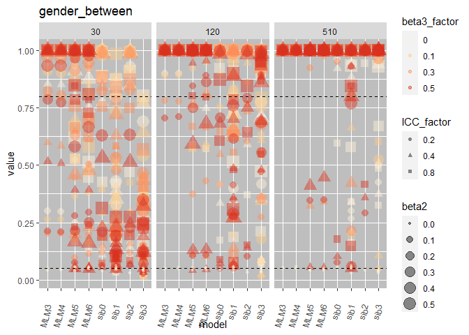
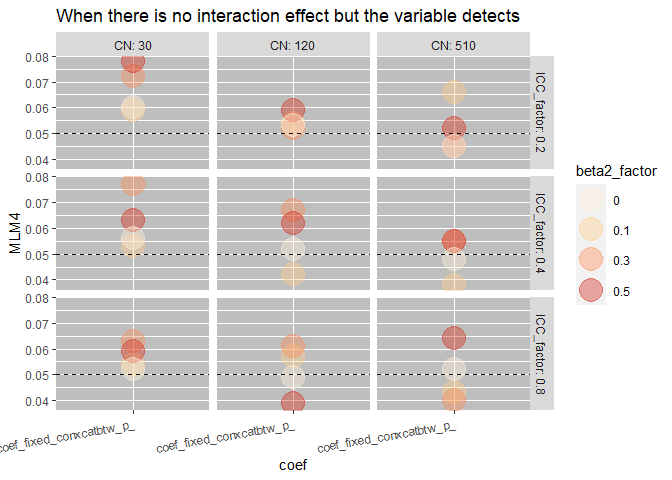

Plot AND regression for Check
================
Yoo Ri Hwang
6/5/2022

# setup

## load the package

``` r
#install.packages("gtsummary")
library(tidyverse)
```

    ## -- Attaching packages --------------------------------------- tidyverse 1.3.1 --

    ## v ggplot2 3.3.6     v purrr   0.3.4
    ## v tibble  3.1.4     v dplyr   1.0.8
    ## v tidyr   1.2.0     v stringr 1.4.0
    ## v readr   2.1.2     v forcats 0.5.1

    ## Warning: package 'ggplot2' was built under R version 4.1.3

    ## Warning: package 'tidyr' was built under R version 4.1.3

    ## Warning: package 'readr' was built under R version 4.1.3

    ## Warning: package 'dplyr' was built under R version 4.1.3

    ## -- Conflicts ------------------------------------------ tidyverse_conflicts() --
    ## x dplyr::filter() masks stats::filter()
    ## x dplyr::lag()    masks stats::lag()

``` r
# library(gtsummary)
# ## https://github.com/R-Computing-Lab/target-causalclaims/blob/main/R/utils_prettify-results.R
# prettify_regression_results <- function(regression_object) {
#   regression_object %>%
#     gtsummary::tbl_regression(intercept=TRUE) %>%
#     gtsummary::add_glance_source_note(
#       label = list(statistic ~ "F-statistic",
#                    df  ~ "DF1",
#                    df.residual  ~ "DF2"),
#       include = c(r.squared, statistic, df, df.residual, p.value, nobs)
#       ) %>%
#     gtsummary::modify_header(
#       statistic ~ "**t-statistic**", p.value ~ "**p-value**"
#       )
# }
```

## load the data

``` r
sig_rate<-read.csv("type1error/sig_rate_with_conditions.csv")
sig_rate_01alpha<-read.csv("type1error/sig_rate_0.01alpha.csv")
```

## EVERYTHING

``` r
# 
sig_rate$X<-NULL
sig_rate$X.1<-NULL
sig_rate_01alpha$X<-NULL
sig_rate_01alpha$X.1<-NULL
# 
# write.csv(sig_rate,"type1error/sig_rate_with_conditions.csv")
# write.csv(sig_rate_01alpha, "type1error/sig_rate_0.01alpha.csv")

# if you want to see only categorical/interaction terms variable
# sig_rate<-sig_rate[,grep("_gender|ev|catbtw|fxg|fxe|nxe|nxc|CN|beta|ICC",names(sig_rate))]
# sig_rate_01alpha<-sig_rate_01alpha[,grep("_gender|ev|catbtw|fxg|fxe|nxe|nxc|CN|beta|ICC",names(sig_rate_01alpha))]


sig_rate$beta2_factor<-as.factor(sig_rate$beta2)
sig_rate$beta3_factor<-as.factor(sig_rate$beta3)
sig_rate$ICC_factor<-as.factor(sig_rate$ICC)
sig_rate$CN_factor <- as.factor(sig_rate$CN)


sig_rate_01alpha$beta2_factor<-as.factor(sig_rate_01alpha$beta2)
sig_rate_01alpha$beta3_factor<-as.factor(sig_rate_01alpha$beta3)
sig_rate_01alpha$ICC_factor<-as.factor(sig_rate_01alpha$ICC)
sig_rate_01alpha$CN_factor <- as.factor(sig_rate_01alpha$CN)

### data reshaping for plotting  for 0.05 alpha 

# wide to long 
sig_rate_long<-sig_rate%>%
  pivot_longer( cols=-c("beta1","condition","beta2","beta3","ICC","CN",
                        "beta2_factor","beta3_factor","ICC_factor","CN_factor"),
    names_to = c('coef', 'model'),
               names_sep = '(?<=_p_)')

sig_rate_long_01alpha<-sig_rate_01alpha%>%
  pivot_longer( cols=-c("beta1","condition","beta2","beta3","ICC","CN",
                        "beta2_factor","beta3_factor","ICC_factor","CN_factor"),
    names_to = c('coef', 'model'),
               names_sep = '(?<=_p_)')


# corresponding variable. 
## make a categorical variable
## this variable indicate this effect. (i.e., edu within , gendern between effect etc. )


sig_rate_long <- sig_rate_long %>%
  mutate(
    correspond = case_when(
      coef=="coef_con_diff_p_" ~ "edu_within",
      coef=="coef_con_diffxev1_p_" ~ "interaction",
      coef=="coef_con_diffxev2_p_" ~ "interaction",
      coef=="coef_con_diffxgender_composition_two_eff_p_" ~ "interaction",
      coef=="coef_con_mean_p_" ~ "edu_between",
      coef=="coef_ev1_p_" ~ "gender_between",
      coef=="coef_ev2_p_" ~ "gender_between",
      coef=="coef_fixed_catbtw_p_" ~ "gender_between",
      coef=="coef_fixed_catwtn_p_" ~ "gender_within",
      coef=="coef_fixed_catwtnxcon_p_"  ~ "interaction",
      coef=="coef_fixed_con_p_" ~ "edu_within",
      coef=="coef_fixed_conxcatbtw_p_" ~ "interaction",
      coef=="coef_fixed_conxev1_p_" ~ "interaction",
      coef=="coef_fixed_conxev2_p_" ~ "interaction",
      coef=="coef_fixed_ev1_p_" ~ "gender_between",
      coef=="coef_fixed_ev2_p_" ~ "gender_between",
      coef=="coef_fixed_Intercept_p_" ~ "intercept",
      coef=="coef_gender_composition_two_eff_p_"~"gender_between",
      coef=="coef_intercept_p_" ~ "intercept",
      coef=="coef_y_mean_p_" ~ "health_between",
      coef=="f_p_" ~ "F_test_dyadic"
    )
  )


sig_rate_long_01alpha <- sig_rate_long_01alpha %>%
  mutate(
    correspond = case_when(
      coef=="coef_con_diff_p_" ~ "edu_within",
      coef=="coef_con_diffxev1_p_" ~ "interaction",
      coef=="coef_con_diffxev2_p_" ~ "interaction",
      coef=="coef_con_diffxgender_composition_two_eff_p_" ~ "interaction",
      coef=="coef_con_mean_p_" ~ "edu_between",
      coef=="coef_ev1_p_" ~ "gender_between",
      coef=="coef_ev2_p_" ~ "gender_between",
      coef=="coef_fixed_catbtw_p_" ~ "gender_between",
      coef=="coef_fixed_catwtn_p_" ~ "gender_within",
      coef=="coef_fixed_catwtnxcon_p_"  ~ "interaction",
      coef=="coef_fixed_con_p_" ~ "edu_within",
      coef=="coef_fixed_conxcatbtw_p_" ~ "interaction",
      coef=="coef_fixed_conxev1_p_" ~ "interaction",
      coef=="coef_fixed_conxev2_p_" ~ "interaction",
      coef=="coef_fixed_ev1_p_" ~ "gender_between",
      coef=="coef_fixed_ev2_p_" ~ "gender_between",
      coef=="coef_fixed_Intercept_p_" ~ "intercept",
      coef=="coef_gender_composition_two_eff_p_"~"gender_between",
      coef=="coef_intercept_p_" ~ "intercept",
      coef=="coef_y_mean_p_" ~ "health_between",
      coef=="f_p_" ~ "F_test_dyadic"
    )
  )


sig_rate_long2_interaction <- sig_rate_long %>%
  mutate(
    correspond = case_when(
      
      coef=="coef_con_diffxev1_p_" ~ "edudiffxinteraction_ev1",
      coef=="coef_con_diffxev2_p_" ~ "edudiffxinteraction_ev2",
      coef=="coef_con_diffxgender_composition_two_eff_p_" ~ "edu_diffxgendercomposition_two",
     
      coef=="coef_fixed_catwtnxcon_p_"  ~ "education_genderwithin",
      
      coef=="coef_fixed_conxcatbtw_p_" ~ "eduxgendercomposition_two",
      coef=="coef_fixed_conxev1_p_" ~ "eduxinteraction_ev1",
      coef=="coef_fixed_conxev2_p_" ~ "edudiffxinteraction_ev2",
      TRUE ~ NA_character_
      
    )
  )


# I tried to draw big giant plot, but r says thare are restrictions ( maximum number of points/ maximum number of levels) so, let's split a data. that's not an ideal way to do so, but R is not not perfect

## by sample size 
sig_rate_long_CN30<- sig_rate_long %>%
  subset(CN==30)
sig_rate_long_CN120<- sig_rate_long %>%
  subset(CN==120)
sig_rate_long_CN510<- sig_rate_long %>%
  subset(CN==510)


# by corresponds 

sig_rate_long_edu_between<- sig_rate_long %>%
  subset(correspond=="edu_between")
sig_rate_long_edu_within<- sig_rate_long %>%
  subset(correspond=="edu_within")
sig_rate_long_F_test_dyadic<- sig_rate_long %>%
  subset(correspond=="F_test_dyadic")
sig_rate_long_gender_between<- sig_rate_long %>%
  subset(correspond=="gender_between")
sig_rate_long_gender_within<- sig_rate_long %>%
  subset(correspond=="gender_within")
sig_rate_long_health_between<- sig_rate_long %>%
  subset(correspond=="health_between")
sig_rate_long_interaction<- sig_rate_long %>%
  subset(correspond=="interaction")
sig_rate_long_intercept<- sig_rate_long %>%
  subset(correspond=="intercept")

#closer compare for interaction effect 

sig_rate_long2_interaction$modelcoef<-str_c(sig_rate_long2_interaction$model,'_',sig_rate_long2_interaction$correspond)


sig_rate_long2_interaction_ev <- sig_rate_long2_interaction %>% 
  subset(grepl('ev[1-2]$', modelcoef))


sig_rate_long2_interaction_two <- sig_rate_long2_interaction %>% 
  subset(grepl('two$', modelcoef))


sig_rate_long2_interaction_genderwithin <- sig_rate_long2_interaction %>% 
  subset(grepl('within$', modelcoef))


# I tried to draw big giant plot, but r says thare are restrictions ( maximum number of points/ maximum number of levels) so, let's split a data. that's not an ideal way to do so, but R is not not perfect

## by sample size 
sig_rate_long_01alpha_CN30<- sig_rate_long_01alpha %>%
  subset(CN==30)
sig_rate_long_01alpha_CN120<- sig_rate_long_01alpha %>%
  subset(CN==120)
sig_rate_long_01alpha_CN510<- sig_rate_long_01alpha %>%
  subset(CN==510)


# by corresponds 
## make a categorical variable
## this variable indicate this effect. (i.e., edu within , gendern between effect etc. )

sig_rate_long_01alpha_edu_between<- sig_rate_long_01alpha %>%
  subset(correspond=="edu_between")
sig_rate_long_01alpha_edu_within<- sig_rate_long_01alpha %>%
  subset(correspond=="edu_within")
sig_rate_long_01alpha_F_test_dyadic<- sig_rate_long_01alpha %>%
  subset(correspond=="F_test_dyadic")
sig_rate_long_01alpha_gender_between<- sig_rate_long_01alpha %>%
  subset(correspond=="gender_between")
sig_rate_long_01alpha_gender_within<- sig_rate_long_01alpha %>%
  subset(correspond=="gender_within")
sig_rate_long_01alpha_health_between<- sig_rate_long_01alpha %>%
  subset(correspond=="health_between")
sig_rate_long_01alpha_interaction<- sig_rate_long_01alpha %>%
  subset(correspond=="interaction")
sig_rate_long_01alpha_intercept<- sig_rate_long_01alpha %>%
  subset(correspond=="intercept")
```

# plot interactions

(only variables that corresponding to categorical/interaction term)

## when alpha 0.5

``` r
ggplot(sig_rate_long2_interaction_ev,
       aes(y= value, 
                          x= modelcoef, 
                          colour = beta3_factor, 
                          size = beta2))+
        geom_point(alpha=0.45) +
          facet_grid(ICC~CN,
                     labeller="label_both") +
   scale_colour_brewer(palette="OrRd") + 
   theme(panel.background= element_rect(fill = "grey"))+
  theme(axis.text.x = element_text(angle = 75, vjust = 1, hjust=1)) +
   geom_hline(yintercept=0.05, linetype="dashed")+
   geom_hline(yintercept=0.80, linetype="dashed")+
  ggtitle('compare interaction when gender composition (ff vs mm vs mixed)')
```

<!-- -->

``` r
ggplot(sig_rate_long2_interaction_two,
       aes(y= value, 
                          x= modelcoef, 
                          colour = beta3_factor, 
                          size = beta2))+
        geom_point(alpha=0.45) +
          facet_grid(ICC~CN,
                     labeller="label_both") +
   scale_colour_brewer(palette="OrRd") + 
   theme(panel.background= element_rect(fill = "grey"))+
  theme(axis.text.x = element_text(angle = 75, vjust = 1, hjust=1)) +
   geom_hline(yintercept=0.05, linetype="dashed")+
   geom_hline(yintercept=0.80, linetype="dashed")+
  ggtitle('compare interaction when gender composition (mixed vs same)')
```

<!-- -->

``` r
ggplot(sig_rate_long2_interaction_genderwithin,
       aes(y= value, 
                          x= modelcoef, 
                          colour = beta3_factor, 
                          size = beta2))+
        geom_point(alpha=0.45) +
          facet_grid(ICC~CN,
                     labeller="label_both") +
   scale_colour_brewer(palette="OrRd") + 
   theme(panel.background= element_rect(fill = "grey"))+
  theme(axis.text.x = element_text(angle = 75, vjust = 1, hjust=1)) +
   geom_hline(yintercept=0.05, linetype="dashed")+
   geom_hline(yintercept=0.80, linetype="dashed")+
   ggtitle('compare interaction when gender (f vs m)')
```

<!-- -->

### facet CN

``` r
start <- which( colnames(sig_rate)=="coef_fixed_conxev2_p_MLM6")

for(i in 2:start){
  
 p<- ggplot(sig_rate, aes(y= sig_rate[,i], 
                          x= ICC, 
                          colour = beta3_factor, 
                          size = beta2))+
        geom_point(alpha=0.45) +
          facet_wrap(~CN) +
   scale_colour_brewer(palette="OrRd") + 
      ylab(colnames(sig_rate[i]))+
   theme(panel.background= element_rect(fill = "grey"))+
   geom_hline(yintercept=0.05, linetype="dashed")+
   geom_hline(yintercept=0.80, linetype="dashed")
   
 
    model <- lm(paste(colnames(sig_rate[i]),"~ICC+beta2+beta3+CN"), data=sig_rate)
    sum<-summary(model) 
    
    model_fac <- lm(paste(colnames(sig_rate[i]),"~ICC_factor+beta2_factor+beta3_factor+CN_factor"), data=sig_rate) 
  
   sum_fac<-summary(model_fac)
  
    out<-list(p,sum,sum_fac)
    print(out)
    
  
  
}
```

    ## [[1]]

<!-- -->

    ## 
    ## [[2]]
    ## 
    ## Call:
    ## lm(formula = paste(colnames(sig_rate[i]), "~ICC+beta2+beta3+CN"), 
    ##     data = sig_rate)
    ## 
    ## Residuals:
    ##      Min       1Q   Median       3Q      Max 
    ## -0.23434 -0.01525  0.01246  0.03231  0.09298 
    ## 
    ## Coefficients:
    ##               Estimate Std. Error t value Pr(>|t|)    
    ## (Intercept)  9.649e-01  1.628e-02  59.250  < 2e-16 ***
    ## ICC         -1.280e-02  2.198e-02  -0.583   0.5613    
    ## beta2        7.432e-02  3.144e-02   2.364   0.0198 *  
    ## beta3       -1.362e-01  2.854e-02  -4.772 5.56e-06 ***
    ## CN           1.089e-04  2.631e-05   4.138 6.82e-05 ***
    ## ---
    ## Signif. codes:  0 '***' 0.001 '**' 0.01 '*' 0.05 '.' 0.1 ' ' 1
    ## 
    ## Residual standard error: 0.05929 on 112 degrees of freedom
    ## Multiple R-squared:  0.2781, Adjusted R-squared:  0.2524 
    ## F-statistic: 10.79 on 4 and 112 DF,  p-value: 1.962e-07
    ## 
    ## 
    ## [[3]]
    ## 
    ## Call:
    ## lm(formula = paste(colnames(sig_rate[i]), "~ICC_factor+beta2_factor+beta3_factor+CN_factor"), 
    ##     data = sig_rate)
    ## 
    ## Residuals:
    ##       Min        1Q    Median        3Q       Max 
    ## -0.196548 -0.020692  0.000669  0.035286  0.074518 
    ## 
    ## Coefficients:
    ##                  Estimate Std. Error t value Pr(>|t|)    
    ## (Intercept)      0.953872   0.020127  47.392  < 2e-16 ***
    ## ICC_factor0.4   -0.003000   0.011958  -0.251    0.802    
    ## ICC_factor0.8   -0.007769   0.011958  -0.650    0.517    
    ## beta2_factor0.1 -0.023620   0.021557  -1.096    0.276    
    ## beta2_factor0.3 -0.011704   0.021557  -0.543    0.588    
    ## beta2_factor0.5  0.012546   0.021557   0.582    0.562    
    ## beta3_factor0.1  0.002259   0.014371   0.157    0.875    
    ## beta3_factor0.3 -0.016963   0.014371  -1.180    0.241    
    ## beta3_factor0.5 -0.062704   0.014371  -4.363 2.99e-05 ***
    ## CN_factor120     0.074564   0.011958   6.236 9.34e-09 ***
    ## CN_factor510     0.074590   0.011958   6.238 9.25e-09 ***
    ## ---
    ## Signif. codes:  0 '***' 0.001 '**' 0.01 '*' 0.05 '.' 0.1 ' ' 1
    ## 
    ## Residual standard error: 0.0528 on 106 degrees of freedom
    ## Multiple R-squared:  0.4582, Adjusted R-squared:  0.4071 
    ## F-statistic: 8.963 on 10 and 106 DF,  p-value: 1.494e-10
    ## 
    ## 
    ## [[1]]

<!-- -->

    ## 
    ## [[2]]
    ## 
    ## Call:
    ## lm(formula = paste(colnames(sig_rate[i]), "~ICC+beta2+beta3+CN"), 
    ##     data = sig_rate)
    ## 
    ## Residuals:
    ##      Min       1Q   Median       3Q      Max 
    ## -0.25156 -0.01865  0.01345  0.03154  0.09180 
    ## 
    ## Coefficients:
    ##               Estimate Std. Error t value Pr(>|t|)    
    ## (Intercept)  9.706e-01  1.720e-02  56.441  < 2e-16 ***
    ## ICC         -1.378e-02  2.321e-02  -0.594    0.554    
    ## beta2        5.182e-02  3.320e-02   1.561    0.121    
    ## beta3       -1.402e-01  3.014e-02  -4.651 9.10e-06 ***
    ## CN           1.129e-04  2.779e-05   4.061 9.07e-05 ***
    ## ---
    ## Signif. codes:  0 '***' 0.001 '**' 0.01 '*' 0.05 '.' 0.1 ' ' 1
    ## 
    ## Residual standard error: 0.06261 on 112 degrees of freedom
    ## Multiple R-squared:  0.2599, Adjusted R-squared:  0.2334 
    ## F-statistic:  9.83 on 4 and 112 DF,  p-value: 7.476e-07
    ## 
    ## 
    ## [[3]]
    ## 
    ## Call:
    ## lm(formula = paste(colnames(sig_rate[i]), "~ICC_factor+beta2_factor+beta3_factor+CN_factor"), 
    ##     data = sig_rate)
    ## 
    ## Residuals:
    ##       Min        1Q    Median        3Q       Max 
    ## -0.208082 -0.021299 -0.004952  0.041538  0.069358 
    ## 
    ## Coefficients:
    ##                  Estimate Std. Error t value Pr(>|t|)    
    ## (Intercept)      0.952350   0.020662  46.093  < 2e-16 ***
    ## ICC_factor0.4   -0.003333   0.012275  -0.272    0.786    
    ## ICC_factor0.8   -0.008385   0.012275  -0.683    0.496    
    ## beta2_factor0.1 -0.018417   0.022129  -0.832    0.407    
    ## beta2_factor0.3 -0.020139   0.022129  -0.910    0.365    
    ## beta2_factor0.5  0.006444   0.022129   0.291    0.771    
    ## beta3_factor0.1  0.002889   0.014753   0.196    0.845    
    ## beta3_factor0.3 -0.001259   0.014753  -0.085    0.932    
    ## beta3_factor0.5 -0.070519   0.014753  -4.780 5.67e-06 ***
    ## CN_factor120     0.077333   0.012275   6.300 6.91e-09 ***
    ## CN_factor510     0.077333   0.012275   6.300 6.91e-09 ***
    ## ---
    ## Signif. codes:  0 '***' 0.001 '**' 0.01 '*' 0.05 '.' 0.1 ' ' 1
    ## 
    ## Residual standard error: 0.0542 on 106 degrees of freedom
    ## Multiple R-squared:  0.475,  Adjusted R-squared:  0.4255 
    ## F-statistic: 9.591 on 10 and 106 DF,  p-value: 3.217e-11
    ## 
    ## 
    ## [[1]]

<!-- -->

    ## 
    ## [[2]]
    ## 
    ## Call:
    ## lm(formula = paste(colnames(sig_rate[i]), "~ICC+beta2+beta3+CN"), 
    ##     data = sig_rate)
    ## 
    ## Residuals:
    ##      Min       1Q   Median       3Q      Max 
    ## -0.21988 -0.01468  0.01004  0.03148  0.09140 
    ## 
    ## Coefficients:
    ##               Estimate Std. Error t value Pr(>|t|)    
    ## (Intercept)  9.641e-01  1.593e-02  60.521  < 2e-16 ***
    ## ICC         -9.707e-03  2.150e-02  -0.452   0.6525    
    ## beta2        7.690e-02  3.076e-02   2.500   0.0139 *  
    ## beta3       -1.385e-01  2.792e-02  -4.960 2.54e-06 ***
    ## CN           1.068e-04  2.574e-05   4.149 6.53e-05 ***
    ## ---
    ## Signif. codes:  0 '***' 0.001 '**' 0.01 '*' 0.05 '.' 0.1 ' ' 1
    ## 
    ## Residual standard error: 0.058 on 112 degrees of freedom
    ## Multiple R-squared:  0.2882, Adjusted R-squared:  0.2627 
    ## F-statistic: 11.33 on 4 and 112 DF,  p-value: 9.282e-08
    ## 
    ## 
    ## [[3]]
    ## 
    ## Call:
    ## lm(formula = paste(colnames(sig_rate[i]), "~ICC_factor+beta2_factor+beta3_factor+CN_factor"), 
    ##     data = sig_rate)
    ## 
    ## Residuals:
    ##       Min        1Q    Median        3Q       Max 
    ## -0.183506 -0.021214  0.002145  0.034735  0.071981 
    ## 
    ## Coefficients:
    ##                   Estimate Std. Error t value Pr(>|t|)    
    ## (Intercept)      0.9540342  0.0198159  48.145  < 2e-16 ***
    ## ICC_factor0.4   -0.0024359  0.0117724  -0.207    0.836    
    ## ICC_factor0.8   -0.0059231  0.0117724  -0.503    0.616    
    ## beta2_factor0.1 -0.0230926  0.0212230  -1.088    0.279    
    ## beta2_factor0.3 -0.0062593  0.0212230  -0.295    0.769    
    ## beta2_factor0.5  0.0140185  0.0212230   0.661    0.510    
    ## beta3_factor0.1  0.0007778  0.0141487   0.055    0.956    
    ## beta3_factor0.3 -0.0230741  0.0141487  -1.631    0.106    
    ## beta3_factor0.5 -0.0630000  0.0141487  -4.453 2.11e-05 ***
    ## CN_factor120     0.0731026  0.0117724   6.210 1.06e-08 ***
    ## CN_factor510     0.0731538  0.0117724   6.214 1.03e-08 ***
    ## ---
    ## Signif. codes:  0 '***' 0.001 '**' 0.01 '*' 0.05 '.' 0.1 ' ' 1
    ## 
    ## Residual standard error: 0.05199 on 106 degrees of freedom
    ## Multiple R-squared:  0.4588, Adjusted R-squared:  0.4077 
    ## F-statistic: 8.986 on 10 and 106 DF,  p-value: 1.413e-10
    ## 
    ## 
    ## [[1]]

<!-- -->

    ## 
    ## [[2]]
    ## 
    ## Call:
    ## lm(formula = paste(colnames(sig_rate[i]), "~ICC+beta2+beta3+CN"), 
    ##     data = sig_rate)
    ## 
    ## Residuals:
    ##       Min        1Q    Median        3Q       Max 
    ## -0.078124 -0.004167  0.002750  0.012847  0.022863 
    ## 
    ## Coefficients:
    ##               Estimate Std. Error t value Pr(>|t|)    
    ## (Intercept)  9.847e-01  5.703e-03 172.679  < 2e-16 ***
    ## ICC         -7.408e-03  7.695e-03  -0.963    0.338    
    ## beta2        1.215e-02  1.101e-02   1.103    0.272    
    ## beta3       -1.571e-02  9.994e-03  -1.572    0.119    
    ## CN           4.157e-05  9.214e-06   4.512 1.59e-05 ***
    ## ---
    ## Signif. codes:  0 '***' 0.001 '**' 0.01 '*' 0.05 '.' 0.1 ' ' 1
    ## 
    ## Residual standard error: 0.02076 on 112 degrees of freedom
    ## Multiple R-squared:  0.1798, Adjusted R-squared:  0.1505 
    ## F-statistic: 6.137 on 4 and 112 DF,  p-value: 0.0001676
    ## 
    ## 
    ## [[3]]
    ## 
    ## Call:
    ## lm(formula = paste(colnames(sig_rate[i]), "~ICC_factor+beta2_factor+beta3_factor+CN_factor"), 
    ##     data = sig_rate)
    ## 
    ## Residuals:
    ##       Min        1Q    Median        3Q       Max 
    ## -0.054031 -0.007009  0.001657  0.010719  0.022431 
    ## 
    ## Coefficients:
    ##                  Estimate Std. Error t value Pr(>|t|)    
    ## (Intercept)      0.983060   0.006286 156.397  < 2e-16 ***
    ## ICC_factor0.4   -0.001949   0.003734  -0.522  0.60286    
    ## ICC_factor0.8   -0.004538   0.003734  -1.215  0.22693    
    ## beta2_factor0.1 -0.013204   0.006732  -1.961  0.05246 .  
    ## beta2_factor0.3 -0.019787   0.006732  -2.939  0.00404 ** 
    ## beta2_factor0.5 -0.004787   0.006732  -0.711  0.47859    
    ## beta3_factor0.1  0.005963   0.004488   1.329  0.18682    
    ## beta3_factor0.3  0.009444   0.004488   2.104  0.03771 *  
    ## beta3_factor0.5 -0.005704   0.004488  -1.271  0.20655    
    ## CN_factor120     0.028487   0.003734   7.629 1.08e-11 ***
    ## CN_factor510     0.028487   0.003734   7.629 1.08e-11 ***
    ## ---
    ## Signif. codes:  0 '***' 0.001 '**' 0.01 '*' 0.05 '.' 0.1 ' ' 1
    ## 
    ## Residual standard error: 0.01649 on 106 degrees of freedom
    ## Multiple R-squared:  0.5104, Adjusted R-squared:  0.4642 
    ## F-statistic: 11.05 on 10 and 106 DF,  p-value: 1.054e-12
    ## 
    ## 
    ## [[1]]

<!-- -->

    ## 
    ## [[2]]
    ## 
    ## Call:
    ## lm(formula = paste(colnames(sig_rate[i]), "~ICC+beta2+beta3+CN"), 
    ##     data = sig_rate)
    ## 
    ## Residuals:
    ##      Min       1Q   Median       3Q      Max 
    ## -0.36966 -0.01796  0.01278  0.03811  0.08507 
    ## 
    ## Coefficients:
    ##              Estimate Std. Error t value Pr(>|t|)    
    ## (Intercept) 8.986e-01  2.010e-02  44.710  < 2e-16 ***
    ## ICC         1.355e-03  2.712e-02   0.050 0.960233    
    ## beta2       1.482e-01  3.880e-02   3.818 0.000221 ***
    ## beta3       8.444e-02  3.522e-02   2.398 0.018161 *  
    ## CN          9.405e-05  3.247e-05   2.896 0.004544 ** 
    ## ---
    ## Signif. codes:  0 '***' 0.001 '**' 0.01 '*' 0.05 '.' 0.1 ' ' 1
    ## 
    ## Residual standard error: 0.07318 on 112 degrees of freedom
    ## Multiple R-squared:  0.2208, Adjusted R-squared:  0.193 
    ## F-statistic: 7.936 on 4 and 112 DF,  p-value: 1.14e-05
    ## 
    ## 
    ## [[3]]
    ## 
    ## Call:
    ## lm(formula = paste(colnames(sig_rate[i]), "~ICC_factor+beta2_factor+beta3_factor+CN_factor"), 
    ##     data = sig_rate)
    ## 
    ## Residuals:
    ##       Min        1Q    Median        3Q       Max 
    ## -0.270496 -0.029467 -0.000665  0.033689  0.133274 
    ## 
    ## Coefficients:
    ##                  Estimate Std. Error t value Pr(>|t|)    
    ## (Intercept)     0.8024957  0.0250446  32.043  < 2e-16 ***
    ## ICC_factor0.4   0.0003077  0.0148787   0.021    0.984    
    ## ICC_factor0.8   0.0008205  0.0148787   0.055    0.956    
    ## beta2_factor0.1 0.1129352  0.0268230   4.210 5.36e-05 ***
    ## beta2_factor0.3 0.1442963  0.0268230   5.380 4.49e-07 ***
    ## beta2_factor0.5 0.1443241  0.0268230   5.381 4.47e-07 ***
    ## beta3_factor0.1 0.0013704  0.0178820   0.077    0.939    
    ## beta3_factor0.3 0.0185185  0.0178820   1.036    0.303    
    ## beta3_factor0.5 0.0205926  0.0178820   1.152    0.252    
    ## CN_factor120    0.0638205  0.0148787   4.289 3.97e-05 ***
    ## CN_factor510    0.0642308  0.0148787   4.317 3.57e-05 ***
    ## ---
    ## Signif. codes:  0 '***' 0.001 '**' 0.01 '*' 0.05 '.' 0.1 ' ' 1
    ## 
    ## Residual standard error: 0.0657 on 106 degrees of freedom
    ## Multiple R-squared:  0.4055, Adjusted R-squared:  0.3494 
    ## F-statistic:  7.23 on 10 and 106 DF,  p-value: 1.278e-08
    ## 
    ## 
    ## [[1]]

<!-- -->

    ## 
    ## [[2]]
    ## 
    ## Call:
    ## lm(formula = paste(colnames(sig_rate[i]), "~ICC+beta2+beta3+CN"), 
    ##     data = sig_rate)
    ## 
    ## Residuals:
    ##      Min       1Q   Median       3Q      Max 
    ## -0.66976 -0.29198 -0.01137  0.26647  0.65081 
    ## 
    ## Coefficients:
    ##               Estimate Std. Error t value Pr(>|t|)    
    ## (Intercept)  0.0272918  0.0950761   0.287  0.77460    
    ## ICC         -0.0034432  0.1283012  -0.027  0.97864    
    ## beta2        0.5578629  0.1835687   3.039  0.00295 ** 
    ## beta3        0.5176796  0.1666233   3.107  0.00240 ** 
    ## CN           0.0007377  0.0001536   4.802  4.9e-06 ***
    ## ---
    ## Signif. codes:  0 '***' 0.001 '**' 0.01 '*' 0.05 '.' 0.1 ' ' 1
    ## 
    ## Residual standard error: 0.3462 on 112 degrees of freedom
    ## Multiple R-squared:  0.2868, Adjusted R-squared:  0.2613 
    ## F-statistic: 11.26 on 4 and 112 DF,  p-value: 1.031e-07
    ## 
    ## 
    ## [[3]]
    ## 
    ## Call:
    ## lm(formula = paste(colnames(sig_rate[i]), "~ICC_factor+beta2_factor+beta3_factor+CN_factor"), 
    ##     data = sig_rate)
    ## 
    ## Residuals:
    ##      Min       1Q   Median       3Q      Max 
    ## -0.26551 -0.12040 -0.01855  0.14542  0.37025 
    ## 
    ## Coefficients:
    ##                  Estimate Std. Error t value Pr(>|t|)    
    ## (Intercept)     -0.185282   0.066047  -2.805  0.00598 ** 
    ## ICC_factor0.4   -0.001641   0.039238  -0.042  0.96672    
    ## ICC_factor0.8   -0.002256   0.039238  -0.058  0.95425    
    ## beta2_factor0.1 -0.141324   0.070737  -1.998  0.04829 *  
    ## beta2_factor0.3  0.021787   0.070737   0.308  0.75869    
    ## beta2_factor0.5  0.031537   0.070737   0.446  0.65663    
    ## beta3_factor0.1  0.741037   0.047158  15.714  < 2e-16 ***
    ## beta3_factor0.3  0.707815   0.047158  15.009  < 2e-16 ***
    ## beta3_factor0.5  0.384889   0.047158   8.162 7.33e-13 ***
    ## CN_factor120     0.290154   0.039238   7.395 3.47e-11 ***
    ## CN_factor510     0.431256   0.039238  10.991  < 2e-16 ***
    ## ---
    ## Signif. codes:  0 '***' 0.001 '**' 0.01 '*' 0.05 '.' 0.1 ' ' 1
    ## 
    ## Residual standard error: 0.1733 on 106 degrees of freedom
    ## Multiple R-squared:  0.8309, Adjusted R-squared:  0.8149 
    ## F-statistic: 52.08 on 10 and 106 DF,  p-value: < 2.2e-16
    ## 
    ## 
    ## [[1]]

<!-- -->

    ## 
    ## [[2]]
    ## 
    ## Call:
    ## lm(formula = paste(colnames(sig_rate[i]), "~ICC+beta2+beta3+CN"), 
    ##     data = sig_rate)
    ## 
    ## Residuals:
    ##      Min       1Q   Median       3Q      Max 
    ## -0.50222 -0.17278 -0.03861  0.09548  0.64528 
    ## 
    ## Coefficients:
    ##               Estimate Std. Error t value Pr(>|t|)    
    ## (Intercept) -0.1365571  0.0768208  -1.778  0.07818 .  
    ## ICC          0.3239744  0.1036664   3.125  0.00226 ** 
    ## beta2        0.1490743  0.1483223   1.005  0.31703    
    ## beta3        0.2951790  0.1346305   2.193  0.03041 *  
    ## CN           0.0006354  0.0001241   5.119 1.29e-06 ***
    ## ---
    ## Signif. codes:  0 '***' 0.001 '**' 0.01 '*' 0.05 '.' 0.1 ' ' 1
    ## 
    ## Residual standard error: 0.2797 on 112 degrees of freedom
    ## Multiple R-squared:  0.2752, Adjusted R-squared:  0.2494 
    ## F-statistic: 10.63 on 4 and 112 DF,  p-value: 2.431e-07
    ## 
    ## 
    ## [[3]]
    ## 
    ## Call:
    ## lm(formula = paste(colnames(sig_rate[i]), "~ICC_factor+beta2_factor+beta3_factor+CN_factor"), 
    ##     data = sig_rate)
    ## 
    ## Residuals:
    ##      Min       1Q   Median       3Q      Max 
    ## -0.45952 -0.14487 -0.02902  0.17336  0.61959 
    ## 
    ## Coefficients:
    ##                  Estimate Std. Error t value Pr(>|t|)    
    ## (Intercept)     -0.164171   0.089898  -1.826  0.07064 .  
    ## ICC_factor0.4   -0.015846   0.053408  -0.297  0.76727    
    ## ICC_factor0.8    0.178256   0.053408   3.338  0.00117 ** 
    ## beta2_factor0.1 -0.041407   0.096282  -0.430  0.66802    
    ## beta2_factor0.3 -0.005519   0.096282  -0.057  0.95440    
    ## beta2_factor0.5 -0.020185   0.096282  -0.210  0.83435    
    ## beta3_factor0.1  0.412407   0.064188   6.425 3.84e-09 ***
    ## beta3_factor0.3  0.340444   0.064188   5.304 6.25e-07 ***
    ## beta3_factor0.5  0.225000   0.064188   3.505  0.00067 ***
    ## CN_factor120     0.149333   0.053408   2.796  0.00614 ** 
    ## CN_factor510     0.336769   0.053408   6.306 6.74e-09 ***
    ## ---
    ## Signif. codes:  0 '***' 0.001 '**' 0.01 '*' 0.05 '.' 0.1 ' ' 1
    ## 
    ## Residual standard error: 0.2358 on 106 degrees of freedom
    ## Multiple R-squared:  0.5123, Adjusted R-squared:  0.4663 
    ## F-statistic: 11.14 on 10 and 106 DF,  p-value: 8.626e-13
    ## 
    ## 
    ## [[1]]

<!-- -->

    ## 
    ## [[2]]
    ## 
    ## Call:
    ## lm(formula = paste(colnames(sig_rate[i]), "~ICC+beta2+beta3+CN"), 
    ##     data = sig_rate)
    ## 
    ## Residuals:
    ##      Min       1Q   Median       3Q      Max 
    ## -0.39044 -0.04821  0.02065  0.06435  0.16398 
    ## 
    ## Coefficients:
    ##               Estimate Std. Error t value Pr(>|t|)    
    ## (Intercept)  9.797e-01  3.033e-02  32.299  < 2e-16 ***
    ## ICC         -2.039e-02  4.093e-02  -0.498   0.6193    
    ## beta2       -1.094e-01  5.856e-02  -1.868   0.0644 .  
    ## beta3       -2.801e-01  5.316e-02  -5.270 6.68e-07 ***
    ## CN           2.617e-04  4.901e-05   5.339 4.94e-07 ***
    ## ---
    ## Signif. codes:  0 '***' 0.001 '**' 0.01 '*' 0.05 '.' 0.1 ' ' 1
    ## 
    ## Residual standard error: 0.1104 on 112 degrees of freedom
    ## Multiple R-squared:  0.3617, Adjusted R-squared:  0.3389 
    ## F-statistic: 15.87 on 4 and 112 DF,  p-value: 2.563e-10
    ## 
    ## 
    ## [[3]]
    ## 
    ## Call:
    ## lm(formula = paste(colnames(sig_rate[i]), "~ICC_factor+beta2_factor+beta3_factor+CN_factor"), 
    ##     data = sig_rate)
    ## 
    ## Residuals:
    ##      Min       1Q   Median       3Q      Max 
    ## -0.32457 -0.04269 -0.00158  0.06617  0.12491 
    ## 
    ## Coefficients:
    ##                  Estimate Std. Error t value Pr(>|t|)    
    ## (Intercept)      0.890419   0.035230  25.275  < 2e-16 ***
    ## ICC_factor0.4   -0.004692   0.020930  -0.224  0.82304    
    ## ICC_factor0.8   -0.012359   0.020930  -0.591  0.55611    
    ## beta2_factor0.1  0.023500   0.037731   0.623  0.53474    
    ## beta2_factor0.3 -0.023750   0.037731  -0.629  0.53041    
    ## beta2_factor0.5 -0.030639   0.037731  -0.812  0.41859    
    ## beta3_factor0.1 -0.003148   0.025154  -0.125  0.90064    
    ## beta3_factor0.3 -0.082111   0.025154  -3.264  0.00148 ** 
    ## beta3_factor0.5 -0.136852   0.025154  -5.441 3.44e-07 ***
    ## CN_factor120     0.169769   0.020930   8.111 9.46e-13 ***
    ## CN_factor510     0.176026   0.020930   8.410 2.06e-13 ***
    ## ---
    ## Signif. codes:  0 '***' 0.001 '**' 0.01 '*' 0.05 '.' 0.1 ' ' 1
    ## 
    ## Residual standard error: 0.09242 on 106 degrees of freedom
    ## Multiple R-squared:  0.5769, Adjusted R-squared:  0.537 
    ## F-statistic: 14.45 on 10 and 106 DF,  p-value: 7.358e-16
    ## 
    ## 
    ## [[1]]

<!-- -->

    ## 
    ## [[2]]
    ## 
    ## Call:
    ## lm(formula = paste(colnames(sig_rate[i]), "~ICC+beta2+beta3+CN"), 
    ##     data = sig_rate)
    ## 
    ## Residuals:
    ##      Min       1Q   Median       3Q      Max 
    ## -0.48272 -0.18952  0.00334  0.19018  0.57429 
    ## 
    ## Coefficients:
    ##               Estimate Std. Error t value Pr(>|t|)    
    ## (Intercept)  0.2570682  0.0667549   3.851 0.000196 ***
    ## ICC         -0.0594780  0.0900829  -0.660 0.510443    
    ## beta2        1.5398184  0.1288874  11.947  < 2e-16 ***
    ## beta3       -0.4088116  0.1169897  -3.494 0.000682 ***
    ## CN           0.0005677  0.0001079   5.264 6.88e-07 ***
    ## ---
    ## Signif. codes:  0 '***' 0.001 '**' 0.01 '*' 0.05 '.' 0.1 ' ' 1
    ## 
    ## Residual standard error: 0.2431 on 112 degrees of freedom
    ## Multiple R-squared:  0.6087, Adjusted R-squared:  0.5948 
    ## F-statistic: 43.56 on 4 and 112 DF,  p-value: < 2.2e-16
    ## 
    ## 
    ## [[3]]
    ## 
    ## Call:
    ## lm(formula = paste(colnames(sig_rate[i]), "~ICC_factor+beta2_factor+beta3_factor+CN_factor"), 
    ##     data = sig_rate)
    ## 
    ## Residuals:
    ##      Min       1Q   Median       3Q      Max 
    ## -0.29204 -0.14211 -0.00216  0.12875  0.35981 
    ## 
    ## Coefficients:
    ##                  Estimate Std. Error t value Pr(>|t|)    
    ## (Intercept)     -0.119376   0.065468  -1.823  0.07106 .  
    ## ICC_factor0.4    0.002051   0.038894   0.053  0.95804    
    ## ICC_factor0.8   -0.032897   0.038894  -0.846  0.39956    
    ## beta2_factor0.1  0.410287   0.070117   5.851 5.49e-08 ***
    ## beta2_factor0.3  0.823287   0.070117  11.742  < 2e-16 ***
    ## beta2_factor0.5  0.911426   0.070117  12.999  < 2e-16 ***
    ## beta3_factor0.1  0.140148   0.046745   2.998  0.00338 ** 
    ## beta3_factor0.3  0.062148   0.046745   1.330  0.18653    
    ## beta3_factor0.5 -0.256000   0.046745  -5.477 2.94e-07 ***
    ## CN_factor120     0.207026   0.038894   5.323 5.75e-07 ***
    ## CN_factor510     0.326282   0.038894   8.389 2.30e-13 ***
    ## ---
    ## Signif. codes:  0 '***' 0.001 '**' 0.01 '*' 0.05 '.' 0.1 ' ' 1
    ## 
    ## Residual standard error: 0.1718 on 106 degrees of freedom
    ## Multiple R-squared:  0.8151, Adjusted R-squared:  0.7976 
    ## F-statistic: 46.73 on 10 and 106 DF,  p-value: < 2.2e-16
    ## 
    ## 
    ## [[1]]

<!-- -->

    ## 
    ## [[2]]
    ## 
    ## Call:
    ## lm(formula = paste(colnames(sig_rate[i]), "~ICC+beta2+beta3+CN"), 
    ##     data = sig_rate)
    ## 
    ## Residuals:
    ##      Min       1Q   Median       3Q      Max 
    ## -0.37992 -0.02592  0.02520  0.05714  0.14452 
    ## 
    ## Coefficients:
    ##               Estimate Std. Error t value Pr(>|t|)    
    ## (Intercept)  8.914e-01  2.689e-02  33.148  < 2e-16 ***
    ## ICC         -8.063e-02  3.629e-02  -2.222  0.02830 *  
    ## beta2        1.239e-01  5.192e-02   2.386  0.01870 *  
    ## beta3        1.317e-01  4.713e-02   2.794  0.00612 ** 
    ## CN           1.883e-04  4.345e-05   4.333 3.23e-05 ***
    ## ---
    ## Signif. codes:  0 '***' 0.001 '**' 0.01 '*' 0.05 '.' 0.1 ' ' 1
    ## 
    ## Residual standard error: 0.09791 on 112 degrees of freedom
    ## Multiple R-squared:  0.2602, Adjusted R-squared:  0.2338 
    ## F-statistic: 9.848 on 4 and 112 DF,  p-value: 7.287e-07
    ## 
    ## 
    ## [[3]]
    ## 
    ## Call:
    ## lm(formula = paste(colnames(sig_rate[i]), "~ICC_factor+beta2_factor+beta3_factor+CN_factor"), 
    ##     data = sig_rate)
    ## 
    ## Residuals:
    ##       Min        1Q    Median        3Q       Max 
    ## -0.265650 -0.040858 -0.002095  0.062697  0.150581 
    ## 
    ## Coefficients:
    ##                  Estimate Std. Error t value Pr(>|t|)    
    ## (Intercept)      0.766650   0.032413  23.653  < 2e-16 ***
    ## ICC_factor0.4   -0.002949   0.019256  -0.153 0.878584    
    ## ICC_factor0.8   -0.045744   0.019256  -2.376 0.019319 *  
    ## beta2_factor0.1  0.100398   0.034714   2.892 0.004644 ** 
    ## beta2_factor0.3  0.124593   0.034714   3.589 0.000504 ***
    ## beta2_factor0.5  0.127676   0.034714   3.678 0.000371 ***
    ## beta3_factor0.1 -0.012519   0.023143  -0.541 0.589693    
    ## beta3_factor0.3  0.025000   0.023143   1.080 0.282481    
    ## beta3_factor0.5  0.041926   0.023143   1.812 0.072876 .  
    ## CN_factor120     0.127564   0.019256   6.625 1.48e-09 ***
    ## CN_factor510     0.128513   0.019256   6.674 1.17e-09 ***
    ## ---
    ## Signif. codes:  0 '***' 0.001 '**' 0.01 '*' 0.05 '.' 0.1 ' ' 1
    ## 
    ## Residual standard error: 0.08503 on 106 degrees of freedom
    ## Multiple R-squared:  0.4719, Adjusted R-squared:  0.4221 
    ## F-statistic: 9.473 on 10 and 106 DF,  p-value: 4.28e-11
    ## 
    ## 
    ## [[1]]

<!-- -->

    ## 
    ## [[2]]
    ## 
    ## Call:
    ## lm(formula = paste(colnames(sig_rate[i]), "~ICC+beta2+beta3+CN"), 
    ##     data = sig_rate)
    ## 
    ## Residuals:
    ##      Min       1Q   Median       3Q      Max 
    ## -0.53853 -0.12483  0.00406  0.10094  0.46585 
    ## 
    ## Coefficients:
    ##               Estimate Std. Error t value Pr(>|t|)    
    ## (Intercept) -0.0635812  0.0671093  -0.947  0.34546    
    ## ICC         -0.0066850  0.0905612  -0.074  0.94129    
    ## beta2        0.4015410  0.1295717   3.099  0.00246 ** 
    ## beta3        0.3793041  0.1176109   3.225  0.00165 ** 
    ## CN           0.0008660  0.0001084   7.987 1.34e-12 ***
    ## ---
    ## Signif. codes:  0 '***' 0.001 '**' 0.01 '*' 0.05 '.' 0.1 ' ' 1
    ## 
    ## Residual standard error: 0.2443 on 112 degrees of freedom
    ## Multiple R-squared:  0.4374, Adjusted R-squared:  0.4173 
    ## F-statistic: 21.77 on 4 and 112 DF,  p-value: 2.626e-13
    ## 
    ## 
    ## [[3]]
    ## 
    ## Call:
    ## lm(formula = paste(colnames(sig_rate[i]), "~ICC_factor+beta2_factor+beta3_factor+CN_factor"), 
    ##     data = sig_rate)
    ## 
    ## Residuals:
    ##       Min        1Q    Median        3Q       Max 
    ## -0.315499 -0.130638  0.006507  0.131952  0.308208 
    ## 
    ## Coefficients:
    ##                  Estimate Std. Error t value Pr(>|t|)    
    ## (Intercept)     -0.147701   0.064527  -2.289   0.0241 *  
    ## ICC_factor0.4   -0.002692   0.038335  -0.070   0.9441    
    ## ICC_factor0.8   -0.004282   0.038335  -0.112   0.9113    
    ## beta2_factor0.1 -0.108815   0.069109  -1.575   0.1183    
    ## beta2_factor0.3  0.064046   0.069109   0.927   0.3562    
    ## beta2_factor0.5  0.025657   0.069109   0.371   0.7112    
    ## beta3_factor0.1  0.435444   0.046073   9.451 9.65e-16 ***
    ## beta3_factor0.3  0.457889   0.046073   9.938  < 2e-16 ***
    ## beta3_factor0.5  0.257481   0.046073   5.589 1.79e-07 ***
    ## CN_factor120     0.166256   0.038335   4.337 3.30e-05 ***
    ## CN_factor510     0.446154   0.038335  11.638  < 2e-16 ***
    ## ---
    ## Signif. codes:  0 '***' 0.001 '**' 0.01 '*' 0.05 '.' 0.1 ' ' 1
    ## 
    ## Residual standard error: 0.1693 on 106 degrees of freedom
    ## Multiple R-squared:  0.7444, Adjusted R-squared:  0.7203 
    ## F-statistic: 30.87 on 10 and 106 DF,  p-value: < 2.2e-16
    ## 
    ## 
    ## [[1]]

<!-- -->

    ## 
    ## [[2]]
    ## 
    ## Call:
    ## lm(formula = paste(colnames(sig_rate[i]), "~ICC+beta2+beta3+CN"), 
    ##     data = sig_rate)
    ## 
    ## Residuals:
    ##      Min       1Q   Median       3Q      Max 
    ## -0.34477 -0.12456 -0.02518  0.06104  0.62531 
    ## 
    ## Coefficients:
    ##               Estimate Std. Error t value Pr(>|t|)    
    ## (Intercept) -1.120e-01  5.450e-02  -2.054   0.0423 *  
    ## ICC          1.309e-01  7.354e-02   1.779   0.0779 .  
    ## beta2        2.714e-01  1.052e-01   2.579   0.0112 *  
    ## beta3        2.420e-01  9.551e-02   2.534   0.0127 *  
    ## CN           5.144e-04  8.806e-05   5.841 5.16e-08 ***
    ## ---
    ## Signif. codes:  0 '***' 0.001 '**' 0.01 '*' 0.05 '.' 0.1 ' ' 1
    ## 
    ## Residual standard error: 0.1984 on 112 degrees of freedom
    ## Multiple R-squared:  0.3191, Adjusted R-squared:  0.2948 
    ## F-statistic: 13.12 on 4 and 112 DF,  p-value: 8.469e-09
    ## 
    ## 
    ## [[3]]
    ## 
    ## Call:
    ## lm(formula = paste(colnames(sig_rate[i]), "~ICC_factor+beta2_factor+beta3_factor+CN_factor"), 
    ##     data = sig_rate)
    ## 
    ## Residuals:
    ##      Min       1Q   Median       3Q      Max 
    ## -0.28857 -0.12126 -0.04000  0.06306  0.58598 
    ## 
    ## Coefficients:
    ##                 Estimate Std. Error t value Pr(>|t|)    
    ## (Intercept)     -0.05997    0.06932  -0.865 0.388865    
    ## ICC_factor0.4   -0.05985    0.04118  -1.453 0.149097    
    ## ICC_factor0.8    0.06131    0.04118   1.489 0.139514    
    ## beta2_factor0.1 -0.07492    0.07424  -1.009 0.315204    
    ## beta2_factor0.3  0.03033    0.07424   0.409 0.683660    
    ## beta2_factor0.5  0.02992    0.07424   0.403 0.687772    
    ## beta3_factor0.1  0.23789    0.04949   4.807 5.09e-06 ***
    ## beta3_factor0.3  0.18289    0.04949   3.695 0.000349 ***
    ## beta3_factor0.5  0.18533    0.04949   3.745 0.000294 ***
    ## CN_factor120     0.07772    0.04118   1.887 0.061857 .  
    ## CN_factor510     0.25774    0.04118   6.259 8.38e-09 ***
    ## ---
    ## Signif. codes:  0 '***' 0.001 '**' 0.01 '*' 0.05 '.' 0.1 ' ' 1
    ## 
    ## Residual standard error: 0.1818 on 106 degrees of freedom
    ## Multiple R-squared:  0.4588, Adjusted R-squared:  0.4078 
    ## F-statistic: 8.987 on 10 and 106 DF,  p-value: 1.408e-10
    ## 
    ## 
    ## [[1]]

<!-- -->

    ## 
    ## [[2]]
    ## 
    ## Call:
    ## lm(formula = paste(colnames(sig_rate[i]), "~ICC+beta2+beta3+CN"), 
    ##     data = sig_rate)
    ## 
    ## Residuals:
    ##      Min       1Q   Median       3Q      Max 
    ## -0.35984 -0.07439  0.02827  0.08675  0.21519 
    ## 
    ## Coefficients:
    ##               Estimate Std. Error t value Pr(>|t|)    
    ## (Intercept)  9.532e-01  3.736e-02  25.516  < 2e-16 ***
    ## ICC         -2.454e-02  5.041e-02  -0.487    0.627    
    ## beta2       -4.912e-02  7.212e-02  -0.681    0.497    
    ## beta3       -4.151e-01  6.547e-02  -6.341 4.95e-09 ***
    ## CN           3.480e-04  6.036e-05   5.765 7.32e-08 ***
    ## ---
    ## Signif. codes:  0 '***' 0.001 '**' 0.01 '*' 0.05 '.' 0.1 ' ' 1
    ## 
    ## Residual standard error: 0.136 on 112 degrees of freedom
    ## Multiple R-squared:  0.4049, Adjusted R-squared:  0.3836 
    ## F-statistic: 19.05 on 4 and 112 DF,  p-value: 5.642e-12
    ## 
    ## 
    ## [[3]]
    ## 
    ## Call:
    ## lm(formula = paste(colnames(sig_rate[i]), "~ICC_factor+beta2_factor+beta3_factor+CN_factor"), 
    ##     data = sig_rate)
    ## 
    ## Residuals:
    ##       Min        1Q    Median        3Q       Max 
    ## -0.269614 -0.069947 -0.002125  0.101783  0.158145 
    ## 
    ## Coefficients:
    ##                  Estimate Std. Error t value Pr(>|t|)    
    ## (Intercept)      0.856624   0.042685  20.069  < 2e-16 ***
    ## ICC_factor0.4   -0.005128   0.025359  -0.202  0.84013    
    ## ICC_factor0.8   -0.014769   0.025359  -0.582  0.56152    
    ## beta2_factor0.1  0.008259   0.045716   0.181  0.85698    
    ## beta2_factor0.3 -0.025130   0.045716  -0.550  0.58369    
    ## beta2_factor0.5 -0.018241   0.045716  -0.399  0.69069    
    ## beta3_factor0.1 -0.003963   0.030477  -0.130  0.89679    
    ## beta3_factor0.3 -0.100630   0.030477  -3.302  0.00131 ** 
    ## beta3_factor0.5 -0.202000   0.030477  -6.628 1.46e-09 ***
    ## CN_factor120     0.218462   0.025359   8.615 7.24e-14 ***
    ## CN_factor510     0.231564   0.025359   9.132 5.05e-15 ***
    ## ---
    ## Signif. codes:  0 '***' 0.001 '**' 0.01 '*' 0.05 '.' 0.1 ' ' 1
    ## 
    ## Residual standard error: 0.112 on 106 degrees of freedom
    ## Multiple R-squared:  0.6182, Adjusted R-squared:  0.5822 
    ## F-statistic: 17.16 on 10 and 106 DF,  p-value: < 2.2e-16
    ## 
    ## 
    ## [[1]]

<!-- -->

    ## 
    ## [[2]]
    ## 
    ## Call:
    ## lm(formula = paste(colnames(sig_rate[i]), "~ICC+beta2+beta3+CN"), 
    ##     data = sig_rate)
    ## 
    ## Residuals:
    ##      Min       1Q   Median       3Q      Max 
    ## -0.64274 -0.14909 -0.01977  0.17318  0.59876 
    ## 
    ## Coefficients:
    ##               Estimate Std. Error t value Pr(>|t|)    
    ## (Intercept)  0.0582040  0.0688709   0.845    0.400    
    ## ICC         -0.1036538  0.0929384  -1.115    0.267    
    ## beta2        0.7241005  0.1329730   5.445 3.09e-07 ***
    ## beta3       -0.1361564  0.1206981  -1.128    0.262    
    ## CN           0.0010100  0.0001113   9.076 4.46e-15 ***
    ## ---
    ## Signif. codes:  0 '***' 0.001 '**' 0.01 '*' 0.05 '.' 0.1 ' ' 1
    ## 
    ## Residual standard error: 0.2508 on 112 degrees of freedom
    ## Multiple R-squared:  0.5031, Adjusted R-squared:  0.4854 
    ## F-statistic: 28.35 on 4 and 112 DF,  p-value: 2.847e-16
    ## 
    ## 
    ## [[3]]
    ## 
    ## Call:
    ## lm(formula = paste(colnames(sig_rate[i]), "~ICC_factor+beta2_factor+beta3_factor+CN_factor"), 
    ##     data = sig_rate)
    ## 
    ## Residuals:
    ##      Min       1Q   Median       3Q      Max 
    ## -0.51104 -0.13966  0.01875  0.13919  0.40396 
    ## 
    ## Coefficients:
    ##                 Estimate Std. Error t value Pr(>|t|)    
    ## (Intercept)     -0.17793    0.08344  -2.133  0.03527 *  
    ## ICC_factor0.4   -0.01810    0.04957  -0.365  0.71568    
    ## ICC_factor0.8   -0.06167    0.04957  -1.244  0.21621    
    ## beta2_factor0.1  0.27761    0.08936   3.107  0.00243 ** 
    ## beta2_factor0.3  0.25189    0.08936   2.819  0.00575 ** 
    ## beta2_factor0.5  0.49994    0.08936   5.595 1.74e-07 ***
    ## beta3_factor0.1  0.13407    0.05957   2.251  0.02648 *  
    ## beta3_factor0.3  0.10796    0.05957   1.812  0.07277 .  
    ## beta3_factor0.5 -0.09048    0.05957  -1.519  0.13178    
    ## CN_factor120     0.23628    0.04957   4.767 5.99e-06 ***
    ## CN_factor510     0.53495    0.04957  10.792  < 2e-16 ***
    ## ---
    ## Signif. codes:  0 '***' 0.001 '**' 0.01 '*' 0.05 '.' 0.1 ' ' 1
    ## 
    ## Residual standard error: 0.2189 on 106 degrees of freedom
    ## Multiple R-squared:  0.6417, Adjusted R-squared:  0.6079 
    ## F-statistic: 18.98 on 10 and 106 DF,  p-value: < 2.2e-16
    ## 
    ## 
    ## [[1]]

<!-- -->

    ## 
    ## [[2]]
    ## 
    ## Call:
    ## lm(formula = paste(colnames(sig_rate[i]), "~ICC+beta2+beta3+CN"), 
    ##     data = sig_rate)
    ## 
    ## Residuals:
    ##      Min       1Q   Median       3Q      Max 
    ## -0.60432 -0.17773  0.03836  0.17531  0.58979 
    ## 
    ## Coefficients:
    ##              Estimate Std. Error t value Pr(>|t|)    
    ## (Intercept) 0.1665117  0.0756834   2.200   0.0299 *  
    ## ICC         0.1120330  0.1021316   1.097   0.2750    
    ## beta2       1.0327492  0.1461262   7.068 1.43e-10 ***
    ## beta3       0.0901163  0.1326372   0.679   0.4983    
    ## CN          0.0007415  0.0001223   6.064 1.84e-08 ***
    ## ---
    ## Signif. codes:  0 '***' 0.001 '**' 0.01 '*' 0.05 '.' 0.1 ' ' 1
    ## 
    ## Residual standard error: 0.2756 on 112 degrees of freedom
    ## Multiple R-squared:  0.4477, Adjusted R-squared:  0.4279 
    ## F-statistic: 22.69 on 4 and 112 DF,  p-value: 9.549e-14
    ## 
    ## 
    ## [[3]]
    ## 
    ## Call:
    ## lm(formula = paste(colnames(sig_rate[i]), "~ICC_factor+beta2_factor+beta3_factor+CN_factor"), 
    ##     data = sig_rate)
    ## 
    ## Residuals:
    ##      Min       1Q   Median       3Q      Max 
    ## -0.48509 -0.11334 -0.01167  0.13103  0.38748 
    ## 
    ## Coefficients:
    ##                  Estimate Std. Error t value Pr(>|t|)    
    ## (Intercept)     -0.248427   0.071907  -3.455 0.000793 ***
    ## ICC_factor0.4    0.039385   0.042719   0.922 0.358649    
    ## ICC_factor0.8    0.070615   0.042719   1.653 0.101285    
    ## beta2_factor0.1  0.404750   0.077013   5.256 7.69e-07 ***
    ## beta2_factor0.3  0.592139   0.077013   7.689 7.99e-12 ***
    ## beta2_factor0.5  0.692667   0.077013   8.994 1.03e-14 ***
    ## beta3_factor0.1  0.250296   0.051342   4.875 3.84e-06 ***
    ## beta3_factor0.3  0.265185   0.051342   5.165 1.13e-06 ***
    ## beta3_factor0.5 -0.001259   0.051342  -0.025 0.980478    
    ## CN_factor120     0.332154   0.042719   7.775 5.17e-12 ***
    ## CN_factor510     0.447462   0.042719  10.475  < 2e-16 ***
    ## ---
    ## Signif. codes:  0 '***' 0.001 '**' 0.01 '*' 0.05 '.' 0.1 ' ' 1
    ## 
    ## Residual standard error: 0.1886 on 106 degrees of freedom
    ## Multiple R-squared:  0.755,  Adjusted R-squared:  0.7319 
    ## F-statistic: 32.67 on 10 and 106 DF,  p-value: < 2.2e-16
    ## 
    ## 
    ## [[1]]

<!-- -->

    ## 
    ## [[2]]
    ## 
    ## Call:
    ## lm(formula = paste(colnames(sig_rate[i]), "~ICC+beta2+beta3+CN"), 
    ##     data = sig_rate)
    ## 
    ## Residuals:
    ##      Min       1Q   Median       3Q      Max 
    ## -0.37621 -0.01952  0.01459  0.04345  0.09974 
    ## 
    ## Coefficients:
    ##              Estimate Std. Error t value Pr(>|t|)    
    ## (Intercept) 8.825e-01  2.214e-02  39.856  < 2e-16 ***
    ## ICC         8.425e-04  2.988e-02   0.028 0.977557    
    ## beta2       1.689e-01  4.275e-02   3.950 0.000137 ***
    ## beta3       9.710e-02  3.881e-02   2.502 0.013789 *  
    ## CN          1.117e-04  3.578e-05   3.123 0.002281 ** 
    ## ---
    ## Signif. codes:  0 '***' 0.001 '**' 0.01 '*' 0.05 '.' 0.1 ' ' 1
    ## 
    ## Residual standard error: 0.08062 on 112 degrees of freedom
    ## Multiple R-squared:  0.2375, Adjusted R-squared:  0.2102 
    ## F-statistic:  8.72 on 4 and 112 DF,  p-value: 3.642e-06
    ## 
    ## 
    ## [[3]]
    ## 
    ## Call:
    ## lm(formula = paste(colnames(sig_rate[i]), "~ICC_factor+beta2_factor+beta3_factor+CN_factor"), 
    ##     data = sig_rate)
    ## 
    ## Residuals:
    ##       Min        1Q    Median        3Q       Max 
    ## -0.275137 -0.035108  0.001457  0.038502  0.138504 
    ## 
    ## Coefficients:
    ##                   Estimate Std. Error t value Pr(>|t|)    
    ## (Intercept)      0.7855726  0.0277672  28.291  < 2e-16 ***
    ## ICC_factor0.4   -0.0004359  0.0164962  -0.026 0.978969    
    ## ICC_factor0.8    0.0003846  0.0164962   0.023 0.981443    
    ## beta2_factor0.1  0.1098333  0.0297389   3.693 0.000352 ***
    ## beta2_factor0.3  0.1495833  0.0297389   5.030 2.01e-06 ***
    ## beta2_factor0.5  0.1506944  0.0297389   5.067 1.72e-06 ***
    ## beta3_factor0.1  0.0011852  0.0198260   0.060 0.952444    
    ## beta3_factor0.3  0.0235926  0.0198260   1.190 0.236711    
    ## beta3_factor0.5  0.0267778  0.0198260   1.351 0.179687    
    ## CN_factor120     0.0759744  0.0164962   4.606 1.15e-05 ***
    ## CN_factor510     0.0763590  0.0164962   4.629 1.05e-05 ***
    ## ---
    ## Signif. codes:  0 '***' 0.001 '**' 0.01 '*' 0.05 '.' 0.1 ' ' 1
    ## 
    ## Residual standard error: 0.07285 on 106 degrees of freedom
    ## Multiple R-squared:  0.4109, Adjusted R-squared:  0.3553 
    ## F-statistic: 7.392 on 10 and 106 DF,  p-value: 8.327e-09
    ## 
    ## 
    ## [[1]]

<!-- -->

    ## 
    ## [[2]]
    ## 
    ## Call:
    ## lm(formula = paste(colnames(sig_rate[i]), "~ICC+beta2+beta3+CN"), 
    ##     data = sig_rate)
    ## 
    ## Residuals:
    ##      Min       1Q   Median       3Q      Max 
    ## -0.66875 -0.27853 -0.02382  0.27196  0.65866 
    ## 
    ## Coefficients:
    ##               Estimate Std. Error t value Pr(>|t|)    
    ## (Intercept)  0.0303089  0.0960399   0.316  0.75290    
    ## ICC         -0.0044505  0.1296018  -0.034  0.97267    
    ## beta2        0.5321226  0.1854296   2.870  0.00491 ** 
    ## beta3        0.4629215  0.1683124   2.750  0.00694 ** 
    ## CN           0.0007574  0.0001552   4.881 3.53e-06 ***
    ## ---
    ## Signif. codes:  0 '***' 0.001 '**' 0.01 '*' 0.05 '.' 0.1 ' ' 1
    ## 
    ## Residual standard error: 0.3497 on 112 degrees of freedom
    ## Multiple R-squared:  0.2737, Adjusted R-squared:  0.2477 
    ## F-statistic: 10.55 on 4 and 112 DF,  p-value: 2.733e-07
    ## 
    ## 
    ## [[3]]
    ## 
    ## Call:
    ## lm(formula = paste(colnames(sig_rate[i]), "~ICC_factor+beta2_factor+beta3_factor+CN_factor"), 
    ##     data = sig_rate)
    ## 
    ## Residuals:
    ##      Min       1Q   Median       3Q      Max 
    ## -0.26558 -0.12163 -0.04031  0.15060  0.37109 
    ## 
    ## Coefficients:
    ##                  Estimate Std. Error t value Pr(>|t|)    
    ## (Intercept)     -0.190154   0.067369  -2.823  0.00569 ** 
    ## ICC_factor0.4   -0.002026   0.040023  -0.051  0.95973    
    ## ICC_factor0.8   -0.002897   0.040023  -0.072  0.94242    
    ## beta2_factor0.1 -0.132907   0.072153  -1.842  0.06827 .  
    ## beta2_factor0.3  0.020731   0.072153   0.287  0.77442    
    ## beta2_factor0.5  0.026620   0.072153   0.369  0.71290    
    ## beta3_factor0.1  0.733593   0.048102  15.251  < 2e-16 ***
    ## beta3_factor0.3  0.699667   0.048102  14.546  < 2e-16 ***
    ## beta3_factor0.5  0.352148   0.048102   7.321 5.00e-11 ***
    ## CN_factor120     0.292487   0.040023   7.308 5.33e-11 ***
    ## CN_factor510     0.440897   0.040023  11.016  < 2e-16 ***
    ## ---
    ## Signif. codes:  0 '***' 0.001 '**' 0.01 '*' 0.05 '.' 0.1 ' ' 1
    ## 
    ## Residual standard error: 0.1767 on 106 degrees of freedom
    ## Multiple R-squared:  0.8244, Adjusted R-squared:  0.8078 
    ## F-statistic: 49.76 on 10 and 106 DF,  p-value: < 2.2e-16
    ## 
    ## 
    ## [[1]]

<!-- -->

    ## 
    ## [[2]]
    ## 
    ## Call:
    ## lm(formula = paste(colnames(sig_rate[i]), "~ICC+beta2+beta3+CN"), 
    ##     data = sig_rate)
    ## 
    ## Residuals:
    ##      Min       1Q   Median       3Q      Max 
    ## -0.49704 -0.17153 -0.04956  0.09761  0.65139 
    ## 
    ## Coefficients:
    ##               Estimate Std. Error t value Pr(>|t|)    
    ## (Intercept) -0.1177433  0.0776204  -1.517  0.13211    
    ## ICC          0.2896429  0.1047454   2.765  0.00665 ** 
    ## beta2        0.1451736  0.1498660   0.969  0.33479    
    ## beta3        0.2727181  0.1360318   2.005  0.04740 *  
    ## CN           0.0006402  0.0001254   5.104 1.37e-06 ***
    ## ---
    ## Signif. codes:  0 '***' 0.001 '**' 0.01 '*' 0.05 '.' 0.1 ' ' 1
    ## 
    ## Residual standard error: 0.2826 on 112 degrees of freedom
    ## Multiple R-squared:  0.2598, Adjusted R-squared:  0.2334 
    ## F-statistic: 9.828 on 4 and 112 DF,  p-value: 7.498e-07
    ## 
    ## 
    ## [[3]]
    ## 
    ## Call:
    ## lm(formula = paste(colnames(sig_rate[i]), "~ICC_factor+beta2_factor+beta3_factor+CN_factor"), 
    ##     data = sig_rate)
    ## 
    ## Residuals:
    ##      Min       1Q   Median       3Q      Max 
    ## -0.45762 -0.14199 -0.02603  0.18792  0.62455 
    ## 
    ## Coefficients:
    ##                  Estimate Std. Error t value Pr(>|t|)    
    ## (Intercept)     -0.159000   0.090316  -1.760  0.08121 .  
    ## ICC_factor0.4   -0.017923   0.053655  -0.334  0.73901    
    ## ICC_factor0.8    0.158615   0.053655   2.956  0.00384 ** 
    ## beta2_factor0.1 -0.041426   0.096729  -0.428  0.66932    
    ## beta2_factor0.3 -0.006815   0.096729  -0.070  0.94397    
    ## beta2_factor0.5 -0.023204   0.096729  -0.240  0.81088    
    ## beta3_factor0.1  0.420185   0.064486   6.516 2.49e-09 ***
    ## beta3_factor0.3  0.339481   0.064486   5.264 7.41e-07 ***
    ## beta3_factor0.5  0.215704   0.064486   3.345  0.00114 ** 
    ## CN_factor120     0.152359   0.053655   2.840  0.00542 ** 
    ## CN_factor510     0.339949   0.053655   6.336 5.85e-09 ***
    ## ---
    ## Signif. codes:  0 '***' 0.001 '**' 0.01 '*' 0.05 '.' 0.1 ' ' 1
    ## 
    ## Residual standard error: 0.2369 on 106 degrees of freedom
    ## Multiple R-squared:  0.5076, Adjusted R-squared:  0.4612 
    ## F-statistic: 10.93 on 10 and 106 DF,  p-value: 1.387e-12
    ## 
    ## 
    ## [[1]]

<!-- -->

    ## 
    ## [[2]]
    ## 
    ## Call:
    ## lm(formula = paste(colnames(sig_rate[i]), "~ICC+beta2+beta3+CN"), 
    ##     data = sig_rate)
    ## 
    ## Residuals:
    ##      Min       1Q   Median       3Q      Max 
    ## -0.38237 -0.06022  0.02832  0.06542  0.17726 
    ## 
    ## Coefficients:
    ##               Estimate Std. Error t value Pr(>|t|)    
    ## (Intercept)  9.727e-01  3.232e-02  30.094  < 2e-16 ***
    ## ICC         -1.937e-02  4.362e-02  -0.444    0.658    
    ## beta2       -9.650e-02  6.240e-02  -1.546    0.125    
    ## beta3       -3.080e-01  5.664e-02  -5.438  3.2e-07 ***
    ## CN           2.813e-04  5.222e-05   5.387  4.0e-07 ***
    ## ---
    ## Signif. codes:  0 '***' 0.001 '**' 0.01 '*' 0.05 '.' 0.1 ' ' 1
    ## 
    ## Residual standard error: 0.1177 on 112 degrees of freedom
    ## Multiple R-squared:  0.3645, Adjusted R-squared:  0.3418 
    ## F-statistic: 16.06 on 4 and 112 DF,  p-value: 2.026e-10
    ## 
    ## 
    ## [[3]]
    ## 
    ## Call:
    ## lm(formula = paste(colnames(sig_rate[i]), "~ICC_factor+beta2_factor+beta3_factor+CN_factor"), 
    ##     data = sig_rate)
    ## 
    ## Residuals:
    ##       Min        1Q    Median        3Q       Max 
    ## -0.313377 -0.051689  0.005477  0.083538  0.131085 
    ## 
    ## Coefficients:
    ##                  Estimate Std. Error t value Pr(>|t|)    
    ## (Intercept)      0.880684   0.037275  23.627  < 2e-16 ***
    ## ICC_factor0.4   -0.004615   0.022144  -0.208 0.835299    
    ## ICC_factor0.8   -0.011769   0.022144  -0.531 0.596200    
    ## beta2_factor0.1  0.021352   0.039921   0.535 0.593875    
    ## beta2_factor0.3 -0.018815   0.039921  -0.471 0.638397    
    ## beta2_factor0.5 -0.026870   0.039921  -0.673 0.502359    
    ## beta3_factor0.1 -0.004407   0.026614  -0.166 0.868785    
    ## beta3_factor0.3 -0.097333   0.026614  -3.657 0.000399 ***
    ## beta3_factor0.5 -0.147667   0.026614  -5.548 2.14e-07 ***
    ## CN_factor120     0.184179   0.022144   8.317 3.32e-13 ***
    ## CN_factor510     0.189821   0.022144   8.572 9.02e-14 ***
    ## ---
    ## Signif. codes:  0 '***' 0.001 '**' 0.01 '*' 0.05 '.' 0.1 ' ' 1
    ## 
    ## Residual standard error: 0.09779 on 106 degrees of freedom
    ## Multiple R-squared:  0.5847, Adjusted R-squared:  0.5455 
    ## F-statistic: 14.92 on 10 and 106 DF,  p-value: 2.889e-16
    ## 
    ## 
    ## [[1]]

<!-- -->

    ## 
    ## [[2]]
    ## 
    ## Call:
    ## lm(formula = paste(colnames(sig_rate[i]), "~ICC+beta2+beta3+CN"), 
    ##     data = sig_rate)
    ## 
    ## Residuals:
    ##      Min       1Q   Median       3Q      Max 
    ## -0.55245 -0.19047  0.00253  0.20132  0.53792 
    ## 
    ## Coefficients:
    ##               Estimate Std. Error t value Pr(>|t|)    
    ## (Intercept)  0.3110417  0.0677274   4.593 1.15e-05 ***
    ## ICC         -0.0560806  0.0913953  -0.614   0.5407    
    ## beta2        1.3988048  0.1307651  10.697  < 2e-16 ***
    ## beta3       -0.3795246  0.1186941  -3.198   0.0018 ** 
    ## CN           0.0005914  0.0001094   5.404 3.71e-07 ***
    ## ---
    ## Signif. codes:  0 '***' 0.001 '**' 0.01 '*' 0.05 '.' 0.1 ' ' 1
    ## 
    ## Residual standard error: 0.2466 on 112 degrees of freedom
    ## Multiple R-squared:  0.5675, Adjusted R-squared:  0.552 
    ## F-statistic: 36.74 on 4 and 112 DF,  p-value: < 2.2e-16
    ## 
    ## 
    ## [[3]]
    ## 
    ## Call:
    ## lm(formula = paste(colnames(sig_rate[i]), "~ICC_factor+beta2_factor+beta3_factor+CN_factor"), 
    ##     data = sig_rate)
    ## 
    ## Residuals:
    ##      Min       1Q   Median       3Q      Max 
    ## -0.28670 -0.13989 -0.01922  0.14720  0.29554 
    ## 
    ## Coefficients:
    ##                  Estimate Std. Error t value Pr(>|t|)    
    ## (Intercept)     -0.150915   0.063415  -2.380   0.0191 *  
    ## ICC_factor0.4    0.002154   0.037674   0.057   0.9545    
    ## ICC_factor0.8   -0.030974   0.037674  -0.822   0.4128    
    ## beta2_factor0.1  0.526907   0.067918   7.758 5.65e-12 ***
    ## beta2_factor0.3  0.872741   0.067918  12.850  < 2e-16 ***
    ## beta2_factor0.5  0.944685   0.067918  13.909  < 2e-16 ***
    ## beta3_factor0.1  0.093259   0.045279   2.060   0.0419 *  
    ## beta3_factor0.3  0.027704   0.045279   0.612   0.5419    
    ## beta3_factor0.5 -0.271815   0.045279  -6.003 2.75e-08 ***
    ## CN_factor120     0.243179   0.037674   6.455 3.33e-09 ***
    ## CN_factor510     0.349385   0.037674   9.274 2.42e-15 ***
    ## ---
    ## Signif. codes:  0 '***' 0.001 '**' 0.01 '*' 0.05 '.' 0.1 ' ' 1
    ## 
    ## Residual standard error: 0.1664 on 106 degrees of freedom
    ## Multiple R-squared:  0.8137, Adjusted R-squared:  0.7961 
    ## F-statistic: 46.29 on 10 and 106 DF,  p-value: < 2.2e-16
    ## 
    ## 
    ## [[1]]

<!-- -->

    ## 
    ## [[2]]
    ## 
    ## Call:
    ## lm(formula = paste(colnames(sig_rate[i]), "~ICC+beta2+beta3+CN"), 
    ##     data = sig_rate)
    ## 
    ## Residuals:
    ##      Min       1Q   Median       3Q      Max 
    ## -0.59109 -0.09766  0.00828  0.14664  0.41041 
    ## 
    ## Coefficients:
    ##               Estimate Std. Error t value Pr(>|t|)    
    ## (Intercept)  1.510e-01  5.666e-02   2.665 0.008831 ** 
    ## ICC          1.963e-02  7.647e-02   0.257 0.797835    
    ## beta2       -3.424e-01  1.094e-01  -3.130 0.002233 ** 
    ## beta3        3.829e-01  9.931e-02   3.856 0.000193 ***
    ## CN           9.733e-04  9.156e-05  10.630  < 2e-16 ***
    ## ---
    ## Signif. codes:  0 '***' 0.001 '**' 0.01 '*' 0.05 '.' 0.1 ' ' 1
    ## 
    ## Residual standard error: 0.2063 on 112 degrees of freedom
    ## Multiple R-squared:  0.5461, Adjusted R-squared:  0.5299 
    ## F-statistic: 33.69 on 4 and 112 DF,  p-value: < 2.2e-16
    ## 
    ## 
    ## [[3]]
    ## 
    ## Call:
    ## lm(formula = paste(colnames(sig_rate[i]), "~ICC_factor+beta2_factor+beta3_factor+CN_factor"), 
    ##     data = sig_rate)
    ## 
    ## Residuals:
    ##      Min       1Q   Median       3Q      Max 
    ## -0.29542 -0.08554  0.01143  0.09506  0.24396 
    ## 
    ## Coefficients:
    ##                  Estimate Std. Error t value Pr(>|t|)    
    ## (Intercept)     -0.165752   0.056030  -2.958 0.003815 ** 
    ## ICC_factor0.4    0.006051   0.033287   0.182 0.856092    
    ## ICC_factor0.8    0.012205   0.033287   0.367 0.714598    
    ## beta2_factor0.1  0.395944   0.060008   6.598 1.69e-09 ***
    ## beta2_factor0.3  0.395972   0.060008   6.599 1.68e-09 ***
    ## beta2_factor0.5  0.143417   0.060008   2.390 0.018616 *  
    ## beta3_factor0.1 -0.014889   0.040006  -0.372 0.710509    
    ## beta3_factor0.3 -0.106630   0.040006  -2.665 0.008894 ** 
    ## beta3_factor0.5  0.143630   0.040006   3.590 0.000502 ***
    ## CN_factor120     0.178744   0.033287   5.370 4.69e-07 ***
    ## CN_factor510     0.498590   0.033287  14.979  < 2e-16 ***
    ## ---
    ## Signif. codes:  0 '***' 0.001 '**' 0.01 '*' 0.05 '.' 0.1 ' ' 1
    ## 
    ## Residual standard error: 0.147 on 106 degrees of freedom
    ## Multiple R-squared:  0.782,  Adjusted R-squared:  0.7614 
    ## F-statistic: 38.02 on 10 and 106 DF,  p-value: < 2.2e-16
    ## 
    ## 
    ## [[1]]

<!-- -->

    ## 
    ## [[2]]
    ## 
    ## Call:
    ## lm(formula = paste(colnames(sig_rate[i]), "~ICC+beta2+beta3+CN"), 
    ##     data = sig_rate)
    ## 
    ## Residuals:
    ##      Min       1Q   Median       3Q      Max 
    ## -0.45867 -0.08640 -0.01076  0.13293  0.31009 
    ## 
    ## Coefficients:
    ##               Estimate Std. Error t value Pr(>|t|)    
    ## (Intercept)  7.840e-01  4.656e-02  16.837  < 2e-16 ***
    ## ICC         -1.601e-01  6.284e-02  -2.547   0.0122 *  
    ## beta2        1.891e-01  8.990e-02   2.103   0.0377 *  
    ## beta3       -1.083e-01  8.160e-02  -1.327   0.1873    
    ## CN           5.764e-04  7.524e-05   7.662 7.12e-12 ***
    ## ---
    ## Signif. codes:  0 '***' 0.001 '**' 0.01 '*' 0.05 '.' 0.1 ' ' 1
    ## 
    ## Residual standard error: 0.1695 on 112 degrees of freedom
    ## Multiple R-squared:  0.387,  Adjusted R-squared:  0.3651 
    ## F-statistic: 17.67 on 4 and 112 DF,  p-value: 2.848e-11
    ## 
    ## 
    ## [[3]]
    ## 
    ## Call:
    ## lm(formula = paste(colnames(sig_rate[i]), "~ICC_factor+beta2_factor+beta3_factor+CN_factor"), 
    ##     data = sig_rate)
    ## 
    ## Residuals:
    ##       Min        1Q    Median        3Q       Max 
    ## -0.300813 -0.050781 -0.005967  0.056905  0.249552 
    ## 
    ## Coefficients:
    ##                 Estimate Std. Error t value Pr(>|t|)    
    ## (Intercept)      0.58440    0.03905  14.966  < 2e-16 ***
    ## ICC_factor0.4   -0.01926    0.02320  -0.830 0.408357    
    ## ICC_factor0.8   -0.09349    0.02320  -4.030 0.000105 ***
    ## beta2_factor0.1  0.07524    0.04182   1.799 0.074846 .  
    ## beta2_factor0.3  0.09194    0.04182   2.198 0.030102 *  
    ## beta2_factor0.5  0.13738    0.04182   3.285 0.001383 ** 
    ## beta3_factor0.1 -0.02433    0.02788  -0.873 0.384763    
    ## beta3_factor0.3 -0.02370    0.02788  -0.850 0.397140    
    ## beta3_factor0.5 -0.07248    0.02788  -2.600 0.010660 *  
    ## CN_factor120     0.37259    0.02320  16.061  < 2e-16 ***
    ## CN_factor510     0.38728    0.02320  16.695  < 2e-16 ***
    ## ---
    ## Signif. codes:  0 '***' 0.001 '**' 0.01 '*' 0.05 '.' 0.1 ' ' 1
    ## 
    ## Residual standard error: 0.1024 on 106 degrees of freedom
    ## Multiple R-squared:  0.7882, Adjusted R-squared:  0.7682 
    ## F-statistic: 39.44 on 10 and 106 DF,  p-value: < 2.2e-16
    ## 
    ## 
    ## [[1]]

<!-- -->

    ## 
    ## [[2]]
    ## 
    ## Call:
    ## lm(formula = paste(colnames(sig_rate[i]), "~ICC+beta2+beta3+CN"), 
    ##     data = sig_rate)
    ## 
    ## Residuals:
    ##      Min       1Q   Median       3Q      Max 
    ## -0.55215 -0.17925  0.01769  0.14391  0.49251 
    ## 
    ## Coefficients:
    ##               Estimate Std. Error t value Pr(>|t|)    
    ## (Intercept) -0.0685484  0.0709479  -0.966  0.33604    
    ## ICC         -0.0067582  0.0957413  -0.071  0.94385    
    ## beta2        0.3658573  0.1369832   2.671  0.00869 ** 
    ## beta3        0.6241247  0.1243381   5.020 1.97e-06 ***
    ## CN           0.0009356  0.0001146   8.162 5.41e-13 ***
    ## ---
    ## Signif. codes:  0 '***' 0.001 '**' 0.01 '*' 0.05 '.' 0.1 ' ' 1
    ## 
    ## Residual standard error: 0.2583 on 112 degrees of freedom
    ## Multiple R-squared:  0.4801, Adjusted R-squared:  0.4616 
    ## F-statistic: 25.86 on 4 and 112 DF,  p-value: 3.436e-15
    ## 
    ## 
    ## [[3]]
    ## 
    ## Call:
    ## lm(formula = paste(colnames(sig_rate[i]), "~ICC_factor+beta2_factor+beta3_factor+CN_factor"), 
    ##     data = sig_rate)
    ## 
    ## Residuals:
    ##      Min       1Q   Median       3Q      Max 
    ## -0.34737 -0.14506 -0.01066  0.13174  0.34276 
    ## 
    ## Coefficients:
    ##                  Estimate Std. Error t value Pr(>|t|)    
    ## (Intercept)     -0.183615   0.068598  -2.677  0.00862 ** 
    ## ICC_factor0.4   -0.003897   0.040753  -0.096  0.92399    
    ## ICC_factor0.8   -0.004564   0.040753  -0.112  0.91104    
    ## beta2_factor0.1 -0.106250   0.073469  -1.446  0.15107    
    ## beta2_factor0.3  0.077417   0.073469   1.054  0.29440    
    ## beta2_factor0.5  0.010167   0.073469   0.138  0.89020    
    ## beta3_factor0.1  0.463111   0.048979   9.455 9.45e-16 ***
    ## beta3_factor0.3  0.529148   0.048979  10.804  < 2e-16 ***
    ## beta3_factor0.5  0.379185   0.048979   7.742 6.12e-12 ***
    ## CN_factor120     0.224744   0.040753   5.515 2.48e-07 ***
    ## CN_factor510     0.497564   0.040753  12.209  < 2e-16 ***
    ## ---
    ## Signif. codes:  0 '***' 0.001 '**' 0.01 '*' 0.05 '.' 0.1 ' ' 1
    ## 
    ## Residual standard error: 0.18 on 106 degrees of freedom
    ## Multiple R-squared:  0.7612, Adjusted R-squared:  0.7387 
    ## F-statistic: 33.79 on 10 and 106 DF,  p-value: < 2.2e-16
    ## 
    ## 
    ## [[1]]

<!-- -->

    ## 
    ## [[2]]
    ## 
    ## Call:
    ## lm(formula = paste(colnames(sig_rate[i]), "~ICC+beta2+beta3+CN"), 
    ##     data = sig_rate)
    ## 
    ## Residuals:
    ##      Min       1Q   Median       3Q      Max 
    ## -0.41411 -0.13796 -0.02109  0.08160  0.56775 
    ## 
    ## Coefficients:
    ##               Estimate Std. Error t value Pr(>|t|)    
    ## (Intercept) -1.439e-01  5.961e-02  -2.414  0.01742 *  
    ## ICC          1.811e-01  8.045e-02   2.251  0.02636 *  
    ## beta2        3.007e-01  1.151e-01   2.612  0.01022 *  
    ## beta3        3.228e-01  1.045e-01   3.090  0.00253 ** 
    ## CN           5.976e-04  9.632e-05   6.205 9.47e-09 ***
    ## ---
    ## Signif. codes:  0 '***' 0.001 '**' 0.01 '*' 0.05 '.' 0.1 ' ' 1
    ## 
    ## Residual standard error: 0.2171 on 112 degrees of freedom
    ## Multiple R-squared:  0.3584, Adjusted R-squared:  0.3355 
    ## F-statistic: 15.64 on 4 and 112 DF,  p-value: 3.383e-10
    ## 
    ## 
    ## [[3]]
    ## 
    ## Call:
    ## lm(formula = paste(colnames(sig_rate[i]), "~ICC_factor+beta2_factor+beta3_factor+CN_factor"), 
    ##     data = sig_rate)
    ## 
    ## Residuals:
    ##      Min       1Q   Median       3Q      Max 
    ## -0.33842 -0.11455 -0.04269  0.07391  0.52494 
    ## 
    ## Coefficients:
    ##                 Estimate Std. Error t value Pr(>|t|)    
    ## (Intercept)     -0.08809    0.07305  -1.206   0.2305    
    ## ICC_factor0.4   -0.07426    0.04340  -1.711   0.0900 .  
    ## ICC_factor0.8    0.08654    0.04340   1.994   0.0487 *  
    ## beta2_factor0.1 -0.08461    0.07824  -1.081   0.2820    
    ## beta2_factor0.3  0.03794    0.07824   0.485   0.6287    
    ## beta2_factor0.5  0.02833    0.07824   0.362   0.7180    
    ## beta3_factor0.1  0.28470    0.05216   5.458 3.18e-07 ***
    ## beta3_factor0.3  0.24548    0.05216   4.706 7.66e-06 ***
    ## beta3_factor0.5  0.23026    0.05216   4.415 2.45e-05 ***
    ## CN_factor120     0.10510    0.04340   2.422   0.0171 *  
    ## CN_factor510     0.30456    0.04340   7.018 2.22e-10 ***
    ## ---
    ## Signif. codes:  0 '***' 0.001 '**' 0.01 '*' 0.05 '.' 0.1 ' ' 1
    ## 
    ## Residual standard error: 0.1916 on 106 degrees of freedom
    ## Multiple R-squared:  0.5266, Adjusted R-squared:  0.482 
    ## F-statistic: 11.79 on 10 and 106 DF,  p-value: 1.984e-13
    ## 
    ## 
    ## [[1]]

<!-- -->

    ## 
    ## [[2]]
    ## 
    ## Call:
    ## lm(formula = paste(colnames(sig_rate[i]), "~ICC+beta2+beta3+CN"), 
    ##     data = sig_rate)
    ## 
    ## Residuals:
    ##      Min       1Q   Median       3Q      Max 
    ## -0.32974 -0.03942  0.01275  0.04519  0.14124 
    ## 
    ## Coefficients:
    ##               Estimate Std. Error t value Pr(>|t|)    
    ## (Intercept)  9.683e-01  2.325e-02  41.642  < 2e-16 ***
    ## ICC         -1.606e-02  3.138e-02  -0.512    0.610    
    ## beta2       -6.487e-02  4.490e-02  -1.445    0.151    
    ## beta3       -1.813e-01  4.075e-02  -4.448 2.06e-05 ***
    ## CN           2.114e-04  3.757e-05   5.626 1.38e-07 ***
    ## ---
    ## Signif. codes:  0 '***' 0.001 '**' 0.01 '*' 0.05 '.' 0.1 ' ' 1
    ## 
    ## Residual standard error: 0.08467 on 112 degrees of freedom
    ## Multiple R-squared:  0.3336, Adjusted R-squared:  0.3098 
    ## F-statistic: 14.02 on 4 and 112 DF,  p-value: 2.656e-09
    ## 
    ## 
    ## [[3]]
    ## 
    ## Call:
    ## lm(formula = paste(colnames(sig_rate[i]), "~ICC_factor+beta2_factor+beta3_factor+CN_factor"), 
    ##     data = sig_rate)
    ## 
    ## Residuals:
    ##       Min        1Q    Median        3Q       Max 
    ## -0.261098 -0.031219 -0.008141  0.051553  0.096513 
    ## 
    ## Coefficients:
    ##                  Estimate Std. Error t value Pr(>|t|)    
    ## (Intercept)      0.906718   0.024889  36.431  < 2e-16 ***
    ## ICC_factor0.4   -0.006179   0.014786  -0.418    0.677    
    ## ICC_factor0.8   -0.010231   0.014786  -0.692    0.491    
    ## beta2_factor0.1 -0.001120   0.026656  -0.042    0.967    
    ## beta2_factor0.3 -0.029898   0.026656  -1.122    0.265    
    ## beta2_factor0.5 -0.030648   0.026656  -1.150    0.253    
    ## beta3_factor0.1 -0.002519   0.017771  -0.142    0.888    
    ## beta3_factor0.3 -0.019148   0.017771  -1.078    0.284    
    ## beta3_factor0.5 -0.095741   0.017771  -5.388 4.34e-07 ***
    ## CN_factor120     0.144769   0.014786   9.791  < 2e-16 ***
    ## CN_factor510     0.144821   0.014786   9.794  < 2e-16 ***
    ## ---
    ## Signif. codes:  0 '***' 0.001 '**' 0.01 '*' 0.05 '.' 0.1 ' ' 1
    ## 
    ## Residual standard error: 0.06529 on 106 degrees of freedom
    ## Multiple R-squared:  0.6249, Adjusted R-squared:  0.5895 
    ## F-statistic: 17.66 on 10 and 106 DF,  p-value: < 2.2e-16
    ## 
    ## 
    ## [[1]]

<!-- -->

    ## 
    ## [[2]]
    ## 
    ## Call:
    ## lm(formula = paste(colnames(sig_rate[i]), "~ICC+beta2+beta3+CN"), 
    ##     data = sig_rate)
    ## 
    ## Residuals:
    ##      Min       1Q   Median       3Q      Max 
    ## -0.55780 -0.16190 -0.03124  0.17217  0.53959 
    ## 
    ## Coefficients:
    ##               Estimate Std. Error t value Pr(>|t|)    
    ## (Intercept)  0.0708231  0.0710483   0.997    0.321    
    ## ICC         -0.0880037  0.0958767  -0.918    0.361    
    ## beta2        0.7530862  0.1371769   5.490 2.54e-07 ***
    ## beta3        0.6190060  0.1245140   4.971 2.41e-06 ***
    ## CN           0.0010580  0.0001148   9.216 2.13e-15 ***
    ## ---
    ## Signif. codes:  0 '***' 0.001 '**' 0.01 '*' 0.05 '.' 0.1 ' ' 1
    ## 
    ## Residual standard error: 0.2587 on 112 degrees of freedom
    ## Multiple R-squared:  0.5718, Adjusted R-squared:  0.5565 
    ## F-statistic: 37.39 on 4 and 112 DF,  p-value: < 2.2e-16
    ## 
    ## 
    ## [[3]]
    ## 
    ## Call:
    ## lm(formula = paste(colnames(sig_rate[i]), "~ICC_factor+beta2_factor+beta3_factor+CN_factor"), 
    ##     data = sig_rate)
    ## 
    ## Residuals:
    ##      Min       1Q   Median       3Q      Max 
    ## -0.33114 -0.10291 -0.00199  0.11340  0.41452 
    ## 
    ## Coefficients:
    ##                 Estimate Std. Error t value Pr(>|t|)    
    ## (Intercept)     -0.31519    0.05894  -5.348 5.16e-07 ***
    ## ICC_factor0.4   -0.01526    0.03501  -0.436 0.663919    
    ## ICC_factor0.8   -0.05233    0.03501  -1.495 0.137974    
    ## beta2_factor0.1  0.23820    0.06312   3.774 0.000265 ***
    ## beta2_factor0.3  0.41029    0.06312   6.500 2.69e-09 ***
    ## beta2_factor0.5  0.45629    0.06312   7.229 7.88e-11 ***
    ## beta3_factor0.1  0.29015    0.04208   6.895 4.03e-10 ***
    ## beta3_factor0.3  0.35070    0.04208   8.334 3.05e-13 ***
    ## beta3_factor0.5  0.30778    0.04208   7.314 5.17e-11 ***
    ## CN_factor120     0.49113    0.03501  14.027  < 2e-16 ***
    ## CN_factor510     0.64436    0.03501  18.403  < 2e-16 ***
    ## ---
    ## Signif. codes:  0 '***' 0.001 '**' 0.01 '*' 0.05 '.' 0.1 ' ' 1
    ## 
    ## Residual standard error: 0.1546 on 106 degrees of freedom
    ## Multiple R-squared:  0.8552, Adjusted R-squared:  0.8416 
    ## F-statistic: 62.61 on 10 and 106 DF,  p-value: < 2.2e-16
    ## 
    ## 
    ## [[1]]

<!-- -->

    ## 
    ## [[2]]
    ## 
    ## Call:
    ## lm(formula = paste(colnames(sig_rate[i]), "~ICC+beta2+beta3+CN"), 
    ##     data = sig_rate)
    ## 
    ## Residuals:
    ##      Min       1Q   Median       3Q      Max 
    ## -0.52483 -0.15261 -0.02142  0.16362  0.46948 
    ## 
    ## Coefficients:
    ##               Estimate Std. Error t value Pr(>|t|)    
    ## (Intercept) -0.2012211  0.0646260  -3.114  0.00235 ** 
    ## ICC          0.2400092  0.0872101   2.752  0.00691 ** 
    ## beta2        1.2859052  0.1247771  10.306  < 2e-16 ***
    ## beta3        0.1502210  0.1132588   1.326  0.18742    
    ## CN           0.0010661  0.0001044  10.210  < 2e-16 ***
    ## ---
    ## Signif. codes:  0 '***' 0.001 '**' 0.01 '*' 0.05 '.' 0.1 ' ' 1
    ## 
    ## Residual standard error: 0.2353 on 112 degrees of freedom
    ## Multiple R-squared:  0.6685, Adjusted R-squared:  0.6567 
    ## F-statistic: 56.47 on 4 and 112 DF,  p-value: < 2.2e-16
    ## 
    ## 
    ## [[3]]
    ## 
    ## Call:
    ## lm(formula = paste(colnames(sig_rate[i]), "~ICC_factor+beta2_factor+beta3_factor+CN_factor"), 
    ##     data = sig_rate)
    ## 
    ## Residuals:
    ##      Min       1Q   Median       3Q      Max 
    ## -0.40280 -0.14453  0.00925  0.12641  0.44149 
    ## 
    ## Coefficients:
    ##                  Estimate Std. Error t value Pr(>|t|)    
    ## (Intercept)     -0.349282   0.077847  -4.487 1.84e-05 ***
    ## ICC_factor0.4    0.059000   0.046248   1.276 0.204839    
    ## ICC_factor0.8    0.146205   0.046248   3.161 0.002048 ** 
    ## beta2_factor0.1  0.312028   0.083375   3.742 0.000296 ***
    ## beta2_factor0.3  0.589611   0.083375   7.072 1.70e-10 ***
    ## beta2_factor0.5  0.785806   0.083375   9.425 1.11e-15 ***
    ## beta3_factor0.1 -0.113481   0.055583  -2.042 0.043670 *  
    ## beta3_factor0.3  0.015593   0.055583   0.281 0.779620    
    ## beta3_factor0.5 -0.004778   0.055583  -0.086 0.931663    
    ## CN_factor120     0.353436   0.046248   7.642 1.01e-11 ***
    ## CN_factor510     0.600538   0.046248  12.985  < 2e-16 ***
    ## ---
    ## Signif. codes:  0 '***' 0.001 '**' 0.01 '*' 0.05 '.' 0.1 ' ' 1
    ## 
    ## Residual standard error: 0.2042 on 106 degrees of freedom
    ## Multiple R-squared:  0.7637, Adjusted R-squared:  0.7414 
    ## F-statistic: 34.25 on 10 and 106 DF,  p-value: < 2.2e-16
    ## 
    ## 
    ## [[1]]

<!-- -->

    ## 
    ## [[2]]
    ## 
    ## Call:
    ## lm(formula = paste(colnames(sig_rate[i]), "~ICC+beta2+beta3+CN"), 
    ##     data = sig_rate)
    ## 
    ## Residuals:
    ##      Min       1Q   Median       3Q      Max 
    ## -0.41568 -0.19542 -0.09032  0.17333  0.58792 
    ## 
    ## Coefficients:
    ##               Estimate Std. Error t value Pr(>|t|)    
    ## (Intercept)  0.1915514  0.0725454   2.640 0.009462 ** 
    ## ICC         -0.0042766  0.0978970  -0.044 0.965234    
    ## beta2        0.0673647  0.1400675   0.481 0.631494    
    ## beta3        1.5690917  0.1271378  12.342  < 2e-16 ***
    ## CN           0.0004359  0.0001172   3.718 0.000315 ***
    ## ---
    ## Signif. codes:  0 '***' 0.001 '**' 0.01 '*' 0.05 '.' 0.1 ' ' 1
    ## 
    ## Residual standard error: 0.2641 on 112 degrees of freedom
    ## Multiple R-squared:  0.6044, Adjusted R-squared:  0.5903 
    ## F-statistic: 42.78 on 4 and 112 DF,  p-value: < 2.2e-16
    ## 
    ## 
    ## [[3]]
    ## 
    ## Call:
    ## lm(formula = paste(colnames(sig_rate[i]), "~ICC_factor+beta2_factor+beta3_factor+CN_factor"), 
    ##     data = sig_rate)
    ## 
    ## Residuals:
    ##      Min       1Q   Median       3Q      Max 
    ## -0.32047 -0.05866  0.00277  0.09691  0.17842 
    ## 
    ## Coefficients:
    ##                  Estimate Std. Error t value Pr(>|t|)    
    ## (Intercept)     -0.105650   0.045508  -2.322   0.0222 *  
    ## ICC_factor0.4   -0.001872   0.027036  -0.069   0.9449    
    ## ICC_factor0.8   -0.002769   0.027036  -0.102   0.9186    
    ## beta2_factor0.1  0.041509   0.048739   0.852   0.3963    
    ## beta2_factor0.3  0.016287   0.048739   0.334   0.7389    
    ## beta2_factor0.5 -0.013463   0.048739  -0.276   0.7829    
    ## beta3_factor0.1  0.677704   0.032493  20.857  < 2e-16 ***
    ## beta3_factor0.3  0.842519   0.032493  25.929  < 2e-16 ***
    ## beta3_factor0.5  0.860296   0.032493  26.477  < 2e-16 ***
    ## CN_factor120     0.243077   0.027036   8.991 1.04e-14 ***
    ## CN_factor510     0.279513   0.027036  10.339  < 2e-16 ***
    ## ---
    ## Signif. codes:  0 '***' 0.001 '**' 0.01 '*' 0.05 '.' 0.1 ' ' 1
    ## 
    ## Residual standard error: 0.1194 on 106 degrees of freedom
    ## Multiple R-squared:  0.9235, Adjusted R-squared:  0.9163 
    ## F-statistic:   128 on 10 and 106 DF,  p-value: < 2.2e-16
    ## 
    ## 
    ## [[1]]

<!-- -->

    ## 
    ## [[2]]
    ## 
    ## Call:
    ## lm(formula = paste(colnames(sig_rate[i]), "~ICC+beta2+beta3+CN"), 
    ##     data = sig_rate)
    ## 
    ## Residuals:
    ##      Min       1Q   Median       3Q      Max 
    ## -0.42830 -0.19072 -0.08688  0.19168  0.54299 
    ## 
    ## Coefficients:
    ##               Estimate Std. Error t value Pr(>|t|)    
    ## (Intercept)  0.1435766  0.0688628   2.085   0.0393 *  
    ## ICC         -0.0246062  0.0929274  -0.265   0.7917    
    ## beta2        0.1015600  0.1329572   0.764   0.4466    
    ## beta3        1.5499358  0.1206838  12.843  < 2e-16 ***
    ## CN           0.0005331  0.0001113   4.791 5.13e-06 ***
    ## ---
    ## Signif. codes:  0 '***' 0.001 '**' 0.01 '*' 0.05 '.' 0.1 ' ' 1
    ## 
    ## Residual standard error: 0.2507 on 112 degrees of freedom
    ## Multiple R-squared:  0.6348, Adjusted R-squared:  0.6218 
    ## F-statistic: 48.67 on 4 and 112 DF,  p-value: < 2.2e-16
    ## 
    ## 
    ## [[3]]
    ## 
    ## Call:
    ## lm(formula = paste(colnames(sig_rate[i]), "~ICC_factor+beta2_factor+beta3_factor+CN_factor"), 
    ##     data = sig_rate)
    ## 
    ## Residuals:
    ##      Min       1Q   Median       3Q      Max 
    ## -0.32486 -0.07639 -0.00406  0.08674  0.22442 
    ## 
    ## Coefficients:
    ##                  Estimate Std. Error t value Pr(>|t|)    
    ## (Intercept)     -0.120709   0.049112  -2.458   0.0156 *  
    ## ICC_factor0.4   -0.007897   0.029177  -0.271   0.7872    
    ## ICC_factor0.8   -0.015359   0.029177  -0.526   0.5997    
    ## beta2_factor0.1  0.045000   0.052599   0.856   0.3942    
    ## beta2_factor0.3 -0.007944   0.052599  -0.151   0.8802    
    ## beta2_factor0.5  0.015944   0.052599   0.303   0.7624    
    ## beta3_factor0.1  0.593926   0.035066  16.937  < 2e-16 ***
    ## beta3_factor0.3  0.834333   0.035066  23.793  < 2e-16 ***
    ## beta3_factor0.5  0.823074   0.035066  23.472  < 2e-16 ***
    ## CN_factor120     0.250385   0.029177   8.582 8.58e-14 ***
    ## CN_factor510     0.325667   0.029177  11.162  < 2e-16 ***
    ## ---
    ## Signif. codes:  0 '***' 0.001 '**' 0.01 '*' 0.05 '.' 0.1 ' ' 1
    ## 
    ## Residual standard error: 0.1288 on 106 degrees of freedom
    ## Multiple R-squared:  0.9087, Adjusted R-squared:  0.9001 
    ## F-statistic: 105.5 on 10 and 106 DF,  p-value: < 2.2e-16
    ## 
    ## 
    ## [[1]]

<!-- -->

    ## 
    ## [[2]]
    ## 
    ## Call:
    ## lm(formula = paste(colnames(sig_rate[i]), "~ICC+beta2+beta3+CN"), 
    ##     data = sig_rate)
    ## 
    ## Residuals:
    ##        Min         1Q     Median         3Q        Max 
    ## -0.0166670 -0.0054034  0.0000458  0.0042363  0.0193595 
    ## 
    ## Coefficients:
    ##               Estimate Std. Error t value Pr(>|t|)    
    ## (Intercept)  3.362e-02  2.011e-03  16.723  < 2e-16 ***
    ## ICC          3.397e-02  2.713e-03  12.522  < 2e-16 ***
    ## beta2       -5.504e-02  3.882e-03 -14.178  < 2e-16 ***
    ## beta3        1.374e-02  3.524e-03   3.899 0.000165 ***
    ## CN          -1.281e-07  3.249e-06  -0.039 0.968607    
    ## ---
    ## Signif. codes:  0 '***' 0.001 '**' 0.01 '*' 0.05 '.' 0.1 ' ' 1
    ## 
    ## Residual standard error: 0.007321 on 112 degrees of freedom
    ## Multiple R-squared:  0.7635, Adjusted R-squared:  0.755 
    ## F-statistic: 90.38 on 4 and 112 DF,  p-value: < 2.2e-16
    ## 
    ## 
    ## [[3]]
    ## 
    ## Call:
    ## lm(formula = paste(colnames(sig_rate[i]), "~ICC_factor+beta2_factor+beta3_factor+CN_factor"), 
    ##     data = sig_rate)
    ## 
    ## Residuals:
    ##        Min         1Q     Median         3Q        Max 
    ## -0.0154798 -0.0047063  0.0003523  0.0040850  0.0177609 
    ## 
    ## Coefficients:
    ##                   Estimate Std. Error t value Pr(>|t|)    
    ## (Intercept)      0.0453144  0.0027431  16.520  < 2e-16 ***
    ## ICC_factor0.4    0.0051296  0.0016296   3.148 0.002137 ** 
    ## ICC_factor0.8    0.0200513  0.0016296  12.304  < 2e-16 ***
    ## beta2_factor0.1 -0.0115155  0.0029378  -3.920 0.000157 ***
    ## beta2_factor0.3 -0.0236544  0.0029378  -8.052 1.28e-12 ***
    ## beta2_factor0.5 -0.0317377  0.0029378 -10.803  < 2e-16 ***
    ## beta3_factor0.1  0.0014074  0.0019586   0.719 0.473972    
    ## beta3_factor0.3  0.0056296  0.0019586   2.874 0.004893 ** 
    ## beta3_factor0.5  0.0077778  0.0019586   3.971 0.000131 ***
    ## CN_factor120     0.0012037  0.0016296   0.739 0.461762    
    ## CN_factor510     0.0003575  0.0016296   0.219 0.826761    
    ## ---
    ## Signif. codes:  0 '***' 0.001 '**' 0.01 '*' 0.05 '.' 0.1 ' ' 1
    ## 
    ## Residual standard error: 0.007196 on 106 degrees of freedom
    ## Multiple R-squared:  0.7837, Adjusted R-squared:  0.7633 
    ## F-statistic:  38.4 on 10 and 106 DF,  p-value: < 2.2e-16
    ## 
    ## 
    ## [[1]]

<!-- -->

    ## 
    ## [[2]]
    ## 
    ## Call:
    ## lm(formula = paste(colnames(sig_rate[i]), "~ICC+beta2+beta3+CN"), 
    ##     data = sig_rate)
    ## 
    ## Residuals:
    ##        Min         1Q     Median         3Q        Max 
    ## -0.0188949 -0.0050455 -0.0006703  0.0060646  0.0203656 
    ## 
    ## Coefficients:
    ##               Estimate Std. Error t value Pr(>|t|)    
    ## (Intercept)  4.928e-02  2.115e-03  23.298   <2e-16 ***
    ## ICC         -2.751e-03  2.855e-03  -0.964    0.337    
    ## beta2        4.797e-03  4.084e-03   1.175    0.243    
    ## beta3        1.709e-03  3.707e-03   0.461    0.646    
    ## CN          -7.720e-07  3.418e-06  -0.226    0.822    
    ## ---
    ## Signif. codes:  0 '***' 0.001 '**' 0.01 '*' 0.05 '.' 0.1 ' ' 1
    ## 
    ## Residual standard error: 0.007702 on 112 degrees of freedom
    ## Multiple R-squared:  0.02404,    Adjusted R-squared:  -0.01081 
    ## F-statistic: 0.6898 on 4 and 112 DF,  p-value: 0.6005
    ## 
    ## 
    ## [[3]]
    ## 
    ## Call:
    ## lm(formula = paste(colnames(sig_rate[i]), "~ICC_factor+beta2_factor+beta3_factor+CN_factor"), 
    ##     data = sig_rate)
    ## 
    ## Residuals:
    ##        Min         1Q     Median         3Q        Max 
    ## -0.0168592 -0.0050918 -0.0007466  0.0054984  0.0185524 
    ## 
    ## Coefficients:
    ##                   Estimate Std. Error t value Pr(>|t|)    
    ## (Intercept)      0.0474429  0.0029459  16.105   <2e-16 ***
    ## ICC_factor0.4   -0.0006424  0.0017501  -0.367    0.714    
    ## ICC_factor0.8   -0.0016693  0.0017501  -0.954    0.342    
    ## beta2_factor0.1  0.0021061  0.0031551   0.668    0.506    
    ## beta2_factor0.3  0.0049947  0.0031551   1.583    0.116    
    ## beta2_factor0.5  0.0032156  0.0031551   1.019    0.310    
    ## beta3_factor0.1  0.0016705  0.0021034   0.794    0.429    
    ## beta3_factor0.3  0.0001852  0.0021034   0.088    0.930    
    ## beta3_factor0.5  0.0010370  0.0021034   0.493    0.623    
    ## CN_factor120    -0.0019730  0.0017501  -1.127    0.262    
    ## CN_factor510    -0.0010270  0.0017501  -0.587    0.559    
    ## ---
    ## Signif. codes:  0 '***' 0.001 '**' 0.01 '*' 0.05 '.' 0.1 ' ' 1
    ## 
    ## Residual standard error: 0.007728 on 106 degrees of freedom
    ## Multiple R-squared:  0.07005,    Adjusted R-squared:  -0.01769 
    ## F-statistic: 0.7984 on 10 and 106 DF,  p-value: 0.6304
    ## 
    ## 
    ## [[1]]

<!-- -->

    ## 
    ## [[2]]
    ## 
    ## Call:
    ## lm(formula = paste(colnames(sig_rate[i]), "~ICC+beta2+beta3+CN"), 
    ##     data = sig_rate)
    ## 
    ## Residuals:
    ##        Min         1Q     Median         3Q        Max 
    ## -0.0234557 -0.0003588  0.0004499  0.0013700  0.0032883 
    ## 
    ## Coefficients:
    ##               Estimate Std. Error  t value Pr(>|t|)    
    ## (Intercept)  1.000e+00  9.309e-04 1074.237  < 2e-16 ***
    ## ICC          1.163e-03  1.256e-03    0.926  0.35654    
    ## beta2       -3.135e-03  1.797e-03   -1.744  0.08383 .  
    ## beta3       -4.601e-03  1.631e-03   -2.820  0.00568 ** 
    ## CN           2.844e-06  1.504e-06    1.891  0.06126 .  
    ## ---
    ## Signif. codes:  0 '***' 0.001 '**' 0.01 '*' 0.05 '.' 0.1 ' ' 1
    ## 
    ## Residual standard error: 0.003389 on 112 degrees of freedom
    ## Multiple R-squared:  0.1322, Adjusted R-squared:  0.1012 
    ## F-statistic: 4.264 on 4 and 112 DF,  p-value: 0.002999
    ## 
    ## 
    ## [[3]]
    ## 
    ## Call:
    ## lm(formula = paste(colnames(sig_rate[i]), "~ICC_factor+beta2_factor+beta3_factor+CN_factor"), 
    ##     data = sig_rate)
    ## 
    ## Residuals:
    ##        Min         1Q     Median         3Q        Max 
    ## -0.0215264 -0.0009936  0.0004138  0.0013625  0.0035249 
    ## 
    ## Coefficients:
    ##                   Estimate Std. Error t value Pr(>|t|)    
    ## (Intercept)      9.984e-01  1.258e-03 793.581  < 2e-16 ***
    ## ICC_factor0.4    3.333e-04  7.474e-04   0.446  0.65651    
    ## ICC_factor0.8    7.179e-04  7.474e-04   0.961  0.33893    
    ## beta2_factor0.1  6.481e-04  1.347e-03   0.481  0.63147    
    ## beta2_factor0.3  3.981e-04  1.347e-03   0.296  0.76819    
    ## beta2_factor0.5 -1.046e-03  1.347e-03  -0.777  0.43915    
    ## beta3_factor0.1 -6.938e-16  8.982e-04   0.000  1.00000    
    ## beta3_factor0.3 -3.704e-05  8.982e-04  -0.041  0.96719    
    ## beta3_factor0.5 -2.778e-03  8.982e-04  -3.092  0.00254 ** 
    ## CN_factor120     1.949e-03  7.474e-04   2.607  0.01044 *  
    ## CN_factor510     1.949e-03  7.474e-04   2.607  0.01044 *  
    ## ---
    ## Signif. codes:  0 '***' 0.001 '**' 0.01 '*' 0.05 '.' 0.1 ' ' 1
    ## 
    ## Residual standard error: 0.0033 on 106 degrees of freedom
    ## Multiple R-squared:  0.2213, Adjusted R-squared:  0.1478 
    ## F-statistic: 3.012 on 10 and 106 DF,  p-value: 0.002187
    ## 
    ## 
    ## [[1]]

<!-- -->

    ## 
    ## [[2]]
    ## 
    ## Call:
    ## lm(formula = paste(colnames(sig_rate[i]), "~ICC+beta2+beta3+CN"), 
    ##     data = sig_rate)
    ## 
    ## Residuals:
    ##      Min       1Q   Median       3Q      Max 
    ## -0.64124 -0.08147  0.04552  0.13137  0.30671 
    ## 
    ## Coefficients:
    ##               Estimate Std. Error t value Pr(>|t|)    
    ## (Intercept)  0.6191743  0.0644538   9.606 2.68e-16 ***
    ## ICC         -0.0172808  0.0869776  -0.199    0.843    
    ## beta2        0.8359520  0.1244445   6.717 8.03e-10 ***
    ## beta3        0.0815207  0.1129569   0.722    0.472    
    ## CN           0.0001449  0.0001041   1.391    0.167    
    ## ---
    ## Signif. codes:  0 '***' 0.001 '**' 0.01 '*' 0.05 '.' 0.1 ' ' 1
    ## 
    ## Residual standard error: 0.2347 on 112 degrees of freedom
    ## Multiple R-squared:  0.3083, Adjusted R-squared:  0.2836 
    ## F-statistic: 12.48 on 4 and 112 DF,  p-value: 1.978e-08
    ## 
    ## 
    ## [[3]]
    ## 
    ## Call:
    ## lm(formula = paste(colnames(sig_rate[i]), "~ICC_factor+beta2_factor+beta3_factor+CN_factor"), 
    ##     data = sig_rate)
    ## 
    ## Residuals:
    ##      Min       1Q   Median       3Q      Max 
    ## -0.51326 -0.04933  0.01838  0.06022  0.14951 
    ## 
    ## Coefficients:
    ##                   Estimate Std. Error t value Pr(>|t|)    
    ## (Intercept)     -0.0003603  0.0432108  -0.008 0.993362    
    ## ICC_factor0.4   -0.0005882  0.0256710  -0.023 0.981763    
    ## ICC_factor0.8   -0.0097949  0.0256710  -0.382 0.703556    
    ## beta2_factor0.1  0.8740118  0.0462791  18.886  < 2e-16 ***
    ## beta2_factor0.3  0.9835674  0.0462791  21.253  < 2e-16 ***
    ## beta2_factor0.5  0.9867341  0.0462791  21.321  < 2e-16 ***
    ## beta3_factor0.1 -0.0010000  0.0308527  -0.032 0.974204    
    ## beta3_factor0.3 -0.0489259  0.0308527  -1.586 0.115766    
    ## beta3_factor0.5 -0.1045926  0.0308527  -3.390 0.000983 ***
    ## CN_factor120     0.0759215  0.0256710   2.957 0.003825 ** 
    ## CN_factor510     0.0912292  0.0256710   3.554 0.000569 ***
    ## ---
    ## Signif. codes:  0 '***' 0.001 '**' 0.01 '*' 0.05 '.' 0.1 ' ' 1
    ## 
    ## Residual standard error: 0.1134 on 106 degrees of freedom
    ## Multiple R-squared:  0.8473, Adjusted R-squared:  0.8328 
    ## F-statistic:  58.8 on 10 and 106 DF,  p-value: < 2.2e-16
    ## 
    ## 
    ## [[1]]

<!-- -->

    ## 
    ## [[2]]
    ## 
    ## Call:
    ## lm(formula = paste(colnames(sig_rate[i]), "~ICC+beta2+beta3+CN"), 
    ##     data = sig_rate)
    ## 
    ## Residuals:
    ##        Min         1Q     Median         3Q        Max 
    ## -0.0152228 -0.0043125 -0.0004265  0.0051092  0.0213959 
    ## 
    ## Coefficients:
    ##               Estimate Std. Error t value Pr(>|t|)    
    ## (Intercept)  5.034e-02  1.928e-03  26.106   <2e-16 ***
    ## ICC         -1.201e-03  2.602e-03  -0.461   0.6454    
    ## beta2        1.877e-03  3.723e-03   0.504   0.6151    
    ## beta3        1.815e-03  3.379e-03   0.537   0.5922    
    ## CN          -5.203e-06  3.116e-06  -1.670   0.0978 .  
    ## ---
    ## Signif. codes:  0 '***' 0.001 '**' 0.01 '*' 0.05 '.' 0.1 ' ' 1
    ## 
    ## Residual standard error: 0.007021 on 112 degrees of freedom
    ## Multiple R-squared:  0.03141,    Adjusted R-squared:  -0.00318 
    ## F-statistic: 0.9081 on 4 and 112 DF,  p-value: 0.4619
    ## 
    ## 
    ## [[3]]
    ## 
    ## Call:
    ## lm(formula = paste(colnames(sig_rate[i]), "~ICC_factor+beta2_factor+beta3_factor+CN_factor"), 
    ##     data = sig_rate)
    ## 
    ## Residuals:
    ##       Min        1Q    Median        3Q       Max 
    ## -0.012504 -0.004875 -0.000600  0.004933  0.020065 
    ## 
    ## Coefficients:
    ##                   Estimate Std. Error t value Pr(>|t|)    
    ## (Intercept)      4.640e-02  2.683e-03  17.296   <2e-16 ***
    ## ICC_factor0.4    6.655e-04  1.594e-03   0.418    0.677    
    ## ICC_factor0.8   -5.393e-04  1.594e-03  -0.338    0.736    
    ## beta2_factor0.1  2.965e-03  2.873e-03   1.032    0.304    
    ## beta2_factor0.3  4.547e-03  2.873e-03   1.583    0.117    
    ## beta2_factor0.5  2.603e-03  2.873e-03   0.906    0.367    
    ## beta3_factor0.1  1.924e-03  1.916e-03   1.005    0.317    
    ## beta3_factor0.3  4.074e-04  1.916e-03   0.213    0.832    
    ## beta3_factor0.5  9.279e-04  1.916e-03   0.484    0.629    
    ## CN_factor120    -4.363e-07  1.594e-03   0.000    1.000    
    ## CN_factor510    -2.336e-03  1.594e-03  -1.466    0.146    
    ## ---
    ## Signif. codes:  0 '***' 0.001 '**' 0.01 '*' 0.05 '.' 0.1 ' ' 1
    ## 
    ## Residual standard error: 0.007038 on 106 degrees of freedom
    ## Multiple R-squared:  0.07874,    Adjusted R-squared:  -0.008171 
    ## F-statistic: 0.906 on 10 and 106 DF,  p-value: 0.5306
    ## 
    ## 
    ## [[1]]

<!-- -->

    ## 
    ## [[2]]
    ## 
    ## Call:
    ## lm(formula = paste(colnames(sig_rate[i]), "~ICC+beta2+beta3+CN"), 
    ##     data = sig_rate)
    ## 
    ## Residuals:
    ##        Min         1Q     Median         3Q        Max 
    ## -0.0083013 -0.0000692  0.0000937  0.0002754  0.0006639 
    ## 
    ## Coefficients:
    ##               Estimate Std. Error  t value Pr(>|t|)    
    ## (Intercept)  1.000e+00  2.442e-04 4095.975   <2e-16 ***
    ## ICC         -3.759e-04  3.296e-04   -1.141   0.2565    
    ## beta2       -6.798e-04  4.715e-04   -1.442   0.1521    
    ## beta3       -7.770e-04  4.280e-04   -1.816   0.0721 .  
    ## CN           4.868e-07  3.946e-07    1.234   0.2200    
    ## ---
    ## Signif. codes:  0 '***' 0.001 '**' 0.01 '*' 0.05 '.' 0.1 ' ' 1
    ## 
    ## Residual standard error: 0.0008892 on 112 degrees of freedom
    ## Multiple R-squared:  0.0748, Adjusted R-squared:  0.04176 
    ## F-statistic: 2.264 on 4 and 112 DF,  p-value: 0.06673
    ## 
    ## 
    ## [[3]]
    ## 
    ## Call:
    ## lm(formula = paste(colnames(sig_rate[i]), "~ICC_factor+beta2_factor+beta3_factor+CN_factor"), 
    ##     data = sig_rate)
    ## 
    ## Residuals:
    ##        Min         1Q     Median         3Q        Max 
    ## -0.0079441 -0.0001198  0.0000933  0.0002495  0.0008339 
    ## 
    ## Coefficients:
    ##                   Estimate Std. Error  t value Pr(>|t|)    
    ## (Intercept)      9.999e-01  3.390e-04 2949.801   <2e-16 ***
    ## ICC_factor0.4   -1.026e-04  2.014e-04   -0.509   0.6116    
    ## ICC_factor0.8   -2.310e-04  2.014e-04   -1.147   0.2539    
    ## beta2_factor0.1  1.205e-04  3.630e-04    0.332   0.7407    
    ## beta2_factor0.3  1.205e-04  3.630e-04    0.332   0.7407    
    ## beta2_factor0.5 -2.409e-04  3.630e-04   -0.664   0.5084    
    ## beta3_factor0.1 -5.393e-16  2.420e-04    0.000   1.0000    
    ## beta3_factor0.3 -5.394e-16  2.420e-04    0.000   1.0000    
    ## beta3_factor0.5 -4.818e-04  2.420e-04   -1.991   0.0491 *  
    ## CN_factor120     3.336e-04  2.014e-04    1.656   0.1006    
    ## CN_factor510     3.336e-04  2.014e-04    1.656   0.1006    
    ## ---
    ## Signif. codes:  0 '***' 0.001 '**' 0.01 '*' 0.05 '.' 0.1 ' ' 1
    ## 
    ## Residual standard error: 0.0008893 on 106 degrees of freedom
    ## Multiple R-squared:  0.1243, Adjusted R-squared:  0.04164 
    ## F-statistic: 1.504 on 10 and 106 DF,  p-value: 0.148
    ## 
    ## 
    ## [[1]]

<!-- -->

    ## 
    ## [[2]]
    ## 
    ## Call:
    ## lm(formula = paste(colnames(sig_rate[i]), "~ICC+beta2+beta3+CN"), 
    ##     data = sig_rate)
    ## 
    ## Residuals:
    ##      Min       1Q   Median       3Q      Max 
    ## -0.65054 -0.07850  0.04844  0.13968  0.29932 
    ## 
    ## Coefficients:
    ##               Estimate Std. Error t value Pr(>|t|)    
    ## (Intercept)  0.6529926  0.0633165  10.313  < 2e-16 ***
    ## ICC         -0.0412180  0.0854429  -0.482    0.630    
    ## beta2        0.7743966  0.1222487   6.335 5.11e-09 ***
    ## beta3        0.1396915  0.1109638   1.259    0.211    
    ## CN           0.0001074  0.0001023   1.050    0.296    
    ## ---
    ## Signif. codes:  0 '***' 0.001 '**' 0.01 '*' 0.05 '.' 0.1 ' ' 1
    ## 
    ## Residual standard error: 0.2305 on 112 degrees of freedom
    ## Multiple R-squared:  0.2919, Adjusted R-squared:  0.2666 
    ## F-statistic: 11.54 on 4 and 112 DF,  p-value: 6.995e-08
    ## 
    ## 
    ## [[3]]
    ## 
    ## Call:
    ## lm(formula = paste(colnames(sig_rate[i]), "~ICC_factor+beta2_factor+beta3_factor+CN_factor"), 
    ##     data = sig_rate)
    ## 
    ## Residuals:
    ##      Min       1Q   Median       3Q      Max 
    ## -0.54003 -0.03158  0.01750  0.04519  0.12410 
    ## 
    ## Coefficients:
    ##                   Estimate Std. Error t value Pr(>|t|)    
    ## (Intercept)      0.0194872  0.0363989   0.535  0.59351    
    ## ICC_factor0.4   -0.0086923  0.0216242  -0.402  0.68851    
    ## ICC_factor0.8   -0.0248206  0.0216242  -1.148  0.25363    
    ## beta2_factor0.1  0.8946204  0.0389835  22.949  < 2e-16 ***
    ## beta2_factor0.3  0.9746482  0.0389835  25.002  < 2e-16 ***
    ## beta2_factor0.5  0.9770648  0.0389835  25.064  < 2e-16 ***
    ## beta3_factor0.1 -0.0004815  0.0259890  -0.019  0.98525    
    ## beta3_factor0.3 -0.0306296  0.0259890  -1.179  0.24121    
    ## beta3_factor0.5 -0.0822593  0.0259890  -3.165  0.00202 ** 
    ## CN_factor120     0.0598462  0.0216242   2.768  0.00667 ** 
    ## CN_factor510     0.0688718  0.0216242   3.185  0.00190 ** 
    ## ---
    ## Signif. codes:  0 '***' 0.001 '**' 0.01 '*' 0.05 '.' 0.1 ' ' 1
    ## 
    ## Residual standard error: 0.09549 on 106 degrees of freedom
    ## Multiple R-squared:  0.885,  Adjusted R-squared:  0.8742 
    ## F-statistic: 81.59 on 10 and 106 DF,  p-value: < 2.2e-16
    ## 
    ## 
    ## [[1]]

<!-- -->

    ## 
    ## [[2]]
    ## 
    ## Call:
    ## lm(formula = paste(colnames(sig_rate[i]), "~ICC+beta2+beta3+CN"), 
    ##     data = sig_rate)
    ## 
    ## Residuals:
    ##      Min       1Q   Median       3Q      Max 
    ## -0.58294 -0.24273 -0.07946  0.24384  0.58706 
    ## 
    ## Coefficients:
    ##               Estimate Std. Error t value Pr(>|t|)    
    ## (Intercept)  0.3566320  0.0850849   4.191 5.56e-05 ***
    ## ICC         -0.2356921  0.1148185  -2.053   0.0424 *  
    ## beta2        0.2294516  0.1642782   1.397   0.1653    
    ## beta3        1.4822041  0.1491135   9.940  < 2e-16 ***
    ## CN           0.0001975  0.0001375   1.436   0.1537    
    ## ---
    ## Signif. codes:  0 '***' 0.001 '**' 0.01 '*' 0.05 '.' 0.1 ' ' 1
    ## 
    ## Residual standard error: 0.3098 on 112 degrees of freedom
    ## Multiple R-squared:  0.5023, Adjusted R-squared:  0.4845 
    ## F-statistic: 28.26 on 4 and 112 DF,  p-value: 3.126e-16
    ## 
    ## 
    ## [[3]]
    ## 
    ## Call:
    ## lm(formula = paste(colnames(sig_rate[i]), "~ICC_factor+beta2_factor+beta3_factor+CN_factor"), 
    ##     data = sig_rate)
    ## 
    ## Residuals:
    ##      Min       1Q   Median       3Q      Max 
    ## -0.39096 -0.03748  0.00347  0.08643  0.17454 
    ## 
    ## Coefficients:
    ##                  Estimate Std. Error t value Pr(>|t|)    
    ## (Intercept)      0.020237   0.044637   0.453    0.651    
    ## ICC_factor0.4   -0.007309   0.026519  -0.276    0.783    
    ## ICC_factor0.8   -0.133449   0.026519  -5.032 1.99e-06 ***
    ## beta2_factor0.1 -0.006326   0.047807  -0.132    0.895    
    ## beta2_factor0.3 -0.009272   0.047807  -0.194    0.847    
    ## beta2_factor0.5 -0.001951   0.047807  -0.041    0.968    
    ## beta3_factor0.1  0.864813   0.031871  27.134  < 2e-16 ***
    ## beta3_factor0.3  0.898442   0.031871  28.190  < 2e-16 ***
    ## beta3_factor0.5  0.879499   0.031871  27.595  < 2e-16 ***
    ## CN_factor120     0.120754   0.026519   4.554 1.41e-05 ***
    ## CN_factor510     0.130292   0.026519   4.913 3.28e-06 ***
    ## ---
    ## Signif. codes:  0 '***' 0.001 '**' 0.01 '*' 0.05 '.' 0.1 ' ' 1
    ## 
    ## Residual standard error: 0.1171 on 106 degrees of freedom
    ## Multiple R-squared:  0.9327, Adjusted R-squared:  0.9263 
    ## F-statistic: 146.9 on 10 and 106 DF,  p-value: < 2.2e-16
    ## 
    ## 
    ## [[1]]

<!-- -->

    ## 
    ## [[2]]
    ## 
    ## Call:
    ## lm(formula = paste(colnames(sig_rate[i]), "~ICC+beta2+beta3+CN"), 
    ##     data = sig_rate)
    ## 
    ## Residuals:
    ##        Min         1Q     Median         3Q        Max 
    ## -0.0132207 -0.0063044  0.0005579  0.0055040  0.0197666 
    ## 
    ## Coefficients:
    ##               Estimate Std. Error t value Pr(>|t|)    
    ## (Intercept)  3.559e-02  2.086e-03  17.063  < 2e-16 ***
    ## ICC         -1.778e-03  2.814e-03  -0.632    0.529    
    ## beta2       -8.646e-02  4.027e-03 -21.470  < 2e-16 ***
    ## beta3        2.569e-02  3.655e-03   7.028 1.74e-10 ***
    ## CN           2.664e-06  3.370e-06   0.790    0.431    
    ## ---
    ## Signif. codes:  0 '***' 0.001 '**' 0.01 '*' 0.05 '.' 0.1 ' ' 1
    ## 
    ## Residual standard error: 0.007594 on 112 degrees of freedom
    ## Multiple R-squared:  0.8103, Adjusted R-squared:  0.8035 
    ## F-statistic: 119.6 on 4 and 112 DF,  p-value: < 2.2e-16
    ## 
    ## 
    ## [[3]]
    ## 
    ## Call:
    ## lm(formula = paste(colnames(sig_rate[i]), "~ICC_factor+beta2_factor+beta3_factor+CN_factor"), 
    ##     data = sig_rate)
    ## 
    ## Residuals:
    ##       Min        1Q    Median        3Q       Max 
    ## -0.011136 -0.002825 -0.000925  0.002975  0.015602 
    ## 
    ## Coefficients:
    ##                   Estimate Std. Error t value Pr(>|t|)    
    ## (Intercept)      0.0451436  0.0018918  23.862  < 2e-16 ***
    ## ICC_factor0.4    0.0001030  0.0011239   0.092    0.927    
    ## ICC_factor0.8   -0.0009752  0.0011239  -0.868    0.388    
    ## beta2_factor0.1 -0.0188010  0.0020262  -9.279 2.35e-15 ***
    ## beta2_factor0.3 -0.0442186  0.0020262 -21.824  < 2e-16 ***
    ## beta2_factor0.5 -0.0495519  0.0020262 -24.456  < 2e-16 ***
    ## beta3_factor0.1  0.0016679  0.0013508   1.235    0.220    
    ## beta3_factor0.3  0.0085185  0.0013508   6.306 6.71e-09 ***
    ## beta3_factor0.5  0.0150000  0.0013508  11.105  < 2e-16 ***
    ## CN_factor120     0.0006903  0.0011239   0.614    0.540    
    ## CN_factor510     0.0014338  0.0011239   1.276    0.205    
    ## ---
    ## Signif. codes:  0 '***' 0.001 '**' 0.01 '*' 0.05 '.' 0.1 ' ' 1
    ## 
    ## Residual standard error: 0.004963 on 106 degrees of freedom
    ## Multiple R-squared:  0.9233, Adjusted R-squared:  0.9161 
    ## F-statistic: 127.6 on 10 and 106 DF,  p-value: < 2.2e-16
    ## 
    ## 
    ## [[1]]

<!-- -->

    ## 
    ## [[2]]
    ## 
    ## Call:
    ## lm(formula = paste(colnames(sig_rate[i]), "~ICC+beta2+beta3+CN"), 
    ##     data = sig_rate)
    ## 
    ## Residuals:
    ##       Min        1Q    Median        3Q       Max 
    ## -0.065738 -0.000915  0.000952  0.002670  0.006733 
    ## 
    ## Coefficients:
    ##               Estimate Std. Error t value Pr(>|t|)    
    ## (Intercept)  9.982e-01  1.953e-03 511.104   <2e-16 ***
    ## ICC          5.229e-03  2.636e-03   1.984   0.0497 *  
    ## beta2       -7.276e-03  3.771e-03  -1.930   0.0562 .  
    ## beta3       -6.112e-03  3.423e-03  -1.786   0.0769 .  
    ## CN           5.875e-06  3.156e-06   1.862   0.0653 .  
    ## ---
    ## Signif. codes:  0 '***' 0.001 '**' 0.01 '*' 0.05 '.' 0.1 ' ' 1
    ## 
    ## Residual standard error: 0.007111 on 112 degrees of freedom
    ## Multiple R-squared:  0.1211, Adjusted R-squared:  0.08976 
    ## F-statistic:  3.86 on 4 and 112 DF,  p-value: 0.00563
    ## 
    ## 
    ## [[3]]
    ## 
    ## Call:
    ## lm(formula = paste(colnames(sig_rate[i]), "~ICC_factor+beta2_factor+beta3_factor+CN_factor"), 
    ##     data = sig_rate)
    ## 
    ## Residuals:
    ##       Min        1Q    Median        3Q       Max 
    ## -0.061823 -0.002197  0.000586  0.003512  0.007638 
    ## 
    ## Coefficients:
    ##                   Estimate Std. Error t value Pr(>|t|)    
    ## (Intercept)      9.951e-01  2.667e-03 373.137   <2e-16 ***
    ## ICC_factor0.4    3.051e-03  1.584e-03   1.926   0.0568 .  
    ## ICC_factor0.8    3.538e-03  1.584e-03   2.233   0.0276 *  
    ## beta2_factor0.1  9.352e-04  2.856e-03   0.327   0.7440    
    ## beta2_factor0.3  5.463e-04  2.856e-03   0.191   0.8487    
    ## beta2_factor0.5 -2.704e-03  2.856e-03  -0.947   0.3460    
    ## beta3_factor0.1  7.407e-05  1.904e-03   0.039   0.9690    
    ## beta3_factor0.3 -6.667e-04  1.904e-03  -0.350   0.7270    
    ## beta3_factor0.5 -3.593e-03  1.904e-03  -1.887   0.0619 .  
    ## CN_factor120     4.026e-03  1.584e-03   2.541   0.0125 *  
    ## CN_factor510     4.026e-03  1.584e-03   2.541   0.0125 *  
    ## ---
    ## Signif. codes:  0 '***' 0.001 '**' 0.01 '*' 0.05 '.' 0.1 ' ' 1
    ## 
    ## Residual standard error: 0.006996 on 106 degrees of freedom
    ## Multiple R-squared:  0.1948, Adjusted R-squared:  0.1189 
    ## F-statistic: 2.565 on 10 and 106 DF,  p-value: 0.008104
    ## 
    ## 
    ## [[1]]

<!-- -->

    ## 
    ## [[2]]
    ## 
    ## Call:
    ## lm(formula = paste(colnames(sig_rate[i]), "~ICC+beta2+beta3+CN"), 
    ##     data = sig_rate)
    ## 
    ## Residuals:
    ##      Min       1Q   Median       3Q      Max 
    ## -0.66129 -0.09234  0.03054  0.16882  0.34809 
    ## 
    ## Coefficients:
    ##              Estimate Std. Error t value Pr(>|t|)    
    ## (Intercept) 0.4734343  0.0633008   7.479 1.80e-11 ***
    ## ICC         0.1730394  0.0854218   2.026   0.0452 *  
    ## beta2       0.8539112  0.1222185   6.987 2.13e-10 ***
    ## beta3       0.2131274  0.1109364   1.921   0.0573 .  
    ## CN          0.0001989  0.0001023   1.944   0.0544 .  
    ## ---
    ## Signif. codes:  0 '***' 0.001 '**' 0.01 '*' 0.05 '.' 0.1 ' ' 1
    ## 
    ## Residual standard error: 0.2305 on 112 degrees of freedom
    ## Multiple R-squared:  0.3683, Adjusted R-squared:  0.3457 
    ## F-statistic: 16.32 on 4 and 112 DF,  p-value: 1.463e-10
    ## 
    ## 
    ## [[3]]
    ## 
    ## Call:
    ## lm(formula = paste(colnames(sig_rate[i]), "~ICC_factor+beta2_factor+beta3_factor+CN_factor"), 
    ##     data = sig_rate)
    ## 
    ## Residuals:
    ##      Min       1Q   Median       3Q      Max 
    ## -0.50789 -0.05479  0.02974  0.06177  0.18372 
    ## 
    ## Coefficients:
    ##                  Estimate Std. Error t value Pr(>|t|)    
    ## (Intercept)     -0.093773   0.047597  -1.970 0.051430 .  
    ## ICC_factor0.4    0.081097   0.028277   2.868 0.004985 ** 
    ## ICC_factor0.8    0.113121   0.028277   4.001 0.000117 ***
    ## beta2_factor0.1  0.827334   0.050977  16.230  < 2e-16 ***
    ## beta2_factor0.3  0.950910   0.050977  18.654  < 2e-16 ***
    ## beta2_factor0.5  0.962965   0.050977  18.890  < 2e-16 ***
    ## beta3_factor0.1 -0.004694   0.033984  -0.138 0.890407    
    ## beta3_factor0.3 -0.022667   0.033984  -0.667 0.506238    
    ## beta3_factor0.5 -0.031407   0.033984  -0.924 0.357495    
    ## CN_factor120     0.107197   0.028277   3.791 0.000250 ***
    ## CN_factor510     0.126249   0.028277   4.465 2.01e-05 ***
    ## ---
    ## Signif. codes:  0 '***' 0.001 '**' 0.01 '*' 0.05 '.' 0.1 ' ' 1
    ## 
    ## Residual standard error: 0.1249 on 106 degrees of freedom
    ## Multiple R-squared:  0.8245, Adjusted R-squared:  0.808 
    ## F-statistic:  49.8 on 10 and 106 DF,  p-value: < 2.2e-16
    ## 
    ## 
    ## [[1]]

<!-- -->

    ## 
    ## [[2]]
    ## 
    ## Call:
    ## lm(formula = paste(colnames(sig_rate[i]), "~ICC+beta2+beta3+CN"), 
    ##     data = sig_rate)
    ## 
    ## Residuals:
    ##        Min         1Q     Median         3Q        Max 
    ## -0.0126255 -0.0062113  0.0004867  0.0055196  0.0206627 
    ## 
    ## Coefficients:
    ##               Estimate Std. Error t value Pr(>|t|)    
    ## (Intercept)  3.562e-02  2.061e-03  17.283  < 2e-16 ***
    ## ICC          9.007e-05  2.781e-03   0.032    0.974    
    ## beta2       -8.793e-02  3.979e-03 -22.099  < 2e-16 ***
    ## beta3        2.631e-02  3.612e-03   7.285 4.82e-11 ***
    ## CN           1.342e-06  3.330e-06   0.403    0.688    
    ## ---
    ## Signif. codes:  0 '***' 0.001 '**' 0.01 '*' 0.05 '.' 0.1 ' ' 1
    ## 
    ## Residual standard error: 0.007503 on 112 degrees of freedom
    ## Multiple R-squared:  0.8189, Adjusted R-squared:  0.8124 
    ## F-statistic: 126.6 on 4 and 112 DF,  p-value: < 2.2e-16
    ## 
    ## 
    ## [[3]]
    ## 
    ## Call:
    ## lm(formula = paste(colnames(sig_rate[i]), "~ICC_factor+beta2_factor+beta3_factor+CN_factor"), 
    ##     data = sig_rate)
    ## 
    ## Residuals:
    ##        Min         1Q     Median         3Q        Max 
    ## -0.0114851 -0.0028508 -0.0007938  0.0028875  0.0163469 
    ## 
    ## Coefficients:
    ##                   Estimate Std. Error t value Pr(>|t|)    
    ## (Intercept)      0.0458949  0.0018082  25.382  < 2e-16 ***
    ## ICC_factor0.4    0.0010246  0.0010742   0.954    0.342    
    ## ICC_factor0.8    0.0002554  0.0010742   0.238    0.813    
    ## beta2_factor0.1 -0.0190231  0.0019365  -9.823  < 2e-16 ***
    ## beta2_factor0.3 -0.0446897  0.0019365 -23.077  < 2e-16 ***
    ## beta2_factor0.5 -0.0503009  0.0019365 -25.975  < 2e-16 ***
    ## beta3_factor0.1  0.0015185  0.0012910   1.176    0.242    
    ## beta3_factor0.3  0.0082963  0.0012910   6.426 3.82e-09 ***
    ## beta3_factor0.5  0.0153704  0.0012910  11.906  < 2e-16 ***
    ## CN_factor120    -0.0004113  0.0010742  -0.383    0.703    
    ## CN_factor510     0.0004605  0.0010742   0.429    0.669    
    ## ---
    ## Signif. codes:  0 '***' 0.001 '**' 0.01 '*' 0.05 '.' 0.1 ' ' 1
    ## 
    ## Residual standard error: 0.004744 on 106 degrees of freedom
    ## Multiple R-squared:  0.9315, Adjusted R-squared:  0.925 
    ## F-statistic: 144.1 on 10 and 106 DF,  p-value: < 2.2e-16
    ## 
    ## 
    ## [[1]]

<!-- -->

    ## 
    ## [[2]]
    ## 
    ## Call:
    ## lm(formula = paste(colnames(sig_rate[i]), "~ICC+beta2+beta3+CN"), 
    ##     data = sig_rate)
    ## 
    ## Residuals:
    ##       Min        1Q    Median        3Q       Max 
    ## -0.086702 -0.001339  0.001352  0.003606  0.009520 
    ## 
    ## Coefficients:
    ##               Estimate Std. Error t value Pr(>|t|)    
    ## (Intercept)  9.974e-01  2.608e-03 382.505   <2e-16 ***
    ## ICC          7.335e-03  3.519e-03   2.085   0.0394 *  
    ## beta2       -1.127e-02  5.035e-03  -2.239   0.0271 *  
    ## beta3       -7.563e-03  4.570e-03  -1.655   0.1007    
    ## CN           8.644e-06  4.213e-06   2.052   0.0426 *  
    ## ---
    ## Signif. codes:  0 '***' 0.001 '**' 0.01 '*' 0.05 '.' 0.1 ' ' 1
    ## 
    ## Residual standard error: 0.009494 on 112 degrees of freedom
    ## Multiple R-squared:  0.1353, Adjusted R-squared:  0.1044 
    ## F-statistic: 4.381 on 4 and 112 DF,  p-value: 0.002501
    ## 
    ## 
    ## [[3]]
    ## 
    ## Call:
    ## lm(formula = paste(colnames(sig_rate[i]), "~ICC_factor+beta2_factor+beta3_factor+CN_factor"), 
    ##     data = sig_rate)
    ## 
    ## Residuals:
    ##       Min        1Q    Median        3Q       Max 
    ## -0.081246 -0.003370  0.000923  0.004858  0.010882 
    ## 
    ## Coefficients:
    ##                   Estimate Std. Error t value Pr(>|t|)    
    ## (Intercept)      0.9931538  0.0035415 280.433  < 2e-16 ***
    ## ICC_factor0.4    0.0038205  0.0021040   1.816  0.07222 .  
    ## ICC_factor0.8    0.0048718  0.0021040   2.316  0.02251 *  
    ## beta2_factor0.1  0.0011759  0.0037930   0.310  0.75715    
    ## beta2_factor0.3  0.0006204  0.0037930   0.164  0.87039    
    ## beta2_factor0.5 -0.0043519  0.0037930  -1.147  0.25382    
    ## beta3_factor0.1  0.0001111  0.0025286   0.044  0.96503    
    ## beta3_factor0.3 -0.0007037  0.0025286  -0.278  0.78133    
    ## beta3_factor0.5 -0.0045556  0.0025286  -1.802  0.07445 .  
    ## CN_factor120     0.0059231  0.0021040   2.815  0.00581 ** 
    ## CN_factor510     0.0059231  0.0021040   2.815  0.00581 ** 
    ## ---
    ## Signif. codes:  0 '***' 0.001 '**' 0.01 '*' 0.05 '.' 0.1 ' ' 1
    ## 
    ## Residual standard error: 0.009291 on 106 degrees of freedom
    ## Multiple R-squared:  0.2163, Adjusted R-squared:  0.1423 
    ## F-statistic: 2.925 on 10 and 106 DF,  p-value: 0.002823
    ## 
    ## 
    ## [[1]]

<!-- -->

    ## 
    ## [[2]]
    ## 
    ## Call:
    ## lm(formula = paste(colnames(sig_rate[i]), "~ICC+beta2+beta3+CN"), 
    ##     data = sig_rate)
    ## 
    ## Residuals:
    ##      Min       1Q   Median       3Q      Max 
    ## -0.65895 -0.09820  0.02903  0.16397  0.34913 
    ## 
    ## Coefficients:
    ##              Estimate Std. Error t value Pr(>|t|)    
    ## (Intercept) 0.4709082  0.0632735   7.442 2.17e-11 ***
    ## ICC         0.1757127  0.0853850   2.058   0.0419 *  
    ## beta2       0.8532486  0.1221658   6.984 2.16e-10 ***
    ## beta3       0.2120633  0.1108885   1.912   0.0584 .  
    ## CN          0.0002029  0.0001022   1.985   0.0496 *  
    ## ---
    ## Signif. codes:  0 '***' 0.001 '**' 0.01 '*' 0.05 '.' 0.1 ' ' 1
    ## 
    ## Residual standard error: 0.2304 on 112 degrees of freedom
    ## Multiple R-squared:  0.369,  Adjusted R-squared:  0.3464 
    ## F-statistic: 16.37 on 4 and 112 DF,  p-value: 1.375e-10
    ## 
    ## 
    ## [[3]]
    ## 
    ## Call:
    ## lm(formula = paste(colnames(sig_rate[i]), "~ICC_factor+beta2_factor+beta3_factor+CN_factor"), 
    ##     data = sig_rate)
    ## 
    ## Residuals:
    ##      Min       1Q   Median       3Q      Max 
    ## -0.50343 -0.05457  0.02853  0.06345  0.18548 
    ## 
    ## Coefficients:
    ##                  Estimate Std. Error t value Pr(>|t|)    
    ## (Intercept)     -0.095327   0.047734  -1.997 0.048384 *  
    ## ICC_factor0.4    0.081973   0.028358   2.891 0.004665 ** 
    ## ICC_factor0.8    0.114794   0.028358   4.048 9.85e-05 ***
    ## beta2_factor0.1  0.825236   0.051124  16.142  < 2e-16 ***
    ## beta2_factor0.3  0.948430   0.051124  18.552  < 2e-16 ***
    ## beta2_factor0.5  0.961208   0.051124  18.802  < 2e-16 ***
    ## beta3_factor0.1 -0.004407   0.034083  -0.129 0.897353    
    ## beta3_factor0.3 -0.023481   0.034083  -0.689 0.492354    
    ## beta3_factor0.5 -0.031185   0.034083  -0.915 0.362273    
    ## CN_factor120     0.110153   0.028358   3.884 0.000179 ***
    ## CN_factor510     0.129076   0.028358   4.552 1.43e-05 ***
    ## ---
    ## Signif. codes:  0 '***' 0.001 '**' 0.01 '*' 0.05 '.' 0.1 ' ' 1
    ## 
    ## Residual standard error: 0.1252 on 106 degrees of freedom
    ## Multiple R-squared:  0.8235, Adjusted R-squared:  0.8069 
    ## F-statistic: 49.47 on 10 and 106 DF,  p-value: < 2.2e-16
    ## 
    ## 
    ## [[1]]

<!-- -->

    ## 
    ## [[2]]
    ## 
    ## Call:
    ## lm(formula = paste(colnames(sig_rate[i]), "~ICC+beta2+beta3+CN"), 
    ##     data = sig_rate)
    ## 
    ## Residuals:
    ##        Min         1Q     Median         3Q        Max 
    ## -0.0255371 -0.0093707 -0.0003048  0.0091568  0.0283542 
    ## 
    ## Coefficients:
    ##               Estimate Std. Error t value Pr(>|t|)    
    ## (Intercept)  8.187e-02  3.475e-03  23.562  < 2e-16 ***
    ## ICC         -3.982e-02  4.689e-03  -8.492 9.66e-14 ***
    ## beta2       -1.062e-02  6.709e-03  -1.583    0.116    
    ## beta3        4.358e-02  6.089e-03   7.156 9.18e-11 ***
    ## CN          -8.984e-06  5.614e-06  -1.600    0.112    
    ## ---
    ## Signif. codes:  0 '***' 0.001 '**' 0.01 '*' 0.05 '.' 0.1 ' ' 1
    ## 
    ## Residual standard error: 0.01265 on 112 degrees of freedom
    ## Multiple R-squared:  0.5299, Adjusted R-squared:  0.5131 
    ## F-statistic: 31.56 on 4 and 112 DF,  p-value: < 2.2e-16
    ## 
    ## 
    ## [[3]]
    ## 
    ## Call:
    ## lm(formula = paste(colnames(sig_rate[i]), "~ICC_factor+beta2_factor+beta3_factor+CN_factor"), 
    ##     data = sig_rate)
    ## 
    ## Residuals:
    ##        Min         1Q     Median         3Q        Max 
    ## -0.0246380 -0.0081252  0.0003605  0.0086976  0.0290351 
    ## 
    ## Coefficients:
    ##                   Estimate Std. Error t value Pr(>|t|)    
    ## (Intercept)      0.0661369  0.0046026  14.370  < 2e-16 ***
    ## ICC_factor0.4   -0.0085144  0.0027343  -3.114  0.00237 ** 
    ## ICC_factor0.8   -0.0240015  0.0027343  -8.778 3.13e-14 ***
    ## beta2_factor0.1  0.0083544  0.0049294   1.695  0.09304 .  
    ## beta2_factor0.3  0.0052711  0.0049294   1.069  0.28735    
    ## beta2_factor0.5  0.0005767  0.0049294   0.117  0.90709    
    ## beta3_factor0.1  0.0096667  0.0032863   2.942  0.00401 ** 
    ## beta3_factor0.3  0.0185185  0.0032863   5.635 1.46e-07 ***
    ## beta3_factor0.5  0.0201481  0.0032863   6.131 1.52e-08 ***
    ## CN_factor120    -0.0045913  0.0027343  -1.679  0.09607 .  
    ## CN_factor510    -0.0056169  0.0027343  -2.054  0.04241 *  
    ## ---
    ## Signif. codes:  0 '***' 0.001 '**' 0.01 '*' 0.05 '.' 0.1 ' ' 1
    ## 
    ## Residual standard error: 0.01207 on 106 degrees of freedom
    ## Multiple R-squared:  0.5947, Adjusted R-squared:  0.5565 
    ## F-statistic: 15.55 on 10 and 106 DF,  p-value: < 2.2e-16
    ## 
    ## 
    ## [[1]]

<!-- -->

    ## 
    ## [[2]]
    ## 
    ## Call:
    ## lm(formula = paste(colnames(sig_rate[i]), "~ICC+beta2+beta3+CN"), 
    ##     data = sig_rate)
    ## 
    ## Residuals:
    ##      Min       1Q   Median       3Q      Max 
    ## -0.76783 -0.12810  0.01147  0.17113  0.40414 
    ## 
    ## Coefficients:
    ##               Estimate Std. Error t value Pr(>|t|)    
    ## (Intercept) -0.0796204  0.0651674  -1.222    0.224    
    ## ICC          0.6347651  0.0879407   7.218 6.72e-11 ***
    ## beta2        1.1264690  0.1258224   8.953 8.57e-15 ***
    ## beta3       -0.0522279  0.1142076  -0.457    0.648    
    ## CN           0.0007405  0.0001053   7.032 1.70e-10 ***
    ## ---
    ## Signif. codes:  0 '***' 0.001 '**' 0.01 '*' 0.05 '.' 0.1 ' ' 1
    ## 
    ## Residual standard error: 0.2373 on 112 degrees of freedom
    ## Multiple R-squared:  0.6195, Adjusted R-squared:  0.6059 
    ## F-statistic: 45.59 on 4 and 112 DF,  p-value: < 2.2e-16
    ## 
    ## 
    ## [[3]]
    ## 
    ## Call:
    ## lm(formula = paste(colnames(sig_rate[i]), "~ICC_factor+beta2_factor+beta3_factor+CN_factor"), 
    ##     data = sig_rate)
    ## 
    ## Residuals:
    ##      Min       1Q   Median       3Q      Max 
    ## -0.39605 -0.14219  0.00489  0.13860  0.43589 
    ## 
    ## Coefficients:
    ##                 Estimate Std. Error t value Pr(>|t|)    
    ## (Intercept)     -0.39589    0.06783  -5.836 5.89e-08 ***
    ## ICC_factor0.4    0.20202    0.04030   5.013 2.16e-06 ***
    ## ICC_factor0.8    0.39587    0.04030   9.823  < 2e-16 ***
    ## beta2_factor0.1  0.53577    0.07265   7.375 3.83e-11 ***
    ## beta2_factor0.3  0.81020    0.07265  11.152  < 2e-16 ***
    ## beta2_factor0.5  0.86142    0.07265  11.857  < 2e-16 ***
    ## beta3_factor0.1 -0.01606    0.04843  -0.332   0.7409    
    ## beta3_factor0.3 -0.07213    0.04843  -1.489   0.1394    
    ## beta3_factor0.5 -0.10650    0.04843  -2.199   0.0301 *  
    ## CN_factor120     0.29473    0.04030   7.314 5.18e-11 ***
    ## CN_factor510     0.43408    0.04030  10.771  < 2e-16 ***
    ## ---
    ## Signif. codes:  0 '***' 0.001 '**' 0.01 '*' 0.05 '.' 0.1 ' ' 1
    ## 
    ## Residual standard error: 0.178 on 106 degrees of freedom
    ## Multiple R-squared:  0.7974, Adjusted R-squared:  0.7783 
    ## F-statistic: 41.73 on 10 and 106 DF,  p-value: < 2.2e-16
    ## 
    ## 
    ## [[1]]

<!-- -->

    ## 
    ## [[2]]
    ## 
    ## Call:
    ## lm(formula = paste(colnames(sig_rate[i]), "~ICC+beta2+beta3+CN"), 
    ##     data = sig_rate)
    ## 
    ## Residuals:
    ##        Min         1Q     Median         3Q        Max 
    ## -0.0305087 -0.0002564  0.0003068  0.0009150  0.0023230 
    ## 
    ## Coefficients:
    ##               Estimate Std. Error  t value Pr(>|t|)    
    ## (Intercept)  9.994e-01  8.499e-04 1175.858   <2e-16 ***
    ## ICC          1.804e-03  1.147e-03    1.573   0.1186    
    ## beta2       -1.812e-03  1.641e-03   -1.104   0.2718    
    ## beta3       -2.816e-03  1.490e-03   -1.891   0.0613 .  
    ## CN           1.871e-06  1.373e-06    1.362   0.1758    
    ## ---
    ## Signif. codes:  0 '***' 0.001 '**' 0.01 '*' 0.05 '.' 0.1 ' ' 1
    ## 
    ## Residual standard error: 0.003095 on 112 degrees of freedom
    ## Multiple R-squared:  0.08059,    Adjusted R-squared:  0.04776 
    ## F-statistic: 2.454 on 4 and 112 DF,  p-value: 0.04987
    ## 
    ## 
    ## [[3]]
    ## 
    ## Call:
    ## lm(formula = paste(colnames(sig_rate[i]), "~ICC_factor+beta2_factor+beta3_factor+CN_factor"), 
    ##     data = sig_rate)
    ## 
    ## Residuals:
    ##        Min         1Q     Median         3Q        Max 
    ## -0.0290199 -0.0008291  0.0002400  0.0010684  0.0027236 
    ## 
    ## Coefficients:
    ##                   Estimate Std. Error t value Pr(>|t|)    
    ## (Intercept)      9.983e-01  1.175e-03 849.755   <2e-16 ***
    ## ICC_factor0.4    1.231e-03  6.980e-04   1.763   0.0807 .  
    ## ICC_factor0.8    1.256e-03  6.980e-04   1.800   0.0747 .  
    ## beta2_factor0.1  3.796e-04  1.258e-03   0.302   0.7635    
    ## beta2_factor0.3  2.130e-04  1.258e-03   0.169   0.8659    
    ## beta2_factor0.5 -5.926e-04  1.258e-03  -0.471   0.6386    
    ## beta3_factor0.1 -7.407e-05  8.388e-04  -0.088   0.9298    
    ## beta3_factor0.3 -7.407e-05  8.388e-04  -0.088   0.9298    
    ## beta3_factor0.5 -1.704e-03  8.388e-04  -2.031   0.0448 *  
    ## CN_factor120     1.282e-03  6.980e-04   1.837   0.0690 .  
    ## CN_factor510     1.282e-03  6.980e-04   1.837   0.0690 .  
    ## ---
    ## Signif. codes:  0 '***' 0.001 '**' 0.01 '*' 0.05 '.' 0.1 ' ' 1
    ## 
    ## Residual standard error: 0.003082 on 106 degrees of freedom
    ## Multiple R-squared:  0.1369, Adjusted R-squared:  0.05548 
    ## F-statistic: 1.681 on 10 and 106 DF,  p-value: 0.09451
    ## 
    ## 
    ## [[1]]

<!-- -->

    ## 
    ## [[2]]
    ## 
    ## Call:
    ## lm(formula = paste(colnames(sig_rate[i]), "~ICC+beta2+beta3+CN"), 
    ##     data = sig_rate)
    ## 
    ## Residuals:
    ##      Min       1Q   Median       3Q      Max 
    ## -0.66126 -0.08071  0.04354  0.14375  0.30034 
    ## 
    ## Coefficients:
    ##              Estimate Std. Error t value Pr(>|t|)    
    ## (Intercept) 0.5970693  0.0629330   9.487 5.04e-16 ***
    ## ICC         0.0627010  0.0849254   0.738    0.462    
    ## beta2       0.7710309  0.1215082   6.346 4.85e-09 ***
    ## beta3       0.1801072  0.1102917   1.633    0.105    
    ## CN          0.0001079  0.0001017   1.061    0.291    
    ## ---
    ## Signif. codes:  0 '***' 0.001 '**' 0.01 '*' 0.05 '.' 0.1 ' ' 1
    ## 
    ## Residual standard error: 0.2291 on 112 degrees of freedom
    ## Multiple R-squared:  0.3019, Adjusted R-squared:  0.277 
    ## F-statistic: 12.11 on 4 and 112 DF,  p-value: 3.258e-08
    ## 
    ## 
    ## [[3]]
    ## 
    ## Call:
    ## lm(formula = paste(colnames(sig_rate[i]), "~ICC_factor+beta2_factor+beta3_factor+CN_factor"), 
    ##     data = sig_rate)
    ## 
    ## Residuals:
    ##      Min       1Q   Median       3Q      Max 
    ## -0.53966 -0.03092  0.01291  0.05036  0.11139 
    ## 
    ## Coefficients:
    ##                  Estimate Std. Error t value Pr(>|t|)    
    ## (Intercept)     -0.015438   0.036158  -0.427  0.67028    
    ## ICC_factor0.4    0.015848   0.021481   0.738  0.46230    
    ## ICC_factor0.8    0.038282   0.021481   1.782  0.07759 .  
    ## beta2_factor0.1  0.894133   0.038725  23.089  < 2e-16 ***
    ## beta2_factor0.3  0.975633   0.038725  25.194  < 2e-16 ***
    ## beta2_factor0.5  0.976772   0.038725  25.223  < 2e-16 ***
    ## beta3_factor0.1 -0.005259   0.025817  -0.204  0.83897    
    ## beta3_factor0.3 -0.032815   0.025817  -1.271  0.20649    
    ## beta3_factor0.5 -0.061037   0.025817  -2.364  0.01989 *  
    ## CN_factor120     0.065255   0.021481   3.038  0.00300 ** 
    ## CN_factor510     0.070947   0.021481   3.303  0.00131 ** 
    ## ---
    ## Signif. codes:  0 '***' 0.001 '**' 0.01 '*' 0.05 '.' 0.1 ' ' 1
    ## 
    ## Residual standard error: 0.09486 on 106 degrees of freedom
    ## Multiple R-squared:  0.8868, Adjusted R-squared:  0.8761 
    ## F-statistic: 83.02 on 10 and 106 DF,  p-value: < 2.2e-16
    ## 
    ## 
    ## [[1]]

<!-- -->

    ## 
    ## [[2]]
    ## 
    ## Call:
    ## lm(formula = paste(colnames(sig_rate[i]), "~ICC+beta2+beta3+CN"), 
    ##     data = sig_rate)
    ## 
    ## Residuals:
    ##      Min       1Q   Median       3Q      Max 
    ## -0.57297 -0.20454  0.01502  0.19888  0.52302 
    ## 
    ## Coefficients:
    ##               Estimate Std. Error t value Pr(>|t|)    
    ## (Intercept)  0.2440164  0.0715601   3.410 0.000904 ***
    ## ICC          0.0588291  0.0965674   0.609 0.543624    
    ## beta2        1.3051561  0.1381651   9.446 6.27e-16 ***
    ## beta3       -0.4147929  0.1254110  -3.307 0.001266 ** 
    ## CN           0.0006390  0.0001156   5.526 2.16e-07 ***
    ## ---
    ## Signif. codes:  0 '***' 0.001 '**' 0.01 '*' 0.05 '.' 0.1 ' ' 1
    ## 
    ## Residual standard error: 0.2606 on 112 degrees of freedom
    ## Multiple R-squared:  0.5257, Adjusted R-squared:  0.5088 
    ## F-statistic: 31.04 on 4 and 112 DF,  p-value: < 2.2e-16
    ## 
    ## 
    ## [[3]]
    ## 
    ## Call:
    ## lm(formula = paste(colnames(sig_rate[i]), "~ICC_factor+beta2_factor+beta3_factor+CN_factor"), 
    ##     data = sig_rate)
    ## 
    ## Residuals:
    ##      Min       1Q   Median       3Q      Max 
    ## -0.44659 -0.14036  0.01627  0.15359  0.44504 
    ## 
    ## Coefficients:
    ##                   Estimate Std. Error t value Pr(>|t|)    
    ## (Intercept)     -0.1135458  0.0741370  -1.532 0.128609    
    ## ICC_factor0.4   -0.1623383  0.0440440  -3.686 0.000361 ***
    ## ICC_factor0.8    0.0004766  0.0440440   0.011 0.991387    
    ## beta2_factor0.1  0.5801325  0.0794014   7.306 5.37e-11 ***
    ## beta2_factor0.3  0.8742899  0.0794014  11.011  < 2e-16 ***
    ## beta2_factor0.5  0.9659288  0.0794014  12.165  < 2e-16 ***
    ## beta3_factor0.1 -0.0219013  0.0529343  -0.414 0.679897    
    ## beta3_factor0.3 -0.1460124  0.0529343  -2.758 0.006844 ** 
    ## beta3_factor0.5 -0.2917161  0.0529343  -5.511 2.53e-07 ***
    ## CN_factor120     0.2689045  0.0440440   6.105 1.71e-08 ***
    ## CN_factor510     0.3796139  0.0440440   8.619 7.09e-14 ***
    ## ---
    ## Signif. codes:  0 '***' 0.001 '**' 0.01 '*' 0.05 '.' 0.1 ' ' 1
    ## 
    ## Residual standard error: 0.1945 on 106 degrees of freedom
    ## Multiple R-squared:  0.7499, Adjusted R-squared:  0.7263 
    ## F-statistic: 31.78 on 10 and 106 DF,  p-value: < 2.2e-16
    ## 
    ## 
    ## [[1]]

<!-- -->

    ## 
    ## [[2]]
    ## 
    ## Call:
    ## lm(formula = paste(colnames(sig_rate[i]), "~ICC+beta2+beta3+CN"), 
    ##     data = sig_rate)
    ## 
    ## Residuals:
    ##      Min       1Q   Median       3Q      Max 
    ## -0.75873 -0.12964  0.00691  0.18220  0.40554 
    ## 
    ## Coefficients:
    ##               Estimate Std. Error t value Pr(>|t|)    
    ## (Intercept) -0.0752180  0.0660290  -1.139    0.257    
    ## ICC          0.6068407  0.0891033   6.811 5.09e-10 ***
    ## beta2        1.1201955  0.1274858   8.787 2.06e-14 ***
    ## beta3       -0.0104966  0.1157175  -0.091    0.928    
    ## CN           0.0007578  0.0001067   7.103 1.20e-10 ***
    ## ---
    ## Signif. codes:  0 '***' 0.001 '**' 0.01 '*' 0.05 '.' 0.1 ' ' 1
    ## 
    ## Residual standard error: 0.2404 on 112 degrees of freedom
    ## Multiple R-squared:  0.6103, Adjusted R-squared:  0.5963 
    ## F-statistic: 43.84 on 4 and 112 DF,  p-value: < 2.2e-16
    ## 
    ## 
    ## [[3]]
    ## 
    ## Call:
    ## lm(formula = paste(colnames(sig_rate[i]), "~ICC_factor+beta2_factor+beta3_factor+CN_factor"), 
    ##     data = sig_rate)
    ## 
    ## Residuals:
    ##      Min       1Q   Median       3Q      Max 
    ## -0.39299 -0.14516  0.00344  0.13453  0.44426 
    ## 
    ## Coefficients:
    ##                 Estimate Std. Error t value Pr(>|t|)    
    ## (Intercept)     -0.39626    0.06803  -5.825 6.20e-08 ***
    ## ICC_factor0.4    0.18649    0.04042   4.614 1.11e-05 ***
    ## ICC_factor0.8    0.37713    0.04042   9.331 1.80e-15 ***
    ## beta2_factor0.1  0.52394    0.07286   7.191 9.49e-11 ***
    ## beta2_factor0.3  0.80194    0.07286  11.006  < 2e-16 ***
    ## beta2_factor0.5  0.84946    0.07286  11.659  < 2e-16 ***
    ## beta3_factor0.1 -0.01059    0.04857  -0.218   0.8278    
    ## beta3_factor0.3 -0.05411    0.04857  -1.114   0.2678    
    ## beta3_factor0.5 -0.08481    0.04857  -1.746   0.0837 .  
    ## CN_factor120     0.31872    0.04042   7.886 2.96e-12 ***
    ## CN_factor510     0.45013    0.04042  11.137  < 2e-16 ***
    ## ---
    ## Signif. codes:  0 '***' 0.001 '**' 0.01 '*' 0.05 '.' 0.1 ' ' 1
    ## 
    ## Residual standard error: 0.1785 on 106 degrees of freedom
    ## Multiple R-squared:  0.7967, Adjusted R-squared:  0.7775 
    ## F-statistic: 41.55 on 10 and 106 DF,  p-value: < 2.2e-16
    ## 
    ## 
    ## [[1]]

<!-- -->

    ## 
    ## [[2]]
    ## 
    ## Call:
    ## lm(formula = paste(colnames(sig_rate[i]), "~ICC+beta2+beta3+CN"), 
    ##     data = sig_rate)
    ## 
    ## Residuals:
    ##        Min         1Q     Median         3Q        Max 
    ## -0.0177225 -0.0002779  0.0002287  0.0007982  0.0021091 
    ## 
    ## Coefficients:
    ##               Estimate Std. Error  t value Pr(>|t|)    
    ## (Intercept)  9.996e-01  5.772e-04 1731.832   <2e-16 ***
    ## ICC          1.282e-03  7.789e-04    1.646   0.1026    
    ## beta2       -1.732e-03  1.114e-03   -1.554   0.1229    
    ## beta3       -2.622e-03  1.012e-03   -2.592   0.0108 *  
    ## CN           1.871e-06  9.326e-07    2.006   0.0473 *  
    ## ---
    ## Signif. codes:  0 '***' 0.001 '**' 0.01 '*' 0.05 '.' 0.1 ' ' 1
    ## 
    ## Residual standard error: 0.002102 on 112 degrees of freedom
    ## Multiple R-squared:  0.1332, Adjusted R-squared:  0.1022 
    ## F-statistic: 4.301 on 4 and 112 DF,  p-value: 0.002831
    ## 
    ## 
    ## [[3]]
    ## 
    ## Call:
    ## lm(formula = paste(colnames(sig_rate[i]), "~ICC_factor+beta2_factor+beta3_factor+CN_factor"), 
    ##     data = sig_rate)
    ## 
    ## Residuals:
    ##        Min         1Q     Median         3Q        Max 
    ## -0.0166503 -0.0004188  0.0001275  0.0008632  0.0025548 
    ## 
    ## Coefficients:
    ##                   Estimate Std. Error  t value Pr(>|t|)    
    ## (Intercept)      9.988e-01  7.871e-04 1268.855  < 2e-16 ***
    ## ICC_factor0.4    3.846e-04  4.676e-04    0.822  0.41265    
    ## ICC_factor0.8    7.949e-04  4.676e-04    1.700  0.09210 .  
    ## beta2_factor0.1  3.704e-04  8.430e-04    0.439  0.66131    
    ## beta2_factor0.3  6.481e-05  8.430e-04    0.077  0.93886    
    ## beta2_factor0.5 -5.463e-04  8.430e-04   -0.648  0.51837    
    ## beta3_factor0.1 -3.704e-05  5.620e-04   -0.066  0.94758    
    ## beta3_factor0.3 -1.111e-04  5.620e-04   -0.198  0.84366    
    ## beta3_factor0.5 -1.556e-03  5.620e-04   -2.768  0.00666 ** 
    ## CN_factor120     1.282e-03  4.676e-04    2.742  0.00718 ** 
    ## CN_factor510     1.282e-03  4.676e-04    2.742  0.00718 ** 
    ## ---
    ## Signif. codes:  0 '***' 0.001 '**' 0.01 '*' 0.05 '.' 0.1 ' ' 1
    ## 
    ## Residual standard error: 0.002065 on 106 degrees of freedom
    ## Multiple R-squared:  0.2079, Adjusted R-squared:  0.1332 
    ## F-statistic: 2.782 on 10 and 106 DF,  p-value: 0.0043
    ## 
    ## 
    ## [[1]]

<!-- -->

    ## 
    ## [[2]]
    ## 
    ## Call:
    ## lm(formula = paste(colnames(sig_rate[i]), "~ICC+beta2+beta3+CN"), 
    ##     data = sig_rate)
    ## 
    ## Residuals:
    ##      Min       1Q   Median       3Q      Max 
    ## -0.65849 -0.08120  0.04028  0.14375  0.29769 
    ## 
    ## Coefficients:
    ##              Estimate Std. Error t value Pr(>|t|)    
    ## (Intercept) 0.6017040  0.0626465   9.605 2.70e-16 ***
    ## ICC         0.0531593  0.0845388   0.629    0.531    
    ## beta2       0.7697028  0.1209551   6.364 4.45e-09 ***
    ## beta3       0.1811822  0.1097896   1.650    0.102    
    ## CN          0.0001084  0.0001012   1.070    0.287    
    ## ---
    ## Signif. codes:  0 '***' 0.001 '**' 0.01 '*' 0.05 '.' 0.1 ' ' 1
    ## 
    ## Residual standard error: 0.2281 on 112 degrees of freedom
    ## Multiple R-squared:  0.3028, Adjusted R-squared:  0.2779 
    ## F-statistic: 12.16 on 4 and 112 DF,  p-value: 3.045e-08
    ## 
    ## 
    ## [[3]]
    ## 
    ## Call:
    ## lm(formula = paste(colnames(sig_rate[i]), "~ICC_factor+beta2_factor+beta3_factor+CN_factor"), 
    ##     data = sig_rate)
    ## 
    ## Residuals:
    ##      Min       1Q   Median       3Q      Max 
    ## -0.52641 -0.03106  0.01521  0.04740  0.10729 
    ## 
    ## Coefficients:
    ##                  Estimate Std. Error t value Pr(>|t|)    
    ## (Intercept)     -0.012094   0.035242  -0.343 0.732149    
    ## ICC_factor0.4    0.010769   0.020937   0.514 0.608065    
    ## ICC_factor0.8    0.031923   0.020937   1.525 0.130303    
    ## beta2_factor0.1  0.892389   0.037744  23.643  < 2e-16 ***
    ## beta2_factor0.3  0.973694   0.037744  25.797  < 2e-16 ***
    ## beta2_factor0.5  0.974806   0.037744  25.827  < 2e-16 ***
    ## beta3_factor0.1 -0.003963   0.025163  -0.157 0.875156    
    ## beta3_factor0.3 -0.031926   0.025163  -1.269 0.207302    
    ## beta3_factor0.5 -0.059889   0.025163  -2.380 0.019097 *  
    ## CN_factor120     0.068615   0.020937   3.277 0.001418 ** 
    ## CN_factor510     0.072308   0.020937   3.454 0.000796 ***
    ## ---
    ## Signif. codes:  0 '***' 0.001 '**' 0.01 '*' 0.05 '.' 0.1 ' ' 1
    ## 
    ## Residual standard error: 0.09245 on 106 degrees of freedom
    ## Multiple R-squared:  0.8916, Adjusted R-squared:  0.8814 
    ## F-statistic: 87.17 on 10 and 106 DF,  p-value: < 2.2e-16
    ## 
    ## 
    ## [[1]]

<!-- -->

    ## 
    ## [[2]]
    ## 
    ## Call:
    ## lm(formula = paste(colnames(sig_rate[i]), "~ICC+beta2+beta3+CN"), 
    ##     data = sig_rate)
    ## 
    ## Residuals:
    ##     Min      1Q  Median      3Q     Max 
    ## -0.5790 -0.2087  0.0199  0.1960  0.5192 
    ## 
    ## Coefficients:
    ##               Estimate Std. Error t value Pr(>|t|)    
    ## (Intercept)  0.2553088  0.0725911   3.517 0.000631 ***
    ## ICC          0.0140293  0.0979587   0.143 0.886376    
    ## beta2        1.2849440  0.1401558   9.168 2.75e-15 ***
    ## beta3       -0.3683480  0.1272179  -2.895 0.004554 ** 
    ## CN           0.0006598  0.0001173   5.625 1.38e-07 ***
    ## ---
    ## Signif. codes:  0 '***' 0.001 '**' 0.01 '*' 0.05 '.' 0.1 ' ' 1
    ## 
    ## Residual standard error: 0.2643 on 112 degrees of freedom
    ## Multiple R-squared:  0.5138, Adjusted R-squared:  0.4964 
    ## F-statistic: 29.59 on 4 and 112 DF,  p-value: < 2.2e-16
    ## 
    ## 
    ## [[3]]
    ## 
    ## Call:
    ## lm(formula = paste(colnames(sig_rate[i]), "~ICC_factor+beta2_factor+beta3_factor+CN_factor"), 
    ##     data = sig_rate)
    ## 
    ## Residuals:
    ##      Min       1Q   Median       3Q      Max 
    ## -0.46577 -0.13016  0.01771  0.15254  0.44441 
    ## 
    ## Coefficients:
    ##                 Estimate Std. Error t value Pr(>|t|)    
    ## (Intercept)     -0.11277    0.07469  -1.510 0.134047    
    ## ICC_factor0.4   -0.17326    0.04437  -3.905 0.000166 ***
    ## ICC_factor0.8   -0.02679    0.04437  -0.604 0.547210    
    ## beta2_factor0.1  0.56657    0.07999   7.083 1.61e-10 ***
    ## beta2_factor0.3  0.86057    0.07999  10.758  < 2e-16 ***
    ## beta2_factor0.5  0.94663    0.07999  11.834  < 2e-16 ***
    ## beta3_factor0.1 -0.01519    0.05333  -0.285 0.776387    
    ## beta3_factor0.3 -0.12378    0.05333  -2.321 0.022195 *  
    ## beta3_factor0.5 -0.26811    0.05333  -5.028 2.03e-06 ***
    ## CN_factor120     0.29133    0.04437   6.566 1.97e-09 ***
    ## CN_factor510     0.39669    0.04437   8.940 1.36e-14 ***
    ## ---
    ## Signif. codes:  0 '***' 0.001 '**' 0.01 '*' 0.05 '.' 0.1 ' ' 1
    ## 
    ## Residual standard error: 0.1959 on 106 degrees of freedom
    ## Multiple R-squared:  0.7471, Adjusted R-squared:  0.7233 
    ## F-statistic: 31.32 on 10 and 106 DF,  p-value: < 2.2e-16
    ## 
    ## 
    ## [[1]]

<!-- -->

    ## 
    ## [[2]]
    ## 
    ## Call:
    ## lm(formula = paste(colnames(sig_rate[i]), "~ICC+beta2+beta3+CN"), 
    ##     data = sig_rate)
    ## 
    ## Residuals:
    ##     Min      1Q  Median      3Q     Max 
    ## -0.5514 -0.1919 -0.0410  0.2442  0.6287 
    ## 
    ## Coefficients:
    ##               Estimate Std. Error t value Pr(>|t|)    
    ## (Intercept)  0.2869163  0.0765739   3.747 0.000285 ***
    ## ICC         -0.3421795  0.1033332  -3.311 0.001250 ** 
    ## beta2       -0.1131348  0.1478455  -0.765 0.445748    
    ## beta3        1.6104027  0.1341977  12.000  < 2e-16 ***
    ## CN           0.0005464  0.0001237   4.416 2.33e-05 ***
    ## ---
    ## Signif. codes:  0 '***' 0.001 '**' 0.01 '*' 0.05 '.' 0.1 ' ' 1
    ## 
    ## Residual standard error: 0.2788 on 112 degrees of freedom
    ## Multiple R-squared:  0.6102, Adjusted R-squared:  0.5963 
    ## F-statistic: 43.83 on 4 and 112 DF,  p-value: < 2.2e-16
    ## 
    ## 
    ## [[3]]
    ## 
    ## Call:
    ## lm(formula = paste(colnames(sig_rate[i]), "~ICC_factor+beta2_factor+beta3_factor+CN_factor"), 
    ##     data = sig_rate)
    ## 
    ## Residuals:
    ##      Min       1Q   Median       3Q      Max 
    ## -0.43332 -0.12754  0.02676  0.11943  0.34994 
    ## 
    ## Coefficients:
    ##                 Estimate Std. Error t value Pr(>|t|)    
    ## (Intercept)     -0.05278    0.06927  -0.762    0.448    
    ## ICC_factor0.4   -0.03562    0.04115  -0.865    0.389    
    ## ICC_factor0.8   -0.19874    0.04115  -4.830 4.63e-06 ***
    ## beta2_factor0.1  0.02008    0.07418   0.271    0.787    
    ## beta2_factor0.3 -0.04000    0.07418  -0.539    0.591    
    ## beta2_factor0.5 -0.09842    0.07418  -1.327    0.187    
    ## beta3_factor0.1  0.61141    0.04946  12.363  < 2e-16 ***
    ## beta3_factor0.3  0.84970    0.04946  17.181  < 2e-16 ***
    ## beta3_factor0.5  0.85667    0.04946  17.322  < 2e-16 ***
    ## CN_factor120     0.22585    0.04115   5.488 2.79e-07 ***
    ## CN_factor510     0.32318    0.04115   7.854 3.49e-12 ***
    ## ---
    ## Signif. codes:  0 '***' 0.001 '**' 0.01 '*' 0.05 '.' 0.1 ' ' 1
    ## 
    ## Residual standard error: 0.1817 on 106 degrees of freedom
    ## Multiple R-squared:  0.8433, Adjusted R-squared:  0.8285 
    ## F-statistic: 57.04 on 10 and 106 DF,  p-value: < 2.2e-16
    ## 
    ## 
    ## [[1]]

<!-- -->

    ## 
    ## [[2]]
    ## 
    ## Call:
    ## lm(formula = paste(colnames(sig_rate[i]), "~ICC+beta2+beta3+CN"), 
    ##     data = sig_rate)
    ## 
    ## Residuals:
    ##      Min       1Q   Median       3Q      Max 
    ## -0.53451 -0.19926 -0.04083  0.24540  0.62317 
    ## 
    ## Coefficients:
    ##               Estimate Std. Error t value Pr(>|t|)    
    ## (Intercept)  0.2884720  0.0763838   3.777 0.000256 ***
    ## ICC         -0.3414652  0.1030767  -3.313 0.001245 ** 
    ## beta2       -0.1177490  0.1474785  -0.798 0.426320    
    ## beta3        1.6111581  0.1338646  12.036  < 2e-16 ***
    ## CN           0.0005467  0.0001234   4.430 2.21e-05 ***
    ## ---
    ## Signif. codes:  0 '***' 0.001 '**' 0.01 '*' 0.05 '.' 0.1 ' ' 1
    ## 
    ## Residual standard error: 0.2781 on 112 degrees of freedom
    ## Multiple R-squared:  0.6115, Adjusted R-squared:  0.5976 
    ## F-statistic: 44.07 on 4 and 112 DF,  p-value: < 2.2e-16
    ## 
    ## 
    ## [[3]]
    ## 
    ## Call:
    ## lm(formula = paste(colnames(sig_rate[i]), "~ICC_factor+beta2_factor+beta3_factor+CN_factor"), 
    ##     data = sig_rate)
    ## 
    ## Residuals:
    ##      Min       1Q   Median       3Q      Max 
    ## -0.42894 -0.12499  0.03369  0.11614  0.34903 
    ## 
    ## Coefficients:
    ##                 Estimate Std. Error t value Pr(>|t|)    
    ## (Intercept)     -0.05146    0.06914  -0.744    0.458    
    ## ICC_factor0.4   -0.03441    0.04107  -0.838    0.404    
    ## ICC_factor0.8   -0.19810    0.04107  -4.823 4.76e-06 ***
    ## beta2_factor0.1  0.02145    0.07405   0.290    0.773    
    ## beta2_factor0.3 -0.03766    0.07405  -0.509    0.612    
    ## beta2_factor0.5 -0.09946    0.07405  -1.343    0.182    
    ## beta3_factor0.1  0.61056    0.04936  12.368  < 2e-16 ***
    ## beta3_factor0.3  0.84893    0.04936  17.197  < 2e-16 ***
    ## beta3_factor0.5  0.85648    0.04936  17.350  < 2e-16 ***
    ## CN_factor120     0.22241    0.04107   5.415 3.85e-07 ***
    ## CN_factor510     0.32215    0.04107   7.843 3.68e-12 ***
    ## ---
    ## Signif. codes:  0 '***' 0.001 '**' 0.01 '*' 0.05 '.' 0.1 ' ' 1
    ## 
    ## Residual standard error: 0.1814 on 106 degrees of freedom
    ## Multiple R-squared:  0.8436, Adjusted R-squared:  0.8288 
    ## F-statistic: 57.18 on 10 and 106 DF,  p-value: < 2.2e-16

## when alpha is 0.01

``` r
for(i in 2:start){
  
 p<- ggplot(sig_rate_01alpha, aes(y= sig_rate[,i], 
                                  x= ICC, 
                                  colour = beta3_factor, 
                                  size = beta2))+
        geom_point(alpha=0.45) +
          facet_wrap(~CN) +
   scale_colour_brewer(palette="OrRd") + 
      ylab(colnames(sig_rate[i]))+
   theme(panel.background= element_rect(fill = "grey"))+
   geom_hline(yintercept=0.05, linetype="dashed")+
   geom_hline(yintercept=0.80, linetype="dashed")
 
    model <- lm(paste(colnames(sig_rate_01alpha[i]),"~ICC+beta2+beta3+CN"), data=sig_rate_01alpha)
    sum<-summary(model)
    
    
    model_fac <- lm(paste(colnames(sig_rate_01alpha[i]),"~ICC_factor+beta2_factor+beta3_factor+CN_factor"), data=sig_rate_01alpha) 
   sum_fac<-summary(model_fac)
  
    out<-list(p,sum,sum_fac)
    print(out)
    
}
```

    ## [[1]]

<!-- -->

    ## 
    ## [[2]]
    ## 
    ## Call:
    ## lm(formula = paste(colnames(sig_rate_01alpha[i]), "~ICC+beta2+beta3+CN"), 
    ##     data = sig_rate_01alpha)
    ## 
    ## Residuals:
    ##      Min       1Q   Median       3Q      Max 
    ## -0.37473 -0.04196  0.02679  0.06976  0.18867 
    ## 
    ## Coefficients:
    ##               Estimate Std. Error t value Pr(>|t|)    
    ## (Intercept)  9.194e-01  3.209e-02  28.646  < 2e-16 ***
    ## ICC         -2.310e-02  4.331e-02  -0.533   0.5948    
    ## beta2        1.299e-01  6.197e-02   2.096   0.0384 *  
    ## beta3       -2.754e-01  5.625e-02  -4.896 3.32e-06 ***
    ## CN           2.511e-04  5.186e-05   4.842 4.14e-06 ***
    ## ---
    ## Signif. codes:  0 '***' 0.001 '**' 0.01 '*' 0.05 '.' 0.1 ' ' 1
    ## 
    ## Residual standard error: 0.1169 on 112 degrees of freedom
    ## Multiple R-squared:  0.3075, Adjusted R-squared:  0.2827 
    ## F-statistic: 12.43 on 4 and 112 DF,  p-value: 2.114e-08
    ## 
    ## 
    ## [[3]]
    ## 
    ## Call:
    ## lm(formula = paste(colnames(sig_rate_01alpha[i]), "~ICC_factor+beta2_factor+beta3_factor+CN_factor"), 
    ##     data = sig_rate_01alpha)
    ## 
    ## Residuals:
    ##       Min        1Q    Median        3Q       Max 
    ## -0.296619 -0.037967 -0.004397  0.083212  0.149233 
    ## 
    ## Coefficients:
    ##                  Estimate Std. Error t value Pr(>|t|)    
    ## (Intercept)      0.891547   0.037643  23.684  < 2e-16 ***
    ## ICC_factor0.4   -0.005179   0.022363  -0.232    0.817    
    ## ICC_factor0.8   -0.013974   0.022363  -0.625    0.533    
    ## beta2_factor0.1 -0.046806   0.040316  -1.161    0.248    
    ## beta2_factor0.3 -0.031917   0.040316  -0.792    0.430    
    ## beta2_factor0.5  0.018611   0.040316   0.462    0.645    
    ## beta3_factor0.1  0.001630   0.026878   0.061    0.952    
    ## beta3_factor0.3 -0.044037   0.026878  -1.638    0.104    
    ## beta3_factor0.5 -0.125148   0.026878  -4.656 9.38e-06 ***
    ## CN_factor120     0.171846   0.022363   7.684 8.17e-12 ***
    ## CN_factor510     0.172000   0.022363   7.691 7.90e-12 ***
    ## ---
    ## Signif. codes:  0 '***' 0.001 '**' 0.01 '*' 0.05 '.' 0.1 ' ' 1
    ## 
    ## Residual standard error: 0.09875 on 106 degrees of freedom
    ## Multiple R-squared:  0.5319, Adjusted R-squared:  0.4877 
    ## F-statistic: 12.05 on 10 and 106 DF,  p-value: 1.138e-13
    ## 
    ## 
    ## [[1]]

<!-- -->

    ## 
    ## [[2]]
    ## 
    ## Call:
    ## lm(formula = paste(colnames(sig_rate_01alpha[i]), "~ICC+beta2+beta3+CN"), 
    ##     data = sig_rate_01alpha)
    ## 
    ## Residuals:
    ##      Min       1Q   Median       3Q      Max 
    ## -0.41785 -0.05510  0.02440  0.07086  0.19235 
    ## 
    ## Coefficients:
    ##               Estimate Std. Error t value Pr(>|t|)    
    ## (Intercept)  9.251e-01  3.309e-02  27.954  < 2e-16 ***
    ## ICC         -2.432e-02  4.466e-02  -0.545    0.587    
    ## beta2        9.505e-02  6.389e-02   1.488    0.140    
    ## beta3       -2.824e-01  5.800e-02  -4.870 3.70e-06 ***
    ## CN           2.645e-04  5.347e-05   4.946 2.68e-06 ***
    ## ---
    ## Signif. codes:  0 '***' 0.001 '**' 0.01 '*' 0.05 '.' 0.1 ' ' 1
    ## 
    ## Residual standard error: 0.1205 on 112 degrees of freedom
    ## Multiple R-squared:  0.3049, Adjusted R-squared:  0.2801 
    ## F-statistic: 12.28 on 4 and 112 DF,  p-value: 2.573e-08
    ## 
    ## 
    ## [[3]]
    ## 
    ## Call:
    ## lm(formula = paste(colnames(sig_rate_01alpha[i]), "~ICC_factor+beta2_factor+beta3_factor+CN_factor"), 
    ##     data = sig_rate_01alpha)
    ## 
    ## Residuals:
    ##       Min        1Q    Median        3Q       Max 
    ## -0.303715 -0.051687 -0.007115  0.077387  0.134470 
    ## 
    ## Coefficients:
    ##                  Estimate Std. Error t value Pr(>|t|)    
    ## (Intercept)      0.885427   0.037541  23.585  < 2e-16 ***
    ## ICC_factor0.4   -0.004718   0.022303  -0.212    0.833    
    ## ICC_factor0.8   -0.014564   0.022303  -0.653    0.515    
    ## beta2_factor0.1 -0.039333   0.040207  -0.978    0.330    
    ## beta2_factor0.3 -0.048472   0.040207  -1.206    0.231    
    ## beta2_factor0.5  0.009139   0.040207   0.227    0.821    
    ## beta3_factor0.1  0.003519   0.026805   0.131    0.896    
    ## beta3_factor0.3 -0.023704   0.026805  -0.884    0.379    
    ## beta3_factor0.5 -0.135815   0.026805  -5.067 1.72e-06 ***
    ## CN_factor120     0.181128   0.022303   8.121 9.00e-13 ***
    ## CN_factor510     0.181205   0.022303   8.125 8.85e-13 ***
    ## ---
    ## Signif. codes:  0 '***' 0.001 '**' 0.01 '*' 0.05 '.' 0.1 ' ' 1
    ## 
    ## Residual standard error: 0.09849 on 106 degrees of freedom
    ## Multiple R-squared:  0.5605, Adjusted R-squared:  0.519 
    ## F-statistic: 13.52 on 10 and 106 DF,  p-value: 4.929e-15
    ## 
    ## 
    ## [[1]]

<!-- -->

    ## 
    ## [[2]]
    ## 
    ## Call:
    ## lm(formula = paste(colnames(sig_rate_01alpha[i]), "~ICC+beta2+beta3+CN"), 
    ##     data = sig_rate_01alpha)
    ## 
    ## Residuals:
    ##      Min       1Q   Median       3Q      Max 
    ## -0.34200 -0.04341  0.02342  0.07124  0.19358 
    ## 
    ## Coefficients:
    ##               Estimate Std. Error t value Pr(>|t|)    
    ## (Intercept)  9.172e-01  3.183e-02  28.820  < 2e-16 ***
    ## ICC         -2.144e-02  4.295e-02  -0.499   0.6186    
    ## beta2        1.303e-01  6.145e-02   2.120   0.0362 *  
    ## beta3       -2.787e-01  5.578e-02  -4.997 2.17e-06 ***
    ## CN           2.555e-04  5.142e-05   4.968 2.44e-06 ***
    ## ---
    ## Signif. codes:  0 '***' 0.001 '**' 0.01 '*' 0.05 '.' 0.1 ' ' 1
    ## 
    ## Residual standard error: 0.1159 on 112 degrees of freedom
    ## Multiple R-squared:  0.3169, Adjusted R-squared:  0.2925 
    ## F-statistic: 12.99 on 4 and 112 DF,  p-value: 1.011e-08
    ## 
    ## 
    ## [[3]]
    ## 
    ## Call:
    ## lm(formula = paste(colnames(sig_rate_01alpha[i]), "~ICC_factor+beta2_factor+beta3_factor+CN_factor"), 
    ##     data = sig_rate_01alpha)
    ## 
    ## Residuals:
    ##       Min        1Q    Median        3Q       Max 
    ## -0.266119 -0.035703 -0.004475  0.079730  0.145476 
    ## 
    ## Coefficients:
    ##                  Estimate Std. Error t value Pr(>|t|)    
    ## (Intercept)      0.888650   0.037081  23.965  < 2e-16 ***
    ## ICC_factor0.4   -0.004077   0.022030  -0.185    0.854    
    ## ICC_factor0.8   -0.012821   0.022030  -0.582    0.562    
    ## beta2_factor0.1 -0.045306   0.039714  -1.141    0.257    
    ## beta2_factor0.3 -0.027972   0.039714  -0.704    0.483    
    ## beta2_factor0.5  0.020389   0.039714   0.513    0.609    
    ## beta3_factor0.1 -0.001074   0.026476  -0.041    0.968    
    ## beta3_factor0.3 -0.054778   0.026476  -2.069    0.041 *  
    ## beta3_factor0.5 -0.125148   0.026476  -4.727 7.05e-06 ***
    ## CN_factor120     0.174923   0.022030   7.940 2.25e-12 ***
    ## CN_factor510     0.175026   0.022030   7.945 2.20e-12 ***
    ## ---
    ## Signif. codes:  0 '***' 0.001 '**' 0.01 '*' 0.05 '.' 0.1 ' ' 1
    ## 
    ## Residual standard error: 0.09728 on 106 degrees of freedom
    ## Multiple R-squared:  0.5444, Adjusted R-squared:  0.5014 
    ## F-statistic: 12.66 on 10 and 106 DF,  p-value: 2.981e-14
    ## 
    ## 
    ## [[1]]

<!-- -->

    ## 
    ## [[2]]
    ## 
    ## Call:
    ## lm(formula = paste(colnames(sig_rate_01alpha[i]), "~ICC+beta2+beta3+CN"), 
    ##     data = sig_rate_01alpha)
    ## 
    ## Residuals:
    ##       Min        1Q    Median        3Q       Max 
    ## -0.180008 -0.015549  0.006684  0.037764  0.068761 
    ## 
    ## Coefficients:
    ##               Estimate Std. Error t value Pr(>|t|)    
    ## (Intercept)  9.533e-01  1.490e-02  63.978  < 2e-16 ***
    ## ICC         -1.906e-02  2.011e-02  -0.948   0.3453    
    ## beta2        2.885e-02  2.877e-02   1.003   0.3180    
    ## beta3       -5.045e-02  2.611e-02  -1.932   0.0559 .  
    ## CN           1.296e-04  2.408e-05   5.382 4.09e-07 ***
    ## ---
    ## Signif. codes:  0 '***' 0.001 '**' 0.01 '*' 0.05 '.' 0.1 ' ' 1
    ## 
    ## Residual standard error: 0.05425 on 112 degrees of freedom
    ## Multiple R-squared:  0.2336, Adjusted R-squared:  0.2063 
    ## F-statistic: 8.536 on 4 and 112 DF,  p-value: 4.754e-06
    ## 
    ## 
    ## [[3]]
    ## 
    ## Call:
    ## lm(formula = paste(colnames(sig_rate_01alpha[i]), "~ICC_factor+beta2_factor+beta3_factor+CN_factor"), 
    ##     data = sig_rate_01alpha)
    ## 
    ## Residuals:
    ##      Min       1Q   Median       3Q      Max 
    ## -0.11252 -0.02081  0.00377  0.02263  0.06404 
    ## 
    ## Coefficients:
    ##                  Estimate Std. Error t value Pr(>|t|)    
    ## (Intercept)      0.945675   0.015113  62.574  < 2e-16 ***
    ## ICC_factor0.4   -0.005231   0.008978  -0.583  0.56140    
    ## ICC_factor0.8   -0.011718   0.008978  -1.305  0.19468    
    ## beta2_factor0.1 -0.035074   0.016186  -2.167  0.03248 *  
    ## beta2_factor0.3 -0.051157   0.016186  -3.161  0.00205 ** 
    ## beta2_factor0.5 -0.013657   0.016186  -0.844  0.40069    
    ## beta3_factor0.1  0.010296   0.010791   0.954  0.34216    
    ## beta3_factor0.3  0.018148   0.010791   1.682  0.09554 .  
    ## beta3_factor0.5 -0.020148   0.010791  -1.867  0.06464 .  
    ## CN_factor120     0.088795   0.008978   9.890  < 2e-16 ***
    ## CN_factor510     0.088795   0.008978   9.890  < 2e-16 ***
    ## ---
    ## Signif. codes:  0 '***' 0.001 '**' 0.01 '*' 0.05 '.' 0.1 ' ' 1
    ## 
    ## Residual standard error: 0.03965 on 106 degrees of freedom
    ## Multiple R-squared:  0.6126, Adjusted R-squared:  0.5761 
    ## F-statistic: 16.76 on 10 and 106 DF,  p-value: < 2.2e-16
    ## 
    ## 
    ## [[1]]

<!-- -->

    ## 
    ## [[2]]
    ## 
    ## Call:
    ## lm(formula = paste(colnames(sig_rate_01alpha[i]), "~ICC+beta2+beta3+CN"), 
    ##     data = sig_rate_01alpha)
    ## 
    ## Residuals:
    ##      Min       1Q   Median       3Q      Max 
    ## -0.54024 -0.03100  0.02373  0.06946  0.14077 
    ## 
    ## Coefficients:
    ##              Estimate Std. Error t value Pr(>|t|)    
    ## (Intercept) 8.116e-01  3.387e-02  23.959  < 2e-16 ***
    ## ICC         6.868e-04  4.571e-02   0.015  0.98804    
    ## beta2       2.730e-01  6.540e-02   4.173 5.95e-05 ***
    ## beta3       1.529e-01  5.936e-02   2.575  0.01133 *  
    ## CN          1.792e-04  5.473e-05   3.274  0.00141 ** 
    ## ---
    ## Signif. codes:  0 '***' 0.001 '**' 0.01 '*' 0.05 '.' 0.1 ' ' 1
    ## 
    ## Residual standard error: 0.1233 on 112 degrees of freedom
    ## Multiple R-squared:  0.255,  Adjusted R-squared:  0.2284 
    ## F-statistic: 9.582 on 4 and 112 DF,  p-value: 1.061e-06
    ## 
    ## 
    ## [[3]]
    ## 
    ## Call:
    ## lm(formula = paste(colnames(sig_rate_01alpha[i]), "~ICC_factor+beta2_factor+beta3_factor+CN_factor"), 
    ##     data = sig_rate_01alpha)
    ## 
    ## Residuals:
    ##      Min       1Q   Median       3Q      Max 
    ## -0.39281 -0.05492  0.00621  0.06095  0.20870 
    ## 
    ## Coefficients:
    ##                   Estimate Std. Error t value Pr(>|t|)    
    ## (Intercept)      0.6705812  0.0425824  15.748  < 2e-16 ***
    ## ICC_factor0.4   -0.0007692  0.0252977  -0.030 0.975800    
    ## ICC_factor0.8    0.0002308  0.0252977   0.009 0.992739    
    ## beta2_factor0.1  0.1553519  0.0456061   3.406 0.000931 ***
    ## beta2_factor0.3  0.2262407  0.0456061   4.961 2.69e-06 ***
    ## beta2_factor0.5  0.2267407  0.0456061   4.972 2.57e-06 ***
    ## beta3_factor0.1  0.0054444  0.0304040   0.179 0.858225    
    ## beta3_factor0.3  0.0388889  0.0304040   1.279 0.203666    
    ## beta3_factor0.5  0.0463704  0.0304040   1.525 0.130203    
    ## CN_factor120     0.1189744  0.0252977   4.703 7.76e-06 ***
    ## CN_factor510     0.1214872  0.0252977   4.802 5.18e-06 ***
    ## ---
    ## Signif. codes:  0 '***' 0.001 '**' 0.01 '*' 0.05 '.' 0.1 ' ' 1
    ## 
    ## Residual standard error: 0.1117 on 106 degrees of freedom
    ## Multiple R-squared:  0.4215, Adjusted R-squared:  0.3669 
    ## F-statistic: 7.724 on 10 and 106 DF,  p-value: 3.488e-09
    ## 
    ## 
    ## [[1]]

<!-- -->

    ## 
    ## [[2]]
    ## 
    ## Call:
    ## lm(formula = paste(colnames(sig_rate_01alpha[i]), "~ICC+beta2+beta3+CN"), 
    ##     data = sig_rate_01alpha)
    ## 
    ## Residuals:
    ##      Min       1Q   Median       3Q      Max 
    ## -0.68326 -0.22892 -0.02893  0.28107  0.67250 
    ## 
    ## Coefficients:
    ##               Estimate Std. Error t value Pr(>|t|)    
    ## (Intercept) -0.0676821  0.0946376  -0.715  0.47599    
    ## ICC         -0.0041117  0.1277095  -0.032  0.97437    
    ## beta2        0.5663079  0.1827222   3.099  0.00245 ** 
    ## beta3        0.3567106  0.1658549   2.151  0.03365 *  
    ## CN           0.0009188  0.0001529   6.009 2.38e-08 ***
    ## ---
    ## Signif. codes:  0 '***' 0.001 '**' 0.01 '*' 0.05 '.' 0.1 ' ' 1
    ## 
    ## Residual standard error: 0.3446 on 112 degrees of freedom
    ## Multiple R-squared:  0.3193, Adjusted R-squared:  0.295 
    ## F-statistic: 13.13 on 4 and 112 DF,  p-value: 8.36e-09
    ## 
    ## 
    ## [[3]]
    ## 
    ## Call:
    ## lm(formula = paste(colnames(sig_rate_01alpha[i]), "~ICC_factor+beta2_factor+beta3_factor+CN_factor"), 
    ##     data = sig_rate_01alpha)
    ## 
    ## Residuals:
    ##      Min       1Q   Median       3Q      Max 
    ## -0.30986 -0.16250 -0.01706  0.17826  0.40345 
    ## 
    ## Coefficients:
    ##                  Estimate Std. Error t value Pr(>|t|)    
    ## (Intercept)     -0.266752   0.078737  -3.388 0.000989 ***
    ## ICC_factor0.4   -0.001179   0.046777  -0.025 0.979931    
    ## ICC_factor0.8   -0.002538   0.046777  -0.054 0.956824    
    ## beta2_factor0.1 -0.125694   0.084328  -1.491 0.139050    
    ## beta2_factor0.3  0.051000   0.084328   0.605 0.546615    
    ## beta2_factor0.5  0.055250   0.084328   0.655 0.513769    
    ## beta3_factor0.1  0.648778   0.056218  11.540  < 2e-16 ***
    ## beta3_factor0.3  0.620630   0.056218  11.040  < 2e-16 ***
    ## beta3_factor0.5  0.283815   0.056218   5.048 1.86e-06 ***
    ## CN_factor120     0.315615   0.046777   6.747 8.24e-10 ***
    ## CN_factor510     0.521359   0.046777  11.146  < 2e-16 ***
    ## ---
    ## Signif. codes:  0 '***' 0.001 '**' 0.01 '*' 0.05 '.' 0.1 ' ' 1
    ## 
    ## Residual standard error: 0.2066 on 106 degrees of freedom
    ## Multiple R-squared:  0.7685, Adjusted R-squared:  0.7467 
    ## F-statistic: 35.19 on 10 and 106 DF,  p-value: < 2.2e-16
    ## 
    ## 
    ## [[1]]

<!-- -->

    ## 
    ## [[2]]
    ## 
    ## Call:
    ## lm(formula = paste(colnames(sig_rate_01alpha[i]), "~ICC+beta2+beta3+CN"), 
    ##     data = sig_rate_01alpha)
    ## 
    ## Residuals:
    ##      Min       1Q   Median       3Q      Max 
    ## -0.44667 -0.15023 -0.02774  0.05576  0.68948 
    ## 
    ## Coefficients:
    ##               Estimate Std. Error t value Pr(>|t|)    
    ## (Intercept) -0.1782733  0.0706343  -2.524  0.01301 *  
    ## ICC          0.2965568  0.0953180   3.111  0.00236 ** 
    ## beta2        0.1306950  0.1363775   0.958  0.33996    
    ## beta3        0.1774517  0.1237884   1.434  0.15450    
    ## CN           0.0006360  0.0001141   5.572 1.75e-07 ***
    ## ---
    ## Signif. codes:  0 '***' 0.001 '**' 0.01 '*' 0.05 '.' 0.1 ' ' 1
    ## 
    ## Residual standard error: 0.2572 on 112 degrees of freedom
    ## Multiple R-squared:  0.2828, Adjusted R-squared:  0.2572 
    ## F-statistic: 11.04 on 4 and 112 DF,  p-value: 1.389e-07
    ## 
    ## 
    ## [[3]]
    ## 
    ## Call:
    ## lm(formula = paste(colnames(sig_rate_01alpha[i]), "~ICC_factor+beta2_factor+beta3_factor+CN_factor"), 
    ##     data = sig_rate_01alpha)
    ## 
    ## Residuals:
    ##      Min       1Q   Median       3Q      Max 
    ## -0.39939 -0.13355 -0.04208  0.10132  0.71464 
    ## 
    ## Coefficients:
    ##                  Estimate Std. Error t value Pr(>|t|)    
    ## (Intercept)     -0.184658   0.087359  -2.114   0.0369 *  
    ## ICC_factor0.4   -0.012282   0.051899  -0.237   0.8134    
    ## ICC_factor0.8    0.163615   0.051899   3.153   0.0021 ** 
    ## beta2_factor0.1 -0.024769   0.093562  -0.265   0.7917    
    ## beta2_factor0.3  0.008954   0.093562   0.096   0.9239    
    ## beta2_factor0.5 -0.005630   0.093562  -0.060   0.9521    
    ## beta3_factor0.1  0.322407   0.062375   5.169 1.12e-06 ***
    ## beta3_factor0.3  0.258556   0.062375   4.145 6.86e-05 ***
    ## beta3_factor0.5  0.147111   0.062375   2.359   0.0202 *  
    ## CN_factor120     0.113103   0.051899   2.179   0.0315 *  
    ## CN_factor510     0.324538   0.051899   6.253 8.61e-09 ***
    ## ---
    ## Signif. codes:  0 '***' 0.001 '**' 0.01 '*' 0.05 '.' 0.1 ' ' 1
    ## 
    ## Residual standard error: 0.2292 on 106 degrees of freedom
    ## Multiple R-squared:  0.461,  Adjusted R-squared:  0.4101 
    ## F-statistic: 9.065 on 10 and 106 DF,  p-value: 1.162e-10
    ## 
    ## 
    ## [[1]]

<!-- -->

    ## 
    ## [[2]]
    ## 
    ## Call:
    ## lm(formula = paste(colnames(sig_rate_01alpha[i]), "~ICC+beta2+beta3+CN"), 
    ##     data = sig_rate_01alpha)
    ## 
    ## Residuals:
    ##      Min       1Q   Median       3Q      Max 
    ## -0.45431 -0.09153  0.04836  0.10049  0.25545 
    ## 
    ## Coefficients:
    ##               Estimate Std. Error t value Pr(>|t|)    
    ## (Intercept)  9.404e-01  4.516e-02  20.824  < 2e-16 ***
    ## ICC         -2.256e-02  6.094e-02  -0.370   0.7119    
    ## beta2       -1.531e-01  8.719e-02  -1.756   0.0819 .  
    ## beta3       -4.384e-01  7.914e-02  -5.539 2.03e-07 ***
    ## CN           4.478e-04  7.297e-05   6.137 1.31e-08 ***
    ## ---
    ## Signif. codes:  0 '***' 0.001 '**' 0.01 '*' 0.05 '.' 0.1 ' ' 1
    ## 
    ## Residual standard error: 0.1644 on 112 degrees of freedom
    ## Multiple R-squared:  0.4011, Adjusted R-squared:  0.3798 
    ## F-statistic: 18.76 on 4 and 112 DF,  p-value: 7.955e-12
    ## 
    ## 
    ## [[3]]
    ## 
    ## Call:
    ## lm(formula = paste(colnames(sig_rate_01alpha[i]), "~ICC_factor+beta2_factor+beta3_factor+CN_factor"), 
    ##     data = sig_rate_01alpha)
    ## 
    ## Residuals:
    ##      Min       1Q   Median       3Q      Max 
    ## -0.33211 -0.07980 -0.02140  0.09804  0.19979 
    ## 
    ## Coefficients:
    ##                  Estimate Std. Error t value Pr(>|t|)    
    ## (Intercept)      0.813829   0.049712  16.371  < 2e-16 ***
    ## ICC_factor0.4   -0.004897   0.029533  -0.166    0.869    
    ## ICC_factor0.8   -0.013615   0.029533  -0.461    0.646    
    ## beta2_factor0.1  0.023148   0.053242   0.435    0.665    
    ## beta2_factor0.3 -0.046880   0.053242  -0.881    0.381    
    ## beta2_factor0.5 -0.048713   0.053242  -0.915    0.362    
    ## beta3_factor0.1 -0.007741   0.035495  -0.218    0.828    
    ## beta3_factor0.3 -0.143963   0.035495  -4.056 9.56e-05 ***
    ## beta3_factor0.5 -0.207111   0.035495  -5.835 5.92e-08 ***
    ## CN_factor120     0.279590   0.029533   9.467 8.90e-16 ***
    ## CN_factor510     0.297436   0.029533  10.071  < 2e-16 ***
    ## ---
    ## Signif. codes:  0 '***' 0.001 '**' 0.01 '*' 0.05 '.' 0.1 ' ' 1
    ## 
    ## Residual standard error: 0.1304 on 106 degrees of freedom
    ## Multiple R-squared:  0.6434, Adjusted R-squared:  0.6098 
    ## F-statistic: 19.13 on 10 and 106 DF,  p-value: < 2.2e-16
    ## 
    ## 
    ## [[1]]

<!-- -->

    ## 
    ## [[2]]
    ## 
    ## Call:
    ## lm(formula = paste(colnames(sig_rate_01alpha[i]), "~ICC+beta2+beta3+CN"), 
    ##     data = sig_rate_01alpha)
    ## 
    ## Residuals:
    ##      Min       1Q   Median       3Q      Max 
    ## -0.56005 -0.16988 -0.00171  0.15101  0.57412 
    ## 
    ## Coefficients:
    ##               Estimate Std. Error t value Pr(>|t|)    
    ## (Intercept)  0.1422290  0.0687224   2.070   0.0408 *  
    ## ICC         -0.0889286  0.0927380  -0.959   0.3397    
    ## beta2        1.6805621  0.1326862  12.666  < 2e-16 ***
    ## beta3       -0.5005363  0.1204378  -4.156 6.36e-05 ***
    ## CN           0.0007316  0.0001110   6.588 1.51e-09 ***
    ## ---
    ## Signif. codes:  0 '***' 0.001 '**' 0.01 '*' 0.05 '.' 0.1 ' ' 1
    ## 
    ## Residual standard error: 0.2502 on 112 degrees of freedom
    ## Multiple R-squared:  0.6527, Adjusted R-squared:  0.6403 
    ## F-statistic: 52.63 on 4 and 112 DF,  p-value: < 2.2e-16
    ## 
    ## 
    ## [[3]]
    ## 
    ## Call:
    ## lm(formula = paste(colnames(sig_rate_01alpha[i]), "~ICC_factor+beta2_factor+beta3_factor+CN_factor"), 
    ##     data = sig_rate_01alpha)
    ## 
    ## Residuals:
    ##      Min       1Q   Median       3Q      Max 
    ## -0.29610 -0.14239 -0.02262  0.14476  0.42392 
    ## 
    ## Coefficients:
    ##                  Estimate Std. Error t value Pr(>|t|)    
    ## (Intercept)     -0.190983   0.070971  -2.691  0.00828 ** 
    ## ICC_factor0.4   -0.003821   0.042163  -0.091  0.92797    
    ## ICC_factor0.8   -0.050564   0.042163  -1.199  0.23311    
    ## beta2_factor0.1  0.342074   0.076011   4.500 1.75e-05 ***
    ## beta2_factor0.3  0.789880   0.076011  10.392  < 2e-16 ***
    ## beta2_factor0.5  0.919380   0.076011  12.095  < 2e-16 ***
    ## beta3_factor0.1  0.156037   0.050674   3.079  0.00264 ** 
    ## beta3_factor0.3  0.052889   0.050674   1.044  0.29899    
    ## beta3_factor0.5 -0.281000   0.050674  -5.545 2.17e-07 ***
    ## CN_factor120     0.241333   0.042163   5.724 9.78e-08 ***
    ## CN_factor510     0.411667   0.042163   9.764  < 2e-16 ***
    ## ---
    ## Signif. codes:  0 '***' 0.001 '**' 0.01 '*' 0.05 '.' 0.1 ' ' 1
    ## 
    ## Residual standard error: 0.1862 on 106 degrees of freedom
    ## Multiple R-squared:  0.818,  Adjusted R-squared:  0.8009 
    ## F-statistic: 47.65 on 10 and 106 DF,  p-value: < 2.2e-16
    ## 
    ## 
    ## [[1]]

<!-- -->

    ## 
    ## [[2]]
    ## 
    ## Call:
    ## lm(formula = paste(colnames(sig_rate_01alpha[i]), "~ICC+beta2+beta3+CN"), 
    ##     data = sig_rate_01alpha)
    ## 
    ## Residuals:
    ##     Min      1Q  Median      3Q     Max 
    ## -0.5277 -0.0468  0.0394  0.1003  0.2467 
    ## 
    ## Coefficients:
    ##               Estimate Std. Error t value Pr(>|t|)    
    ## (Intercept)  7.974e-01  4.416e-02  18.057  < 2e-16 ***
    ## ICC         -1.362e-01  5.959e-02  -2.286   0.0241 *  
    ## beta2        2.149e-01  8.526e-02   2.521   0.0131 *  
    ## beta3        2.268e-01  7.739e-02   2.930   0.0041 ** 
    ## CN           3.541e-04  7.135e-05   4.962 2.51e-06 ***
    ## ---
    ## Signif. codes:  0 '***' 0.001 '**' 0.01 '*' 0.05 '.' 0.1 ' ' 1
    ## 
    ## Residual standard error: 0.1608 on 112 degrees of freedom
    ## Multiple R-squared:  0.2965, Adjusted R-squared:  0.2714 
    ## F-statistic:  11.8 on 4 and 112 DF,  p-value: 4.913e-08
    ## 
    ## 
    ## [[3]]
    ## 
    ## Call:
    ## lm(formula = paste(colnames(sig_rate_01alpha[i]), "~ICC_factor+beta2_factor+beta3_factor+CN_factor"), 
    ##     data = sig_rate_01alpha)
    ## 
    ## Residuals:
    ##      Min       1Q   Median       3Q      Max 
    ## -0.35626 -0.06299 -0.00545  0.10388  0.24585 
    ## 
    ## Coefficients:
    ##                  Estimate Std. Error t value Pr(>|t|)    
    ## (Intercept)      0.609256   0.051964  11.725  < 2e-16 ***
    ## ICC_factor0.4   -0.008513   0.030871  -0.276 0.783273    
    ## ICC_factor0.8   -0.078000   0.030871  -2.527 0.012993 *  
    ## beta2_factor0.1  0.131259   0.055653   2.359 0.020182 *  
    ## beta2_factor0.3  0.174593   0.055653   3.137 0.002209 ** 
    ## beta2_factor0.5  0.189815   0.055653   3.411 0.000918 ***
    ## beta3_factor0.1 -0.012963   0.037102  -0.349 0.727494    
    ## beta3_factor0.3  0.048296   0.037102   1.302 0.195839    
    ## beta3_factor0.5  0.082630   0.037102   2.227 0.028056 *  
    ## CN_factor120     0.234564   0.030871   7.598 1.26e-11 ***
    ## CN_factor510     0.239846   0.030871   7.769 5.33e-12 ***
    ## ---
    ## Signif. codes:  0 '***' 0.001 '**' 0.01 '*' 0.05 '.' 0.1 ' ' 1
    ## 
    ## Residual standard error: 0.1363 on 106 degrees of freedom
    ## Multiple R-squared:  0.5214, Adjusted R-squared:  0.4762 
    ## F-statistic: 11.55 on 10 and 106 DF,  p-value: 3.436e-13
    ## 
    ## 
    ## [[1]]

<!-- -->

    ## 
    ## [[2]]
    ## 
    ## Call:
    ## lm(formula = paste(colnames(sig_rate_01alpha[i]), "~ICC+beta2+beta3+CN"), 
    ##     data = sig_rate_01alpha)
    ## 
    ## Residuals:
    ##      Min       1Q   Median       3Q      Max 
    ## -0.49155 -0.10293 -0.00817  0.07698  0.53316 
    ## 
    ## Coefficients:
    ##               Estimate Std. Error t value Pr(>|t|)    
    ## (Intercept) -0.1222103  0.0628375  -1.945  0.05430 .  
    ## ICC         -0.0097711  0.0847966  -0.115  0.90847    
    ## beta2        0.3665913  0.1213240   3.022  0.00312 ** 
    ## beta3        0.2446986  0.1101244   2.222  0.02829 *  
    ## CN           0.0008636  0.0001015   8.505 9.02e-14 ***
    ## ---
    ## Signif. codes:  0 '***' 0.001 '**' 0.01 '*' 0.05 '.' 0.1 ' ' 1
    ## 
    ## Residual standard error: 0.2288 on 112 degrees of freedom
    ## Multiple R-squared:  0.4417, Adjusted R-squared:  0.4218 
    ## F-statistic: 22.16 on 4 and 112 DF,  p-value: 1.71e-13
    ## 
    ## 
    ## [[3]]
    ## 
    ## Call:
    ## lm(formula = paste(colnames(sig_rate_01alpha[i]), "~ICC_factor+beta2_factor+beta3_factor+CN_factor"), 
    ##     data = sig_rate_01alpha)
    ## 
    ## Residuals:
    ##      Min       1Q   Median       3Q      Max 
    ## -0.31566 -0.14278  0.00442  0.11439  0.31296 
    ## 
    ## Coefficients:
    ##                   Estimate Std. Error t value Pr(>|t|)    
    ## (Intercept)     -0.1671453  0.0673771  -2.481 0.014683 *  
    ## ICC_factor0.4   -0.0004615  0.0400280  -0.012 0.990822    
    ## ICC_factor0.8   -0.0055641  0.0400280  -0.139 0.889710    
    ## beta2_factor0.1 -0.0985648  0.0721614  -1.366 0.174863    
    ## beta2_factor0.3  0.0662130  0.0721614   0.918 0.360928    
    ## beta2_factor0.5  0.0285741  0.0721614   0.396 0.692920    
    ## beta3_factor0.1  0.3444815  0.0481076   7.161 1.10e-10 ***
    ## beta3_factor0.3  0.3744815  0.0481076   7.784 4.95e-12 ***
    ## beta3_factor0.5  0.1715185  0.0481076   3.565 0.000547 ***
    ## CN_factor120     0.1140769  0.0400280   2.850 0.005255 ** 
    ## CN_factor510     0.4270513  0.0400280  10.669  < 2e-16 ***
    ## ---
    ## Signif. codes:  0 '***' 0.001 '**' 0.01 '*' 0.05 '.' 0.1 ' ' 1
    ## 
    ## Residual standard error: 0.1768 on 106 degrees of freedom
    ## Multiple R-squared:  0.6847, Adjusted R-squared:  0.6549 
    ## F-statistic: 23.01 on 10 and 106 DF,  p-value: < 2.2e-16
    ## 
    ## 
    ## [[1]]

<!-- -->

    ## 
    ## [[2]]
    ## 
    ## Call:
    ## lm(formula = paste(colnames(sig_rate_01alpha[i]), "~ICC+beta2+beta3+CN"), 
    ##     data = sig_rate_01alpha)
    ## 
    ## Residuals:
    ##      Min       1Q   Median       3Q      Max 
    ## -0.26416 -0.09401 -0.01723  0.04175  0.69665 
    ## 
    ## Coefficients:
    ##               Estimate Std. Error t value Pr(>|t|)    
    ## (Intercept) -1.283e-01  4.823e-02  -2.661  0.00894 ** 
    ## ICC          1.007e-01  6.509e-02   1.547  0.12457    
    ## beta2        2.092e-01  9.313e-02   2.246  0.02665 *  
    ## beta3        1.667e-01  8.453e-02   1.972  0.05113 .  
    ## CN           4.228e-04  7.794e-05   5.425 3.39e-07 ***
    ## ---
    ## Signif. codes:  0 '***' 0.001 '**' 0.01 '*' 0.05 '.' 0.1 ' ' 1
    ## 
    ## Residual standard error: 0.1756 on 112 degrees of freedom
    ## Multiple R-squared:  0.2737, Adjusted R-squared:  0.2477 
    ## F-statistic: 10.55 on 4 and 112 DF,  p-value: 2.73e-07
    ## 
    ## 
    ## [[3]]
    ## 
    ## Call:
    ## lm(formula = paste(colnames(sig_rate_01alpha[i]), "~ICC_factor+beta2_factor+beta3_factor+CN_factor"), 
    ##     data = sig_rate_01alpha)
    ## 
    ## Residuals:
    ##      Min       1Q   Median       3Q      Max 
    ## -0.24670 -0.10565 -0.02112  0.05138  0.70386 
    ## 
    ## Coefficients:
    ##                 Estimate Std. Error t value Pr(>|t|)    
    ## (Intercept)     -0.06980    0.06422  -1.087 0.279557    
    ## ICC_factor0.4   -0.05228    0.03815  -1.370 0.173499    
    ## ICC_factor0.8    0.04595    0.03815   1.204 0.231166    
    ## beta2_factor0.1 -0.05831    0.06878  -0.848 0.398539    
    ## beta2_factor0.3  0.02683    0.06878   0.390 0.697239    
    ## beta2_factor0.5  0.02536    0.06878   0.369 0.713083    
    ## beta3_factor0.1  0.15770    0.04586   3.439 0.000836 ***
    ## beta3_factor0.3  0.12437    0.04586   2.712 0.007801 ** 
    ## beta3_factor0.5  0.12715    0.04586   2.773 0.006568 ** 
    ## CN_factor120     0.04531    0.03815   1.187 0.237695    
    ## CN_factor510     0.20544    0.03815   5.384  4.4e-07 ***
    ## ---
    ## Signif. codes:  0 '***' 0.001 '**' 0.01 '*' 0.05 '.' 0.1 ' ' 1
    ## 
    ## Residual standard error: 0.1685 on 106 degrees of freedom
    ## Multiple R-squared:  0.3673, Adjusted R-squared:  0.3076 
    ## F-statistic: 6.154 on 10 and 106 DF,  p-value: 2.383e-07
    ## 
    ## 
    ## [[1]]

<!-- -->

    ## 
    ## [[2]]
    ## 
    ## Call:
    ## lm(formula = paste(colnames(sig_rate_01alpha[i]), "~ICC+beta2+beta3+CN"), 
    ##     data = sig_rate_01alpha)
    ## 
    ## Residuals:
    ##      Min       1Q   Median       3Q      Max 
    ## -0.44862 -0.13002  0.04648  0.13153  0.28747 
    ## 
    ## Coefficients:
    ##               Estimate Std. Error t value Pr(>|t|)    
    ## (Intercept)  9.051e-01  5.144e-02  17.594  < 2e-16 ***
    ## ICC         -2.677e-02  6.942e-02  -0.386    0.701    
    ## beta2       -6.837e-02  9.932e-02  -0.688    0.493    
    ## beta3       -6.067e-01  9.015e-02  -6.730 7.56e-10 ***
    ## CN           5.501e-04  8.312e-05   6.619 1.30e-09 ***
    ## ---
    ## Signif. codes:  0 '***' 0.001 '**' 0.01 '*' 0.05 '.' 0.1 ' ' 1
    ## 
    ## Residual standard error: 0.1873 on 112 degrees of freedom
    ## Multiple R-squared:  0.4509, Adjusted R-squared:  0.4313 
    ## F-statistic: 22.99 on 4 and 112 DF,  p-value: 6.922e-14
    ## 
    ## 
    ## [[3]]
    ## 
    ## Call:
    ## lm(formula = paste(colnames(sig_rate_01alpha[i]), "~ICC_factor+beta2_factor+beta3_factor+CN_factor"), 
    ##     data = sig_rate_01alpha)
    ## 
    ## Residuals:
    ##      Min       1Q   Median       3Q      Max 
    ## -0.29691 -0.09927 -0.04105  0.11608  0.23553 
    ## 
    ## Coefficients:
    ##                  Estimate Std. Error t value Pr(>|t|)    
    ## (Intercept)      0.780598   0.056934  13.711  < 2e-16 ***
    ## ICC_factor0.4   -0.005692   0.033824  -0.168    0.867    
    ## ICC_factor0.8   -0.016128   0.033824  -0.477    0.634    
    ## beta2_factor0.1  0.001019   0.060977   0.017    0.987    
    ## beta2_factor0.3 -0.047926   0.060977  -0.786    0.434    
    ## beta2_factor0.5 -0.031426   0.060977  -0.515    0.607    
    ## beta3_factor0.1 -0.007926   0.040651  -0.195    0.846    
    ## beta3_factor0.3 -0.170630   0.040651  -4.197 5.63e-05 ***
    ## beta3_factor0.5 -0.286185   0.040651  -7.040 1.99e-10 ***
    ## CN_factor120     0.322000   0.033824   9.520 6.76e-16 ***
    ## CN_factor510     0.358026   0.033824  10.585  < 2e-16 ***
    ## ---
    ## Signif. codes:  0 '***' 0.001 '**' 0.01 '*' 0.05 '.' 0.1 ' ' 1
    ## 
    ## Residual standard error: 0.1494 on 106 degrees of freedom
    ## Multiple R-squared:  0.6695, Adjusted R-squared:  0.6383 
    ## F-statistic: 21.47 on 10 and 106 DF,  p-value: < 2.2e-16
    ## 
    ## 
    ## [[1]]

<!-- -->

    ## 
    ## [[2]]
    ## 
    ## Call:
    ## lm(formula = paste(colnames(sig_rate_01alpha[i]), "~ICC+beta2+beta3+CN"), 
    ##     data = sig_rate_01alpha)
    ## 
    ## Residuals:
    ##      Min       1Q   Median       3Q      Max 
    ## -0.58369 -0.13475 -0.01896  0.13315  0.52824 
    ## 
    ## Coefficients:
    ##               Estimate Std. Error t value Pr(>|t|)    
    ## (Intercept) -0.0443439  0.0668012  -0.664    0.508    
    ## ICC         -0.1002289  0.0901454  -1.112    0.269    
    ## beta2        0.6505788  0.1289769   5.044 1.77e-06 ***
    ## beta3       -0.1416321  0.1170709  -1.210    0.229    
    ## CN           0.0010602  0.0001079   9.823  < 2e-16 ***
    ## ---
    ## Signif. codes:  0 '***' 0.001 '**' 0.01 '*' 0.05 '.' 0.1 ' ' 1
    ## 
    ## Residual standard error: 0.2432 on 112 degrees of freedom
    ## Multiple R-squared:  0.5243, Adjusted R-squared:  0.5073 
    ## F-statistic: 30.86 on 4 and 112 DF,  p-value: < 2.2e-16
    ## 
    ## 
    ## [[3]]
    ## 
    ## Call:
    ## lm(formula = paste(colnames(sig_rate_01alpha[i]), "~ICC_factor+beta2_factor+beta3_factor+CN_factor"), 
    ##     data = sig_rate_01alpha)
    ## 
    ## Residuals:
    ##      Min       1Q   Median       3Q      Max 
    ## -0.55381 -0.11332  0.00981  0.14849  0.40422 
    ## 
    ## Coefficients:
    ##                 Estimate Std. Error t value Pr(>|t|)    
    ## (Intercept)     -0.20281    0.08488  -2.389 0.018642 *  
    ## ICC_factor0.4   -0.02167    0.05043  -0.430 0.668306    
    ## ICC_factor0.8   -0.06046    0.05043  -1.199 0.233195    
    ## beta2_factor0.1  0.20300    0.09091   2.233 0.027647 *  
    ## beta2_factor0.3  0.18397    0.09091   2.024 0.045512 *  
    ## beta2_factor0.5  0.41381    0.09091   4.552 1.42e-05 ***
    ## beta3_factor0.1  0.13111    0.06060   2.163 0.032758 *  
    ## beta3_factor0.3  0.10707    0.06060   1.767 0.080145 .  
    ## beta3_factor0.5 -0.08152    0.06060  -1.345 0.181466    
    ## CN_factor120     0.18259    0.05043   3.621 0.000452 ***
    ## CN_factor510     0.53897    0.05043  10.688  < 2e-16 ***
    ## ---
    ## Signif. codes:  0 '***' 0.001 '**' 0.01 '*' 0.05 '.' 0.1 ' ' 1
    ## 
    ## Residual standard error: 0.2227 on 106 degrees of freedom
    ## Multiple R-squared:  0.6226, Adjusted R-squared:  0.587 
    ## F-statistic: 17.49 on 10 and 106 DF,  p-value: < 2.2e-16
    ## 
    ## 
    ## [[1]]

<!-- -->

    ## 
    ## [[2]]
    ## 
    ## Call:
    ## lm(formula = paste(colnames(sig_rate_01alpha[i]), "~ICC+beta2+beta3+CN"), 
    ##     data = sig_rate_01alpha)
    ## 
    ## Residuals:
    ##      Min       1Q   Median       3Q      Max 
    ## -0.62595 -0.17580 -0.03986  0.19982  0.71713 
    ## 
    ## Coefficients:
    ##               Estimate Std. Error t value Pr(>|t|)    
    ## (Intercept)  0.0210107  0.0819110   0.257    0.798    
    ## ICC          0.1355311  0.1105355   1.226    0.223    
    ## beta2        1.0950285  0.1581502   6.924 2.91e-10 ***
    ## beta3       -0.0366450  0.1435512  -0.255    0.799    
    ## CN           0.0009853  0.0001324   7.445 2.14e-11 ***
    ## ---
    ## Signif. codes:  0 '***' 0.001 '**' 0.01 '*' 0.05 '.' 0.1 ' ' 1
    ## 
    ## Residual standard error: 0.2982 on 112 degrees of freedom
    ## Multiple R-squared:  0.4848, Adjusted R-squared:  0.4664 
    ## F-statistic: 26.35 on 4 and 112 DF,  p-value: 2.089e-15
    ## 
    ## 
    ## [[3]]
    ## 
    ## Call:
    ## lm(formula = paste(colnames(sig_rate_01alpha[i]), "~ICC_factor+beta2_factor+beta3_factor+CN_factor"), 
    ##     data = sig_rate_01alpha)
    ## 
    ## Residuals:
    ##      Min       1Q   Median       3Q      Max 
    ## -0.52839 -0.15277 -0.01303  0.14661  0.42423 
    ## 
    ## Coefficients:
    ##                 Estimate Std. Error t value Pr(>|t|)    
    ## (Intercept)     -0.35390    0.08267  -4.281 4.10e-05 ***
    ## ICC_factor0.4    0.04410    0.04912   0.898 0.371262    
    ## ICC_factor0.8    0.08472    0.04912   1.725 0.087470 .  
    ## beta2_factor0.1  0.34765    0.08855   3.926 0.000154 ***
    ## beta2_factor0.3  0.53734    0.08855   6.069 2.03e-08 ***
    ## beta2_factor0.5  0.67656    0.08855   7.641 1.02e-11 ***
    ## beta3_factor0.1  0.25722    0.05903   4.357 3.05e-05 ***
    ## beta3_factor0.3  0.25367    0.05903   4.297 3.85e-05 ***
    ## beta3_factor0.5 -0.05126    0.05903  -0.868 0.387162    
    ## CN_factor120     0.38728    0.04912   7.885 2.98e-12 ***
    ## CN_factor510     0.57592    0.04912  11.726  < 2e-16 ***
    ## ---
    ## Signif. codes:  0 '***' 0.001 '**' 0.01 '*' 0.05 '.' 0.1 ' ' 1
    ## 
    ## Residual standard error: 0.2169 on 106 degrees of freedom
    ## Multiple R-squared:  0.7421, Adjusted R-squared:  0.7178 
    ## F-statistic:  30.5 on 10 and 106 DF,  p-value: < 2.2e-16
    ## 
    ## 
    ## [[1]]

<!-- -->

    ## 
    ## [[2]]
    ## 
    ## Call:
    ## lm(formula = paste(colnames(sig_rate_01alpha[i]), "~ICC+beta2+beta3+CN"), 
    ##     data = sig_rate_01alpha)
    ## 
    ## Residuals:
    ##      Min       1Q   Median       3Q      Max 
    ## -0.55589 -0.03541  0.02761  0.07215  0.16324 
    ## 
    ## Coefficients:
    ##              Estimate Std. Error t value Pr(>|t|)    
    ## (Intercept) 7.854e-01  3.661e-02  21.451  < 2e-16 ***
    ## ICC         5.128e-04  4.941e-02   0.010 0.991737    
    ## beta2       3.008e-01  7.069e-02   4.256 4.34e-05 ***
    ## beta3       1.740e-01  6.416e-02   2.712 0.007739 ** 
    ## CN          2.107e-04  5.916e-05   3.563 0.000541 ***
    ## ---
    ## Signif. codes:  0 '***' 0.001 '**' 0.01 '*' 0.05 '.' 0.1 ' ' 1
    ## 
    ## Residual standard error: 0.1333 on 112 degrees of freedom
    ## Multiple R-squared:  0.2726, Adjusted R-squared:  0.2466 
    ## F-statistic: 10.49 on 4 and 112 DF,  p-value: 2.952e-07
    ## 
    ## 
    ## [[3]]
    ## 
    ## Call:
    ## lm(formula = paste(colnames(sig_rate_01alpha[i]), "~ICC_factor+beta2_factor+beta3_factor+CN_factor"), 
    ##     data = sig_rate_01alpha)
    ## 
    ## Residuals:
    ##      Min       1Q   Median       3Q      Max 
    ## -0.40839 -0.05991  0.00656  0.06858  0.21266 
    ## 
    ## Coefficients:
    ##                   Estimate Std. Error t value Pr(>|t|)    
    ## (Intercept)      0.6468547  0.0460353  14.051  < 2e-16 ***
    ## ICC_factor0.4   -0.0024615  0.0273490  -0.090  0.92845    
    ## ICC_factor0.8   -0.0002051  0.0273490  -0.008  0.99403    
    ## beta2_factor0.1  0.1458796  0.0493042   2.959  0.00381 ** 
    ## beta2_factor0.3  0.2256019  0.0493042   4.576 1.29e-05 ***
    ## beta2_factor0.5  0.2318519  0.0493042   4.702 7.78e-06 ***
    ## beta3_factor0.1  0.0053333  0.0328695   0.162  0.87141    
    ## beta3_factor0.3  0.0469630  0.0328695   1.429  0.15601    
    ## beta3_factor0.5  0.0579630  0.0328695   1.763  0.08071 .  
    ## CN_factor120     0.1401538  0.0273490   5.125 1.35e-06 ***
    ## CN_factor510     0.1429487  0.0273490   5.227 8.71e-07 ***
    ## ---
    ## Signif. codes:  0 '***' 0.001 '**' 0.01 '*' 0.05 '.' 0.1 ' ' 1
    ## 
    ## Residual standard error: 0.1208 on 106 degrees of freedom
    ## Multiple R-squared:  0.435,  Adjusted R-squared:  0.3816 
    ## F-statistic: 8.159 on 10 and 106 DF,  p-value: 1.132e-09
    ## 
    ## 
    ## [[1]]

<!-- -->

    ## 
    ## [[2]]
    ## 
    ## Call:
    ## lm(formula = paste(colnames(sig_rate_01alpha[i]), "~ICC+beta2+beta3+CN"), 
    ##     data = sig_rate_01alpha)
    ## 
    ## Residuals:
    ##      Min       1Q   Median       3Q      Max 
    ## -0.67851 -0.22692 -0.03893  0.29211  0.68281 
    ## 
    ## Coefficients:
    ##               Estimate Std. Error t value Pr(>|t|)    
    ## (Intercept) -0.0563764  0.0953959  -0.591   0.5557    
    ## ICC         -0.0064744  0.1287328  -0.050   0.9600    
    ## beta2        0.5382343  0.1841862   2.922   0.0042 ** 
    ## beta3        0.2937818  0.1671838   1.757   0.0816 .  
    ## CN           0.0009158  0.0001541   5.941 3.25e-08 ***
    ## ---
    ## Signif. codes:  0 '***' 0.001 '**' 0.01 '*' 0.05 '.' 0.1 ' ' 1
    ## 
    ## Residual standard error: 0.3473 on 112 degrees of freedom
    ## Multiple R-squared:  0.3028, Adjusted R-squared:  0.2779 
    ## F-statistic: 12.16 on 4 and 112 DF,  p-value: 3.045e-08
    ## 
    ## 
    ## [[3]]
    ## 
    ## Call:
    ## lm(formula = paste(colnames(sig_rate_01alpha[i]), "~ICC_factor+beta2_factor+beta3_factor+CN_factor"), 
    ##     data = sig_rate_01alpha)
    ## 
    ## Residuals:
    ##      Min       1Q   Median       3Q      Max 
    ## -0.30368 -0.17471  0.00634  0.18246  0.39083 
    ## 
    ## Coefficients:
    ##                  Estimate Std. Error t value Pr(>|t|)    
    ## (Intercept)     -0.264530   0.078936  -3.351  0.00112 ** 
    ## ICC_factor0.4   -0.001615   0.046895  -0.034  0.97259    
    ## ICC_factor0.8   -0.003949   0.046895  -0.084  0.93305    
    ## beta2_factor0.1 -0.117296   0.084542  -1.387  0.16822    
    ## beta2_factor0.3  0.048148   0.084542   0.570  0.57021    
    ## beta2_factor0.5  0.048926   0.084542   0.579  0.56401    
    ## beta3_factor0.1  0.644556   0.056361  11.436  < 2e-16 ***
    ## beta3_factor0.3  0.611704   0.056361  10.853  < 2e-16 ***
    ## beta3_factor0.5  0.248037   0.056361   4.401 2.58e-05 ***
    ## CN_factor120     0.313538   0.046895   6.686 1.11e-09 ***
    ## CN_factor510     0.519282   0.046895  11.073  < 2e-16 ***
    ## ---
    ## Signif. codes:  0 '***' 0.001 '**' 0.01 '*' 0.05 '.' 0.1 ' ' 1
    ## 
    ## Residual standard error: 0.2071 on 106 degrees of freedom
    ## Multiple R-squared:  0.7654, Adjusted R-squared:  0.7433 
    ## F-statistic: 34.59 on 10 and 106 DF,  p-value: < 2.2e-16
    ## 
    ## 
    ## [[1]]

<!-- -->

    ## 
    ## [[2]]
    ## 
    ## Call:
    ## lm(formula = paste(colnames(sig_rate_01alpha[i]), "~ICC+beta2+beta3+CN"), 
    ##     data = sig_rate_01alpha)
    ## 
    ## Residuals:
    ##      Min       1Q   Median       3Q      Max 
    ## -0.43987 -0.15363 -0.03104  0.04935  0.68893 
    ## 
    ## Coefficients:
    ##               Estimate Std. Error t value Pr(>|t|)    
    ## (Intercept) -0.1605780  0.0714682  -2.247  0.02661 *  
    ## ICC          0.2693407  0.0964434   2.793  0.00615 ** 
    ## beta2        0.1228121  0.1379877   0.890  0.37536    
    ## beta3        0.1606150  0.1252500   1.282  0.20237    
    ## CN           0.0006384  0.0001155   5.528 2.14e-07 ***
    ## ---
    ## Signif. codes:  0 '***' 0.001 '**' 0.01 '*' 0.05 '.' 0.1 ' ' 1
    ## 
    ## Residual standard error: 0.2602 on 112 degrees of freedom
    ## Multiple R-squared:  0.2688, Adjusted R-squared:  0.2427 
    ## F-statistic: 10.29 on 4 and 112 DF,  p-value: 3.908e-07
    ## 
    ## 
    ## [[3]]
    ## 
    ## Call:
    ## lm(formula = paste(colnames(sig_rate_01alpha[i]), "~ICC_factor+beta2_factor+beta3_factor+CN_factor"), 
    ##     data = sig_rate_01alpha)
    ## 
    ## Residuals:
    ##      Min       1Q   Median       3Q      Max 
    ## -0.41169 -0.14165 -0.04617  0.09631  0.72025 
    ## 
    ## Coefficients:
    ##                  Estimate Std. Error t value Pr(>|t|)    
    ## (Intercept)     -0.181726   0.088061  -2.064  0.04149 *  
    ## ICC_factor0.4   -0.010692   0.052316  -0.204  0.83845    
    ## ICC_factor0.8    0.148692   0.052316   2.842  0.00538 ** 
    ## beta2_factor0.1 -0.022278   0.094314  -0.236  0.81373    
    ## beta2_factor0.3  0.010917   0.094314   0.116  0.90807    
    ## beta2_factor0.5 -0.008528   0.094314  -0.090  0.92813    
    ## beta3_factor0.1  0.329481   0.062876   5.240 8.22e-07 ***
    ## beta3_factor0.3  0.257889   0.062876   4.102 8.07e-05 ***
    ## beta3_factor0.5  0.139852   0.062876   2.224  0.02825 *  
    ## CN_factor120     0.114692   0.052316   2.192  0.03055 *  
    ## CN_factor510     0.326154   0.052316   6.234 9.41e-09 ***
    ## ---
    ## Signif. codes:  0 '***' 0.001 '**' 0.01 '*' 0.05 '.' 0.1 ' ' 1
    ## 
    ## Residual standard error: 0.231 on 106 degrees of freedom
    ## Multiple R-squared:  0.4545, Adjusted R-squared:  0.4031 
    ## F-statistic: 8.833 on 10 and 106 DF,  p-value: 2.064e-10
    ## 
    ## 
    ## [[1]]

<!-- -->

    ## 
    ## [[2]]
    ## 
    ## Call:
    ## lm(formula = paste(colnames(sig_rate_01alpha[i]), "~ICC+beta2+beta3+CN"), 
    ##     data = sig_rate_01alpha)
    ## 
    ## Residuals:
    ##      Min       1Q   Median       3Q      Max 
    ## -0.46527 -0.09951  0.04559  0.10611  0.27463 
    ## 
    ## Coefficients:
    ##               Estimate Std. Error t value Pr(>|t|)    
    ## (Intercept)  9.274e-01  4.752e-02  19.515  < 2e-16 ***
    ## ICC         -2.100e-02  6.413e-02  -0.327    0.744    
    ## beta2       -1.325e-01  9.175e-02  -1.444    0.151    
    ## beta3       -4.661e-01  8.328e-02  -5.596 1.57e-07 ***
    ## CN           4.757e-04  7.678e-05   6.195 9.91e-09 ***
    ## ---
    ## Signif. codes:  0 '***' 0.001 '**' 0.01 '*' 0.05 '.' 0.1 ' ' 1
    ## 
    ## Residual standard error: 0.173 on 112 degrees of freedom
    ## Multiple R-squared:  0.4007, Adjusted R-squared:  0.3793 
    ## F-statistic: 18.72 on 4 and 112 DF,  p-value: 8.298e-12
    ## 
    ## 
    ## [[3]]
    ## 
    ## Call:
    ## lm(formula = paste(colnames(sig_rate_01alpha[i]), "~ICC_factor+beta2_factor+beta3_factor+CN_factor"), 
    ##     data = sig_rate_01alpha)
    ## 
    ## Residuals:
    ##      Min       1Q   Median       3Q      Max 
    ## -0.32144 -0.09562 -0.03529  0.10322  0.21225 
    ## 
    ## Coefficients:
    ##                 Estimate Std. Error t value Pr(>|t|)    
    ## (Intercept)      0.79939    0.05163  15.482  < 2e-16 ***
    ## ICC_factor0.4   -0.00441    0.03068  -0.144    0.886    
    ## ICC_factor0.8   -0.01264    0.03068  -0.412    0.681    
    ## beta2_factor0.1  0.01649    0.05530   0.298    0.766    
    ## beta2_factor0.3 -0.04184    0.05530  -0.757    0.451    
    ## beta2_factor0.5 -0.04498    0.05530  -0.813    0.418    
    ## beta3_factor0.1 -0.01026    0.03687  -0.278    0.781    
    ## beta3_factor0.3 -0.15937    0.03687  -4.323 3.49e-05 ***
    ## beta3_factor0.5 -0.21733    0.03687  -5.895 4.50e-08 ***
    ## CN_factor120     0.30064    0.03068   9.801  < 2e-16 ***
    ## CN_factor510     0.31723    0.03068  10.342  < 2e-16 ***
    ## ---
    ## Signif. codes:  0 '***' 0.001 '**' 0.01 '*' 0.05 '.' 0.1 ' ' 1
    ## 
    ## Residual standard error: 0.1355 on 106 degrees of freedom
    ## Multiple R-squared:  0.6523, Adjusted R-squared:  0.6195 
    ## F-statistic: 19.89 on 10 and 106 DF,  p-value: < 2.2e-16
    ## 
    ## 
    ## [[1]]

<!-- -->

    ## 
    ## [[2]]
    ## 
    ## Call:
    ## lm(formula = paste(colnames(sig_rate_01alpha[i]), "~ICC+beta2+beta3+CN"), 
    ##     data = sig_rate_01alpha)
    ## 
    ## Residuals:
    ##      Min       1Q   Median       3Q      Max 
    ## -0.56496 -0.18501  0.00576  0.16314  0.58319 
    ## 
    ## Coefficients:
    ##               Estimate Std. Error t value Pr(>|t|)    
    ## (Intercept)  0.1873682  0.0702711   2.666   0.0088 ** 
    ## ICC         -0.0821429  0.0948279  -0.866   0.3882    
    ## beta2        1.5567676  0.1356764  11.474  < 2e-16 ***
    ## beta3       -0.5072648  0.1231520  -4.119 7.31e-05 ***
    ## CN           0.0007850  0.0001135   6.914 3.06e-10 ***
    ## ---
    ## Signif. codes:  0 '***' 0.001 '**' 0.01 '*' 0.05 '.' 0.1 ' ' 1
    ## 
    ## Residual standard error: 0.2559 on 112 degrees of freedom
    ## Multiple R-squared:  0.625,  Adjusted R-squared:  0.6116 
    ## F-statistic: 46.66 on 4 and 112 DF,  p-value: < 2.2e-16
    ## 
    ## 
    ## [[3]]
    ## 
    ## Call:
    ## lm(formula = paste(colnames(sig_rate_01alpha[i]), "~ICC_factor+beta2_factor+beta3_factor+CN_factor"), 
    ##     data = sig_rate_01alpha)
    ## 
    ## Residuals:
    ##      Min       1Q   Median       3Q      Max 
    ## -0.30572 -0.14911 -0.02203  0.15339  0.35478 
    ## 
    ## Coefficients:
    ##                  Estimate Std. Error t value Pr(>|t|)    
    ## (Intercept)     -0.220342   0.071289  -3.091  0.00255 ** 
    ## ICC_factor0.4   -0.002436   0.042352  -0.058  0.95424    
    ## ICC_factor0.8   -0.046487   0.042352  -1.098  0.27485    
    ## beta2_factor0.1  0.444806   0.076351   5.826 6.17e-08 ***
    ## beta2_factor0.3  0.832278   0.076351  10.901  < 2e-16 ***
    ## beta2_factor0.5  0.948694   0.076351  12.425  < 2e-16 ***
    ## beta3_factor0.1  0.110889   0.050901   2.179  0.03158 *  
    ## beta3_factor0.3  0.019370   0.050901   0.381  0.70430    
    ## beta3_factor0.5 -0.313370   0.050901  -6.156 1.35e-08 ***
    ## CN_factor120     0.276744   0.042352   6.534 2.28e-09 ***
    ## CN_factor510     0.447872   0.042352  10.575  < 2e-16 ***
    ## ---
    ## Signif. codes:  0 '***' 0.001 '**' 0.01 '*' 0.05 '.' 0.1 ' ' 1
    ## 
    ## Residual standard error: 0.187 on 106 degrees of freedom
    ## Multiple R-squared:  0.8103, Adjusted R-squared:  0.7925 
    ## F-statistic: 45.29 on 10 and 106 DF,  p-value: < 2.2e-16
    ## 
    ## 
    ## [[1]]

<!-- -->

    ## 
    ## [[2]]
    ## 
    ## Call:
    ## lm(formula = paste(colnames(sig_rate_01alpha[i]), "~ICC+beta2+beta3+CN"), 
    ##     data = sig_rate_01alpha)
    ## 
    ## Residuals:
    ##      Min       1Q   Median       3Q      Max 
    ## -0.52829 -0.07829 -0.00080  0.10190  0.46243 
    ## 
    ## Coefficients:
    ##               Estimate Std. Error t value Pr(>|t|)    
    ## (Intercept)  0.0377827  0.0534093   0.707 0.480776    
    ## ICC          0.0235897  0.0720736   0.327 0.744052    
    ## beta2       -0.3285792  0.1031204  -3.186 0.001867 ** 
    ## beta3        0.3491761  0.0936012   3.730 0.000302 ***
    ## CN           0.0009562  0.0000863  11.080  < 2e-16 ***
    ## ---
    ## Signif. codes:  0 '***' 0.001 '**' 0.01 '*' 0.05 '.' 0.1 ' ' 1
    ## 
    ## Residual standard error: 0.1945 on 112 degrees of freedom
    ## Multiple R-squared:  0.5625, Adjusted R-squared:  0.5469 
    ## F-statistic:    36 on 4 and 112 DF,  p-value: < 2.2e-16
    ## 
    ## 
    ## [[3]]
    ## 
    ## Call:
    ## lm(formula = paste(colnames(sig_rate_01alpha[i]), "~ICC_factor+beta2_factor+beta3_factor+CN_factor"), 
    ##     data = sig_rate_01alpha)
    ## 
    ## Residuals:
    ##      Min       1Q   Median       3Q      Max 
    ## -0.30292 -0.08443  0.00310  0.09334  0.29580 
    ## 
    ## Coefficients:
    ##                  Estimate Std. Error t value Pr(>|t|)    
    ## (Intercept)     -0.187248   0.058582  -3.196  0.00183 ** 
    ## ICC_factor0.4    0.007538   0.034803   0.217  0.82893    
    ## ICC_factor0.8    0.014718   0.034803   0.423  0.67323    
    ## beta2_factor0.1  0.310407   0.062742   4.947 2.84e-06 ***
    ## beta2_factor0.3  0.316630   0.062742   5.047 1.88e-06 ***
    ## beta2_factor0.5  0.087296   0.062742   1.391  0.16703    
    ## beta3_factor0.1 -0.015667   0.041828  -0.375  0.70874    
    ## beta3_factor0.3 -0.097481   0.041828  -2.331  0.02167 *  
    ## beta3_factor0.5  0.140074   0.041828   3.349  0.00112 ** 
    ## CN_factor120     0.114667   0.034803   3.295  0.00134 ** 
    ## CN_factor510     0.468821   0.034803  13.471  < 2e-16 ***
    ## ---
    ## Signif. codes:  0 '***' 0.001 '**' 0.01 '*' 0.05 '.' 0.1 ' ' 1
    ## 
    ## Residual standard error: 0.1537 on 106 degrees of freedom
    ## Multiple R-squared:  0.7414, Adjusted R-squared:  0.717 
    ## F-statistic: 30.39 on 10 and 106 DF,  p-value: < 2.2e-16
    ## 
    ## 
    ## [[1]]

<!-- -->

    ## 
    ## [[2]]
    ## 
    ## Call:
    ## lm(formula = paste(colnames(sig_rate_01alpha[i]), "~ICC+beta2+beta3+CN"), 
    ##     data = sig_rate_01alpha)
    ## 
    ## Residuals:
    ##      Min       1Q   Median       3Q      Max 
    ## -0.46255 -0.16466 -0.02048  0.20988  0.46627 
    ## 
    ## Coefficients:
    ##               Estimate Std. Error t value Pr(>|t|)    
    ## (Intercept)  0.6313133  0.0654403   9.647  < 2e-16 ***
    ## ICC         -0.1820055  0.0883089  -2.061   0.0416 *  
    ## beta2        0.2883597  0.1263493   2.282   0.0244 *  
    ## beta3       -0.1870290  0.1146859  -1.631   0.1057    
    ## CN           0.0009058  0.0001057   8.567 6.54e-14 ***
    ## ---
    ## Signif. codes:  0 '***' 0.001 '**' 0.01 '*' 0.05 '.' 0.1 ' ' 1
    ## 
    ## Residual standard error: 0.2383 on 112 degrees of freedom
    ## Multiple R-squared:  0.4303, Adjusted R-squared:   0.41 
    ## F-statistic: 21.15 on 4 and 112 DF,  p-value: 5.197e-13
    ## 
    ## 
    ## [[3]]
    ## 
    ## Call:
    ## lm(formula = paste(colnames(sig_rate_01alpha[i]), "~ICC_factor+beta2_factor+beta3_factor+CN_factor"), 
    ##     data = sig_rate_01alpha)
    ## 
    ## Residuals:
    ##      Min       1Q   Median       3Q      Max 
    ## -0.23730 -0.08225 -0.00458  0.05803  0.37170 
    ## 
    ## Coefficients:
    ##                 Estimate Std. Error t value Pr(>|t|)    
    ## (Intercept)      0.36638    0.04870   7.523 1.83e-11 ***
    ## ICC_factor0.4   -0.02372    0.02893  -0.820 0.414195    
    ## ICC_factor0.8   -0.10667    0.02893  -3.687 0.000360 ***
    ## beta2_factor0.1  0.08859    0.05216   1.698 0.092349 .  
    ## beta2_factor0.3  0.11481    0.05216   2.201 0.029889 *  
    ## beta2_factor0.5  0.19015    0.05216   3.646 0.000415 ***
    ## beta3_factor0.1 -0.03022    0.03477  -0.869 0.386742    
    ## beta3_factor0.3 -0.04593    0.03477  -1.321 0.189435    
    ## beta3_factor0.5 -0.11156    0.03477  -3.208 0.001768 ** 
    ## CN_factor120     0.55862    0.02893  19.307  < 2e-16 ***
    ## CN_factor510     0.59931    0.02893  20.714  < 2e-16 ***
    ## ---
    ## Signif. codes:  0 '***' 0.001 '**' 0.01 '*' 0.05 '.' 0.1 ' ' 1
    ## 
    ## Residual standard error: 0.1278 on 106 degrees of freedom
    ## Multiple R-squared:  0.845,  Adjusted R-squared:  0.8303 
    ## F-statistic: 57.77 on 10 and 106 DF,  p-value: < 2.2e-16
    ## 
    ## 
    ## [[1]]

<!-- -->

    ## 
    ## [[2]]
    ## 
    ## Call:
    ## lm(formula = paste(colnames(sig_rate_01alpha[i]), "~ICC+beta2+beta3+CN"), 
    ##     data = sig_rate_01alpha)
    ## 
    ## Residuals:
    ##      Min       1Q   Median       3Q      Max 
    ## -0.53814 -0.13736 -0.00126  0.14198  0.47750 
    ## 
    ## Coefficients:
    ##               Estimate Std. Error t value Pr(>|t|)    
    ## (Intercept) -0.1579732  0.0673693  -2.345  0.02079 *  
    ## ICC         -0.0047436  0.0909121  -0.052  0.95848    
    ## beta2        0.3772245  0.1300737   2.900  0.00449 ** 
    ## beta3        0.4964733  0.1180665   4.205 5.28e-05 ***
    ## CN           0.0010126  0.0001089   9.303 1.34e-15 ***
    ## ---
    ## Signif. codes:  0 '***' 0.001 '**' 0.01 '*' 0.05 '.' 0.1 ' ' 1
    ## 
    ## Residual standard error: 0.2453 on 112 degrees of freedom
    ## Multiple R-squared:  0.5102, Adjusted R-squared:  0.4927 
    ## F-statistic: 29.16 on 4 and 112 DF,  p-value: < 2.2e-16
    ## 
    ## 
    ## [[3]]
    ## 
    ## Call:
    ## lm(formula = paste(colnames(sig_rate_01alpha[i]), "~ICC_factor+beta2_factor+beta3_factor+CN_factor"), 
    ##     data = sig_rate_01alpha)
    ## 
    ## Residuals:
    ##      Min       1Q   Median       3Q      Max 
    ## -0.37155 -0.14033 -0.01884  0.16185  0.34374 
    ## 
    ## Coefficients:
    ##                   Estimate Std. Error t value Pr(>|t|)    
    ## (Intercept)     -0.2154957  0.0735520  -2.930 0.004153 ** 
    ## ICC_factor0.4    0.0005897  0.0436964   0.013 0.989257    
    ## ICC_factor0.8   -0.0025385  0.0436964  -0.058 0.953784    
    ## beta2_factor0.1 -0.1078426  0.0787748  -1.369 0.173894    
    ## beta2_factor0.3  0.0810463  0.0787748   1.029 0.305899    
    ## beta2_factor0.5  0.0235741  0.0787748   0.299 0.765328    
    ## beta3_factor0.1  0.3788148  0.0525166   7.213 8.50e-11 ***
    ## beta3_factor0.3  0.4478148  0.0525166   8.527 1.13e-13 ***
    ## beta3_factor0.5  0.3021852  0.0525166   5.754 8.53e-08 ***
    ## CN_factor120     0.1678974  0.0436964   3.842 0.000208 ***
    ## CN_factor510     0.5125385  0.0436964  11.730  < 2e-16 ***
    ## ---
    ## Signif. codes:  0 '***' 0.001 '**' 0.01 '*' 0.05 '.' 0.1 ' ' 1
    ## 
    ## Residual standard error: 0.193 on 106 degrees of freedom
    ## Multiple R-squared:  0.7131, Adjusted R-squared:  0.6861 
    ## F-statistic: 26.35 on 10 and 106 DF,  p-value: < 2.2e-16
    ## 
    ## 
    ## [[1]]

<!-- -->

    ## 
    ## [[2]]
    ## 
    ## Call:
    ## lm(formula = paste(colnames(sig_rate_01alpha[i]), "~ICC+beta2+beta3+CN"), 
    ##     data = sig_rate_01alpha)
    ## 
    ## Residuals:
    ##      Min       1Q   Median       3Q      Max 
    ## -0.34186 -0.12401 -0.01825  0.06425  0.66159 
    ## 
    ## Coefficients:
    ##               Estimate Std. Error t value Pr(>|t|)    
    ## (Intercept) -1.716e-01  5.400e-02  -3.178  0.00192 ** 
    ## ICC          1.560e-01  7.288e-02   2.140  0.03450 *  
    ## beta2        2.369e-01  1.043e-01   2.272  0.02500 *  
    ## beta3        2.346e-01  9.464e-02   2.479  0.01467 *  
    ## CN           5.367e-04  8.726e-05   6.150 1.22e-08 ***
    ## ---
    ## Signif. codes:  0 '***' 0.001 '**' 0.01 '*' 0.05 '.' 0.1 ' ' 1
    ## 
    ## Residual standard error: 0.1966 on 112 degrees of freedom
    ## Multiple R-squared:  0.3316, Adjusted R-squared:  0.3077 
    ## F-statistic: 13.89 on 4 and 112 DF,  p-value: 3.124e-09
    ## 
    ## 
    ## [[3]]
    ## 
    ## Call:
    ## lm(formula = paste(colnames(sig_rate_01alpha[i]), "~ICC_factor+beta2_factor+beta3_factor+CN_factor"), 
    ##     data = sig_rate_01alpha)
    ## 
    ## Residuals:
    ##      Min       1Q   Median       3Q      Max 
    ## -0.29115 -0.12275 -0.02684  0.07699  0.64677 
    ## 
    ## Coefficients:
    ##                 Estimate Std. Error t value Pr(>|t|)    
    ## (Intercept)     -0.10332    0.07028  -1.470 0.144514    
    ## ICC_factor0.4   -0.06200    0.04175  -1.485 0.140536    
    ## ICC_factor0.8    0.07495    0.04175   1.795 0.075498 .  
    ## beta2_factor0.1 -0.06686    0.07527  -0.888 0.376412    
    ## beta2_factor0.3  0.03689    0.07527   0.490 0.625094    
    ## beta2_factor0.5  0.02497    0.07527   0.332 0.740726    
    ## beta3_factor0.1  0.19730    0.05018   3.932 0.000151 ***
    ## beta3_factor0.3  0.17215    0.05018   3.431 0.000860 ***
    ## beta3_factor0.5  0.16644    0.05018   3.317 0.001248 ** 
    ## CN_factor120     0.06721    0.04175   1.610 0.110465    
    ## CN_factor510     0.26413    0.04175   6.326 6.12e-09 ***
    ## ---
    ## Signif. codes:  0 '***' 0.001 '**' 0.01 '*' 0.05 '.' 0.1 ' ' 1
    ## 
    ## Residual standard error: 0.1844 on 106 degrees of freedom
    ## Multiple R-squared:  0.4438, Adjusted R-squared:  0.3913 
    ## F-statistic: 8.456 on 10 and 106 DF,  p-value: 5.314e-10
    ## 
    ## 
    ## [[1]]

<!-- -->

    ## 
    ## [[2]]
    ## 
    ## Call:
    ## lm(formula = paste(colnames(sig_rate_01alpha[i]), "~ICC+beta2+beta3+CN"), 
    ##     data = sig_rate_01alpha)
    ## 
    ## Residuals:
    ##      Min       1Q   Median       3Q      Max 
    ## -0.46770 -0.07720  0.01919  0.08253  0.24584 
    ## 
    ## Coefficients:
    ##               Estimate Std. Error t value Pr(>|t|)    
    ## (Intercept)  9.179e-01  4.003e-02  22.929  < 2e-16 ***
    ## ICC         -2.321e-02  5.402e-02  -0.430    0.668    
    ## beta2       -9.586e-02  7.729e-02  -1.240    0.217    
    ## beta3       -2.997e-01  7.016e-02  -4.272 4.09e-05 ***
    ## CN           4.052e-04  6.468e-05   6.264 7.14e-09 ***
    ## ---
    ## Signif. codes:  0 '***' 0.001 '**' 0.01 '*' 0.05 '.' 0.1 ' ' 1
    ## 
    ## Residual standard error: 0.1458 on 112 degrees of freedom
    ## Multiple R-squared:  0.3531, Adjusted R-squared:   0.33 
    ## F-statistic: 15.28 on 4 and 112 DF,  p-value: 5.314e-10
    ## 
    ## 
    ## [[3]]
    ## 
    ## Call:
    ## lm(formula = paste(colnames(sig_rate_01alpha[i]), "~ICC_factor+beta2_factor+beta3_factor+CN_factor"), 
    ##     data = sig_rate_01alpha)
    ## 
    ## Residuals:
    ##      Min       1Q   Median       3Q      Max 
    ## -0.35055 -0.04062 -0.01278  0.08661  0.17345 
    ## 
    ## Coefficients:
    ##                  Estimate Std. Error t value Pr(>|t|)    
    ## (Intercept)      0.816111   0.039514  20.654  < 2e-16 ***
    ## ICC_factor0.4   -0.007846   0.023475  -0.334    0.739    
    ## ICC_factor0.8   -0.014564   0.023475  -0.620    0.536    
    ## beta2_factor0.1 -0.013667   0.042320  -0.323    0.747    
    ## beta2_factor0.3 -0.066000   0.042320  -1.560    0.122    
    ## beta2_factor0.5 -0.053000   0.042320  -1.252    0.213    
    ## beta3_factor0.1 -0.003667   0.028213  -0.130    0.897    
    ## beta3_factor0.3 -0.040778   0.028213  -1.445    0.151    
    ## beta3_factor0.5 -0.152000   0.028213  -5.388 4.34e-07 ***
    ## CN_factor120     0.277231   0.023475  11.810  < 2e-16 ***
    ## CN_factor510     0.277513   0.023475  11.822  < 2e-16 ***
    ## ---
    ## Signif. codes:  0 '***' 0.001 '**' 0.01 '*' 0.05 '.' 0.1 ' ' 1
    ## 
    ## Residual standard error: 0.1037 on 106 degrees of freedom
    ## Multiple R-squared:  0.6903, Adjusted R-squared:  0.6611 
    ## F-statistic: 23.63 on 10 and 106 DF,  p-value: < 2.2e-16
    ## 
    ## 
    ## [[1]]

<!-- -->

    ## 
    ## [[2]]
    ## 
    ## Call:
    ## lm(formula = paste(colnames(sig_rate_01alpha[i]), "~ICC+beta2+beta3+CN"), 
    ##     data = sig_rate_01alpha)
    ## 
    ## Residuals:
    ##     Min      1Q  Median      3Q     Max 
    ## -0.5534 -0.1604 -0.0094  0.1733  0.6095 
    ## 
    ## Coefficients:
    ##               Estimate Std. Error t value Pr(>|t|)    
    ## (Intercept) -0.0785588  0.0729035  -1.078    0.284    
    ## ICC         -0.0975549  0.0983803  -0.992    0.324    
    ## beta2        0.7591802  0.1407590   5.393 3.89e-07 ***
    ## beta3        0.6109552  0.1277654   4.782 5.33e-06 ***
    ## CN           0.0012851  0.0001178  10.910  < 2e-16 ***
    ## ---
    ## Signif. codes:  0 '***' 0.001 '**' 0.01 '*' 0.05 '.' 0.1 ' ' 1
    ## 
    ## Residual standard error: 0.2654 on 112 degrees of freedom
    ## Multiple R-squared:  0.6169, Adjusted R-squared:  0.6033 
    ## F-statistic:  45.1 on 4 and 112 DF,  p-value: < 2.2e-16
    ## 
    ## 
    ## [[3]]
    ## 
    ## Call:
    ## lm(formula = paste(colnames(sig_rate_01alpha[i]), "~ICC_factor+beta2_factor+beta3_factor+CN_factor"), 
    ##     data = sig_rate_01alpha)
    ## 
    ## Residuals:
    ##      Min       1Q   Median       3Q      Max 
    ## -0.36350 -0.11928 -0.00753  0.13134  0.44640 
    ## 
    ## Coefficients:
    ##                 Estimate Std. Error t value Pr(>|t|)    
    ## (Intercept)     -0.37704    0.06944  -5.430 3.61e-07 ***
    ## ICC_factor0.4   -0.01864    0.04125  -0.452   0.6523    
    ## ICC_factor0.8   -0.05836    0.04125  -1.415   0.1601    
    ## beta2_factor0.1  0.13148    0.07437   1.768   0.0799 .  
    ## beta2_factor0.3  0.32506    0.07437   4.371 2.90e-05 ***
    ## beta2_factor0.5  0.37845    0.07437   5.089 1.57e-06 ***
    ## beta3_factor0.1  0.30578    0.04958   6.167 1.29e-08 ***
    ## beta3_factor0.3  0.37333    0.04958   7.530 1.77e-11 ***
    ## beta3_factor0.5  0.32363    0.04958   6.527 2.36e-09 ***
    ## CN_factor120     0.48592    0.04125  11.779  < 2e-16 ***
    ## CN_factor510     0.74454    0.04125  18.048  < 2e-16 ***
    ## ---
    ## Signif. codes:  0 '***' 0.001 '**' 0.01 '*' 0.05 '.' 0.1 ' ' 1
    ## 
    ## Residual standard error: 0.1822 on 106 degrees of freedom
    ## Multiple R-squared:  0.8293, Adjusted R-squared:  0.8131 
    ## F-statistic: 51.48 on 10 and 106 DF,  p-value: < 2.2e-16
    ## 
    ## 
    ## [[1]]

<!-- -->

    ## 
    ## [[2]]
    ## 
    ## Call:
    ## lm(formula = paste(colnames(sig_rate_01alpha[i]), "~ICC+beta2+beta3+CN"), 
    ##     data = sig_rate_01alpha)
    ## 
    ## Residuals:
    ##      Min       1Q   Median       3Q      Max 
    ## -0.51739 -0.14944 -0.00744  0.13786  0.55182 
    ## 
    ## Coefficients:
    ##              Estimate Std. Error t value Pr(>|t|)    
    ## (Intercept) -0.330420   0.066192  -4.992 2.21e-06 ***
    ## ICC          0.256557   0.089324   2.872  0.00488 ** 
    ## beta2        1.273410   0.127801   9.964  < 2e-16 ***
    ## beta3        0.060261   0.116004   0.519  0.60445    
    ## CN           0.001227   0.000107  11.473  < 2e-16 ***
    ## ---
    ## Signif. codes:  0 '***' 0.001 '**' 0.01 '*' 0.05 '.' 0.1 ' ' 1
    ## 
    ## Residual standard error: 0.241 on 112 degrees of freedom
    ## Multiple R-squared:  0.6844, Adjusted R-squared:  0.6732 
    ## F-statistic: 60.73 on 4 and 112 DF,  p-value: < 2.2e-16
    ## 
    ## 
    ## [[3]]
    ## 
    ## Call:
    ## lm(formula = paste(colnames(sig_rate_01alpha[i]), "~ICC_factor+beta2_factor+beta3_factor+CN_factor"), 
    ##     data = sig_rate_01alpha)
    ## 
    ## Residuals:
    ##      Min       1Q   Median       3Q      Max 
    ## -0.44907 -0.15449 -0.00965  0.15338  0.52541 
    ## 
    ## Coefficients:
    ##                  Estimate Std. Error t value Pr(>|t|)    
    ## (Intercept)     -0.374974   0.088089  -4.257 4.49e-05 ***
    ## ICC_factor0.4    0.060744   0.052333   1.161   0.2484    
    ## ICC_factor0.8    0.155821   0.052333   2.978   0.0036 ** 
    ## beta2_factor0.1  0.230806   0.094344   2.446   0.0161 *  
    ## beta2_factor0.3  0.495639   0.094344   5.254 7.76e-07 ***
    ## beta2_factor0.5  0.720778   0.094344   7.640 1.02e-11 ***
    ## beta3_factor0.1 -0.101889   0.062896  -1.620   0.1082    
    ## beta3_factor0.3  0.009296   0.062896   0.148   0.8828    
    ## beta3_factor0.5 -0.030630   0.062896  -0.487   0.6273    
    ## CN_factor120     0.282641   0.052333   5.401 4.10e-07 ***
    ## CN_factor510     0.648385   0.052333  12.390  < 2e-16 ***
    ## ---
    ## Signif. codes:  0 '***' 0.001 '**' 0.01 '*' 0.05 '.' 0.1 ' ' 1
    ## 
    ## Residual standard error: 0.2311 on 106 degrees of freedom
    ## Multiple R-squared:  0.7254, Adjusted R-squared:  0.6995 
    ## F-statistic:    28 on 10 and 106 DF,  p-value: < 2.2e-16
    ## 
    ## 
    ## [[1]]

<!-- -->

    ## 
    ## [[2]]
    ## 
    ## Call:
    ## lm(formula = paste(colnames(sig_rate_01alpha[i]), "~ICC+beta2+beta3+CN"), 
    ##     data = sig_rate_01alpha)
    ## 
    ## Residuals:
    ##     Min      1Q  Median      3Q     Max 
    ## -0.4084 -0.1872 -0.1001  0.1239  0.6270 
    ## 
    ## Coefficients:
    ##               Estimate Std. Error t value Pr(>|t|)    
    ## (Intercept)  0.0962092  0.0773152   1.244    0.216    
    ## ICC         -0.0155586  0.1043336  -0.149    0.882    
    ## beta2        0.0342020  0.1492768   0.229    0.819    
    ## beta3        1.5897304  0.1354969  11.733  < 2e-16 ***
    ## CN           0.0005984  0.0001249   4.790 5.15e-06 ***
    ## ---
    ## Signif. codes:  0 '***' 0.001 '**' 0.01 '*' 0.05 '.' 0.1 ' ' 1
    ## 
    ## Residual standard error: 0.2815 on 112 degrees of freedom
    ## Multiple R-squared:  0.5945, Adjusted R-squared:   0.58 
    ## F-statistic: 41.05 on 4 and 112 DF,  p-value: < 2.2e-16
    ## 
    ## 
    ## [[3]]
    ## 
    ## Call:
    ## lm(formula = paste(colnames(sig_rate_01alpha[i]), "~ICC_factor+beta2_factor+beta3_factor+CN_factor"), 
    ##     data = sig_rate_01alpha)
    ## 
    ## Residuals:
    ##      Min       1Q   Median       3Q      Max 
    ## -0.31764 -0.09905  0.00186  0.06886  0.27067 
    ## 
    ## Coefficients:
    ##                  Estimate Std. Error t value Pr(>|t|)    
    ## (Intercept)     -0.223205   0.056023  -3.984 0.000125 ***
    ## ICC_factor0.4   -0.005923   0.033282  -0.178 0.859091    
    ## ICC_factor0.8   -0.009897   0.033282  -0.297 0.766760    
    ## beta2_factor0.1  0.037546   0.060001   0.626 0.532814    
    ## beta2_factor0.3  0.001435   0.060001   0.024 0.980962    
    ## beta2_factor0.5 -0.025537   0.060001  -0.426 0.671253    
    ## beta3_factor0.1  0.642333   0.040000  16.058  < 2e-16 ***
    ## beta3_factor0.3  0.838444   0.040000  20.961  < 2e-16 ***
    ## beta3_factor0.5  0.860148   0.040000  21.503  < 2e-16 ***
    ## CN_factor120     0.345359   0.033282  10.377  < 2e-16 ***
    ## CN_factor510     0.387744   0.033282  11.650  < 2e-16 ***
    ## ---
    ## Signif. codes:  0 '***' 0.001 '**' 0.01 '*' 0.05 '.' 0.1 ' ' 1
    ## 
    ## Residual standard error: 0.147 on 106 degrees of freedom
    ## Multiple R-squared:  0.8954, Adjusted R-squared:  0.8855 
    ## F-statistic: 90.73 on 10 and 106 DF,  p-value: < 2.2e-16
    ## 
    ## 
    ## [[1]]

<!-- -->

    ## 
    ## [[2]]
    ## 
    ## Call:
    ## lm(formula = paste(colnames(sig_rate_01alpha[i]), "~ICC+beta2+beta3+CN"), 
    ##     data = sig_rate_01alpha)
    ## 
    ## Residuals:
    ##      Min       1Q   Median       3Q      Max 
    ## -0.52347 -0.16394 -0.04694  0.13361  0.45818 
    ## 
    ## Coefficients:
    ##               Estimate Std. Error t value Pr(>|t|)    
    ## (Intercept)  0.0287482  0.0741019   0.388    0.699    
    ## ICC         -0.0275733  0.0999974  -0.276    0.783    
    ## beta2        0.0774787  0.1430727   0.542    0.589    
    ## beta3        1.5401516  0.1298656  11.860  < 2e-16 ***
    ## CN           0.0007321  0.0001197   6.114 1.45e-08 ***
    ## ---
    ## Signif. codes:  0 '***' 0.001 '**' 0.01 '*' 0.05 '.' 0.1 ' ' 1
    ## 
    ## Residual standard error: 0.2698 on 112 degrees of freedom
    ## Multiple R-squared:  0.6204, Adjusted R-squared:  0.6069 
    ## F-statistic: 45.77 on 4 and 112 DF,  p-value: < 2.2e-16
    ## 
    ## 
    ## [[3]]
    ## 
    ## Call:
    ## lm(formula = paste(colnames(sig_rate_01alpha[i]), "~ICC_factor+beta2_factor+beta3_factor+CN_factor"), 
    ##     data = sig_rate_01alpha)
    ## 
    ## Residuals:
    ##      Min       1Q   Median       3Q      Max 
    ## -0.32422 -0.10941 -0.01749  0.08925  0.29383 
    ## 
    ## Coefficients:
    ##                  Estimate Std. Error t value Pr(>|t|)    
    ## (Intercept)     -0.235863   0.062728  -3.760 0.000278 ***
    ## ICC_factor0.4   -0.010103   0.037266  -0.271 0.786845    
    ## ICC_factor0.8   -0.017462   0.037266  -0.469 0.640340    
    ## beta2_factor0.1  0.034935   0.067182   0.520 0.604141    
    ## beta2_factor0.3 -0.028704   0.067182  -0.427 0.670060    
    ## beta2_factor0.5  0.005657   0.067182   0.084 0.933048    
    ## beta3_factor0.1  0.536815   0.044788  11.986  < 2e-16 ***
    ## beta3_factor0.3  0.820370   0.044788  18.317  < 2e-16 ***
    ## beta3_factor0.5  0.802519   0.044788  17.918  < 2e-16 ***
    ## CN_factor120     0.338436   0.037266   9.082 6.53e-15 ***
    ## CN_factor510     0.445385   0.037266  11.952  < 2e-16 ***
    ## ---
    ## Signif. codes:  0 '***' 0.001 '**' 0.01 '*' 0.05 '.' 0.1 ' ' 1
    ## 
    ## Residual standard error: 0.1646 on 106 degrees of freedom
    ## Multiple R-squared:  0.8664, Adjusted R-squared:  0.8538 
    ## F-statistic: 68.72 on 10 and 106 DF,  p-value: < 2.2e-16
    ## 
    ## 
    ## [[1]]

<!-- -->

    ## 
    ## [[2]]
    ## 
    ## Call:
    ## lm(formula = paste(colnames(sig_rate_01alpha[i]), "~ICC+beta2+beta3+CN"), 
    ##     data = sig_rate_01alpha)
    ## 
    ## Residuals:
    ##        Min         1Q     Median         3Q        Max 
    ## -0.0059694 -0.0015435 -0.0001484  0.0015456  0.0065047 
    ## 
    ## Coefficients:
    ##               Estimate Std. Error t value Pr(>|t|)    
    ## (Intercept)  6.044e-03  7.057e-04   8.565 6.61e-14 ***
    ## ICC          6.090e-03  9.523e-04   6.395 3.83e-09 ***
    ## beta2       -1.292e-02  1.362e-03  -9.481 5.20e-16 ***
    ## beta3        3.150e-03  1.237e-03   2.547   0.0122 *  
    ## CN           1.025e-06  1.140e-06   0.899   0.3704    
    ## ---
    ## Signif. codes:  0 '***' 0.001 '**' 0.01 '*' 0.05 '.' 0.1 ' ' 1
    ## 
    ## Residual standard error: 0.002569 on 112 degrees of freedom
    ## Multiple R-squared:  0.5431, Adjusted R-squared:  0.5267 
    ## F-statistic: 33.28 on 4 and 112 DF,  p-value: < 2.2e-16
    ## 
    ## 
    ## [[3]]
    ## 
    ## Call:
    ## lm(formula = paste(colnames(sig_rate_01alpha[i]), "~ICC_factor+beta2_factor+beta3_factor+CN_factor"), 
    ##     data = sig_rate_01alpha)
    ## 
    ## Residuals:
    ##        Min         1Q     Median         3Q        Max 
    ## -0.0061296 -0.0014196 -0.0002808  0.0017680  0.0053462 
    ## 
    ## Coefficients:
    ##                   Estimate Std. Error t value Pr(>|t|)    
    ## (Intercept)      8.386e-03  9.906e-04   8.466 1.55e-13 ***
    ## ICC_factor0.4    1.282e-03  5.885e-04   2.179   0.0315 *  
    ## ICC_factor0.8    3.667e-03  5.885e-04   6.230 9.58e-09 ***
    ## beta2_factor0.1 -2.576e-03  1.061e-03  -2.428   0.0169 *  
    ## beta2_factor0.3 -5.437e-03  1.061e-03  -5.124 1.35e-06 ***
    ## beta2_factor0.5 -7.326e-03  1.061e-03  -6.905 3.85e-10 ***
    ## beta3_factor0.1  1.111e-04  7.073e-04   0.157   0.8755    
    ## beta3_factor0.3  1.111e-03  7.073e-04   1.571   0.1192    
    ## beta3_factor0.5  1.741e-03  7.073e-04   2.461   0.0155 *  
    ## CN_factor120     7.654e-05  5.885e-04   0.130   0.8968    
    ## CN_factor510     4.868e-04  5.885e-04   0.827   0.4100    
    ## ---
    ## Signif. codes:  0 '***' 0.001 '**' 0.01 '*' 0.05 '.' 0.1 ' ' 1
    ## 
    ## Residual standard error: 0.002599 on 106 degrees of freedom
    ## Multiple R-squared:  0.5576, Adjusted R-squared:  0.5158 
    ## F-statistic: 13.36 on 10 and 106 DF,  p-value: 6.878e-15
    ## 
    ## 
    ## [[1]]

<!-- -->

    ## 
    ## [[2]]
    ## 
    ## Call:
    ## lm(formula = paste(colnames(sig_rate_01alpha[i]), "~ICC+beta2+beta3+CN"), 
    ##     data = sig_rate_01alpha)
    ## 
    ## Residuals:
    ##        Min         1Q     Median         3Q        Max 
    ## -0.0061177 -0.0025993 -0.0003435  0.0021841  0.0124170 
    ## 
    ## Coefficients:
    ##               Estimate Std. Error t value Pr(>|t|)    
    ## (Intercept)  9.277e-03  8.900e-04  10.423   <2e-16 ***
    ## ICC          8.782e-04  1.201e-03   0.731    0.466    
    ## beta2        3.435e-03  1.718e-03   1.999    0.048 *  
    ## beta3       -1.006e-03  1.560e-03  -0.645    0.520    
    ## CN          -4.319e-07  1.438e-06  -0.300    0.764    
    ## ---
    ## Signif. codes:  0 '***' 0.001 '**' 0.01 '*' 0.05 '.' 0.1 ' ' 1
    ## 
    ## Residual standard error: 0.00324 on 112 degrees of freedom
    ## Multiple R-squared:  0.04074,    Adjusted R-squared:  0.006476 
    ## F-statistic: 1.189 on 4 and 112 DF,  p-value: 0.3196
    ## 
    ## 
    ## [[3]]
    ## 
    ## Call:
    ## lm(formula = paste(colnames(sig_rate_01alpha[i]), "~ICC_factor+beta2_factor+beta3_factor+CN_factor"), 
    ##     data = sig_rate_01alpha)
    ## 
    ## Residuals:
    ##       Min        1Q    Median        3Q       Max 
    ## -0.006960 -0.002321 -0.000296  0.002057  0.011468 
    ## 
    ## Coefficients:
    ##                   Estimate Std. Error t value Pr(>|t|)    
    ## (Intercept)      9.676e-03  1.238e-03   7.815 4.25e-12 ***
    ## ICC_factor0.4    1.128e-03  7.356e-04   1.533    0.128    
    ## ICC_factor0.8    7.174e-04  7.356e-04   0.975    0.332    
    ## beta2_factor0.1 -2.689e-04  1.326e-03  -0.203    0.840    
    ## beta2_factor0.3  9.207e-05  1.326e-03   0.069    0.945    
    ## beta2_factor0.5  1.175e-03  1.326e-03   0.886    0.378    
    ## beta3_factor0.1  9.638e-04  8.841e-04   1.090    0.278    
    ## beta3_factor0.3  2.222e-04  8.841e-04   0.251    0.802    
    ## beta3_factor0.5 -1.111e-04  8.841e-04  -0.126    0.900    
    ## CN_factor120    -9.995e-04  7.356e-04  -1.359    0.177    
    ## CN_factor510    -5.386e-04  7.356e-04  -0.732    0.466    
    ## ---
    ## Signif. codes:  0 '***' 0.001 '**' 0.01 '*' 0.05 '.' 0.1 ' ' 1
    ## 
    ## Residual standard error: 0.003248 on 106 degrees of freedom
    ## Multiple R-squared:  0.08772,    Adjusted R-squared:  0.001661 
    ## F-statistic: 1.019 on 10 and 106 DF,  p-value: 0.4323
    ## 
    ## 
    ## [[1]]

<!-- -->

    ## 
    ## [[2]]
    ## 
    ## Call:
    ## lm(formula = paste(colnames(sig_rate_01alpha[i]), "~ICC+beta2+beta3+CN"), 
    ##     data = sig_rate_01alpha)
    ## 
    ## Residuals:
    ##       Min        1Q    Median        3Q       Max 
    ## -0.071485 -0.001668  0.001732  0.004744  0.011562 
    ## 
    ## Coefficients:
    ##               Estimate Std. Error t value Pr(>|t|)    
    ## (Intercept)  1.001e+00  3.138e-03 318.969  < 2e-16 ***
    ## ICC          2.152e-03  4.235e-03   0.508  0.61231    
    ## beta2       -1.129e-02  6.059e-03  -1.863  0.06503 .  
    ## beta3       -1.708e-02  5.499e-03  -3.105  0.00241 ** 
    ## CN           1.059e-05  5.070e-06   2.088  0.03902 *  
    ## ---
    ## Signif. codes:  0 '***' 0.001 '**' 0.01 '*' 0.05 '.' 0.1 ' ' 1
    ## 
    ## Residual standard error: 0.01143 on 112 degrees of freedom
    ## Multiple R-squared:  0.1493, Adjusted R-squared:  0.1189 
    ## F-statistic: 4.914 on 4 and 112 DF,  p-value: 0.001094
    ## 
    ## 
    ## [[3]]
    ## 
    ## Call:
    ## lm(formula = paste(colnames(sig_rate_01alpha[i]), "~ICC_factor+beta2_factor+beta3_factor+CN_factor"), 
    ##     data = sig_rate_01alpha)
    ## 
    ## Residuals:
    ##       Min        1Q    Median        3Q       Max 
    ## -0.064378 -0.003947  0.001303  0.005175  0.012485 
    ## 
    ## Coefficients:
    ##                   Estimate Std. Error t value Pr(>|t|)    
    ## (Intercept)      9.944e-01  4.197e-03 236.908  < 2e-16 ***
    ## ICC_factor0.4    1.026e-03  2.494e-03   0.411  0.68167    
    ## ICC_factor0.8    1.410e-03  2.494e-03   0.566  0.57288    
    ## beta2_factor0.1  2.398e-03  4.495e-03   0.533  0.59481    
    ## beta2_factor0.3  1.315e-03  4.495e-03   0.292  0.77048    
    ## beta2_factor0.5 -3.713e-03  4.495e-03  -0.826  0.41067    
    ## beta3_factor0.1 -6.111e-16  2.997e-03   0.000  1.00000    
    ## beta3_factor0.3 -2.222e-04  2.997e-03  -0.074  0.94103    
    ## beta3_factor0.5 -1.026e-02  2.997e-03  -3.423  0.00088 ***
    ## CN_factor120     7.256e-03  2.494e-03   2.910  0.00440 ** 
    ## CN_factor510     7.256e-03  2.494e-03   2.910  0.00440 ** 
    ## ---
    ## Signif. codes:  0 '***' 0.001 '**' 0.01 '*' 0.05 '.' 0.1 ' ' 1
    ## 
    ## Residual standard error: 0.01101 on 106 degrees of freedom
    ## Multiple R-squared:  0.2522, Adjusted R-squared:  0.1817 
    ## F-statistic: 3.575 on 10 and 106 DF,  p-value: 0.0004111
    ## 
    ## 
    ## [[1]]

<!-- -->

    ## 
    ## [[2]]
    ## 
    ## Call:
    ## lm(formula = paste(colnames(sig_rate_01alpha[i]), "~ICC+beta2+beta3+CN"), 
    ##     data = sig_rate_01alpha)
    ## 
    ## Residuals:
    ##      Min       1Q   Median       3Q      Max 
    ## -0.66791 -0.07392  0.04029  0.15346  0.34377 
    ## 
    ## Coefficients:
    ##               Estimate Std. Error t value Pr(>|t|)    
    ## (Intercept)  0.5641112  0.0706029   7.990 1.32e-12 ***
    ## ICC         -0.0233884  0.0952757  -0.245   0.8065    
    ## beta2        0.9815608  0.1363171   7.201 7.34e-11 ***
    ## beta3       -0.0299131  0.1237335  -0.242   0.8094    
    ## CN           0.0002225  0.0001141   1.950   0.0536 .  
    ## ---
    ## Signif. codes:  0 '***' 0.001 '**' 0.01 '*' 0.05 '.' 0.1 ' ' 1
    ## 
    ## Residual standard error: 0.2571 on 112 degrees of freedom
    ## Multiple R-squared:  0.3346, Adjusted R-squared:  0.3108 
    ## F-statistic: 14.08 on 4 and 112 DF,  p-value: 2.447e-09
    ## 
    ## 
    ## [[3]]
    ## 
    ## Call:
    ## lm(formula = paste(colnames(sig_rate_01alpha[i]), "~ICC_factor+beta2_factor+beta3_factor+CN_factor"), 
    ##     data = sig_rate_01alpha)
    ## 
    ## Residuals:
    ##      Min       1Q   Median       3Q      Max 
    ## -0.55016 -0.07046  0.02702  0.08874  0.21884 
    ## 
    ## Coefficients:
    ##                  Estimate Std. Error t value Pr(>|t|)    
    ## (Intercept)     -0.063998   0.057983  -1.104 0.272206    
    ## ICC_factor0.4   -0.001692   0.034447  -0.049 0.960920    
    ## ICC_factor0.8   -0.013436   0.034447  -0.390 0.697285    
    ## beta2_factor0.1  0.879887   0.062100  14.169  < 2e-16 ***
    ## beta2_factor0.3  1.039248   0.062100  16.735  < 2e-16 ***
    ## beta2_factor0.5  1.050415   0.062100  16.915  < 2e-16 ***
    ## beta3_factor0.1 -0.004889   0.041400  -0.118 0.906221    
    ## beta3_factor0.3 -0.078815   0.041400  -1.904 0.059657 .  
    ## beta3_factor0.5 -0.158296   0.041400  -3.824 0.000222 ***
    ## CN_factor120     0.101794   0.034447   2.955 0.003852 ** 
    ## CN_factor510     0.135000   0.034447   3.919 0.000158 ***
    ## ---
    ## Signif. codes:  0 '***' 0.001 '**' 0.01 '*' 0.05 '.' 0.1 ' ' 1
    ## 
    ## Residual standard error: 0.1521 on 106 degrees of freedom
    ## Multiple R-squared:  0.7795, Adjusted R-squared:  0.7587 
    ## F-statistic: 37.47 on 10 and 106 DF,  p-value: < 2.2e-16
    ## 
    ## 
    ## [[1]]

<!-- -->

    ## 
    ## [[2]]
    ## 
    ## Call:
    ## lm(formula = paste(colnames(sig_rate_01alpha[i]), "~ICC+beta2+beta3+CN"), 
    ##     data = sig_rate_01alpha)
    ## 
    ## Residuals:
    ##        Min         1Q     Median         3Q        Max 
    ## -0.0069256 -0.0023479 -0.0003927  0.0021932  0.0114637 
    ## 
    ## Coefficients:
    ##               Estimate Std. Error t value Pr(>|t|)    
    ## (Intercept)  9.747e-03  9.754e-04   9.992   <2e-16 ***
    ## ICC         -3.671e-05  1.316e-03  -0.028   0.9778    
    ## beta2        3.759e-03  1.883e-03   1.996   0.0484 *  
    ## beta3       -7.540e-05  1.709e-03  -0.044   0.9649    
    ## CN          -1.758e-06  1.576e-06  -1.115   0.2671    
    ## ---
    ## Signif. codes:  0 '***' 0.001 '**' 0.01 '*' 0.05 '.' 0.1 ' ' 1
    ## 
    ## Residual standard error: 0.003552 on 112 degrees of freedom
    ## Multiple R-squared:  0.04506,    Adjusted R-squared:  0.01095 
    ## F-statistic: 1.321 on 4 and 112 DF,  p-value: 0.2665
    ## 
    ## 
    ## [[3]]
    ## 
    ## Call:
    ## lm(formula = paste(colnames(sig_rate_01alpha[i]), "~ICC_factor+beta2_factor+beta3_factor+CN_factor"), 
    ##     data = sig_rate_01alpha)
    ## 
    ## Residuals:
    ##       Min        1Q    Median        3Q       Max 
    ## -0.006737 -0.002291 -0.000260  0.002032  0.010458 
    ## 
    ## Coefficients:
    ##                   Estimate Std. Error t value Pr(>|t|)    
    ## (Intercept)      1.086e-02  1.369e-03   7.929 2.38e-12 ***
    ## ICC_factor0.4   -2.592e-05  8.133e-04  -0.032    0.975    
    ## ICC_factor0.8   -2.574e-05  8.133e-04  -0.032    0.975    
    ## beta2_factor0.1 -8.514e-04  1.466e-03  -0.581    0.563    
    ## beta2_factor0.3  1.761e-04  1.466e-03   0.120    0.905    
    ## beta2_factor0.5  8.985e-04  1.466e-03   0.613    0.541    
    ## beta3_factor0.1  8.145e-04  9.775e-04   0.833    0.407    
    ## beta3_factor0.3 -3.696e-05  9.775e-04  -0.038    0.970    
    ## beta3_factor0.5  5.191e-04  9.775e-04   0.531    0.596    
    ## CN_factor120    -1.282e-03  8.133e-04  -1.576    0.118    
    ## CN_factor510    -1.231e-03  8.133e-04  -1.514    0.133    
    ## ---
    ## Signif. codes:  0 '***' 0.001 '**' 0.01 '*' 0.05 '.' 0.1 ' ' 1
    ## 
    ## Residual standard error: 0.003592 on 106 degrees of freedom
    ## Multiple R-squared:  0.07571,    Adjusted R-squared:  -0.01148 
    ## F-statistic: 0.8683 on 10 and 106 DF,  p-value: 0.5651
    ## 
    ## 
    ## [[1]]

<!-- -->

    ## 
    ## [[2]]
    ## 
    ## Call:
    ## lm(formula = paste(colnames(sig_rate_01alpha[i]), "~ICC+beta2+beta3+CN"), 
    ##     data = sig_rate_01alpha)
    ## 
    ## Residuals:
    ##       Min        1Q    Median        3Q       Max 
    ## -0.042494 -0.000377  0.000432  0.001275  0.003336 
    ## 
    ## Coefficients:
    ##               Estimate Std. Error t value Pr(>|t|)    
    ## (Intercept)  1.002e+00  1.186e-03 844.298   <2e-16 ***
    ## ICC         -2.218e-03  1.601e-03  -1.386   0.1686    
    ## beta2       -3.193e-03  2.291e-03  -1.394   0.1661    
    ## beta3       -3.754e-03  2.079e-03  -1.806   0.0736 .  
    ## CN           2.396e-06  1.917e-06   1.250   0.2138    
    ## ---
    ## Signif. codes:  0 '***' 0.001 '**' 0.01 '*' 0.05 '.' 0.1 ' ' 1
    ## 
    ## Residual standard error: 0.00432 on 112 degrees of freedom
    ## Multiple R-squared:  0.07828,    Adjusted R-squared:  0.04536 
    ## F-statistic: 2.378 on 4 and 112 DF,  p-value: 0.05607
    ## 
    ## 
    ## [[3]]
    ## 
    ## Call:
    ## lm(formula = paste(colnames(sig_rate_01alpha[i]), "~ICC_factor+beta2_factor+beta3_factor+CN_factor"), 
    ##     data = sig_rate_01alpha)
    ## 
    ## Residuals:
    ##       Min        1Q    Median        3Q       Max 
    ## -0.040789 -0.000761  0.000341  0.001347  0.003948 
    ## 
    ## Coefficients:
    ##                   Estimate Std. Error t value Pr(>|t|)    
    ## (Intercept)      9.995e-01  1.651e-03 605.520   <2e-16 ***
    ## ICC_factor0.4   -3.333e-04  9.806e-04  -0.340   0.7346    
    ## ICC_factor0.8   -1.309e-03  9.806e-04  -1.335   0.1848    
    ## beta2_factor0.1  5.930e-04  1.768e-03   0.335   0.7379    
    ## beta2_factor0.3  5.097e-04  1.768e-03   0.288   0.7737    
    ## beta2_factor0.5 -1.103e-03  1.768e-03  -0.624   0.5341    
    ## beta3_factor0.1 -6.110e-16  1.179e-03   0.000   1.0000    
    ## beta3_factor0.3 -7.407e-05  1.179e-03  -0.063   0.9500    
    ## beta3_factor0.5 -2.298e-03  1.179e-03  -1.950   0.0538 .  
    ## CN_factor120     1.642e-03  9.806e-04   1.675   0.0969 .  
    ## CN_factor510     1.642e-03  9.806e-04   1.675   0.0969 .  
    ## ---
    ## Signif. codes:  0 '***' 0.001 '**' 0.01 '*' 0.05 '.' 0.1 ' ' 1
    ## 
    ## Residual standard error: 0.00433 on 106 degrees of freedom
    ## Multiple R-squared:  0.1234, Adjusted R-squared:  0.04065 
    ## F-statistic: 1.492 on 10 and 106 DF,  p-value: 0.1526
    ## 
    ## 
    ## [[1]]

<!-- -->

    ## 
    ## [[2]]
    ## 
    ## Call:
    ## lm(formula = paste(colnames(sig_rate_01alpha[i]), "~ICC+beta2+beta3+CN"), 
    ##     data = sig_rate_01alpha)
    ## 
    ## Residuals:
    ##      Min       1Q   Median       3Q      Max 
    ## -0.68465 -0.08625  0.04201  0.15681  0.33541 
    ## 
    ## Coefficients:
    ##               Estimate Std. Error t value Pr(>|t|)    
    ## (Intercept)  0.6144861  0.0687164   8.942 9.06e-15 ***
    ## ICC         -0.0634801  0.0927299  -0.685    0.495    
    ## beta2        0.8977768  0.1326746   6.767 6.31e-10 ***
    ## beta3        0.0504575  0.1204273   0.419    0.676    
    ## CN           0.0001703  0.0001110   1.534    0.128    
    ## ---
    ## Signif. codes:  0 '***' 0.001 '**' 0.01 '*' 0.05 '.' 0.1 ' ' 1
    ## 
    ## Residual standard error: 0.2502 on 112 degrees of freedom
    ## Multiple R-squared:  0.3109, Adjusted R-squared:  0.2862 
    ## F-statistic: 12.63 on 4 and 112 DF,  p-value: 1.623e-08
    ## 
    ## 
    ## [[3]]
    ## 
    ## Call:
    ## lm(formula = paste(colnames(sig_rate_01alpha[i]), "~ICC_factor+beta2_factor+beta3_factor+CN_factor"), 
    ##     data = sig_rate_01alpha)
    ## 
    ## Residuals:
    ##      Min       1Q   Median       3Q      Max 
    ## -0.60464 -0.05285  0.02275  0.06766  0.18710 
    ## 
    ## Coefficients:
    ##                  Estimate Std. Error t value Pr(>|t|)    
    ## (Intercept)     -0.035316   0.050080  -0.705 0.482232    
    ## ICC_factor0.4   -0.015205   0.029752  -0.511 0.610370    
    ## ICC_factor0.8   -0.038590   0.029752  -1.297 0.197428    
    ## beta2_factor0.1  0.906324   0.053636  16.898  < 2e-16 ***
    ## beta2_factor0.3  1.027769   0.053636  19.162  < 2e-16 ***
    ## beta2_factor0.5  1.035685   0.053636  19.310  < 2e-16 ***
    ## beta3_factor0.1 -0.002518   0.035757  -0.070 0.943983    
    ## beta3_factor0.3 -0.052778   0.035757  -1.476 0.142909    
    ## beta3_factor0.5 -0.126778   0.035757  -3.546 0.000585 ***
    ## CN_factor120     0.083487   0.029752   2.806 0.005968 ** 
    ## CN_factor510     0.105257   0.029752   3.538 0.000600 ***
    ## ---
    ## Signif. codes:  0 '***' 0.001 '**' 0.01 '*' 0.05 '.' 0.1 ' ' 1
    ## 
    ## Residual standard error: 0.1314 on 106 degrees of freedom
    ## Multiple R-squared:  0.8202, Adjusted R-squared:  0.8032 
    ## F-statistic: 48.34 on 10 and 106 DF,  p-value: < 2.2e-16
    ## 
    ## 
    ## [[1]]

<!-- -->

    ## 
    ## [[2]]
    ## 
    ## Call:
    ## lm(formula = paste(colnames(sig_rate_01alpha[i]), "~ICC+beta2+beta3+CN"), 
    ##     data = sig_rate_01alpha)
    ## 
    ## Residuals:
    ##      Min       1Q   Median       3Q      Max 
    ## -0.70329 -0.24663 -0.08078  0.26245  0.60789 
    ## 
    ## Coefficients:
    ##               Estimate Std. Error t value Pr(>|t|)    
    ## (Intercept)  0.3409268  0.0894260   3.812 0.000226 ***
    ## ICC         -0.3497757  0.1206767  -2.898 0.004513 ** 
    ## beta2        0.2236787  0.1726599   1.295 0.197816    
    ## beta3        1.5035364  0.1567215   9.594 2.86e-16 ***
    ## CN           0.0003104  0.0001445   2.148 0.033880 *  
    ## ---
    ## Signif. codes:  0 '***' 0.001 '**' 0.01 '*' 0.05 '.' 0.1 ' ' 1
    ## 
    ## Residual standard error: 0.3256 on 112 degrees of freedom
    ## Multiple R-squared:  0.5004, Adjusted R-squared:  0.4825 
    ## F-statistic: 28.04 on 4 and 112 DF,  p-value: 3.859e-16
    ## 
    ## 
    ## [[3]]
    ## 
    ## Call:
    ## lm(formula = paste(colnames(sig_rate_01alpha[i]), "~ICC_factor+beta2_factor+beta3_factor+CN_factor"), 
    ##     data = sig_rate_01alpha)
    ## 
    ## Residuals:
    ##      Min       1Q   Median       3Q      Max 
    ## -0.45465 -0.05156  0.01250  0.10435  0.25321 
    ## 
    ## Coefficients:
    ##                   Estimate Std. Error t value Pr(>|t|)    
    ## (Intercept)     -0.0358771  0.0595852  -0.602    0.548    
    ## ICC_factor0.4   -0.0168722  0.0353989  -0.477    0.635    
    ## ICC_factor0.8   -0.1992488  0.0353989  -5.629 1.50e-07 ***
    ## beta2_factor0.1 -0.0020298  0.0638163  -0.032    0.975    
    ## beta2_factor0.3 -0.0070858  0.0638163  -0.111    0.912    
    ## beta2_factor0.5  0.0001173  0.0638163   0.002    0.999    
    ## beta3_factor0.1  0.8523327  0.0425442  20.034  < 2e-16 ***
    ## beta3_factor0.3  0.9074809  0.0425442  21.330  < 2e-16 ***
    ## beta3_factor0.5  0.8828628  0.0425442  20.752  < 2e-16 ***
    ## CN_factor120     0.1663762  0.0353989   4.700 7.86e-06 ***
    ## CN_factor510     0.1967096  0.0353989   5.557 2.06e-07 ***
    ## ---
    ## Signif. codes:  0 '***' 0.001 '**' 0.01 '*' 0.05 '.' 0.1 ' ' 1
    ## 
    ## Residual standard error: 0.1563 on 106 degrees of freedom
    ## Multiple R-squared:  0.891,  Adjusted R-squared:  0.8807 
    ## F-statistic: 86.66 on 10 and 106 DF,  p-value: < 2.2e-16
    ## 
    ## 
    ## [[1]]

<!-- -->

    ## 
    ## [[2]]
    ## 
    ## Call:
    ## lm(formula = paste(colnames(sig_rate_01alpha[i]), "~ICC+beta2+beta3+CN"), 
    ##     data = sig_rate_01alpha)
    ## 
    ## Residuals:
    ##        Min         1Q     Median         3Q        Max 
    ## -0.0037990 -0.0017301 -0.0002462  0.0013163  0.0080620 
    ## 
    ## Coefficients:
    ##               Estimate Std. Error t value Pr(>|t|)    
    ## (Intercept)  6.358e-03  6.302e-04  10.089  < 2e-16 ***
    ## ICC         -3.573e-04  8.504e-04  -0.420 0.675152    
    ## beta2       -1.651e-02  1.217e-03 -13.568  < 2e-16 ***
    ## beta3        4.405e-03  1.104e-03   3.988 0.000119 ***
    ## CN           1.418e-06  1.018e-06   1.392 0.166637    
    ## ---
    ## Signif. codes:  0 '***' 0.001 '**' 0.01 '*' 0.05 '.' 0.1 ' ' 1
    ## 
    ## Residual standard error: 0.002294 on 112 degrees of freedom
    ## Multiple R-squared:  0.6299, Adjusted R-squared:  0.6167 
    ## F-statistic: 47.66 on 4 and 112 DF,  p-value: < 2.2e-16
    ## 
    ## 
    ## [[3]]
    ## 
    ## Call:
    ## lm(formula = paste(colnames(sig_rate_01alpha[i]), "~ICC_factor+beta2_factor+beta3_factor+CN_factor"), 
    ##     data = sig_rate_01alpha)
    ## 
    ## Residuals:
    ##        Min         1Q     Median         3Q        Max 
    ## -0.0043258 -0.0008810 -0.0001121  0.0006319  0.0065031 
    ## 
    ## Coefficients:
    ##                   Estimate Std. Error t value Pr(>|t|)    
    ## (Intercept)      0.0094797  0.0006931  13.677  < 2e-16 ***
    ## ICC_factor0.4    0.0002309  0.0004118   0.561   0.5761    
    ## ICC_factor0.8   -0.0001539  0.0004118  -0.374   0.7093    
    ## beta2_factor0.1 -0.0055471  0.0007423  -7.473 2.35e-11 ***
    ## beta2_factor0.3 -0.0100194  0.0007423 -13.498  < 2e-16 ***
    ## beta2_factor0.5 -0.0108805  0.0007423 -14.658  < 2e-16 ***
    ## beta3_factor0.1  0.0003334  0.0004949   0.674   0.5019    
    ## beta3_factor0.3  0.0013333  0.0004949   2.694   0.0082 ** 
    ## beta3_factor0.5  0.0030741  0.0004949   6.212 1.04e-08 ***
    ## CN_factor120     0.0003843  0.0004118   0.933   0.3527    
    ## CN_factor510     0.0007689  0.0004118   1.867   0.0646 .  
    ## ---
    ## Signif. codes:  0 '***' 0.001 '**' 0.01 '*' 0.05 '.' 0.1 ' ' 1
    ## 
    ## Residual standard error: 0.001818 on 106 degrees of freedom
    ## Multiple R-squared:  0.7801, Adjusted R-squared:  0.7593 
    ## F-statistic: 37.59 on 10 and 106 DF,  p-value: < 2.2e-16
    ## 
    ## 
    ## [[1]]

<!-- -->

    ## 
    ## [[2]]
    ## 
    ## Call:
    ## lm(formula = paste(colnames(sig_rate_01alpha[i]), "~ICC+beta2+beta3+CN"), 
    ##     data = sig_rate_01alpha)
    ## 
    ## Residuals:
    ##       Min        1Q    Median        3Q       Max 
    ## -0.185067 -0.003087  0.002522  0.008437  0.021216 
    ## 
    ## Coefficients:
    ##               Estimate Std. Error t value Pr(>|t|)    
    ## (Intercept)  9.945e-01  5.656e-03 175.816   <2e-16 ***
    ## ICC          1.588e-02  7.633e-03   2.080   0.0398 *  
    ## beta2       -2.401e-02  1.092e-02  -2.198   0.0300 *  
    ## beta3       -1.833e-02  9.913e-03  -1.849   0.0671 .  
    ## CN           1.908e-05  9.140e-06   2.088   0.0391 *  
    ## ---
    ## Signif. codes:  0 '***' 0.001 '**' 0.01 '*' 0.05 '.' 0.1 ' ' 1
    ## 
    ## Residual standard error: 0.0206 on 112 degrees of freedom
    ## Multiple R-squared:  0.1402, Adjusted R-squared:  0.1095 
    ## F-statistic: 4.567 on 4 and 112 DF,  p-value: 0.001872
    ## 
    ## 
    ## [[3]]
    ## 
    ## Call:
    ## lm(formula = paste(colnames(sig_rate_01alpha[i]), "~ICC_factor+beta2_factor+beta3_factor+CN_factor"), 
    ##     data = sig_rate_01alpha)
    ## 
    ## Residuals:
    ##       Min        1Q    Median        3Q       Max 
    ## -0.173152 -0.007260  0.001947  0.010474  0.024387 
    ## 
    ## Coefficients:
    ##                   Estimate Std. Error t value Pr(>|t|)    
    ## (Intercept)      9.852e-01  7.677e-03 128.321   <2e-16 ***
    ## ICC_factor0.4    7.846e-03  4.561e-03   1.720   0.0883 .  
    ## ICC_factor0.8    1.046e-02  4.561e-03   2.294   0.0238 *  
    ## beta2_factor0.1  2.898e-03  8.223e-03   0.352   0.7252    
    ## beta2_factor0.3  1.537e-03  8.223e-03   0.187   0.8521    
    ## beta2_factor0.5 -8.991e-03  8.223e-03  -1.093   0.2767    
    ## beta3_factor0.1 -3.704e-05  5.482e-03  -0.007   0.9946    
    ## beta3_factor0.3 -1.741e-03  5.482e-03  -0.318   0.7514    
    ## beta3_factor0.5 -1.104e-02  5.482e-03  -2.013   0.0466 *  
    ## CN_factor120     1.308e-02  4.561e-03   2.867   0.0050 ** 
    ## CN_factor510     1.308e-02  4.561e-03   2.867   0.0050 ** 
    ## ---
    ## Signif. codes:  0 '***' 0.001 '**' 0.01 '*' 0.05 '.' 0.1 ' ' 1
    ## 
    ## Residual standard error: 0.02014 on 106 degrees of freedom
    ## Multiple R-squared:  0.2218, Adjusted R-squared:  0.1484 
    ## F-statistic: 3.021 on 10 and 106 DF,  p-value: 0.002129
    ## 
    ## 
    ## [[1]]

<!-- -->

    ## 
    ## [[2]]
    ## 
    ## Call:
    ## lm(formula = paste(colnames(sig_rate_01alpha[i]), "~ICC+beta2+beta3+CN"), 
    ##     data = sig_rate_01alpha)
    ## 
    ## Residuals:
    ##      Min       1Q   Median       3Q      Max 
    ## -0.72231 -0.12618  0.04211  0.19606  0.42845 
    ## 
    ## Coefficients:
    ##              Estimate Std. Error t value Pr(>|t|)    
    ## (Intercept) 0.3098736  0.0689559   4.494 1.71e-05 ***
    ## ICC         0.3086046  0.0930531   3.316  0.00123 ** 
    ## beta2       0.9598990  0.1331371   7.210 7.01e-11 ***
    ## beta3       0.1901655  0.1208471   1.574  0.11840    
    ## CN          0.0003521  0.0001114   3.160  0.00203 ** 
    ## ---
    ## Signif. codes:  0 '***' 0.001 '**' 0.01 '*' 0.05 '.' 0.1 ' ' 1
    ## 
    ## Residual standard error: 0.2511 on 112 degrees of freedom
    ## Multiple R-squared:  0.416,  Adjusted R-squared:  0.3952 
    ## F-statistic: 19.95 on 4 and 112 DF,  p-value: 2.015e-12
    ## 
    ## 
    ## [[3]]
    ## 
    ## Call:
    ## lm(formula = paste(colnames(sig_rate_01alpha[i]), "~ICC_factor+beta2_factor+beta3_factor+CN_factor"), 
    ##     data = sig_rate_01alpha)
    ## 
    ## Residuals:
    ##      Min       1Q   Median       3Q      Max 
    ## -0.47169 -0.10058  0.04287  0.10590  0.26533 
    ## 
    ## Coefficients:
    ##                  Estimate Std. Error t value Pr(>|t|)    
    ## (Intercept)     -0.236918   0.061569  -3.848 0.000204 ***
    ## ICC_factor0.4    0.141152   0.036577   3.859 0.000196 ***
    ## ICC_factor0.8    0.201049   0.036577   5.497 2.69e-07 ***
    ## beta2_factor0.1  0.796908   0.065941  12.085  < 2e-16 ***
    ## beta2_factor0.3  0.956266   0.065941  14.502  < 2e-16 ***
    ## beta2_factor0.5  0.985155   0.065941  14.940  < 2e-16 ***
    ## beta3_factor0.1 -0.004848   0.043961  -0.110 0.912387    
    ## beta3_factor0.3 -0.026296   0.043961  -0.598 0.550996    
    ## beta3_factor0.5 -0.035370   0.043961  -0.805 0.422856    
    ## CN_factor120     0.177587   0.036577   4.855 4.17e-06 ***
    ## CN_factor510     0.219305   0.036577   5.996 2.84e-08 ***
    ## ---
    ## Signif. codes:  0 '***' 0.001 '**' 0.01 '*' 0.05 '.' 0.1 ' ' 1
    ## 
    ## Residual standard error: 0.1615 on 106 degrees of freedom
    ## Multiple R-squared:  0.7712, Adjusted R-squared:  0.7497 
    ## F-statistic: 35.74 on 10 and 106 DF,  p-value: < 2.2e-16
    ## 
    ## 
    ## [[1]]

<!-- -->

    ## 
    ## [[2]]
    ## 
    ## Call:
    ## lm(formula = paste(colnames(sig_rate_01alpha[i]), "~ICC+beta2+beta3+CN"), 
    ##     data = sig_rate_01alpha)
    ## 
    ## Residuals:
    ##        Min         1Q     Median         3Q        Max 
    ## -0.0037911 -0.0018372 -0.0000518  0.0013459  0.0074883 
    ## 
    ## Coefficients:
    ##               Estimate Std. Error t value Pr(>|t|)    
    ## (Intercept)  6.438e-03  6.374e-04  10.100  < 2e-16 ***
    ## ICC         -2.200e-04  8.602e-04  -0.256 0.798609    
    ## beta2       -1.632e-02  1.231e-03 -13.264  < 2e-16 ***
    ## beta3        3.927e-03  1.117e-03   3.515 0.000635 ***
    ## CN           9.805e-07  1.030e-06   0.952 0.343158    
    ## ---
    ## Signif. codes:  0 '***' 0.001 '**' 0.01 '*' 0.05 '.' 0.1 ' ' 1
    ## 
    ## Residual standard error: 0.002321 on 112 degrees of freedom
    ## Multiple R-squared:  0.616,  Adjusted R-squared:  0.6023 
    ## F-statistic: 44.92 on 4 and 112 DF,  p-value: < 2.2e-16
    ## 
    ## 
    ## [[3]]
    ## 
    ## Call:
    ## lm(formula = paste(colnames(sig_rate_01alpha[i]), "~ICC_factor+beta2_factor+beta3_factor+CN_factor"), 
    ##     data = sig_rate_01alpha)
    ## 
    ## Residuals:
    ##        Min         1Q     Median         3Q        Max 
    ## -0.0054537 -0.0009066 -0.0000654  0.0007330  0.0059082 
    ## 
    ## Coefficients:
    ##                   Estimate Std. Error t value Pr(>|t|)    
    ## (Intercept)      9.531e-03  7.069e-04  13.482  < 2e-16 ***
    ## ICC_factor0.4    2.306e-04  4.200e-04   0.549  0.58408    
    ## ICC_factor0.8   -7.708e-05  4.200e-04  -0.184  0.85474    
    ## beta2_factor0.1 -5.473e-03  7.571e-04  -7.229 7.89e-11 ***
    ## beta2_factor0.3 -1.000e-02  7.571e-04 -13.209  < 2e-16 ***
    ## beta2_factor0.5 -1.075e-02  7.571e-04 -14.199  < 2e-16 ***
    ## beta3_factor0.1  2.593e-04  5.047e-04   0.514  0.60857    
    ## beta3_factor0.3  1.444e-03  5.047e-04   2.862  0.00508 ** 
    ## beta3_factor0.5  2.741e-03  5.047e-04   5.430 3.61e-07 ***
    ## CN_factor120     3.588e-04  4.200e-04   0.854  0.39482    
    ## CN_factor510     5.640e-04  4.200e-04   1.343  0.18220    
    ## ---
    ## Signif. codes:  0 '***' 0.001 '**' 0.01 '*' 0.05 '.' 0.1 ' ' 1
    ## 
    ## Residual standard error: 0.001855 on 106 degrees of freedom
    ## Multiple R-squared:  0.768,  Adjusted R-squared:  0.7461 
    ## F-statistic: 35.08 on 10 and 106 DF,  p-value: < 2.2e-16
    ## 
    ## 
    ## [[1]]

<!-- -->

    ## 
    ## [[2]]
    ## 
    ## Call:
    ## lm(formula = paste(colnames(sig_rate_01alpha[i]), "~ICC+beta2+beta3+CN"), 
    ##     data = sig_rate_01alpha)
    ## 
    ## Residuals:
    ##       Min        1Q    Median        3Q       Max 
    ## -0.204505 -0.004166  0.004150  0.010919  0.028094 
    ## 
    ## Coefficients:
    ##               Estimate Std. Error t value Pr(>|t|)    
    ## (Intercept)  9.917e-01  6.777e-03 146.333   <2e-16 ***
    ## ICC          2.139e-02  9.146e-03   2.339   0.0211 *  
    ## beta2       -3.385e-02  1.309e-02  -2.587   0.0110 *  
    ## beta3       -2.079e-02  1.188e-02  -1.750   0.0828 .  
    ## CN           2.668e-05  1.095e-05   2.436   0.0164 *  
    ## ---
    ## Signif. codes:  0 '***' 0.001 '**' 0.01 '*' 0.05 '.' 0.1 ' ' 1
    ## 
    ## Residual standard error: 0.02468 on 112 degrees of freedom
    ## Multiple R-squared:  0.1682, Adjusted R-squared:  0.1385 
    ## F-statistic: 5.663 on 4 and 112 DF,  p-value: 0.0003451
    ## 
    ## 
    ## [[3]]
    ## 
    ## Call:
    ## lm(formula = paste(colnames(sig_rate_01alpha[i]), "~ICC_factor+beta2_factor+beta3_factor+CN_factor"), 
    ##     data = sig_rate_01alpha)
    ## 
    ## Residuals:
    ##       Min        1Q    Median        3Q       Max 
    ## -0.189409 -0.008707  0.001735  0.010920  0.031694 
    ## 
    ## Coefficients:
    ##                   Estimate Std. Error t value Pr(>|t|)    
    ## (Intercept)      0.9799829  0.0090997 107.694  < 2e-16 ***
    ## ICC_factor0.4    0.0095897  0.0054060   1.774  0.07895 .  
    ## ICC_factor0.8    0.0138974  0.0054060   2.571  0.01154 *  
    ## beta2_factor0.1  0.0034074  0.0097459   0.350  0.72731    
    ## beta2_factor0.3  0.0012407  0.0097459   0.127  0.89894    
    ## beta2_factor0.5 -0.0129815  0.0097459  -1.332  0.18572    
    ## beta3_factor0.1 -0.0001481  0.0064972  -0.023  0.98185    
    ## beta3_factor0.3 -0.0025556  0.0064972  -0.393  0.69487    
    ## beta3_factor0.5 -0.0125926  0.0064972  -1.938  0.05527 .  
    ## CN_factor120     0.0182821  0.0054060   3.382  0.00101 ** 
    ## CN_factor510     0.0182821  0.0054060   3.382  0.00101 ** 
    ## ---
    ## Signif. codes:  0 '***' 0.001 '**' 0.01 '*' 0.05 '.' 0.1 ' ' 1
    ## 
    ## Residual standard error: 0.02387 on 106 degrees of freedom
    ## Multiple R-squared:  0.2633, Adjusted R-squared:  0.1938 
    ## F-statistic: 3.788 on 10 and 106 DF,  p-value: 0.0002188
    ## 
    ## 
    ## [[1]]

<!-- -->

    ## 
    ## [[2]]
    ## 
    ## Call:
    ## lm(formula = paste(colnames(sig_rate_01alpha[i]), "~ICC+beta2+beta3+CN"), 
    ##     data = sig_rate_01alpha)
    ## 
    ## Residuals:
    ##      Min       1Q   Median       3Q      Max 
    ## -0.72636 -0.12668  0.03639  0.19515  0.43179 
    ## 
    ## Coefficients:
    ##              Estimate Std. Error t value Pr(>|t|)    
    ## (Intercept) 0.3025852  0.0691736   4.374 2.74e-05 ***
    ## ICC         0.3163275  0.0933469   3.389  0.00097 ***
    ## beta2       0.9562791  0.1335574   7.160 8.99e-11 ***
    ## beta3       0.1907879  0.1212286   1.574  0.11836    
    ## CN          0.0003622  0.0001118   3.240  0.00157 ** 
    ## ---
    ## Signif. codes:  0 '***' 0.001 '**' 0.01 '*' 0.05 '.' 0.1 ' ' 1
    ## 
    ## Residual standard error: 0.2519 on 112 degrees of freedom
    ## Multiple R-squared:  0.4168, Adjusted R-squared:  0.3959 
    ## F-statistic: 20.01 on 4 and 112 DF,  p-value: 1.878e-12
    ## 
    ## 
    ## [[3]]
    ## 
    ## Call:
    ## lm(formula = paste(colnames(sig_rate_01alpha[i]), "~ICC_factor+beta2_factor+beta3_factor+CN_factor"), 
    ##     data = sig_rate_01alpha)
    ## 
    ## Residuals:
    ##     Min      1Q  Median      3Q     Max 
    ## -0.4611 -0.1023  0.0405  0.1058  0.2658 
    ## 
    ## Coefficients:
    ##                 Estimate Std. Error t value Pr(>|t|)    
    ## (Intercept)     -0.24399    0.06189  -3.942 0.000145 ***
    ## ICC_factor0.4    0.14480    0.03677   3.938 0.000147 ***
    ## ICC_factor0.8    0.20610    0.03677   5.605 1.66e-07 ***
    ## beta2_factor0.1  0.79413    0.06629  11.980  < 2e-16 ***
    ## beta2_factor0.3  0.95257    0.06629  14.370  < 2e-16 ***
    ## beta2_factor0.5  0.98152    0.06629  14.807  < 2e-16 ***
    ## beta3_factor0.1 -0.00400    0.04419  -0.091 0.928049    
    ## beta3_factor0.3 -0.02507    0.04419  -0.567 0.571645    
    ## beta3_factor0.5 -0.03456    0.04419  -0.782 0.435986    
    ## CN_factor120     0.18377    0.03677   4.998 2.30e-06 ***
    ## CN_factor510     0.22597    0.03677   6.146 1.42e-08 ***
    ## ---
    ## Signif. codes:  0 '***' 0.001 '**' 0.01 '*' 0.05 '.' 0.1 ' ' 1
    ## 
    ## Residual standard error: 0.1624 on 106 degrees of freedom
    ## Multiple R-squared:  0.7706, Adjusted R-squared:  0.7489 
    ## F-statistic: 35.61 on 10 and 106 DF,  p-value: < 2.2e-16
    ## 
    ## 
    ## [[1]]

<!-- -->

    ## 
    ## [[2]]
    ## 
    ## Call:
    ## lm(formula = paste(colnames(sig_rate_01alpha[i]), "~ICC+beta2+beta3+CN"), 
    ##     data = sig_rate_01alpha)
    ## 
    ## Residuals:
    ##        Min         1Q     Median         3Q        Max 
    ## -0.0112660 -0.0043055 -0.0003389  0.0036702  0.0141316 
    ## 
    ## Coefficients:
    ##               Estimate Std. Error t value Pr(>|t|)    
    ## (Intercept)  2.162e-02  1.570e-03  13.772  < 2e-16 ***
    ## ICC         -1.413e-02  2.118e-03  -6.671 1.01e-09 ***
    ## beta2       -4.235e-03  3.031e-03  -1.397    0.165    
    ## beta3        1.488e-02  2.751e-03   5.408 3.65e-07 ***
    ## CN          -2.962e-06  2.536e-06  -1.168    0.245    
    ## ---
    ## Signif. codes:  0 '***' 0.001 '**' 0.01 '*' 0.05 '.' 0.1 ' ' 1
    ## 
    ## Residual standard error: 0.005716 on 112 degrees of freedom
    ## Multiple R-squared:  0.4027, Adjusted R-squared:  0.3814 
    ## F-statistic: 18.88 on 4 and 112 DF,  p-value: 6.869e-12
    ## 
    ## 
    ## [[3]]
    ## 
    ## Call:
    ## lm(formula = paste(colnames(sig_rate_01alpha[i]), "~ICC_factor+beta2_factor+beta3_factor+CN_factor"), 
    ##     data = sig_rate_01alpha)
    ## 
    ## Residuals:
    ##        Min         1Q     Median         3Q        Max 
    ## -0.0134146 -0.0036166 -0.0009499  0.0034173  0.0131612 
    ## 
    ## Coefficients:
    ##                  Estimate Std. Error t value Pr(>|t|)    
    ## (Intercept)      0.017438   0.002143   8.138 8.27e-13 ***
    ## ICC_factor0.4   -0.002488   0.001273  -1.954   0.0533 .  
    ## ICC_factor0.8   -0.008411   0.001273  -6.607 1.62e-09 ***
    ## beta2_factor0.1  0.001128   0.002295   0.492   0.6241    
    ## beta2_factor0.3  0.001350   0.002295   0.588   0.5575    
    ## beta2_factor0.5 -0.001372   0.002295  -0.598   0.5512    
    ## beta3_factor0.1  0.002889   0.001530   1.888   0.0617 .  
    ## beta3_factor0.3  0.006259   0.001530   4.091 8.39e-05 ***
    ## beta3_factor0.5  0.007000   0.001530   4.575 1.30e-05 ***
    ## CN_factor120    -0.002539   0.001273  -1.994   0.0487 *  
    ## CN_factor510    -0.002205   0.001273  -1.732   0.0861 .  
    ## ---
    ## Signif. codes:  0 '***' 0.001 '**' 0.01 '*' 0.05 '.' 0.1 ' ' 1
    ## 
    ## Residual standard error: 0.005621 on 106 degrees of freedom
    ## Multiple R-squared:  0.4532, Adjusted R-squared:  0.4016 
    ## F-statistic: 8.786 on 10 and 106 DF,  p-value: 2.323e-10
    ## 
    ## 
    ## [[1]]

<!-- -->

    ## 
    ## [[2]]
    ## 
    ## Call:
    ## lm(formula = paste(colnames(sig_rate_01alpha[i]), "~ICC+beta2+beta3+CN"), 
    ##     data = sig_rate_01alpha)
    ## 
    ## Residuals:
    ##      Min       1Q   Median       3Q      Max 
    ## -0.80638 -0.13982  0.00595  0.19358  0.51396 
    ## 
    ## Coefficients:
    ##               Estimate Std. Error t value Pr(>|t|)    
    ## (Intercept) -0.2883145  0.0681722  -4.229 4.81e-05 ***
    ## ICC          0.7901248  0.0919955   8.589 5.83e-14 ***
    ## beta2        1.1714457  0.1316239   8.900 1.13e-14 ***
    ## beta3       -0.0933092  0.1194736  -0.781    0.436    
    ## CN           0.0009266  0.0001102   8.412 1.47e-13 ***
    ## ---
    ## Signif. codes:  0 '***' 0.001 '**' 0.01 '*' 0.05 '.' 0.1 ' ' 1
    ## 
    ## Residual standard error: 0.2482 on 112 degrees of freedom
    ## Multiple R-squared:  0.6666, Adjusted R-squared:  0.6547 
    ## F-statistic: 55.99 on 4 and 112 DF,  p-value: < 2.2e-16
    ## 
    ## 
    ## [[3]]
    ## 
    ## Call:
    ## lm(formula = paste(colnames(sig_rate_01alpha[i]), "~ICC_factor+beta2_factor+beta3_factor+CN_factor"), 
    ##     data = sig_rate_01alpha)
    ## 
    ## Residuals:
    ##      Min       1Q   Median       3Q      Max 
    ## -0.49715 -0.15764 -0.01191  0.16867  0.51131 
    ## 
    ## Coefficients:
    ##                 Estimate Std. Error t value Pr(>|t|)    
    ## (Intercept)     -0.50531    0.07676  -6.583 1.81e-09 ***
    ## ICC_factor0.4    0.21111    0.04560   4.629 1.04e-05 ***
    ## ICC_factor0.8    0.48469    0.04560  10.628  < 2e-16 ***
    ## beta2_factor0.1  0.45465    0.08221   5.530 2.32e-07 ***
    ## beta2_factor0.3  0.76258    0.08221   9.276 2.40e-15 ***
    ## beta2_factor0.5  0.82058    0.08221   9.981  < 2e-16 ***
    ## beta3_factor0.1 -0.01909    0.05481  -0.348   0.7283    
    ## beta3_factor0.3 -0.07805    0.05481  -1.424   0.1574    
    ## beta3_factor0.5 -0.11209    0.05481  -2.045   0.0433 *  
    ## CN_factor120     0.32403    0.04560   7.105 1.44e-10 ***
    ## CN_factor510     0.52777    0.04560  11.573  < 2e-16 ***
    ## ---
    ## Signif. codes:  0 '***' 0.001 '**' 0.01 '*' 0.05 '.' 0.1 ' ' 1
    ## 
    ## Residual standard error: 0.2014 on 106 degrees of freedom
    ## Multiple R-squared:  0.7923, Adjusted R-squared:  0.7727 
    ## F-statistic: 40.44 on 10 and 106 DF,  p-value: < 2.2e-16
    ## 
    ## 
    ## [[1]]

<!-- -->

    ## 
    ## [[2]]
    ## 
    ## Call:
    ## lm(formula = paste(colnames(sig_rate_01alpha[i]), "~ICC+beta2+beta3+CN"), 
    ##     data = sig_rate_01alpha)
    ## 
    ## Residuals:
    ##       Min        1Q    Median        3Q       Max 
    ## -0.096648 -0.001105  0.001250  0.003383  0.008708 
    ## 
    ## Coefficients:
    ##               Estimate Std. Error t value Pr(>|t|)    
    ## (Intercept)  9.979e-01  2.762e-03 361.353   <2e-16 ***
    ## ICC          6.392e-03  3.727e-03   1.715   0.0891 .  
    ## beta2       -6.899e-03  5.332e-03  -1.294   0.1984    
    ## beta3       -1.067e-02  4.840e-03  -2.204   0.0296 *  
    ## CN           7.147e-06  4.462e-06   1.602   0.1121    
    ## ---
    ## Signif. codes:  0 '***' 0.001 '**' 0.01 '*' 0.05 '.' 0.1 ' ' 1
    ## 
    ## Residual standard error: 0.01006 on 112 degrees of freedom
    ## Multiple R-squared:  0.1039, Adjusted R-squared:  0.07188 
    ## F-statistic: 3.246 on 4 and 112 DF,  p-value: 0.01465
    ## 
    ## 
    ## [[3]]
    ## 
    ## Call:
    ## lm(formula = paste(colnames(sig_rate_01alpha[i]), "~ICC_factor+beta2_factor+beta3_factor+CN_factor"), 
    ##     data = sig_rate_01alpha)
    ## 
    ## Residuals:
    ##       Min        1Q    Median        3Q       Max 
    ## -0.091543 -0.002766  0.000845  0.003975  0.010123 
    ## 
    ## Coefficients:
    ##                   Estimate Std. Error t value Pr(>|t|)    
    ## (Intercept)      0.9940342  0.0038016 261.477   <2e-16 ***
    ## ICC_factor0.4    0.0037692  0.0022585   1.669   0.0981 .  
    ## ICC_factor0.8    0.0043333  0.0022585   1.919   0.0577 .  
    ## beta2_factor0.1  0.0014630  0.0040716   0.359   0.7201    
    ## beta2_factor0.3  0.0007685  0.0040716   0.189   0.8506    
    ## beta2_factor0.5 -0.0022315  0.0040716  -0.548   0.5848    
    ## beta3_factor0.1 -0.0001111  0.0027144  -0.041   0.9674    
    ## beta3_factor0.3 -0.0007037  0.0027144  -0.259   0.7959    
    ## beta3_factor0.5 -0.0062593  0.0027144  -2.306   0.0231 *  
    ## CN_factor120     0.0048974  0.0022585   2.168   0.0324 *  
    ## CN_factor510     0.0048974  0.0022585   2.168   0.0324 *  
    ## ---
    ## Signif. codes:  0 '***' 0.001 '**' 0.01 '*' 0.05 '.' 0.1 ' ' 1
    ## 
    ## Residual standard error: 0.009973 on 106 degrees of freedom
    ## Multiple R-squared:  0.1657, Adjusted R-squared:  0.08698 
    ## F-statistic: 2.105 on 10 and 106 DF,  p-value: 0.03013
    ## 
    ## 
    ## [[1]]

<!-- -->

    ## 
    ## [[2]]
    ## 
    ## Call:
    ## lm(formula = paste(colnames(sig_rate_01alpha[i]), "~ICC+beta2+beta3+CN"), 
    ##     data = sig_rate_01alpha)
    ## 
    ## Residuals:
    ##      Min       1Q   Median       3Q      Max 
    ## -0.68299 -0.08995  0.03928  0.16064  0.35042 
    ## 
    ## Coefficients:
    ##              Estimate Std. Error t value Pr(>|t|)    
    ## (Intercept) 0.5167331  0.0672904   7.679 6.51e-12 ***
    ## ICC         0.0999633  0.0908056   1.101   0.2733    
    ## beta2       0.9067180  0.1299214   6.979 2.22e-10 ***
    ## beta3       0.1153825  0.1179283   0.978   0.3300    
    ## CN          0.0001849  0.0001087   1.700   0.0918 .  
    ## ---
    ## Signif. codes:  0 '***' 0.001 '**' 0.01 '*' 0.05 '.' 0.1 ' ' 1
    ## 
    ## Residual standard error: 0.245 on 112 degrees of freedom
    ## Multiple R-squared:  0.3362, Adjusted R-squared:  0.3125 
    ## F-statistic: 14.18 on 4 and 112 DF,  p-value: 2.149e-09
    ## 
    ## 
    ## [[3]]
    ## 
    ## Call:
    ## lm(formula = paste(colnames(sig_rate_01alpha[i]), "~ICC_factor+beta2_factor+beta3_factor+CN_factor"), 
    ##     data = sig_rate_01alpha)
    ## 
    ## Residuals:
    ##      Min       1Q   Median       3Q      Max 
    ## -0.60012 -0.04763  0.01669  0.07610  0.17811 
    ## 
    ## Coefficients:
    ##                  Estimate Std. Error t value Pr(>|t|)    
    ## (Intercept)     -0.093050   0.049307  -1.887 0.061876 .  
    ## ICC_factor0.4    0.026128   0.029293   0.892 0.374427    
    ## ICC_factor0.8    0.061205   0.029293   2.089 0.039063 *  
    ## beta2_factor0.1  0.887101   0.052808  16.798  < 2e-16 ***
    ## beta2_factor0.3  1.021906   0.052808  19.351  < 2e-16 ***
    ## beta2_factor0.5  1.027101   0.052808  19.450  < 2e-16 ***
    ## beta3_factor0.1 -0.009444   0.035206  -0.268 0.789017    
    ## beta3_factor0.3 -0.049259   0.035206  -1.399 0.164676    
    ## beta3_factor0.5 -0.090926   0.035206  -2.583 0.011166 *  
    ## CN_factor120     0.103718   0.029293   3.541 0.000594 ***
    ## CN_factor510     0.118769   0.029293   4.055 9.61e-05 ***
    ## ---
    ## Signif. codes:  0 '***' 0.001 '**' 0.01 '*' 0.05 '.' 0.1 ' ' 1
    ## 
    ## Residual standard error: 0.1294 on 106 degrees of freedom
    ## Multiple R-squared:  0.8249, Adjusted R-squared:  0.8084 
    ## F-statistic: 49.93 on 10 and 106 DF,  p-value: < 2.2e-16
    ## 
    ## 
    ## [[1]]

<!-- -->

    ## 
    ## [[2]]
    ## 
    ## Call:
    ## lm(formula = paste(colnames(sig_rate_01alpha[i]), "~ICC+beta2+beta3+CN"), 
    ##     data = sig_rate_01alpha)
    ## 
    ## Residuals:
    ##      Min       1Q   Median       3Q      Max 
    ## -0.62272 -0.19852 -0.01379  0.21349  0.59776 
    ## 
    ## Coefficients:
    ##               Estimate Std. Error t value Pr(>|t|)    
    ## (Intercept)  0.1180228  0.0800831   1.474  0.14335    
    ## ICC          0.0094797  0.1080688   0.088  0.93026    
    ## beta2        1.3135208  0.1546210   8.495 9.52e-14 ***
    ## beta3       -0.4556267  0.1403478  -3.246  0.00154 ** 
    ## CN           0.0009116  0.0001294   7.045 1.60e-10 ***
    ## ---
    ## Signif. codes:  0 '***' 0.001 '**' 0.01 '*' 0.05 '.' 0.1 ' ' 1
    ## 
    ## Residual standard error: 0.2916 on 112 degrees of freedom
    ## Multiple R-squared:  0.5296, Adjusted R-squared:  0.5128 
    ## F-statistic: 31.53 on 4 and 112 DF,  p-value: < 2.2e-16
    ## 
    ## 
    ## [[3]]
    ## 
    ## Call:
    ## lm(formula = paste(colnames(sig_rate_01alpha[i]), "~ICC_factor+beta2_factor+beta3_factor+CN_factor"), 
    ##     data = sig_rate_01alpha)
    ## 
    ## Residuals:
    ##      Min       1Q   Median       3Q      Max 
    ## -0.48122 -0.14390 -0.01142  0.16869  0.49981 
    ## 
    ## Coefficients:
    ##                 Estimate Std. Error t value Pr(>|t|)    
    ## (Intercept)     -0.21938    0.08596  -2.552 0.012131 *  
    ## ICC_factor0.4   -0.19124    0.05107  -3.745 0.000294 ***
    ## ICC_factor0.8   -0.03294    0.05107  -0.645 0.520300    
    ## beta2_factor0.1  0.51259    0.09206   5.568 1.96e-07 ***
    ## beta2_factor0.3  0.82518    0.09206   8.963 1.20e-14 ***
    ## beta2_factor0.5  0.92054    0.09206   9.999  < 2e-16 ***
    ## beta3_factor0.1 -0.02755    0.06138  -0.449 0.654437    
    ## beta3_factor0.3 -0.16188    0.06138  -2.638 0.009606 ** 
    ## beta3_factor0.5 -0.29818    0.06138  -4.858 4.11e-06 ***
    ## CN_factor120     0.37356    0.05107   7.315 5.14e-11 ***
    ## CN_factor510     0.53810    0.05107  10.537  < 2e-16 ***
    ## ---
    ## Signif. codes:  0 '***' 0.001 '**' 0.01 '*' 0.05 '.' 0.1 ' ' 1
    ## 
    ## Residual standard error: 0.2255 on 106 degrees of freedom
    ## Multiple R-squared:  0.7337, Adjusted R-squared:  0.7086 
    ## F-statistic: 29.21 on 10 and 106 DF,  p-value: < 2.2e-16
    ## 
    ## 
    ## [[1]]

<!-- -->

    ## 
    ## [[2]]
    ## 
    ## Call:
    ## lm(formula = paste(colnames(sig_rate_01alpha[i]), "~ICC+beta2+beta3+CN"), 
    ##     data = sig_rate_01alpha)
    ## 
    ## Residuals:
    ##      Min       1Q   Median       3Q      Max 
    ## -0.79682 -0.15018  0.01114  0.16597  0.51364 
    ## 
    ## Coefficients:
    ##               Estimate Std. Error t value Pr(>|t|)    
    ## (Intercept) -0.2828973  0.0692119  -4.087 8.23e-05 ***
    ## ICC          0.7575549  0.0933986   8.111 7.04e-13 ***
    ## beta2        1.1722129  0.1336313   8.772 2.22e-14 ***
    ## beta3       -0.0599674  0.1212957  -0.494    0.622    
    ## CN           0.0009464  0.0001118   8.463 1.13e-13 ***
    ## ---
    ## Signif. codes:  0 '***' 0.001 '**' 0.01 '*' 0.05 '.' 0.1 ' ' 1
    ## 
    ## Residual standard error: 0.252 on 112 degrees of freedom
    ## Multiple R-squared:  0.6574, Adjusted R-squared:  0.6452 
    ## F-statistic: 53.73 on 4 and 112 DF,  p-value: < 2.2e-16
    ## 
    ## 
    ## [[3]]
    ## 
    ## Call:
    ## lm(formula = paste(colnames(sig_rate_01alpha[i]), "~ICC_factor+beta2_factor+beta3_factor+CN_factor"), 
    ##     data = sig_rate_01alpha)
    ## 
    ## Residuals:
    ##      Min       1Q   Median       3Q      Max 
    ## -0.49185 -0.16842 -0.00709  0.16468  0.51422 
    ## 
    ## Coefficients:
    ##                 Estimate Std. Error t value Pr(>|t|)    
    ## (Intercept)     -0.50822    0.07667  -6.629 1.45e-09 ***
    ## ICC_factor0.4    0.19551    0.04555   4.293 3.92e-05 ***
    ## ICC_factor0.8    0.46333    0.04555  10.173  < 2e-16 ***
    ## beta2_factor0.1  0.44402    0.08211   5.408 3.98e-07 ***
    ## beta2_factor0.3  0.75796    0.08211   9.231 3.02e-15 ***
    ## beta2_factor0.5  0.81213    0.08211   9.891  < 2e-16 ***
    ## beta3_factor0.1 -0.01433    0.05474  -0.262   0.7939    
    ## beta3_factor0.3 -0.05774    0.05474  -1.055   0.2939    
    ## beta3_factor0.5 -0.09622    0.05474  -1.758   0.0817 .  
    ## CN_factor120     0.35041    0.04555   7.693 7.80e-12 ***
    ## CN_factor510     0.54574    0.04555  11.982  < 2e-16 ***
    ## ---
    ## Signif. codes:  0 '***' 0.001 '**' 0.01 '*' 0.05 '.' 0.1 ' ' 1
    ## 
    ## Residual standard error: 0.2011 on 106 degrees of freedom
    ## Multiple R-squared:  0.7935, Adjusted R-squared:  0.774 
    ## F-statistic: 40.72 on 10 and 106 DF,  p-value: < 2.2e-16
    ## 
    ## 
    ## [[1]]

<!-- -->

    ## 
    ## [[2]]
    ## 
    ## Call:
    ## lm(formula = paste(colnames(sig_rate_01alpha[i]), "~ICC+beta2+beta3+CN"), 
    ##     data = sig_rate_01alpha)
    ## 
    ## Residuals:
    ##       Min        1Q    Median        3Q       Max 
    ## -0.066385 -0.001204  0.000971  0.002906  0.008881 
    ## 
    ## Coefficients:
    ##               Estimate Std. Error t value Pr(>|t|)    
    ## (Intercept)  9.979e-01  2.167e-03 460.575   <2e-16 ***
    ## ICC          5.788e-03  2.924e-03   1.979   0.0502 .  
    ## beta2       -8.092e-03  4.183e-03  -1.934   0.0556 .  
    ## beta3       -9.763e-03  3.797e-03  -2.571   0.0115 *  
    ## CN           8.157e-06  3.501e-06   2.330   0.0216 *  
    ## ---
    ## Signif. codes:  0 '***' 0.001 '**' 0.01 '*' 0.05 '.' 0.1 ' ' 1
    ## 
    ## Residual standard error: 0.007889 on 112 degrees of freedom
    ## Multiple R-squared:   0.16,  Adjusted R-squared:   0.13 
    ## F-statistic: 5.333 on 4 and 112 DF,  p-value: 0.0005732
    ## 
    ## 
    ## [[3]]
    ## 
    ## Call:
    ## lm(formula = paste(colnames(sig_rate_01alpha[i]), "~ICC_factor+beta2_factor+beta3_factor+CN_factor"), 
    ##     data = sig_rate_01alpha)
    ## 
    ## Residuals:
    ##       Min        1Q    Median        3Q       Max 
    ## -0.061972 -0.002060  0.000763  0.003338  0.009362 
    ## 
    ## Coefficients:
    ##                   Estimate Std. Error t value Pr(>|t|)    
    ## (Intercept)      0.9943419  0.0029324 339.086  < 2e-16 ***
    ## ICC_factor0.4    0.0021282  0.0017421   1.222  0.22456    
    ## ICC_factor0.8    0.0036667  0.0017421   2.105  0.03768 *  
    ## beta2_factor0.1  0.0014722  0.0031406   0.469  0.64020    
    ## beta2_factor0.3  0.0003056  0.0031406   0.097  0.92268    
    ## beta2_factor0.5 -0.0026667  0.0031406  -0.849  0.39775    
    ## beta3_factor0.1 -0.0001852  0.0020938  -0.088  0.92969    
    ## beta3_factor0.3 -0.0010000  0.0020938  -0.478  0.63391    
    ## beta3_factor0.5 -0.0057037  0.0020938  -2.724  0.00754 ** 
    ## CN_factor120     0.0055897  0.0017421   3.209  0.00176 ** 
    ## CN_factor510     0.0055897  0.0017421   3.209  0.00176 ** 
    ## ---
    ## Signif. codes:  0 '***' 0.001 '**' 0.01 '*' 0.05 '.' 0.1 ' ' 1
    ## 
    ## Residual standard error: 0.007693 on 106 degrees of freedom
    ## Multiple R-squared:  0.244,  Adjusted R-squared:  0.1727 
    ## F-statistic: 3.421 on 10 and 106 DF,  p-value: 0.0006501
    ## 
    ## 
    ## [[1]]

<!-- -->

    ## 
    ## [[2]]
    ## 
    ## Call:
    ## lm(formula = paste(colnames(sig_rate_01alpha[i]), "~ICC+beta2+beta3+CN"), 
    ##     data = sig_rate_01alpha)
    ## 
    ## Residuals:
    ##      Min       1Q   Median       3Q      Max 
    ## -0.67707 -0.08885  0.03980  0.15461  0.34872 
    ## 
    ## Coefficients:
    ##              Estimate Std. Error t value Pr(>|t|)    
    ## (Intercept) 0.5209689  0.0670776   7.767 4.16e-12 ***
    ## ICC         0.0833425  0.0905184   0.921   0.3592    
    ## beta2       0.9095628  0.1295106   7.023 1.78e-10 ***
    ## beta3       0.1219914  0.1175553   1.038   0.3016    
    ## CN          0.0001891  0.0001084   1.745   0.0838 .  
    ## ---
    ## Signif. codes:  0 '***' 0.001 '**' 0.01 '*' 0.05 '.' 0.1 ' ' 1
    ## 
    ## Residual standard error: 0.2442 on 112 degrees of freedom
    ## Multiple R-squared:  0.3388, Adjusted R-squared:  0.3152 
    ## F-statistic: 14.35 on 4 and 112 DF,  p-value: 1.733e-09
    ## 
    ## 
    ## [[3]]
    ## 
    ## Call:
    ## lm(formula = paste(colnames(sig_rate_01alpha[i]), "~ICC_factor+beta2_factor+beta3_factor+CN_factor"), 
    ##     data = sig_rate_01alpha)
    ## 
    ## Residuals:
    ##      Min       1Q   Median       3Q      Max 
    ## -0.60270 -0.05011  0.01592  0.07898  0.17073 
    ## 
    ## Coefficients:
    ##                  Estimate Std. Error t value Pr(>|t|)    
    ## (Intercept)     -0.090786   0.048729  -1.863 0.065218 .  
    ## ICC_factor0.4    0.016641   0.028949   0.575 0.566622    
    ## ICC_factor0.8    0.050000   0.028949   1.727 0.087052 .  
    ## beta2_factor0.1  0.883009   0.052189  16.919  < 2e-16 ***
    ## beta2_factor0.3  1.021176   0.052189  19.567  < 2e-16 ***
    ## beta2_factor0.5  1.025037   0.052189  19.641  < 2e-16 ***
    ## beta3_factor0.1 -0.007704   0.034793  -0.221 0.825194    
    ## beta3_factor0.3 -0.047148   0.034793  -1.355 0.178262    
    ## beta3_factor0.5 -0.086519   0.034793  -2.487 0.014454 *  
    ## CN_factor120     0.112154   0.028949   3.874 0.000186 ***
    ## CN_factor510     0.123564   0.028949   4.268  4.3e-05 ***
    ## ---
    ## Signif. codes:  0 '***' 0.001 '**' 0.01 '*' 0.05 '.' 0.1 ' ' 1
    ## 
    ## Residual standard error: 0.1278 on 106 degrees of freedom
    ## Multiple R-squared:  0.8286, Adjusted R-squared:  0.8124 
    ## F-statistic: 51.23 on 10 and 106 DF,  p-value: < 2.2e-16
    ## 
    ## 
    ## [[1]]

<!-- -->

    ## 
    ## [[2]]
    ## 
    ## Call:
    ## lm(formula = paste(colnames(sig_rate_01alpha[i]), "~ICC+beta2+beta3+CN"), 
    ##     data = sig_rate_01alpha)
    ## 
    ## Residuals:
    ##      Min       1Q   Median       3Q      Max 
    ## -0.64432 -0.20469 -0.02176  0.23172  0.59931 
    ## 
    ## Coefficients:
    ##               Estimate Std. Error t value Pr(>|t|)    
    ## (Intercept)  0.1293671  0.0809667   1.598  0.11291    
    ## ICC         -0.0299359  0.1092611  -0.274  0.78460    
    ## beta2        1.2939849  0.1563269   8.277 2.97e-13 ***
    ## beta3       -0.4091256  0.1418962  -2.883  0.00472 ** 
    ## CN           0.0009303  0.0001308   7.111 1.15e-10 ***
    ## ---
    ## Signif. codes:  0 '***' 0.001 '**' 0.01 '*' 0.05 '.' 0.1 ' ' 1
    ## 
    ## Residual standard error: 0.2948 on 112 degrees of freedom
    ## Multiple R-squared:  0.5217, Adjusted R-squared:  0.5047 
    ## F-statistic: 30.55 on 4 and 112 DF,  p-value: < 2.2e-16
    ## 
    ## 
    ## [[3]]
    ## 
    ## Call:
    ## lm(formula = paste(colnames(sig_rate_01alpha[i]), "~ICC_factor+beta2_factor+beta3_factor+CN_factor"), 
    ##     data = sig_rate_01alpha)
    ## 
    ## Residuals:
    ##      Min       1Q   Median       3Q      Max 
    ## -0.49300 -0.14103 -0.00289  0.18655  0.49517 
    ## 
    ## Coefficients:
    ##                 Estimate Std. Error t value Pr(>|t|)    
    ## (Intercept)     -0.21914    0.08555  -2.561 0.011830 *  
    ## ICC_factor0.4   -0.20438    0.05083  -4.021 0.000109 ***
    ## ICC_factor0.8   -0.05764    0.05083  -1.134 0.259309    
    ## beta2_factor0.1  0.50458    0.09163   5.507 2.57e-07 ***
    ## beta2_factor0.3  0.81319    0.09163   8.875 1.90e-14 ***
    ## beta2_factor0.5  0.90578    0.09163   9.886  < 2e-16 ***
    ## beta3_factor0.1 -0.02178    0.06108  -0.357 0.722159    
    ## beta3_factor0.3 -0.13659    0.06108  -2.236 0.027438 *  
    ## beta3_factor0.5 -0.27674    0.06108  -4.530 1.55e-05 ***
    ## CN_factor120     0.39467    0.05083   7.765 5.44e-12 ***
    ## CN_factor510     0.55377    0.05083  10.896  < 2e-16 ***
    ## ---
    ## Signif. codes:  0 '***' 0.001 '**' 0.01 '*' 0.05 '.' 0.1 ' ' 1
    ## 
    ## Residual standard error: 0.2244 on 106 degrees of freedom
    ## Multiple R-squared:  0.7377, Adjusted R-squared:  0.7129 
    ## F-statistic:  29.8 on 10 and 106 DF,  p-value: < 2.2e-16
    ## 
    ## 
    ## [[1]]

<!-- -->

    ## 
    ## [[2]]
    ## 
    ## Call:
    ## lm(formula = paste(colnames(sig_rate_01alpha[i]), "~ICC+beta2+beta3+CN"), 
    ##     data = sig_rate_01alpha)
    ## 
    ## Residuals:
    ##      Min       1Q   Median       3Q      Max 
    ## -0.57090 -0.19170 -0.02096  0.15460  0.67659 
    ## 
    ## Coefficients:
    ##               Estimate Std. Error t value Pr(>|t|)    
    ## (Intercept)  0.2419935  0.0754073   3.209  0.00174 ** 
    ## ICC         -0.4228846  0.1017589  -4.156 6.37e-05 ***
    ## beta2       -0.1683534  0.1455931  -1.156  0.25001    
    ## beta3        1.5383193  0.1321532  11.640  < 2e-16 ***
    ## CN           0.0007298  0.0001218   5.990 2.60e-08 ***
    ## ---
    ## Signif. codes:  0 '***' 0.001 '**' 0.01 '*' 0.05 '.' 0.1 ' ' 1
    ## 
    ## Residual standard error: 0.2746 on 112 degrees of freedom
    ## Multiple R-squared:  0.6278, Adjusted R-squared:  0.6145 
    ## F-statistic: 47.22 on 4 and 112 DF,  p-value: < 2.2e-16
    ## 
    ## 
    ## [[3]]
    ## 
    ## Call:
    ## lm(formula = paste(colnames(sig_rate_01alpha[i]), "~ICC_factor+beta2_factor+beta3_factor+CN_factor"), 
    ##     data = sig_rate_01alpha)
    ## 
    ## Residuals:
    ##      Min       1Q   Median       3Q      Max 
    ## -0.38126 -0.13344 -0.00305  0.15994  0.44054 
    ## 
    ## Coefficients:
    ##                  Estimate Std. Error t value Pr(>|t|)    
    ## (Intercept)     -0.111145   0.078557  -1.415    0.160    
    ## ICC_factor0.4   -0.050026   0.046670  -1.072    0.286    
    ## ICC_factor0.8   -0.246821   0.046670  -5.289 6.67e-07 ***
    ## beta2_factor0.1  0.056926   0.084135   0.677    0.500    
    ## beta2_factor0.3 -0.007352   0.084135  -0.087    0.931    
    ## beta2_factor0.5 -0.082574   0.084135  -0.981    0.329    
    ## beta3_factor0.1  0.499556   0.056090   8.906 1.62e-14 ***
    ## beta3_factor0.3  0.771444   0.056090  13.754  < 2e-16 ***
    ## beta3_factor0.5  0.789296   0.056090  14.072  < 2e-16 ***
    ## CN_factor120     0.253538   0.046670   5.433 3.56e-07 ***
    ## CN_factor510     0.415077   0.046670   8.894 1.72e-14 ***
    ## ---
    ## Signif. codes:  0 '***' 0.001 '**' 0.01 '*' 0.05 '.' 0.1 ' ' 1
    ## 
    ## Residual standard error: 0.2061 on 106 degrees of freedom
    ## Multiple R-squared:  0.8015, Adjusted R-squared:  0.7828 
    ## F-statistic:  42.8 on 10 and 106 DF,  p-value: < 2.2e-16
    ## 
    ## 
    ## [[1]]

<!-- -->

    ## 
    ## [[2]]
    ## 
    ## Call:
    ## lm(formula = paste(colnames(sig_rate_01alpha[i]), "~ICC+beta2+beta3+CN"), 
    ##     data = sig_rate_01alpha)
    ## 
    ## Residuals:
    ##      Min       1Q   Median       3Q      Max 
    ## -0.56426 -0.17766 -0.01941  0.15400  0.67289 
    ## 
    ## Coefficients:
    ##               Estimate Std. Error t value Pr(>|t|)    
    ## (Intercept)  0.2410510  0.0755008   3.193  0.00183 ** 
    ## ICC         -0.4255128  0.1018852  -4.176 5.89e-05 ***
    ## beta2       -0.1682476  0.1457737  -1.154  0.25089    
    ## beta3        1.5429844  0.1323172  11.661  < 2e-16 ***
    ## CN           0.0007316  0.0001220   5.997 2.51e-08 ***
    ## ---
    ## Signif. codes:  0 '***' 0.001 '**' 0.01 '*' 0.05 '.' 0.1 ' ' 1
    ## 
    ## Residual standard error: 0.2749 on 112 degrees of freedom
    ## Multiple R-squared:  0.6287, Adjusted R-squared:  0.6154 
    ## F-statistic: 47.41 on 4 and 112 DF,  p-value: < 2.2e-16
    ## 
    ## 
    ## [[3]]
    ## 
    ## Call:
    ## lm(formula = paste(colnames(sig_rate_01alpha[i]), "~ICC_factor+beta2_factor+beta3_factor+CN_factor"), 
    ##     data = sig_rate_01alpha)
    ## 
    ## Residuals:
    ##      Min       1Q   Median       3Q      Max 
    ## -0.38328 -0.13497 -0.00916  0.15884  0.44153 
    ## 
    ## Coefficients:
    ##                  Estimate Std. Error t value Pr(>|t|)    
    ## (Intercept)     -0.112991   0.079004  -1.430    0.156    
    ## ICC_factor0.4   -0.049718   0.046935  -1.059    0.292    
    ## ICC_factor0.8   -0.248231   0.046935  -5.289 6.67e-07 ***
    ## beta2_factor0.1  0.059444   0.084614   0.703    0.484    
    ## beta2_factor0.3 -0.004139   0.084614  -0.049    0.961    
    ## beta2_factor0.5 -0.080306   0.084614  -0.949    0.345    
    ## beta3_factor0.1  0.495111   0.056409   8.777 3.14e-14 ***
    ## beta3_factor0.3  0.773111   0.056409  13.705  < 2e-16 ***
    ## beta3_factor0.5  0.789111   0.056409  13.989  < 2e-16 ***
    ## CN_factor120     0.252179   0.046935   5.373 4.63e-07 ***
    ## CN_factor510     0.415410   0.046935   8.851 2.15e-14 ***
    ## ---
    ## Signif. codes:  0 '***' 0.001 '**' 0.01 '*' 0.05 '.' 0.1 ' ' 1
    ## 
    ## Residual standard error: 0.2073 on 106 degrees of freedom
    ## Multiple R-squared:  0.8002, Adjusted R-squared:  0.7814 
    ## F-statistic: 42.46 on 10 and 106 DF,  p-value: < 2.2e-16

# comparing models

## plotting alpha 0.05

``` r
## edu-between
  ggplot(sig_rate_long_edu_between, 
             aes(y= value, x= model, 
                 shape= ICC_factor, 
                 colour = beta3_factor, 
                 size = beta2))+
        geom_point(alpha=0.45) +
    facet_wrap(~CN) +
   scale_colour_brewer(palette="OrRd") + 
   theme(panel.background= element_rect(fill = "grey"))+
   geom_hline(yintercept=0.05, linetype="dashed")+
   geom_hline(yintercept=0.80, linetype="dashed")+
  theme(axis.text.x = element_text(angle = 75, vjust = 0.5, hjust=1))+
  ggtitle("edu_between")
```

<!-- -->

``` r
# edu_within
ggplot(sig_rate_long_edu_within, 
             aes(y= value, 
                 x= model, 
                 shape= ICC_factor, 
                 colour = beta3_factor, 
                 size = beta2))+
        geom_point(alpha=0.45) +
          facet_wrap(~CN) +
   scale_colour_brewer(palette="OrRd") + 
   theme(panel.background= element_rect(fill = "grey"))+
   geom_hline(yintercept=0.05, linetype="dashed")+
   geom_hline(yintercept=0.80, linetype="dashed")+
  theme(axis.text.x = element_text(angle = 75, vjust = 0.5, hjust=1))+
  ggtitle("edu_within")
```

<!-- -->

``` r
# f-test for dyadic regression
ggplot(sig_rate_long_F_test_dyadic, 
             aes(y= value, 
                 x= model,
                 shape= ICC_factor, 
                 colour = beta3_factor, 
                 size = beta2))+
        geom_point(alpha=0.45) +
          facet_wrap(~CN) +
   scale_colour_brewer(palette="OrRd") + 
   theme(panel.background= element_rect(fill = "grey"))+
   geom_hline(yintercept=0.05, linetype="dashed")+
   geom_hline(yintercept=0.80, linetype="dashed")+
  theme(axis.text.x = element_text(angle = 75, vjust = 0.5, hjust=1))+
  ggtitle("F test's p value for regression approach")
```

<!-- -->

``` r
# gender_Between 
ggplot(sig_rate_long_gender_between, 
             aes(y= value, x= model, 
                 shape= ICC_factor, 
                 colour = beta3_factor, 
                 size = beta2))+
        geom_point(alpha=0.45) +
          facet_wrap(~CN) +
   scale_colour_brewer(palette="OrRd") + 
   theme(panel.background= element_rect(fill = "grey"))+
   geom_hline(yintercept=0.05, linetype="dashed")+
   geom_hline(yintercept=0.80, linetype="dashed")+
  theme(axis.text.x = element_text(angle = 75, vjust = 0.5, hjust=1))+
  ggtitle("gender_between")
```

<!-- -->

``` r
#gender_within

ggplot(sig_rate_long_gender_within, 
             aes(y= value, x= model, 
                 shape= ICC_factor, 
                 colour = beta3_factor, 
                 size = beta2))+
        geom_point(alpha=0.45) +
          facet_wrap(~CN) +
   scale_colour_brewer(palette="OrRd") + 
   theme(panel.background= element_rect(fill = "grey"))+
   geom_hline(yintercept=0.05, linetype="dashed")+
   geom_hline(yintercept=0.80, linetype="dashed")+
  theme(axis.text.x = element_text(angle = 75, vjust = 0.5, hjust=1))+
  ggtitle("gender_within")
```

<!-- -->

``` r
# health between

ggplot(sig_rate_long_health_between, 
             aes(y= value, 
                 x= model, 
                 shape= ICC_factor, 
                 colour = beta3_factor, 
                 size = beta2))+
        geom_point(alpha=0.45) +
          facet_wrap(~CN) +
   scale_colour_brewer(palette="OrRd") + 
   theme(panel.background= element_rect(fill = "grey"))+
   geom_hline(yintercept=0.05, linetype="dashed")+
   geom_hline(yintercept=0.80, linetype="dashed")+
  theme(axis.text.x = element_text(angle = 75, vjust = 0.5, hjust=1))+
  ggtitle("health_between")
```

<!-- -->

``` r
# interaction 
ggplot(sig_rate_long_interaction, 
             aes(y= value, 
                 x= model, 
                 shape= ICC_factor, 
                 colour = beta3_factor, 
                 size = beta2))+
        geom_point(alpha=0.4) +
          facet_wrap(~CN) +
   scale_colour_brewer(palette="OrRd") + 
   theme(panel.background= element_rect(fill = "grey"))+
   geom_hline(yintercept=0.05, linetype="dashed")+
   geom_hline(yintercept=0.80, linetype="dashed")+
  theme(axis.text.x = element_text(angle = 75, vjust = 0.5, hjust=1))+
  ggtitle("interaction")
```

<!-- -->

``` r
# intercept 

ggplot(sig_rate_long_intercept, 
             aes(y= value, 
                 x= model, 
                 shape= ICC_factor, 
                 colour = beta3_factor, 
                 size = beta2))+
        geom_point(alpha=0.4) +
          facet_wrap(~CN) +
   scale_colour_brewer(palette="OrRd") + 
   theme(panel.background= element_rect(fill = "grey"))+
   geom_hline(yintercept=0.05, linetype="dashed")+
   geom_hline(yintercept=0.80, linetype="dashed")+
  theme(axis.text.x = element_text(angle = 75, vjust = 0.5, hjust=1))+
  ggtitle("intercept")
```

<!-- -->

### Interaction plot more closely

``` r
ggplot(sig_rate_long_interaction, 
             aes(y= value, 
                 x= model, 
                 colour = beta3_factor, 
                 size = beta2))+
        geom_point(alpha=0.4) +
          facet_grid(ICC_factor~CN,
                     labeller="label_both") +
   scale_colour_brewer(palette="OrRd") + 
   theme(panel.background= element_rect(fill = "grey"))+
   geom_hline(yintercept=0.05, linetype="dashed")+
   geom_hline(yintercept=0.80, linetype="dashed")+
  theme(axis.text.x = element_text(angle = 75, vjust = 0.5, hjust=1))+
    ggtitle("interaction")
```

<!-- -->

#### split by the ICC/beta2/beta3/CN about interaction

ICC

``` r
sig_rate_long_interaction_ICC2 <-sig_rate_long_interaction %>%
  filter(ICC==0.2)
sig_rate_long_interaction_ICC4 <-sig_rate_long_interaction %>%
  filter(ICC==0.4)
sig_rate_long_interaction_ICC8 <-sig_rate_long_interaction %>%
  filter(ICC==0.8)

ggplot(sig_rate_long_interaction_ICC2, 
             aes(y= value, 
                 x= model, 
                 colour = beta3_factor, 
                 size = beta2))+
        geom_point(alpha=0.4) +
          facet_wrap(~CN_factor) +
   scale_colour_brewer(palette="OrRd") + 
   theme(panel.background= element_rect(fill = "grey"))+
   geom_hline(yintercept=0.05, linetype="dashed")+
   geom_hline(yintercept=0.80, linetype="dashed")+
  theme(axis.text.x = element_text(angle = 75, vjust = 0.5, hjust=1))+
  ggtitle("interaction ICC 0.2")
```

<!-- -->

``` r
ggplot(sig_rate_long_interaction_ICC4, 
             aes(y= value, 
                 x= model, 
                 colour = beta3_factor, 
                 size = beta2))+
        geom_point(alpha=0.4) +
          facet_wrap(~CN) +
   scale_colour_brewer(palette="OrRd") + 
   theme(panel.background= element_rect(fill = "grey"))+
   geom_hline(yintercept=0.05, linetype="dashed")+
   geom_hline(yintercept=0.80, linetype="dashed")+
  theme(axis.text.x = element_text(angle = 75, vjust = 0.5, hjust=1))+
  ggtitle("interaction ICC 0.4")
```

<!-- -->

``` r
ggplot(sig_rate_long_interaction_ICC8, 
             aes(y= value, 
                 x= model, 
                 colour = beta3_factor, 
                 size = beta2))+
        geom_point(alpha=0.4) +
          facet_wrap(~CN) +
   scale_colour_brewer(palette="OrRd") + 
   theme(panel.background= element_rect(fill = "grey"))+
   geom_hline(yintercept=0.05, linetype="dashed")+
   geom_hline(yintercept=0.80, linetype="dashed")+
  theme(axis.text.x = element_text(angle = 75, vjust = 0.5, hjust=1))+
  ggtitle("interaction ICC 0.8")
```

<!-- -->

``` r
# different facet 

ggplot(sig_rate_long_interaction_ICC2, 
             aes(y= value, 
                 x= model, 
                 colour = CN_factor, 
                 size = beta2))+
        geom_point(alpha=0.4) +
          facet_wrap(~beta3_factor) +
   scale_colour_brewer(palette="OrRd") + 
   theme(panel.background= element_rect(fill = "grey"))+
   geom_hline(yintercept=0.05, linetype="dashed")+
   geom_hline(yintercept=0.80, linetype="dashed")+
  theme(axis.text.x = element_text(angle = 75, vjust = 0.5, hjust=1))+
  ggtitle("interaction ICC 0.2")
```

<!-- -->

``` r
ggplot(sig_rate_long_interaction_ICC4, 
             aes(y= value, 
                 x= model, 
                 colour = CN_factor, 
                 size = beta2))+
        geom_point(alpha=0.4) +
          facet_wrap(~beta3_factor) +
   scale_colour_brewer(palette="OrRd") + 
   theme(panel.background= element_rect(fill = "grey"))+
   geom_hline(yintercept=0.05, linetype="dashed")+
   geom_hline(yintercept=0.80, linetype="dashed")+
  theme(axis.text.x = element_text(angle = 75, vjust = 0.5, hjust=1))+
  ggtitle("interaction ICC 0.4")
```

<!-- -->

``` r
ggplot(sig_rate_long_interaction_ICC8, 
             aes(y= value, 
                 x= model, 
                 colour = CN_factor, 
                 size = beta2))+
        geom_point(alpha=0.4) +
          facet_wrap(~beta3_factor) +
   scale_colour_brewer(palette="OrRd") + 
   theme(panel.background= element_rect(fill = "grey"))+
   geom_hline(yintercept=0.05, linetype="dashed")+
   geom_hline(yintercept=0.80, linetype="dashed")+
  theme(axis.text.x = element_text(angle = 75, vjust = 0.5, hjust=1))+
  ggtitle("interaction ICC 0.8")
```

<!-- --> beta2

``` r
sig_rate_long_interaction_beta2_0 <-sig_rate_long_interaction %>%
  filter(beta2_factor=="0")
sig_rate_long_interaction_beta2_1 <-sig_rate_long_interaction %>%
  filter(beta2_factor=="0.1")
sig_rate_long_interaction_beta2_3 <-sig_rate_long_interaction %>%
  filter(beta2_factor=="0.3")
sig_rate_long_interaction_beta2_5 <-sig_rate_long_interaction %>%
  filter(beta2_factor=="0.5")

ggplot(sig_rate_long_interaction_beta2_0, 
             aes(y= value, 
                 x= model, 
                 colour = beta3_factor 
                 ))+
        geom_point(alpha=0.4) +
          facet_grid(ICC_factor~CN,
                     labeller="label_both")  +
   scale_colour_brewer(palette="OrRd") + 
   theme(panel.background= element_rect(fill = "grey"))+
   geom_hline(yintercept=0.05, linetype="dashed")+
   geom_hline(yintercept=0.80, linetype="dashed")+
  theme(axis.text.x = element_text(angle = 75, vjust = 0.5, hjust=1))+
  ggtitle("interaction beta2=0")
```

<!-- -->

``` r
ggplot(sig_rate_long_interaction_beta2_1, 
             aes(y= value, 
                 x= model, 
                 colour = beta3_factor 
                 ))+
        geom_point(alpha=0.4) +
          facet_grid(ICC_factor~CN,
                     labeller="label_both")  +
   scale_colour_brewer(palette="OrRd") + 
   theme(panel.background= element_rect(fill = "grey"))+
   geom_hline(yintercept=0.05, linetype="dashed")+
   geom_hline(yintercept=0.80, linetype="dashed")+
  theme(axis.text.x = element_text(angle = 75, vjust = 0.5, hjust=1))+
  ggtitle("interaction beta2=0.1")
```

<!-- -->

``` r
ggplot(sig_rate_long_interaction_beta2_3, 
             aes(y= value, 
                 x= model, 
                 colour = beta3_factor 
                ))+
        geom_point(alpha=0.4) +
          facet_grid(ICC_factor~CN,
                     labeller="label_both")  +
   scale_colour_brewer(palette="OrRd") + 
   theme(panel.background= element_rect(fill = "grey"))+
   geom_hline(yintercept=0.05, linetype="dashed")+
   geom_hline(yintercept=0.80, linetype="dashed")+
  theme(axis.text.x = element_text(angle = 75, vjust = 0.5, hjust=1))+
  ggtitle("interaction beta2=0.3")
```

<!-- -->

``` r
ggplot(sig_rate_long_interaction_beta2_5, 
             aes(y= value, 
                 x= model, 
                 colour = beta3_factor 
                 ))+
        geom_point(alpha=0.4) +
          facet_grid(ICC_factor~CN,
                     labeller="label_both")  +
   scale_colour_brewer(palette="OrRd") + 
   theme(panel.background= element_rect(fill = "grey"))+
   geom_hline(yintercept=0.05, linetype="dashed")+
   geom_hline(yintercept=0.80, linetype="dashed")+
  theme(axis.text.x = element_text(angle = 75, vjust = 0.5, hjust=1))+
  ggtitle("interaction  beta2=0.5")
```

<!-- -->

beta3

``` r
sig_rate_long_interaction_beta3_0 <-sig_rate_long_interaction %>%
  filter(beta3_factor=="0")
sig_rate_long_interaction_beta3_1 <-sig_rate_long_interaction %>%
  filter(beta3_factor=="0.1")
sig_rate_long_interaction_beta3_3 <-sig_rate_long_interaction %>%
  filter(beta3_factor=="0.3")
sig_rate_long_interaction_beta3_5 <-sig_rate_long_interaction %>%
  filter(beta3_factor=="0.5")

ggplot(sig_rate_long_interaction_beta3_0, 
             aes(y= value, 
                 x= model, 
                 colour = beta2_factor, 
                 ))+
        geom_point(alpha=0.4) +
         facet_grid(ICC_factor~CN,
                     labeller="label_both")  +
   scale_colour_brewer(palette="OrRd") + 
   theme(panel.background= element_rect(fill = "grey"))+
   geom_hline(yintercept=0.05, linetype="dashed")+
   geom_hline(yintercept=0.80, linetype="dashed")+
  theme(axis.text.x = element_text(angle = 75, vjust = 0.5, hjust=1))+
  ggtitle("interaction beta3=0")
```

<!-- -->

``` r
ggplot(sig_rate_long_interaction_beta3_1, 
             aes(y= value, 
                 x= model, 
                 colour = beta2_factor
                 ))+
        geom_point(alpha=0.4) +
          facet_grid(ICC_factor~CN,
                     labeller="label_both")  +
   scale_colour_brewer(palette="OrRd") + 
   theme(panel.background= element_rect(fill = "grey"))+
   geom_hline(yintercept=0.05, linetype="dashed")+
   geom_hline(yintercept=0.80, linetype="dashed")+
  theme(axis.text.x = element_text(angle = 75, vjust = 0.5, hjust=1))+
  ggtitle("interaction beta3=0.1")
```

<!-- -->

``` r
ggplot(sig_rate_long_interaction_beta3_3, 
             aes(y= value, 
                 x= model, 
                 colour = beta2_factor 
                 ))+
        geom_point(alpha=0.4) +
          facet_grid(ICC_factor~CN,
                     labeller="label_both")  +
   scale_colour_brewer(palette="OrRd") + 
   theme(panel.background= element_rect(fill = "grey"))+
   geom_hline(yintercept=0.05, linetype="dashed")+
   geom_hline(yintercept=0.80, linetype="dashed")+
  theme(axis.text.x = element_text(angle = 75, vjust = 0.5, hjust=1))+
  ggtitle("interaction beta3=0.3")
```

<!-- -->

``` r
ggplot(sig_rate_long_interaction_beta3_5, 
             aes(y= value, 
                 x= model, 
                 colour = beta2_factor 
                 ))+
        geom_point(alpha=0.4) +
          facet_grid(ICC_factor~CN,
                     labeller="label_both")  +
   scale_colour_brewer(palette="OrRd") + 
   theme(panel.background= element_rect(fill = "grey"))+
   geom_hline(yintercept=0.05, linetype="dashed")+
   geom_hline(yintercept=0.80, linetype="dashed")+
  theme(axis.text.x = element_text(angle = 75, vjust = 0.5, hjust=1))+
  ggtitle("interaction beta3=0.5")
```

<!-- -->

CN

``` r
sig_rate_long_interaction_CN30 <-sig_rate_long_interaction %>%
  filter(CN==30)
sig_rate_long_interaction_CN120 <-sig_rate_long_interaction %>%
  filter(CN==120)
sig_rate_long_interaction_CN510 <-sig_rate_long_interaction %>%
  filter(CN==510)

ggplot(sig_rate_long_interaction_CN30, 
             aes(y= value, 
                 x= model, 
                 colour = beta3_factor, 
                 size = ICC))+
        geom_point(alpha=0.4) +
          facet_wrap(~beta2_factor) +
   scale_colour_brewer(palette="OrRd") + 
   theme(panel.background= element_rect(fill = "grey"))+
   geom_hline(yintercept=0.05, linetype="dashed")+
   geom_hline(yintercept=0.80, linetype="dashed")+
  theme(axis.text.x = element_text(angle = 75, vjust = 0.5, hjust=1))+
  ggtitle("interaction_CN=30")
```

<!-- -->

``` r
ggplot(sig_rate_long_interaction_CN120, 
             aes(y= value, 
                 x= model, 
                 colour = beta3_factor, 
                 size = beta2_factor))+
        geom_point(alpha=0.4) +
          facet_wrap(~beta2_factor) +
   scale_colour_brewer(palette="OrRd") + 
   theme(panel.background= element_rect(fill = "grey"))+
   geom_hline(yintercept=0.05, linetype="dashed")+
   geom_hline(yintercept=0.80, linetype="dashed")+
  theme(axis.text.x = element_text(angle = 75, vjust = 0.5, hjust=1))+
  ggtitle("interaction_CN=120")
```

    ## Warning: Using size for a discrete variable is not advised.

<!-- -->

``` r
ggplot(sig_rate_long_interaction_CN510, 
             aes(y= value, 
                 x= model, 
                 colour = beta3_factor, 
                 size = ICC))+
        geom_point(alpha=0.4) +
          facet_wrap(~beta2_factor) +
   scale_colour_brewer(palette="OrRd") + 
   theme(panel.background= element_rect(fill = "grey"))+
   geom_hline(yintercept=0.05, linetype="dashed")+
   geom_hline(yintercept=0.80, linetype="dashed")+
  theme(axis.text.x = element_text(angle = 75, vjust = 0.5, hjust=1))+
  ggtitle("interaction CN=510")
```

<!-- -->

## plotting for 0.01 alpha

``` r
## edu-between
  ggplot(sig_rate_long_01alpha_edu_between, 
             aes(y= value, 
                 x= model, 
                  
                 colour = beta3_factor, 
                 size = beta2))+
        geom_point(alpha=0.45) +
          facet_grid(ICC_factor~CN,
                     labeller="label_both")  +
   scale_colour_brewer(palette="OrRd") + 
   theme(panel.background= element_rect(fill = "grey"))+
   geom_hline(yintercept=0.05, linetype="dashed")+
   geom_hline(yintercept=0.80, linetype="dashed")+
  theme(axis.text.x = element_text(angle = 75, vjust = 0.5, hjust=1))+
  ggtitle("edu_between")
```

<!-- -->

``` r
# edu_within
ggplot(sig_rate_long_01alpha_edu_within, 
             aes(y= value, 
                 x= model, 
                  
                 colour = beta3_factor, 
                 size = beta2))+
        geom_point(alpha=0.45) +
          facet_grid(ICC_factor~CN,
                     labeller="label_both")  +
   scale_colour_brewer(palette="OrRd") + 
   theme(panel.background= element_rect(fill = "grey"))+
   geom_hline(yintercept=0.05, linetype="dashed")+
   geom_hline(yintercept=0.80, linetype="dashed")+
  theme(axis.text.x = element_text(angle = 75, vjust = 0.5, hjust=1))+
  ggtitle("edu_within")
```

<!-- -->

``` r
# f-test for dyadic regression
ggplot(sig_rate_long_01alpha_F_test_dyadic, 
             aes(y= value, 
                 x= model, 
                 
                 colour = beta3_factor, 
                 size = beta2))+
        geom_point(alpha=0.45) +
          facet_grid(ICC_factor~CN,
                     labeller="label_both") +
   scale_colour_brewer(palette="OrRd") + 
   theme(panel.background= element_rect(fill = "grey"))+
   geom_hline(yintercept=0.05, linetype="dashed")+
   geom_hline(yintercept=0.80, linetype="dashed")+
  theme(axis.text.x = element_text(angle = 75, vjust = 0.5, hjust=1))+
  ggtitle("F test's p value for regression approach")
```

<!-- -->

``` r
# gender_Between 
ggplot(sig_rate_long_01alpha_gender_between, 
             aes(y= value, 
                 x= model, 
                  
                 colour = beta3_factor, 
                 size = beta2))+
        geom_point(alpha=0.45) +
         facet_grid(ICC_factor~CN,
                     labeller="label_both")  +
   scale_colour_brewer(palette="OrRd") + 
   theme(panel.background= element_rect(fill = "grey"))+
   geom_hline(yintercept=0.05, linetype="dashed")+
   geom_hline(yintercept=0.80, linetype="dashed")+
  theme(axis.text.x = element_text(angle = 75, vjust = 0.5, hjust=1))+
  ggtitle("gender_between")
```

<!-- -->

``` r
#gender_within

ggplot(sig_rate_long_01alpha_gender_within, 
             aes(y= value, 
                 x= model, 
                  
                 colour = beta3_factor, 
                 size = beta2))+
        geom_point(alpha=0.45) +
         facet_grid(ICC_factor~CN,
                     labeller="label_both")  +
   scale_colour_brewer(palette="OrRd") + 
   theme(panel.background= element_rect(fill = "grey"))+
   geom_hline(yintercept=0.05, linetype="dashed")+
   geom_hline(yintercept=0.80, linetype="dashed")+
  theme(axis.text.x = element_text(angle = 75, vjust = 0.5, hjust=1))+
  ggtitle("gender_within")
```

<!-- -->

``` r
# health between

ggplot(sig_rate_long_01alpha_health_between, 
             aes(y= value, 
                 x= model, 
                  
                 colour = beta3_factor, 
                 size = beta2))+
        geom_point(alpha=0.45) +
          facet_grid(ICC_factor~CN,
                     labeller="label_both")  +
   scale_colour_brewer(palette="OrRd") + 
   theme(panel.background= element_rect(fill = "grey"))+
   geom_hline(yintercept=0.05, linetype="dashed")+
   geom_hline(yintercept=0.80, linetype="dashed")+
  theme(axis.text.x = element_text(angle = 75, vjust = 0.5, hjust=1))+
  ggtitle("health_between")
```

<!-- -->

``` r
# interaction 
ggplot(sig_rate_long_01alpha_interaction, 
             aes(y= value, x= model, 
                  
                 colour = beta3_factor, 
                 size = beta2))+
        geom_point(alpha=0.4) +
          facet_grid(ICC_factor~CN,
                     labeller="label_both")  +
   scale_colour_brewer(palette="OrRd") + 
   theme(panel.background= element_rect(fill = "grey"))+
   geom_hline(yintercept=0.05, linetype="dashed")+
   geom_hline(yintercept=0.80, linetype="dashed")+
  theme(axis.text.x = element_text(angle = 75, vjust = 0.5, hjust=1))+
  ggtitle("interaction")
```

<!-- -->

``` r
# intercept 

ggplot(sig_rate_long_01alpha_intercept, 
             aes(y= value, 
                 x= model, 
                 
                 colour = beta3_factor, 
                 size = beta2))+
        geom_point(alpha=0.4) +
          facet_grid(ICC_factor~CN,
                     labeller="label_both")  +
   scale_colour_brewer(palette="OrRd") + 
   theme(panel.background= element_rect(fill = "grey"))+
   geom_hline(yintercept=0.05, linetype="dashed")+
   geom_hline(yintercept=0.80, linetype="dashed")+
  theme(axis.text.x = element_text(angle = 75, vjust = 0.5, hjust=1))+
  ggtitle("intercept")
```

<!-- -->

# type 1 error rate plot

## when there is no gender effect, but detected gender effect

``` r
# when there is no gender effect, but it detected

beta2<-read.csv("type1error/beta2.csv")
beta2$X<-NULL
beta2$beta3_factor<-as.factor(beta2$beta3)
beta2$ICC_factor<-as.factor(beta2$ICC)
beta2$CN_factor<-as.factor(beta2$CN)

beta2<-beta2[,-grep("fx|nx",names(beta2))]

beta2_long <- beta2 %>%
  pivot_longer( cols=-c("beta1","condition","beta2","beta3","ICC","CN",
                        "beta3_factor","ICC_factor","CN_factor"),
    names_to = c('coef', 'model'),
               names_sep = '(?<=_p_)')


beta2_list <- beta2_long %>% 
  group_split(model)

for(i in 1:length(beta2_list)){
p<-ggplot(beta2_list[[i]], 
             aes(y= value, 
                 x= coef,
                 colour=ICC_factor) 
                )+
        geom_point(alpha=0.4, size = 10) +
          facet_wrap(~CN) +
   scale_colour_brewer(palette="OrRd") + 
   theme(panel.background= element_rect(fill = "grey"))+
   geom_hline(yintercept=0.05, linetype="dashed")+
  theme(axis.text.x = element_text(angle = 30, vjust = 0.5, hjust=1))+
  ggtitle("When there is no gender effect but the variable detects (also no interaction effect), but corresponding to gender effect variables  ") +
  ylab(beta2_list[[i]][["model"]][1])

print(p)
}
```

<!-- --><!-- --><!-- --><!-- --><!-- --><!-- --><!-- --><!-- --><!-- --><!-- -->

## when there is no interaction effect, but detect interaction effect

``` r
beta3<-read.csv("type1error/beta3.csv")
beta3$X<-NULL
beta3$beta3_factor<-as.factor(beta3$beta3)
beta3$beta2_factor<-as.factor(beta3$beta2)
beta3$ICC_factor<-as.factor(beta3$ICC)
beta3$CN_factor<-as.factor(beta3$CN)

beta3_long <- beta3 %>%
  pivot_longer( cols=-c("beta1","condition","beta2","beta3","ICC","CN","beta2_factor",
                        "beta3_factor","ICC_factor","CN_factor"),
    names_to = c('coef', 'model'),
               names_sep = '(?<=_p_)')


beta3_list <- beta3_long %>% 
  group_split(model)

for(i in 1:length(beta3_list)){
  p<-ggplot(beta3_list[[i]], 
            aes(y= value, 
                x= coef,
                colour=beta2_factor) 
  )+
    geom_point(alpha=0.4, size=8) +
     facet_grid(ICC_factor~CN,
                     labeller="label_both")  +
   scale_colour_brewer(palette="OrRd") +
    
    theme(panel.background= element_rect(fill = "grey"))+
    geom_hline(yintercept=0.05, linetype="dashed")+
    theme(axis.text.x = element_text(angle = 10, hjust=1))+
    ggtitle("When there is no interaction effect but the variable detects") +
    ylab(beta3_list[[i]][["model"]][1])
  
  lm<-lm(value ~ ICC + beta2 +  CN, data = beta3_list[[i]])
  sum<-summary(lm)
  lm_factor<-lm(value ~ factor(ICC_factor)+ factor(beta2_factor)+factor(CN_factor),data= beta3_list[[i]])
  sum_factor<-summary(lm_factor)
  
 out<-list(p,sum,sum_factor)
 print(out)
}
```

    ## [[1]]

<!-- -->

    ## 
    ## [[2]]
    ## 
    ## Call:
    ## lm(formula = value ~ ICC + beta2 + CN, data = beta3_list[[i]])
    ## 
    ## Residuals:
    ##        Min         1Q     Median         3Q        Max 
    ## -0.0161711 -0.0040354 -0.0007159  0.0040404  0.0150193 
    ## 
    ## Coefficients:
    ##               Estimate Std. Error t value Pr(>|t|)    
    ## (Intercept)  5.891e-02  3.004e-03  19.610   <2e-16 ***
    ## ICC         -4.591e-03  4.556e-03  -1.008   0.3212    
    ## beta2       -1.270e-02  5.918e-03  -2.146   0.0396 *  
    ## CN          -5.909e-06  5.455e-06  -1.083   0.2868    
    ## ---
    ## Signif. codes:  0 '***' 0.001 '**' 0.01 '*' 0.05 '.' 0.1 ' ' 1
    ## 
    ## Residual standard error: 0.006819 on 32 degrees of freedom
    ## Multiple R-squared:  0.1751, Adjusted R-squared:  0.09777 
    ## F-statistic: 2.264 on 3 and 32 DF,  p-value: 0.0999
    ## 
    ## 
    ## [[3]]
    ## 
    ## Call:
    ## lm(formula = value ~ factor(ICC_factor) + factor(beta2_factor) + 
    ##     factor(CN_factor), data = beta3_list[[i]])
    ## 
    ## Residuals:
    ##       Min        1Q    Median        3Q       Max 
    ## -0.013696 -0.003259 -0.001213  0.003695  0.012809 
    ## 
    ## Coefficients:
    ##                          Estimate Std. Error t value Pr(>|t|)    
    ## (Intercept)              0.062368   0.002919  21.368  < 2e-16 ***
    ## factor(ICC_factor)0.4   -0.004672   0.002528  -1.848  0.07516 .  
    ## factor(ICC_factor)0.8   -0.003505   0.002528  -1.387  0.17649    
    ## factor(beta2_factor)0.1 -0.002549   0.002919  -0.873  0.38996    
    ## factor(beta2_factor)0.3 -0.009667   0.002919  -3.312  0.00256 ** 
    ## factor(beta2_factor)0.5 -0.005333   0.002919  -1.827  0.07834 .  
    ## factor(CN_factor)120    -0.003922   0.002528  -1.551  0.13202    
    ## factor(CN_factor)510    -0.004005   0.002528  -1.584  0.12432    
    ## ---
    ## Signif. codes:  0 '***' 0.001 '**' 0.01 '*' 0.05 '.' 0.1 ' ' 1
    ## 
    ## Residual standard error: 0.006192 on 28 degrees of freedom
    ## Multiple R-squared:  0.4048, Adjusted R-squared:  0.256 
    ## F-statistic: 2.721 on 7 and 28 DF,  p-value: 0.02761
    ## 
    ## 
    ## [[1]]

<!-- -->

    ## 
    ## [[2]]
    ## 
    ## Call:
    ## lm(formula = value ~ ICC + beta2 + CN, data = beta3_list[[i]])
    ## 
    ## Residuals:
    ##        Min         1Q     Median         3Q        Max 
    ## -0.0203365 -0.0038192 -0.0006784  0.0046185  0.0162946 
    ## 
    ## Coefficients:
    ##               Estimate Std. Error t value Pr(>|t|)    
    ## (Intercept)  6.000e-02  3.631e-03  16.523  < 2e-16 ***
    ## ICC         -8.430e-03  5.507e-03  -1.531  0.13564    
    ## beta2        1.701e-02  7.153e-03   2.379  0.02352 *  
    ## CN          -2.021e-05  6.594e-06  -3.066  0.00439 ** 
    ## ---
    ## Signif. codes:  0 '***' 0.001 '**' 0.01 '*' 0.05 '.' 0.1 ' ' 1
    ## 
    ## Residual standard error: 0.008242 on 32 degrees of freedom
    ## Multiple R-squared:  0.3522, Adjusted R-squared:  0.2915 
    ## F-statistic:   5.8 on 3 and 32 DF,  p-value: 0.002771
    ## 
    ## 
    ## [[3]]
    ## 
    ## Call:
    ## lm(formula = value ~ factor(ICC_factor) + factor(beta2_factor) + 
    ##     factor(CN_factor), data = beta3_list[[i]])
    ## 
    ## Residuals:
    ##        Min         1Q     Median         3Q        Max 
    ## -0.0157744 -0.0040658 -0.0005131  0.0038431  0.0169428 
    ## 
    ## Coefficients:
    ##                           Estimate Std. Error t value Pr(>|t|)    
    ## (Intercept)              0.0610967  0.0038111  16.031 1.22e-15 ***
    ## factor(ICC_factor)0.4   -0.0022550  0.0033005  -0.683  0.50008    
    ## factor(ICC_factor)0.8   -0.0051717  0.0033005  -1.567  0.12836    
    ## factor(beta2_factor)0.1 -0.0001178  0.0038111  -0.031  0.97556    
    ## factor(beta2_factor)0.3  0.0072155  0.0038111   1.893  0.06870 .  
    ## factor(beta2_factor)0.5  0.0071044  0.0038111   1.864  0.07282 .  
    ## factor(CN_factor)120    -0.0082550  0.0033005  -2.501  0.01850 *  
    ## factor(CN_factor)510    -0.0119217  0.0033005  -3.612  0.00118 ** 
    ## ---
    ## Signif. codes:  0 '***' 0.001 '**' 0.01 '*' 0.05 '.' 0.1 ' ' 1
    ## 
    ## Residual standard error: 0.008085 on 28 degrees of freedom
    ## Multiple R-squared:  0.4546, Adjusted R-squared:  0.3182 
    ## F-statistic: 3.334 on 7 and 28 DF,  p-value: 0.01038
    ## 
    ## 
    ## [[1]]

<!-- -->

    ## 
    ## [[2]]
    ## 
    ## Call:
    ## lm(formula = value ~ ICC + beta2 + CN, data = beta3_list[[i]])
    ## 
    ## Residuals:
    ##       Min        1Q    Median        3Q       Max 
    ## -0.016172 -0.009160  0.002950  0.006684  0.019452 
    ## 
    ## Coefficients:
    ##               Estimate Std. Error t value Pr(>|t|)    
    ## (Intercept)  4.644e-02  2.860e-03  16.235   <2e-16 ***
    ## ICC          1.830e-03  4.338e-03   0.422    0.674    
    ## beta2       -1.055e-01  5.635e-03 -18.727   <2e-16 ***
    ## CN          -2.112e-06  5.194e-06  -0.407    0.686    
    ## ---
    ## Signif. codes:  0 '***' 0.001 '**' 0.01 '*' 0.05 '.' 0.1 ' ' 1
    ## 
    ## Residual standard error: 0.009181 on 68 degrees of freedom
    ## Multiple R-squared:  0.8377, Adjusted R-squared:  0.8306 
    ## F-statistic:   117 on 3 and 68 DF,  p-value: < 2.2e-16
    ## 
    ## 
    ## [[3]]
    ## 
    ## Call:
    ## lm(formula = value ~ factor(ICC_factor) + factor(beta2_factor) + 
    ##     factor(CN_factor), data = beta3_list[[i]])
    ## 
    ## Residuals:
    ##       Min        1Q    Median        3Q       Max 
    ## -0.014917 -0.001823 -0.000375  0.003076  0.014208 
    ## 
    ## Coefficients:
    ##                           Estimate Std. Error t value Pr(>|t|)    
    ## (Intercept)              5.267e-02  1.940e-03  27.146  < 2e-16 ***
    ## factor(ICC_factor)0.4    8.333e-05  1.680e-03   0.050    0.961    
    ## factor(ICC_factor)0.8    1.042e-03  1.680e-03   0.620    0.537    
    ## factor(beta2_factor)0.1 -1.750e-02  1.940e-03  -9.020 5.22e-13 ***
    ## factor(beta2_factor)0.3 -4.806e-02  1.940e-03 -24.770  < 2e-16 ***
    ## factor(beta2_factor)0.5 -5.144e-02  1.940e-03 -26.516  < 2e-16 ***
    ## factor(CN_factor)120    -8.750e-04  1.680e-03  -0.521    0.604    
    ## factor(CN_factor)510    -1.250e-03  1.680e-03  -0.744    0.460    
    ## ---
    ## Signif. codes:  0 '***' 0.001 '**' 0.01 '*' 0.05 '.' 0.1 ' ' 1
    ## 
    ## Residual standard error: 0.00582 on 64 degrees of freedom
    ## Multiple R-squared:  0.9386, Adjusted R-squared:  0.9319 
    ## F-statistic: 139.8 on 7 and 64 DF,  p-value: < 2.2e-16
    ## 
    ## 
    ## [[1]]

<!-- -->

    ## 
    ## [[2]]
    ## 
    ## Call:
    ## lm(formula = value ~ ICC + beta2 + CN, data = beta3_list[[i]])
    ## 
    ## Residuals:
    ##      Min       1Q   Median       3Q      Max 
    ## -0.42228 -0.07273 -0.02841  0.15079  0.41405 
    ## 
    ## Coefficients:
    ##               Estimate Std. Error t value Pr(>|t|)    
    ## (Intercept)  0.0893619  0.1096528   0.815 0.421123    
    ## ICC         -0.0085119  0.1662906  -0.051 0.959495    
    ## beta2        0.1668927  0.2160103   0.773 0.445420    
    ## CN           0.0008046  0.0001991   4.041 0.000312 ***
    ## ---
    ## Signif. codes:  0 '***' 0.001 '**' 0.01 '*' 0.05 '.' 0.1 ' ' 1
    ## 
    ## Residual standard error: 0.2489 on 32 degrees of freedom
    ## Multiple R-squared:  0.346,  Adjusted R-squared:  0.2847 
    ## F-statistic: 5.642 on 3 and 32 DF,  p-value: 0.003206
    ## 
    ## 
    ## [[3]]
    ## 
    ## Call:
    ## lm(formula = value ~ factor(ICC_factor) + factor(beta2_factor) + 
    ##     factor(CN_factor), data = beta3_list[[i]])
    ## 
    ## Residuals:
    ##       Min        1Q    Median        3Q       Max 
    ## -0.219806 -0.139062 -0.002944  0.142549  0.227917 
    ## 
    ## Coefficients:
    ##                          Estimate Std. Error t value Pr(>|t|)    
    ## (Intercept)             -0.121694   0.082765  -1.470 0.152614    
    ## factor(ICC_factor)0.4    0.001750   0.071677   0.024 0.980695    
    ## factor(ICC_factor)0.8   -0.004417   0.071677  -0.062 0.951304    
    ## factor(beta2_factor)0.1  0.360778   0.082765   4.359 0.000159 ***
    ## factor(beta2_factor)0.3  0.441444   0.082765   5.334 1.11e-05 ***
    ## factor(beta2_factor)0.5  0.133111   0.082765   1.608 0.118990    
    ## factor(CN_factor)120     0.152333   0.071677   2.125 0.042522 *  
    ## factor(CN_factor)510     0.413750   0.071677   5.772 3.38e-06 ***
    ## ---
    ## Signif. codes:  0 '***' 0.001 '**' 0.01 '*' 0.05 '.' 0.1 ' ' 1
    ## 
    ## Residual standard error: 0.1756 on 28 degrees of freedom
    ## Multiple R-squared:  0.7152, Adjusted R-squared:  0.644 
    ## F-statistic: 10.05 on 7 and 28 DF,  p-value: 3.156e-06
    ## 
    ## 
    ## [[1]]

<!-- -->

    ## 
    ## [[2]]
    ## 
    ## Call:
    ## lm(formula = value ~ ICC + beta2 + CN, data = beta3_list[[i]])
    ## 
    ## Residuals:
    ##       Min        1Q    Median        3Q       Max 
    ## -0.093541 -0.018859 -0.000195  0.017971  0.110929 
    ## 
    ## Coefficients:
    ##               Estimate Std. Error t value Pr(>|t|)    
    ## (Intercept)  4.214e-02  1.589e-02   2.652  0.00995 ** 
    ## ICC          6.711e-03  2.410e-02   0.279  0.78146    
    ## beta2       -5.262e-02  3.130e-02  -1.681  0.09735 .  
    ## CN           2.001e-04  2.885e-05   6.934 1.86e-09 ***
    ## ---
    ## Signif. codes:  0 '***' 0.001 '**' 0.01 '*' 0.05 '.' 0.1 ' ' 1
    ## 
    ## Residual standard error: 0.051 on 68 degrees of freedom
    ## Multiple R-squared:  0.4285, Adjusted R-squared:  0.4033 
    ## F-statistic:    17 on 3 and 68 DF,  p-value: 2.427e-08
    ## 
    ## 
    ## [[3]]
    ## 
    ## Call:
    ## lm(formula = value ~ factor(ICC_factor) + factor(beta2_factor) + 
    ##     factor(CN_factor), data = beta3_list[[i]])
    ## 
    ## Residuals:
    ##       Min        1Q    Median        3Q       Max 
    ## -0.072750 -0.038368  0.005715  0.036205  0.090056 
    ## 
    ## Coefficients:
    ##                          Estimate Std. Error t value Pr(>|t|)    
    ## (Intercept)              0.028306   0.015969   1.773   0.0811 .  
    ## factor(ICC_factor)0.4    0.001417   0.013829   0.102   0.9187    
    ## factor(ICC_factor)0.8    0.004042   0.013829   0.292   0.7710    
    ## factor(beta2_factor)0.1  0.038667   0.015969   2.421   0.0183 *  
    ## factor(beta2_factor)0.3  0.028389   0.015969   1.778   0.0802 .  
    ## factor(beta2_factor)0.5 -0.018389   0.015969  -1.152   0.2538    
    ## factor(CN_factor)120     0.011625   0.013829   0.841   0.4037    
    ## factor(CN_factor)510     0.093833   0.013829   6.785 4.43e-09 ***
    ## ---
    ## Signif. codes:  0 '***' 0.001 '**' 0.01 '*' 0.05 '.' 0.1 ' ' 1
    ## 
    ## Residual standard error: 0.04791 on 64 degrees of freedom
    ## Multiple R-squared:  0.5254, Adjusted R-squared:  0.4735 
    ## F-statistic: 10.12 on 7 and 64 DF,  p-value: 1.867e-08

``` r
#previous plot

# for(i in 1:length(beta3_list)){
#   p<-ggplot(beta3_list[[i]], 
#             aes(y= value, 
#                 x= coef,
#                 colour=ICC_factor) 
#   )+
#     geom_point(alpha=0.4, size=10) +
#     facet_wrap(~ CN_factor) +
#     scale_colour_brewer(palette="OrRd") + 
#     theme(panel.background= element_rect(fill = "grey"))+
#     geom_hline(yintercept=0.05, linetype="dashed")+
#     theme(axis.text.x = element_text(angle = 30, vjust = 0.5, hjust=1))+
#     ggtitle("When there is no interaction effect but the variable detects") +
#     ylab(beta3_list[[i]][["model"]][1])
#   print(p)
# }
```

### Yoo RI does not want to struggle with regression table, so will gonna use apaTables pacakge

``` r
library(apaTables)

#sib2 type 1 error rate of interaction 

  lm_factor1<-lm(value ~ factor(ICC_factor)+ factor(beta2_factor)+factor(CN_factor),data= beta3_list[[4]])
  sum<-summary(lm_factor1)
  
apa.reg.table(lm_factor1, filename="sib2_type1error_interaction.doc")
```

    ## 
    ## 
    ## Regression results using value as the criterion
    ##  
    ## 
    ##                Predictor      b      b_95%_CI sr2  sr2_95%_CI             Fit
    ##              (Intercept)  -0.12 [-0.29, 0.05]                                
    ##    factor(ICC_factor)0.4   0.00 [-0.15, 0.15] .00 [-.00, .00]                
    ##    factor(ICC_factor)0.8  -0.00 [-0.15, 0.14] .00 [-.00, .00]                
    ##  factor(beta2_factor)0.1 0.36**  [0.19, 0.53] .19  [.03, .36]                
    ##  factor(beta2_factor)0.3 0.44**  [0.27, 0.61] .29  [.09, .49]                
    ##  factor(beta2_factor)0.5   0.13 [-0.04, 0.30] .03 [-.03, .08]                
    ##     factor(CN_factor)120  0.15*  [0.01, 0.30] .05 [-.03, .12]                
    ##     factor(CN_factor)510 0.41**  [0.27, 0.56] .34  [.13, .55]                
    ##                                                                   R2 = .715**
    ##                                                               95% CI[.40,.77]
    ##                                                                              
    ## 
    ## Note. A significant b-weight indicates the semi-partial correlation is also significant.
    ## b represents unstandardized regression weights. 
    ## sr2 represents the semi-partial correlation squared.
    ## Square brackets are used to enclose the lower and upper limits of a confidence interval.
    ## * indicates p < .05. ** indicates p < .01.
    ## 

``` r
#sib3 type 1 error rate of interaction 

  lm_factor2<-lm(value ~ factor(ICC_factor)+ factor(beta2_factor)+factor(CN_factor),data= beta3_list[[5]])
  sum<-summary(lm_factor2)
  
apa.reg.table(lm_factor2, filename="sib3_type1error_interaction.doc")
```

    ## 
    ## 
    ## Regression results using value as the criterion
    ##  
    ## 
    ##                Predictor      b      b_95%_CI sr2  sr2_95%_CI             Fit
    ##              (Intercept)   0.03 [-0.00, 0.06]                                
    ##    factor(ICC_factor)0.4   0.00 [-0.03, 0.03] .00 [-.00, .00]                
    ##    factor(ICC_factor)0.8   0.00 [-0.02, 0.03] .00 [-.01, .01]                
    ##  factor(beta2_factor)0.1  0.04*  [0.01, 0.07] .04 [-.02, .11]                
    ##  factor(beta2_factor)0.3   0.03 [-0.00, 0.06] .02 [-.03, .07]                
    ##  factor(beta2_factor)0.5  -0.02 [-0.05, 0.01] .01 [-.02, .04]                
    ##     factor(CN_factor)120   0.01 [-0.02, 0.04] .01 [-.02, .03]                
    ##     factor(CN_factor)510 0.09**  [0.07, 0.12] .34  [.18, .51]                
    ##                                                                   R2 = .525**
    ##                                                               95% CI[.29,.61]
    ##                                                                              
    ## 
    ## Note. A significant b-weight indicates the semi-partial correlation is also significant.
    ## b represents unstandardized regression weights. 
    ## sr2 represents the semi-partial correlation squared.
    ## Square brackets are used to enclose the lower and upper limits of a confidence interval.
    ## * indicates p < .05. ** indicates p < .01.
    ## 
